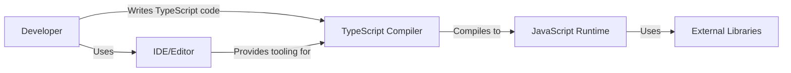
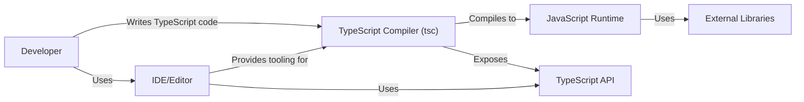
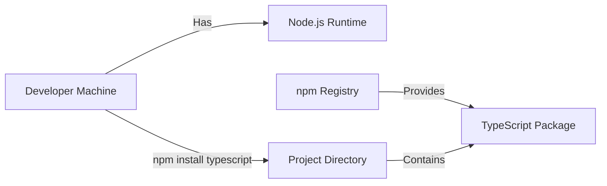
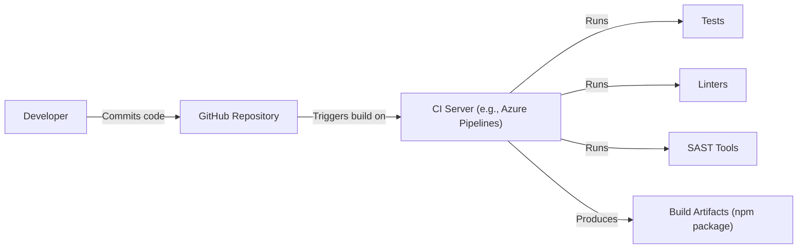

Okay, let's create a design document for the TypeScript project, focusing on aspects relevant for threat modeling.

# BUSINESS POSTURE

Business Priorities and Goals:

*   Provide a superset of JavaScript that adds optional static typing, classes, and interfaces.
*   Enable developers to write more robust and maintainable code.
*   Improve developer tooling and experience (e.g., autocompletion, refactoring).
*   Maintain compatibility with existing JavaScript code and ecosystems.
*   Be a leader in the programming language space, driving innovation and adoption.
*   Support a wide range of development environments and platforms.
*   Provide high-quality documentation and community support.

Business Risks:

*   Loss of developer trust due to security vulnerabilities in the compiler or related tools.
*   Inability to keep up with evolving JavaScript standards, leading to fragmentation.
*   Reputational damage from security incidents involving TypeScript code.
*   Competition from other languages or tools that offer better security or developer experience.
*   Intellectual property theft or unauthorized access to the TypeScript codebase.
*   Supply chain attacks that compromise the integrity of the TypeScript compiler or its dependencies.

# SECURITY POSTURE

Existing Security Controls:

*   security control: Code Reviews: All changes to the TypeScript codebase undergo mandatory code reviews by other developers. (Described in the contributing guidelines and enforced by GitHub pull request workflows).
*   security control: Static Analysis: The TypeScript compiler itself performs static analysis on TypeScript code, identifying potential type errors and other issues. (Implemented within the compiler's type checking system).
*   security control: Testing: A comprehensive test suite is maintained to ensure the correctness and stability of the compiler. (Described in the contributing guidelines and run as part of the build process).
*   security control: Secure Development Practices: Microsoft's internal secure development lifecycle (SDL) practices are likely followed, although specifics are not publicly detailed for this open-source project.
*   security control: Vulnerability Reporting Program: Microsoft has a vulnerability reporting program that encourages responsible disclosure of security issues.
*   security control: Regular Updates: TypeScript is frequently updated, providing bug fixes and security patches.

Accepted Risks:

*   accepted risk: Reliance on Third-Party Dependencies: TypeScript, like any large project, depends on third-party libraries. While efforts are made to vet these, vulnerabilities in dependencies are an inherent risk.
*   accepted risk: User-Generated Code: The primary purpose of TypeScript is to compile user-written code. The compiler cannot guarantee the security of the code it compiles; this is the responsibility of the developer using TypeScript.
*   accepted risk: Complexity of the Compiler: The TypeScript compiler is a complex piece of software. Despite rigorous testing, the possibility of undiscovered bugs, including security vulnerabilities, exists.

Recommended Security Controls:

*   security control: Fuzzing: Implement regular fuzzing of the compiler to identify potential vulnerabilities that might be missed by traditional testing.
*   security control: Supply Chain Security Measures: Implement stronger supply chain security measures, such as signing releases and using software bills of materials (SBOMs).
*   security control: Static Application Security Testing (SAST): Integrate SAST tools specifically designed for analyzing compiler-like code.
*   security control: Dynamic Application Security Testing (DAST): Explore the use of DAST techniques to test the runtime behavior of compiled code, although this is more challenging for a compiler.

Security Requirements:

*   Authentication: Not directly applicable to the compiler itself, but relevant for any associated services (e.g., package management).
*   Authorization: Not directly applicable to the compiler itself, but relevant for any associated services.
*   Input Validation: The compiler must correctly handle malformed or malicious input (TypeScript code) without crashing or exhibiting unexpected behavior. This is crucial for preventing denial-of-service or code execution vulnerabilities.
*   Cryptography: Not directly used in the core compilation process, but may be relevant for signing releases or other security-related features.
*   Output Encoding: The compiler should generate JavaScript code that is free from injection vulnerabilities, assuming the input TypeScript code is also secure. This is primarily the responsibility of the developer writing the TypeScript code.

# DESIGN

## C4 CONTEXT

Element Descriptions:

*   Element:
    *   Name: Developer
    *   Type: Person
    *   Description: A software developer who writes TypeScript code.
    *   Responsibilities: Writing, testing, and debugging TypeScript code.
    *   Security controls: Follows secure coding practices.

*   Element:
    *   Name: TypeScript Compiler
    *   Type: Software System
    *   Description: The core component that translates TypeScript code into JavaScript.
    *   Responsibilities: Parsing, type checking, and generating JavaScript code.
    *   Security controls: Input validation, static analysis, regular updates, vulnerability reporting program.

*   Element:
    *   Name: JavaScript Runtime
    *   Type: Software System
    *   Description: The environment where the compiled JavaScript code executes (e.g., a web browser, Node.js).
    *   Responsibilities: Executing JavaScript code.
    *   Security controls: Browser security features, Node.js security policies.

*   Element:
    *   Name: External Libraries
    *   Type: Software System
    *   Description: Third-party JavaScript libraries used by the compiled code.
    *   Responsibilities: Providing additional functionality to the application.
    *   Security controls: Dependency management, vulnerability scanning.

*   Element:
    *   Name: IDE/Editor
    *   Type: Software System
    *   Description: Integrated Development Environment or code editor used by the developer.
    *   Responsibilities: Providing code editing, autocompletion, debugging, and other development tools.
    *   Security controls: IDE security features, extensions security.

## C4 CONTAINER

In this case, the TypeScript compiler is relatively simple from a container perspective. The container diagram is essentially an extension of the context diagram.

Element Descriptions:

*   Element:
    *   Name: Developer
    *   Type: Person
    *   Description: A software developer who writes TypeScript code.
    *   Responsibilities: Writing, testing, and debugging TypeScript code.
    *   Security controls: Follows secure coding practices.

*   Element:
    *   Name: TypeScript Compiler (tsc)
    *   Type: Application
    *   Description: The command-line tool that invokes the TypeScript compiler.
    *   Responsibilities: Parsing command-line arguments, invoking the compiler, and writing output files.
    *   Security controls: Input validation, regular updates.

*   Element:
    *   Name: JavaScript Runtime
    *   Type: Software System
    *   Description: The environment where the compiled JavaScript code executes (e.g., a web browser, Node.js).
    *   Responsibilities: Executing JavaScript code.
    *   Security controls: Browser security features, Node.js security policies.

*   Element:
    *   Name: External Libraries
    *   Type: Software System
    *   Description: Third-party JavaScript libraries used by the compiled code.
    *   Responsibilities: Providing additional functionality to the application.
    *   Security controls: Dependency management, vulnerability scanning.

*   Element:
    *   Name: IDE/Editor
    *   Type: Software System
    *   Description: Integrated Development Environment or code editor used by the developer.
    *   Responsibilities: Providing code editing, autocompletion, debugging, and other development tools.
    *   Security controls: IDE security features, extensions security.

*   Element:
    *   Name: TypeScript API
    *   Type: API
    *   Description: Programmatic interface to interact with the compiler.
    *   Responsibilities: Provide access to compiler functionalities for tools and integrations.
    *   Security controls: Input validation, regular updates.

## DEPLOYMENT

Possible Deployment Solutions:

1.  **Global npm Installation:**  `npm install -g typescript`. This is the most common method for individual developers.
2.  **Project-Specific npm Installation:** `npm install typescript` (within a project directory).  This is best practice for managing project dependencies.
3.  **Docker Image:**  A Docker image could be used to provide a consistent and isolated environment for the compiler.
4.  **Web-Based Compiler:**  A web-based version of the compiler (like the TypeScript Playground) runs entirely in the browser.

Chosen Solution (for detailed description): Project-Specific npm Installation

Element Descriptions:

*   Element:
    *   Name: Developer Machine
    *   Type: Infrastructure
    *   Description: The developer's local computer.
    *   Responsibilities: Running the npm command, storing project files.
    *   Security controls: Operating system security, firewall, antivirus.

*   Element:
    *   Name: Node.js Runtime
    *   Type: Infrastructure
    *   Description: Node.js runtime environment.
    *   Responsibilities: Provides environment to run npm.
    *   Security controls: Regular updates, secure configuration.

*   Element:
    *   Name: npm Registry
    *   Type: External System
    *   Description: The public registry for npm packages.
    *   Responsibilities: Storing and serving npm packages.
    *   Security controls: npm's security measures (e.g., two-factor authentication for publishers).

*   Element:
    *   Name: TypeScript Package
    *   Type: Package
    *   Description: The TypeScript compiler and related files, packaged as an npm module.
    *   Responsibilities: Providing the compiler functionality.
    *   Security controls: Package signing (if implemented), vulnerability scanning.

*   Element:
    *   Name: Project Directory
    *   Type: Infrastructure
    *   Description: The directory containing the project's source code and dependencies.
    *   Responsibilities: Storing project files, including the TypeScript compiler (locally installed).
    *   Security controls: File system permissions.

## BUILD

Build Process Description:

1.  **Code Commit:** A developer commits changes to the TypeScript source code on GitHub.
2.  **Continuous Integration (CI) Trigger:** The commit triggers a build on a CI server (likely Azure Pipelines, given Microsoft's ownership).
3.  **Build Environment Setup:** The CI server sets up a clean build environment.
4.  **Dependency Installation:** Dependencies are installed (likely using npm).
5.  **Compilation:** The TypeScript compiler is used to compile the TypeScript source code into JavaScript.
6.  **Testing:** The test suite is executed, including unit tests, integration tests, and potentially other types of tests.
7.  **Linting:** Linters (e.g., ESLint) are used to check for code style and potential errors.
8.  **Static Analysis (SAST):** SAST tools are run to identify potential security vulnerabilities in the compiler's source code.
9.  **Artifact Creation:** If all checks pass, build artifacts are created, primarily the npm package containing the compiled compiler.
10. **Publishing:** The npm package is published to the npm registry (likely with a specific version tag).

Security Controls in Build Process:

*   security control: CI/CD Pipeline: Automation of the build process ensures consistency and reduces the risk of manual errors.
*   security control: Test Suite: Comprehensive testing helps to identify bugs and regressions.
*   security control: Linters: Enforce code style and identify potential issues.
*   security control: SAST Tools: Scan for security vulnerabilities in the source code.
*   security control: Dependency Management: Tools like `npm audit` can be used to identify vulnerabilities in dependencies.
*   security control: Build Artifact Signing: Signing the npm package would provide assurance of its integrity and authenticity (recommended, but not confirmed to be implemented).

# RISK ASSESSMENT

Critical Business Processes:

*   Software Development: TypeScript is a critical tool for many developers and organizations building software.
*   Compilation: The core process of converting TypeScript to JavaScript must be reliable and secure.
*   Community Engagement: Maintaining a healthy and active community is essential for the long-term success of the project.

Data to Protect:

*   Source Code (High Sensitivity): The TypeScript compiler's source code itself is valuable intellectual property. Unauthorized access or modification could have significant consequences.
*   User-Provided Code (Variable Sensitivity): The compiler processes user-written code, which may contain sensitive data or proprietary logic. While the compiler doesn't store this code, vulnerabilities could potentially expose it.
*   Compiler Output (Variable Sensitivity): The generated JavaScript code could indirectly reveal information about the original TypeScript code, depending on the compilation settings and the nature of the code.
*   Telemetry Data (Low-Medium Sensitivity): If the compiler collects any telemetry data (usage statistics, error reports), this data should be protected according to privacy regulations and best practices.

# QUESTIONS & ASSUMPTIONS

Questions:

*   What specific SAST tools are used in the TypeScript build process?
*   Are there any DAST or fuzzing techniques employed?
*   Is the npm package for TypeScript signed?
*   What are the specific procedures for handling security vulnerability reports?
*   What are the details of Microsoft's internal SDL practices applied to this project?
*   Does the compiler collect any telemetry data, and if so, what are the privacy implications?
*   What is the process for vetting and managing third-party dependencies?

Assumptions:

*   BUSINESS POSTURE: Microsoft prioritizes the security and reliability of TypeScript, given its widespread use and strategic importance.
*   SECURITY POSTURE: Microsoft's internal SDL practices are followed, even though specifics are not publicly documented. The project benefits from Microsoft's overall security expertise.
*   DESIGN: The build process is automated using a CI/CD pipeline, likely Azure Pipelines. Standard security tools and practices are employed, but specific details may not be publicly available. The deployment primarily relies on npm.