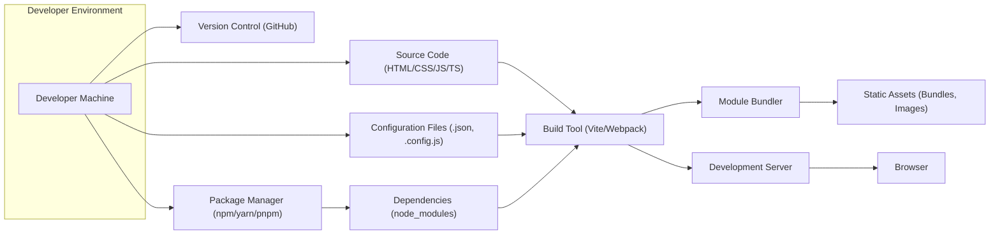

## Project Design Document: Modern Web Development Starter Kit (Improved)

**Project Name:** web

**Project Repository:** https://github.com/modernweb-dev/web

**Version:** 1.1

**Date:** October 26, 2023

**Author:** Gemini (AI Language Model)

**1. Introduction**

This document provides an enhanced design overview of the "web" project, a modern web development starter kit hosted on GitHub under the "modernweb-dev" organization. This refined document aims to provide a more detailed understanding of the project's architecture, components, data flow, and security considerations, making it more suitable for subsequent threat modeling activities.

**2. Project Overview**

The "web" project serves as a robust foundation for building contemporary web applications. It is designed to accelerate development by providing a pre-configured environment with established best practices. Key features likely include:

*   **Optimized Build Pipeline:**  A pre-configured and efficient build process for transforming source code into production-ready assets.
*   **Standardized Project Structure:** A well-defined and organized file structure to promote maintainability and collaboration.
*   **Modern Front-End Tooling Integration:** Seamless integration with popular front-end libraries, frameworks, and development tools.
*   **Local Development Environment Setup:** Simplified setup for a consistent and reproducible local development environment.
*   **Extensible Architecture:** A design that allows for easy addition of new features and integration with various backend services.
*   **Potential UI Component Library or Examples:**  Inclusion of basic UI elements or illustrative examples to accelerate UI development.

The primary objective is to empower developers to bypass initial configuration hurdles and concentrate on implementing application-specific logic and user interfaces.

**3. Goals and Objectives**

*   **Accelerate Project Initialization:**  Provide a ready-to-use starting point, minimizing initial setup time.
*   **Promote Modern Development Practices:**  Enforce or encourage the use of current best practices in web development.
*   **Ensure Flexibility and Extensibility:**  Offer an architecture adaptable to diverse project requirements.
*   **Simplify Onboarding for New Developers:**  Provide a consistent and understandable project structure.
*   **Showcase Recommended Technologies and Patterns:**  Demonstrate effective use of modern tools and architectural patterns.

**4. Target Audience**

*   Individual web developers initiating new projects.
*   Development teams seeking a consistent and efficient project template.
*   Organizations aiming to standardize their web development environment.
*   Developers learning modern front-end development techniques.

**5. System Architecture**

The architecture of this starter kit primarily focuses on the front-end development workflow, emphasizing the transformation of source code into deployable assets. It is designed with the understanding that it will likely interface with various backend systems.

**6. Component Descriptions**

*   **Developer Machine ("Developer Machine"):** The local computer used by developers for coding, testing, and managing the project.
*   **Version Control (GitHub) ("Version Control (GitHub)"):**  The remote repository hosting the project's codebase, facilitating collaboration and version tracking.
*   **Package Manager (npm/yarn/pnpm) ("Package Manager (npm/yarn/pnpm)"):** A tool used to manage project dependencies (libraries and packages), including installation, updates, and removal.
*   **Build Tool (Vite/Webpack) ("Build Tool (Vite/Webpack)"):** A core tool that transforms and optimizes the source code for deployment. This includes tasks like bundling, minification, transpilation (e.g., TypeScript to JavaScript), and asset processing. Vite and Webpack are common choices for modern JavaScript projects.
*   **Module Bundler ("Module Bundler"):** A sub-component of the build tool responsible for combining multiple JavaScript modules and their dependencies into optimized bundles for efficient browser loading.
*   **Development Server ("Development Server"):** A local server that hosts the application during development, often providing features like hot module replacement (HMR) for faster development cycles.
*   **Browser ("Browser"):** The web browser used by developers to preview and test the application's functionality and user interface.
*   **Source Code (HTML/CSS/JS/TS) ("Source Code (HTML/CSS/JS/TS)"):** The human-readable code written by developers, encompassing HTML for structure, CSS for styling, and JavaScript or TypeScript for interactivity and logic.
*   **Configuration Files (.json, .config.js) ("Configuration Files (.json, .config.js)"):** Files that define the settings and behavior of various tools and aspects of the project, such as build tool configurations, linting rules, and testing configurations. Examples include `package.json`, `webpack.config.js`, `vite.config.js`, `tsconfig.json`, `.eslintrc.js`, etc.
*   **Dependencies (node_modules) ("Dependencies (node_modules)"):** The external libraries and packages installed via the package manager, typically stored in a `node_modules` directory. These provide reusable functionality and extend the capabilities of the project.
*   **Static Assets (Bundles, Images) ("Static Assets (Bundles, Images)"):** The final, optimized files generated by the build process, ready to be served to the browser. This includes bundled JavaScript and CSS files, images, and other assets.

**7. Data Flow**

The primary data flow within the starter kit during development involves the transformation of developer-written source code into optimized assets viewable in a browser.

1. Developers write **Source Code (HTML/CSS/JS/TS)** and configure project settings in **Configuration Files (.json, .config.js)** on their **Developer Machine**.
2. Project **Dependencies (node_modules)** are managed using the **Package Manager (npm/yarn/pnpm)**.
3. Changes are committed and pushed to **Version Control (GitHub)** for collaboration and tracking.
4. The **Build Tool (Vite/Webpack)** processes the **Source Code**, guided by the **Configuration Files** and utilizing **Dependencies**.
5. The **Module Bundler** within the build tool combines and optimizes JavaScript modules and their dependencies.
6. The build process generates optimized **Static Assets (Bundles, Images)**.
7. The **Development Server** hosts and serves the **Static Assets**.
8. Developers access the application through their **Browser**, which requests and renders the **Static Assets**.

**8. Security Considerations**

While the starter kit itself is primarily a development environment, security is paramount for the applications built using it. Potential vulnerabilities and considerations include:

*   **Supply Chain Attacks (Dependency Vulnerabilities):**  Malicious or vulnerable code within **Dependencies (node_modules)** can be unintentionally included in projects. Regularly auditing and updating dependencies is crucial. Using tools like `npm audit`, `yarn audit`, or dedicated vulnerability scanning tools is recommended.
*   **Build Process Compromise:**  If the **Build Tool (Vite/Webpack)** or its plugins are compromised, malicious code could be injected into the generated **Static Assets**. Ensuring the integrity of the build pipeline and using trusted sources for tools is vital.
*   **Insecure Configuration:**  Misconfigured **Configuration Files (.json, .config.js)** can introduce vulnerabilities. Examples include exposing sensitive information, disabling security features, or allowing insecure protocols.
*   **Source Code Vulnerabilities:**  The starter kit might include example code or configurations that contain security flaws if not carefully reviewed and adapted by developers. Common web vulnerabilities like Cross-Site Scripting (XSS) and Cross-Site Request Forgery (CSRF) need to be considered in the context of the generated application.
*   **Secrets Management in Development:**  Careless handling of API keys, database credentials, or other secrets within the development environment or configuration files can lead to exposure. Secure methods for managing secrets, even in development, should be encouraged.
*   **Developer Machine Security:**  Compromised **Developer Machines** can be a vector for injecting malicious code or leaking sensitive information. Enforcing security best practices on developer machines is important.
*   **Version Control Security:**  Inadequate access controls or insecure practices in **Version Control (GitHub)** can allow unauthorized modifications to the codebase.
*   **Exposure of Development Artifacts:**  Accidentally deploying development-related files or configurations to production can create security risks.

**9. Technology Stack (Likely)**

Based on current best practices and the nature of a modern web development starter kit, the technology stack likely incorporates:

*   **Programming Languages:** JavaScript, and very likely TypeScript for enhanced type safety and developer experience.
*   **Front-End Framework/Library:**  One of the popular choices like React, Vue.js, or Svelte is likely included or easily configurable.
*   **Build Tool:**  Vite is a strong contender due to its speed and modern features, but Webpack remains a possibility.
*   **Package Manager:** npm, yarn, or pnpm are the standard choices for managing JavaScript dependencies.
*   **Version Control:** Git, managed through platforms like GitHub.
*   **Operating System (Developer Environment):** Designed to be cross-platform, supporting macOS, Windows, and Linux.
*   **Linting and Formatting Tools:**  Likely includes ESLint and Prettier for code quality and consistency.

**10. Deployment Model (Facilitated by the Starter Kit)**

The starter kit aims to streamline the deployment process for applications built upon it. Common deployment models that the kit likely supports or facilitates include:

*   **Static Site Hosting:** For purely front-end applications, generating static assets that can be easily hosted on services like Netlify, Vercel, GitHub Pages, or AWS S3. The build process is typically configured for this.
*   **Containerization (Docker):**  The starter kit might include Docker configuration files (e.g., `Dockerfile`, `docker-compose.yml`) to containerize the application for consistent deployment across different environments.
*   **Cloud Platforms:**  Designed to be deployable to major cloud platforms like AWS, Azure, or Google Cloud, often leveraging their container orchestration services (e.g., ECS, AKS, GKE) if Docker is used.
*   **Server-Side Rendering (SSR) or Static Site Generation (SSG):** If a framework like Next.js or Nuxt.js is integrated (or easily configurable), the deployment process might involve Node.js servers or pre-rendering pages at build time.

**11. Future Considerations**

*   Enhanced integration with backend development workflows and technologies.
*   Inclusion of comprehensive testing frameworks (unit, integration, end-to-end) and best practices.
*   More detailed documentation, tutorials, and examples covering various use cases.
*   Regular security audits and updates to address emerging vulnerabilities and maintain dependency security.
*   Community contributions and expansion of features based on user feedback.
*   Guidance and best practices for handling authentication and authorization within applications built with the kit.

This improved design document provides a more detailed and nuanced understanding of the "web" project, enhancing its value for threat modeling and overall project comprehension. The added details in component descriptions, data flow, and security considerations offer a stronger foundation for identifying and mitigating potential risks.