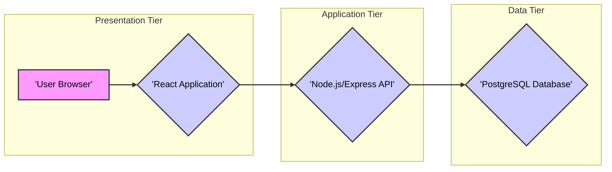

# Project Design Document: Modern Web Development Template - Improved

**Project Name:** Modern Web Development Template

**Project Repository:** [https://github.com/modernweb-dev/web](https://github.com/modernweb-dev/web)

**Document Version:** 2.0
**Date:** 2023-10-27
**Author:** AI Expert

## 1. Introduction

This document provides a comprehensive design specification for the "Modern Web Development Template" project, available at [https://github.com/modernweb-dev/web](https://github.com/modernweb-dev/web).  This document is intended for developers, security engineers, and operations teams who need to understand the architecture, components, and data flow of this template. It serves as a critical input for threat modelling, security assessments, and further development efforts.

The "Modern Web Development Template" is designed to be a robust and scalable starting point for building modern web applications. It leverages a full-stack JavaScript architecture, employing React for the frontend, Node.js with Express.js for the backend API, and PostgreSQL for data persistence. Containerization with Docker is integrated to ensure consistent environments and simplified deployment across various platforms. This template prioritizes developer productivity and adherence to modern web development best practices.

## 2. System Architecture Overview

The system is structured as a classic three-tier architecture, promoting separation of concerns and maintainability.  Each tier is designed to operate independently and communicate through well-defined interfaces. Containerization further enhances this separation and allows for independent scaling and deployment of each tier.



**Architectural Tiers:**

*   **Presentation Tier (Frontend):**  Responsible for user interaction and presentation. Implemented as a React Single Page Application (SPA).
*   **Application Tier (Backend):**  Handles business logic, API endpoints, and communication with the data tier. Implemented using Node.js and Express.js.
*   **Data Tier (Database):**  Provides persistent data storage and management. Implemented using PostgreSQL.

## 3. Component Description

This section provides a detailed breakdown of each component within the system architecture, outlining their specific functionalities, underlying technologies, and interaction patterns.

### 3.1. Presentation Tier - React Application

*   **Functionality:**
    *   **User Interface (UI) Rendering:**  Dynamically renders the user interface based on application state and data received from the backend.
    *   **User Interaction Handling:** Captures and processes user inputs from the browser (e.g., form submissions, button clicks, navigation).
    *   **Frontend Routing:** Manages client-side navigation and application state transitions using a routing library (e.g., React Router).
    *   **API Communication:**  Initiates and manages HTTP requests to the Backend API to fetch data and submit user actions.
    *   **State Management:**  Manages application state, potentially using React Context, Redux, or similar state management solutions for complex applications.
    *   **Data Presentation and Formatting:**  Formats and presents data received from the backend in a user-friendly manner.
*   **Technologies:**
    *   **React:**  Primary JavaScript library for building component-based UIs.
    *   **JavaScript (ES6+):**  Programming language for frontend logic and interactivity.
    *   **JSX (JavaScript XML):**  Syntax extension for writing HTML-like structures within JavaScript.
    *   **HTML5:**  Markup language for structuring the web page content.
    *   **CSS3 (and potentially CSS preprocessors like Sass/Less):**  Styling language for visual presentation and layout.
    *   **npm/yarn:** Package managers for managing frontend dependencies and build tools.
    *   **Webpack (or Parcel, Rollup):**  Module bundler for packaging frontend assets (JavaScript, CSS, images).
    *   **Babel:**  JavaScript compiler for transpiling modern JavaScript (ES6+) to browser-compatible versions.
    *   **Fetch API or Axios:**  HTTP client libraries for making API requests.
    *   **React Router (or similar):**  Library for handling client-side routing and navigation.
    *   **State Management Libraries (e.g., Redux, Zustand, Recoil - depending on complexity):** For managing application state in larger applications.
*   **Data Handled:**
    *   **User Input Data:** Data entered by users through forms and UI elements.
    *   **Backend API Data (JSON):** Data received from the Backend API, typically in JSON format.
    *   **Application State:**  Frontend-managed data representing the current state of the application UI and user session.
    *   **Session Storage/Local Storage (potentially):**  For storing non-sensitive, client-side data (use with caution for sensitive information).
*   **Interactions:**
    *   **User Browser:**  Renders the UI and interacts with the user through the browser.
    *   **Backend API (Node.js/Express):**  Communicates via HTTP requests to fetch data and send user actions.

### 3.2. Application Tier - Node.js/Express API

*   **Functionality:**
    *   **REST API Endpoint Management:** Defines and manages RESTful API endpoints to serve frontend requests.
    *   **Business Logic Execution:** Implements the core business logic of the application, processing requests and orchestrating data flow.
    *   **Data Validation and Sanitization:** Validates and sanitizes incoming data from the frontend to ensure data integrity and prevent injection attacks.
    *   **Authentication and Authorization:**  Handles user authentication (verifying user identity) and authorization (controlling access to resources).
    *   **Database Interaction (ORM or raw queries):**  Interacts with the PostgreSQL database to persist and retrieve data.
    *   **Error Handling and Logging:**  Manages application errors, logs events, and provides informative error responses to the frontend.
    *   **API Rate Limiting and Throttling:**  Implements mechanisms to limit the rate of API requests to prevent abuse and DoS attacks.
*   **Technologies:**
    *   **Node.js:**  JavaScript runtime environment for server-side execution.
    *   **Express.js:**  Minimalist web application framework for Node.js, ideal for building APIs.
    *   **JavaScript (ES6+):**  Programming language for backend logic.
    *   **npm/yarn:** Package managers for managing backend dependencies.
    *   **PostgreSQL Node.js Client (`pg`, `node-postgres`, or ORMs like Sequelize, Prisma, TypeORM):**  For interacting with the PostgreSQL database.
    *   **JSON Web Tokens (JWT) (or similar authentication mechanisms like OAuth 2.0):** For secure authentication and authorization.
    *   **Middleware (for CORS, body parsing, logging, security headers, authentication, etc.):**  Extends Express.js functionality and handles cross-cutting concerns.
    *   **Environment Variable Management (e.g., `dotenv`):**  For managing configuration settings outside of the codebase.
    *   **Logging Libraries (e.g., Winston, Morgan):** For structured logging of application events.
    *   **API Documentation Tools (e.g., Swagger/OpenAPI):** For generating API documentation.
*   **Data Handled:**
    *   **Frontend Requests (JSON):**  Receives requests from the Frontend Application, typically in JSON format.
    *   **Database Data:**  Retrieves and persists data to the PostgreSQL database.
    *   **API Responses (JSON):**  Sends responses back to the Frontend Application, typically in JSON format.
    *   **Sensitive Data (depending on application):** May handle sensitive user data, authentication credentials, etc., requiring secure handling and storage.
*   **Interactions:**
    *   **Frontend Application (React):**  Receives HTTP requests and sends HTTP responses.
    *   **PostgreSQL Database:**  Sends SQL queries and receives data from the database.
    *   **Potentially other external services/APIs:**  May interact with third-party services for tasks like payment processing, email sending, etc. (depending on application requirements).

### 3.3. Data Tier - PostgreSQL Database

*   **Functionality:**
    *   **Persistent Data Storage:** Provides reliable and persistent storage for application data.
    *   **Data Management and Organization:**  Organizes data in relational tables with defined schemas, ensuring data integrity and consistency.
    *   **Data Retrieval and Querying:**  Allows efficient data retrieval and manipulation using SQL queries.
    *   **Data Integrity and Transactions:**  Supports ACID properties (Atomicity, Consistency, Isolation, Durability) for data transactions, ensuring data reliability.
    *   **Data Backup and Recovery:**  Provides mechanisms for backing up and restoring data to prevent data loss.
    *   **Data Security and Access Control:**  Offers features for securing data access and controlling user permissions.
*   **Technologies:**
    *   **PostgreSQL:**  Open-source, object-relational database management system (ORDBMS).
    *   **SQL (Structured Query Language):**  Standard language for interacting with relational databases.
    *   **Database Administration Tools (e.g., pgAdmin, DBeaver):** For database management and administration.
*   **Data Handled:**
    *   **Application Data:** Stores all persistent data required by the application, including user data, application settings, content, and transactional data. The specific data schema depends on the application built using the template.
*   **Interactions:**
    *   **Backend Application (Node.js/Express):**  Receives SQL queries from the backend and returns query results.

## 4. Data Flow - Detailed Request Lifecycle

This section elaborates on the data flow within the system, detailing the steps involved in a typical user request lifecycle, including security considerations and error handling.

1.  **User Initiates Action:** A user interacts with the Frontend Application in their browser (e.g., clicks a link, submits a form, performs a search).
2.  **Frontend Request Construction:** The React Application constructs an HTTP request (e.g., GET, POST, PUT, DELETE) to the Backend API. This request typically includes:
    *   **HTTP Method:**  Specifies the action to be performed (e.g., GET for retrieval, POST for creation).
    *   **API Endpoint URL:**  Identifies the specific API endpoint to be accessed.
    *   **Request Headers:**  Includes metadata like content type, authorization tokens (e.g., JWT), and CORS headers.
    *   **Request Body (for POST, PUT, PATCH):**  Contains data to be sent to the backend, usually in JSON format.
3.  **Network Transmission:** The Frontend Application sends the HTTP request over the network to the Backend API. HTTPS should be used to encrypt communication in transit.
4.  **Backend Request Reception:** The Node.js/Express API receives the HTTP request.
5.  **Middleware Processing (Backend):**  The request passes through a series of middleware functions in the Express.js application. These middleware functions can handle tasks such as:
    *   **CORS Handling:**  Verifies the origin of the request and applies CORS policies.
    *   **Body Parsing:**  Parses the request body (e.g., JSON, URL-encoded) into a usable format.
    *   **Logging:**  Logs request details for monitoring and debugging.
    *   **Security Headers:**  Adds security-related HTTP headers (e.g., X-Frame-Options, Content-Security-Policy).
    *   **Authentication:**  Verifies user authentication tokens (e.g., JWT validation).
    *   **Authorization:**  Checks if the authenticated user has the necessary permissions to access the requested resource.
6.  **Route Handling and Business Logic:** The request is routed to the appropriate route handler function in the Express.js application based on the API endpoint URL. This handler function executes the core business logic associated with the request. This may involve:
    *   **Input Validation and Sanitization:** Validates and sanitizes data received from the frontend to prevent injection attacks and ensure data integrity.
    *   **Data Processing and Transformation:**  Processes and transforms data as required by the business logic.
    *   **Database Interaction:**  Constructs and executes SQL queries to interact with the PostgreSQL database.
7.  **Database Query Execution:** The Backend API sends SQL queries to the PostgreSQL Database.
8.  **Database Response:** The PostgreSQL Database executes the queries and returns the results to the Backend API.
9.  **Backend Response Construction:** The Backend API constructs an HTTP response to send back to the Frontend Application. This response typically includes:
    *   **HTTP Status Code:**  Indicates the success or failure of the request (e.g., 200 OK, 400 Bad Request, 500 Internal Server Error).
    *   **Response Headers:**  Includes metadata like content type and CORS headers.
    *   **Response Body (JSON):**  Contains the data requested by the frontend or an error message in case of failure.
10. **Network Transmission (Response):** The Backend API sends the HTTP response back to the Frontend Application over the network (HTTPS).
11. **Frontend Response Processing:** The React Application receives the HTTP response.
12. **Frontend State Update and UI Rendering:** The React Application processes the response, updates the application state accordingly, and re-renders the UI to reflect the changes to the user.
13. **User View Update:** The User Browser updates the displayed page based on the re-rendered UI from the React Application.
14. **Error Handling (if applicable):** If an error occurs at any stage, appropriate error handling mechanisms should be in place to log the error, return informative error responses to the frontend, and potentially display user-friendly error messages in the UI.

## 5. Technology Stack - Detailed Breakdown

This section provides a more detailed breakdown of the technology stack, including specific libraries and tools commonly used within each tier.

*   **Frontend:**
    *   **Core Libraries:**
        *   React (for UI components and rendering)
        *   React Router (for client-side routing)
        *   Fetch API or Axios (for HTTP requests)
    *   **Styling:**
        *   CSS3
        *   Potentially CSS Preprocessors (Sass, Less) or CSS-in-JS libraries (Styled Components, Emotion)
        *   UI Component Libraries (e.g., Material UI, Ant Design, Chakra UI)
    *   **State Management (depending on complexity):**
        *   React Context (for simpler state management)
        *   Redux, Zustand, Recoil (for more complex state management)
    *   **Build Tools:**
        *   Webpack, Parcel, Rollup (module bundlers)
        *   Babel (JavaScript compiler)
        *   npm or yarn (package managers)
    *   **Testing:**
        *   Jest, Mocha, Chai, Enzyme, React Testing Library (for unit and integration testing)
        *   Cypress, Selenium (for end-to-end testing)
    *   **Other Common Libraries:**
        *   Formik, React Hook Form (for form handling)
        *   Yup, Joi (for form validation)
        *   Date-fns, Moment.js (for date manipulation)
        *   Lodash, Underscore.js (utility libraries)

*   **Backend:**
    *   **Core Framework:**
        *   Express.js (for API framework)
    *   **Database Interaction:**
        *   PostgreSQL Node.js Client (`pg`, `node-postgres`)
        *   Potentially ORMs (Sequelize, Prisma, TypeORM)
    *   **Authentication & Authorization:**
        *   jsonwebtoken (for JWT implementation)
        *   Passport.js (for authentication middleware)
        *   bcryptjs (for password hashing)
    *   **Middleware:**
        *   cors (for CORS handling)
        *   body-parser (for parsing request bodies)
        *   morgan (for HTTP request logging)
        *   helmet (for security headers)
        *   express-rate-limit (for rate limiting)
    *   **Validation:**
        *   Joi, express-validator (for input validation)
    *   **Logging:**
        *   Winston, Morgan, Bunyan (for structured logging)
    *   **Environment Management:**
        *   dotenv (for environment variable loading)
    *   **Testing:**
        *   Jest, Mocha, Chai, Supertest (for unit and integration testing)
    *   **API Documentation:**
        *   Swagger/OpenAPI, jsdoc

*   **Database:**
    *   **PostgreSQL:**
        *   PostgreSQL Server
        *   pgAdmin, DBeaver (database administration tools)
    *   **SQL:**
        *   Standard SQL language

*   **Containerization & Deployment:**
    *   Docker
    *   Docker Compose (for local development and testing)
    *   Kubernetes (for production orchestration)
    *   Reverse Proxy (Nginx, Traefik)

*   **Operating System (Deployment Environment):**
    *   Linux (common for server environments)

*   **Cloud Provider (Deployment Environment - Optional):**
    *   AWS, Google Cloud, Azure, DigitalOcean, Heroku, etc.

## 6. Deployment Architecture - Environments and Components

This section expands on the deployment architecture, detailing typical deployment environments and the role of each component in a production deployment.

**Deployment Environments:**

*   **Development Environment (Local):**
    *   Purpose: For local development, testing, and debugging by developers.
    *   Infrastructure: Typically developer's local machine. Docker Compose is often used to orchestrate containers locally.
    *   Characteristics:  Simplified setup, faster iteration cycles, debugging tools readily available.
*   **Staging Environment:**
    *   Purpose:  Pre-production environment for testing and validating changes before deploying to production. Mimics the production environment as closely as possible.
    *   Infrastructure: Cloud-based or dedicated servers. Kubernetes or similar orchestration may be used.
    *   Characteristics:  Production-like configuration, used for integration testing, user acceptance testing (UAT), and performance testing.
*   **Production Environment:**
    *   Purpose:  Live environment serving end-users.
    *   Infrastructure: Cloud-based infrastructure (AWS, Google Cloud, Azure) or dedicated data centers. Kubernetes is highly recommended for orchestration, scalability, and resilience.
    *   Characteristics:  High availability, scalability, security, performance, monitoring, and disaster recovery mechanisms are critical.

**Detailed Deployment Diagram (Production - Conceptual):**

```mermaid
graph LR
    subgraph "External Network"
    A["'Internet'"]
    end

    subgraph "Load Balancer / Reverse Proxy Layer"
    B["'Load Balancer (e.g., AWS ELB, GCP Load Balancer)'"] --> C{"'Reverse Proxy (Nginx/Traefik)'"}
    A --> B
    end

    subgraph "Application Cluster (Kubernetes)"
    D{"'Frontend Pods (React)'"}
    E{"'Backend Pods (Node.js/Express)'"}
    F{"'Database Pods (PostgreSQL)'"}
    C --> D
    C --> E
    E --> F
    end

    style A fill:#f9f,stroke:#333,stroke-width:2px, color: black
    style B fill:#ccf,stroke:#333,stroke-width:2px, color: black
    style C fill:#ccf,stroke:#333,stroke-width:2px, color: black
    style D fill:#ccf,stroke:#333,stroke-width:2px, color: black
    style E fill:#ccf,stroke:#333,stroke-width:2px, color: black
    style F fill:#ccf,stroke:#333,stroke-width:2px, color: black
    linkStyle 0,1,2,3,4,5 stroke:#333, stroke-width: 2px;
```

**Deployment Component Roles:**

*   **Internet:** Represents the public internet from where user requests originate.
*   **Load Balancer:** Distributes incoming traffic across multiple Reverse Proxy instances for high availability and scalability. Cloud provider managed load balancers are commonly used.
*   **Reverse Proxy (Nginx/Traefik):**
    *   Handles incoming HTTP/HTTPS requests.
    *   Performs SSL termination (decrypts HTTPS traffic).
    *   Routes requests to the appropriate Frontend or Backend pods within the Kubernetes cluster.
    *   May provide additional security features like rate limiting, WAF (Web Application Firewall).
*   **Frontend Pods (React):**  Containers running the React application, serving static assets and handling frontend logic. Scaled horizontally for handling user traffic.
*   **Backend Pods (Node.js/Express):** Containers running the Node.js/Express API, handling business logic and API requests. Scaled horizontally for handling API traffic.
*   **Database Pods (PostgreSQL):** Containers running the PostgreSQL database. Typically deployed in a clustered configuration for high availability and data redundancy. Persistent volumes are used to ensure data persistence.

## 7. Security Considerations - Detailed Threat Landscape

This section provides a more detailed overview of security considerations, categorized by security domains and components, to facilitate comprehensive threat modelling.

**7.1. Frontend Security Considerations:**

*   **Cross-Site Scripting (XSS):**
    *   Threat: Attackers inject malicious scripts into the frontend application, which are then executed in users' browsers, potentially stealing cookies, session tokens, or performing actions on behalf of the user.
    *   Mitigation:
        *   **Input Sanitization and Output Encoding:**  Sanitize user inputs and encode outputs when rendering user-generated content. React's default rendering helps prevent XSS, but developers must be cautious with `dangerouslySetInnerHTML`.
        *   **Content Security Policy (CSP):** Implement a strict CSP to control the sources from which the browser is allowed to load resources, significantly reducing the impact of XSS attacks.
*   **Cross-Site Request Forgery (CSRF):**
    *   Threat: Attackers trick users into performing unintended actions on the web application while authenticated.
    *   Mitigation:
        *   **CSRF Tokens:** Implement CSRF tokens synchronized between the frontend and backend to verify the origin of requests.
        *   **SameSite Cookie Attribute:** Use the `SameSite` attribute for cookies to prevent cross-site cookie leakage.
*   **Dependency Vulnerabilities:**
    *   Threat: Frontend dependencies may contain known security vulnerabilities that attackers can exploit.
    *   Mitigation:
        *   **Dependency Scanning:** Regularly scan frontend dependencies using tools like `npm audit`, `yarn audit`, or dedicated vulnerability scanners.
        *   **Dependency Updates:** Keep frontend dependencies updated to the latest versions, including security patches.
*   **Client-Side Data Security:**
    *   Threat: Sensitive data stored in the frontend (e.g., in local storage, session storage, cookies) can be accessed by attackers or malicious scripts.
    *   Mitigation:
        *   **Minimize Client-Side Storage of Sensitive Data:** Avoid storing sensitive data in the frontend if possible.
        *   **Encryption (if necessary):** If sensitive data must be stored client-side, encrypt it properly.
        *   **Secure Cookie Attributes:** Use `HttpOnly` and `Secure` attributes for cookies to protect them from client-side JavaScript access and ensure transmission over HTTPS only.
*   **Open Redirects:**
    *   Threat: Attackers can craft malicious URLs that redirect users to attacker-controlled websites after they visit a legitimate link on the application.
    *   Mitigation:
        *   **Avoid User-Controlled Redirects:** Minimize or eliminate redirects based on user-supplied input.
        *   **Whitelist Allowed Redirect Destinations:** If redirects are necessary, maintain a whitelist of allowed redirect destinations and validate against it.

**7.2. Backend Security Considerations:**

*   **Authentication and Authorization Vulnerabilities:**
    *   Threat: Weak or improperly implemented authentication and authorization mechanisms can allow unauthorized access to API endpoints and resources.
    *   Mitigation:
        *   **Strong Authentication Mechanisms:** Use robust authentication methods like JWT or OAuth 2.0.
        *   **Secure Password Management:** Hash passwords using strong hashing algorithms (e.g., bcrypt) and salting.
        *   **Role-Based Access Control (RBAC):** Implement RBAC to control access to resources based on user roles and permissions.
        *   **Regular Security Audits of Authentication and Authorization Logic.**
*   **Injection Attacks (SQL Injection, NoSQL Injection, Command Injection):**
    *   Threat: Attackers inject malicious code into application inputs, which is then executed by the backend or database, potentially leading to data breaches, data manipulation, or system compromise.
    *   Mitigation:
        *   **Input Validation and Sanitization:** Thoroughly validate and sanitize all user inputs on the backend.
        *   **Parameterized Queries or ORMs:** Use parameterized queries or ORM features to prevent SQL injection.
        *   **Principle of Least Privilege:** Run backend processes with minimal necessary privileges to limit the impact of command injection.
*   **API Security Vulnerabilities:**
    *   Threat: API endpoints may be vulnerable to various attacks if not properly secured.
    *   Mitigation:
        *   **HTTPS Enforcement:** Enforce HTTPS for all API communication to encrypt data in transit.
        *   **Rate Limiting and Throttling:** Implement rate limiting to protect against brute-force attacks and DoS attempts.
        *   **API Input Validation:** Validate all API request parameters and bodies.
        *   **Secure Error Handling:** Avoid exposing sensitive information in API error responses.
        *   **API Documentation and Security Audits:** Maintain up-to-date API documentation and conduct regular security audits of API endpoints.
*   **Dependency Vulnerabilities:**
    *   Threat: Backend dependencies may contain known security vulnerabilities.
    *   Mitigation:
        *   **Dependency Scanning:** Regularly scan backend dependencies using tools like `npm audit`, `yarn audit`, or dedicated vulnerability scanners.
        *   **Dependency Updates:** Keep backend dependencies updated to the latest versions, including security patches.
*   **Session Management Vulnerabilities:**
    *   Threat: Weak session management can lead to session hijacking or session fixation attacks.
    *   Mitigation:
        *   **Secure Session Storage:** Store session data securely (e.g., using server-side session storage).
        *   **Session Expiration and Timeout:** Implement session expiration and timeout mechanisms.
        *   **Session Regeneration after Authentication:** Regenerate session IDs after successful authentication to prevent session fixation.
        *   **HttpOnly and Secure Cookies for Session Tokens:** Use `HttpOnly` and `Secure` attributes for session cookies.
*   **Logging and Monitoring Security:**
    *   Threat: Insufficient logging and monitoring can hinder incident detection and response. Improper logging can expose sensitive data.
    *   Mitigation:
        *   **Comprehensive Logging:** Implement comprehensive logging of security-relevant events (authentication attempts, authorization failures, API requests, errors).
        *   **Secure Logging Practices:** Avoid logging sensitive data directly. Sanitize or mask sensitive information in logs.
        *   **Centralized Logging and Monitoring:** Use centralized logging and monitoring systems for efficient security analysis and incident response.

**7.3. Database Security Considerations:**

*   **SQL Injection (already covered in Backend Security but also directly relevant to Database):**
    *   Threat: Attackers inject malicious SQL code, directly targeting the database.
    *   Mitigation: (Same as Backend - Parameterized Queries, ORMs, Input Validation in Backend).
*   **Database Access Control:**
    *   Threat: Unauthorized access to the database can lead to data breaches, data manipulation, or denial of service.
    *   Mitigation:
        *   **Principle of Least Privilege:** Grant database access only to authorized backend components and with minimal necessary privileges.
        *   **Strong Authentication for Database Access:** Use strong passwords or key-based authentication for database access.
        *   **Network Segmentation:** Isolate the database server within a private network segment, restricting direct access from the internet.
        *   **Database Firewalls:** Configure database firewalls to control network access to the database server.
*   **Data Encryption at Rest and in Transit:**
    *   Threat: Sensitive data stored in the database or transmitted between the backend and database can be compromised if not encrypted.
    *   Mitigation:
        *   **Encryption at Rest:** Enable database encryption at rest to protect data stored on disk.
        *   **Encryption in Transit:** Use TLS/SSL to encrypt communication between the backend and database.
*   **Database Vulnerabilities and Patch Management:**
    *   Threat: Database software may contain known security vulnerabilities.
    *   Mitigation:
        *   **Regular Database Updates and Patching:** Keep PostgreSQL updated with the latest security patches and version upgrades.
        *   **Vulnerability Scanning:** Regularly scan the database server for known vulnerabilities.
*   **Database Backup Security:**
    *   Threat: Database backups may contain sensitive data and can be a target for attackers.
    *   Mitigation:
        *   **Secure Backup Storage:** Store database backups in a secure location with restricted access.
        *   **Backup Encryption:** Encrypt database backups to protect data confidentiality.
        *   **Regular Backup Testing:** Regularly test backup and restore procedures to ensure data recoverability and integrity.

**7.4. Deployment and Infrastructure Security Considerations:**

*   **Container Security:**
    *   Threat: Vulnerabilities in container images or insecure container configurations can be exploited.
    *   Mitigation:
        *   **Minimal Container Images:** Use minimal base images for containers to reduce the attack surface.
        *   **Container Image Scanning:** Scan container images for vulnerabilities before deployment.
        *   **Container Security Contexts:** Configure container security contexts to restrict container capabilities and access to host resources.
        *   **Regular Container Image Updates:** Keep container images updated with the latest security patches.
*   **Kubernetes Security (if applicable):**
    *   Threat: Misconfigurations or vulnerabilities in Kubernetes clusters can lead to security breaches.
    *   Mitigation:
        *   **Kubernetes Security Best Practices:** Follow Kubernetes security best practices for cluster configuration, access control, and network policies.
        *   **RBAC in Kubernetes:** Implement RBAC to control access to Kubernetes resources.
        *   **Network Policies in Kubernetes:** Use network policies to restrict network traffic between pods and namespaces.
        *   **Kubernetes Security Audits and Updates:** Regularly audit Kubernetes configurations and update Kubernetes components to the latest versions.
*   **Secrets Management:**
    *   Threat: Improperly managed secrets (API keys, database credentials, etc.) can be exposed and compromised.
    *   Mitigation:
        *   **Dedicated Secrets Management Solutions:** Use dedicated secrets management solutions like HashiCorp Vault, AWS Secrets Manager, Azure Key Vault, or Kubernetes Secrets for secure storage and access control of secrets.
        *   **Avoid Hardcoding Secrets:** Never hardcode secrets directly in code or configuration files.
        *   **Rotate Secrets Regularly:** Rotate secrets regularly to limit the impact of potential compromises.
*   **Network Security (Infrastructure Level):**
    *   Threat: Network vulnerabilities can allow attackers to gain unauthorized access to the application infrastructure.
    *   Mitigation:
        *   **Network Segmentation:** Segment the network into different zones (e.g., public, private, database) to restrict lateral movement of attackers.
        *   **Firewalls and Network Access Control Lists (ACLs):** Implement firewalls and ACLs to control network traffic and restrict access to services.
        *   **Intrusion Detection and Prevention Systems (IDS/IPS):** Deploy IDS/IPS systems to detect and prevent network-based attacks.
*   **Operating System Security:**
    *   Threat: Vulnerabilities in the underlying operating system can be exploited.
    *   Mitigation:
        *   **Regular OS Updates and Patching:** Keep the operating system updated with the latest security patches.
        *   **Operating System Hardening:** Harden the operating system by disabling unnecessary services, configuring secure settings, and applying security baselines.

This detailed security considerations section provides a comprehensive starting point for threat modelling activities. By systematically analyzing each component and interaction against these potential threats, a robust security posture can be achieved for the "Modern Web Development Template" and applications built upon it.