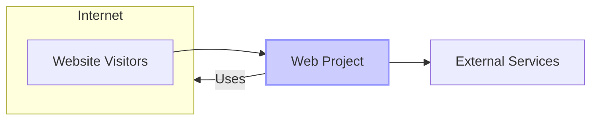
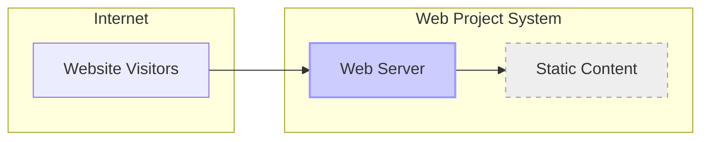
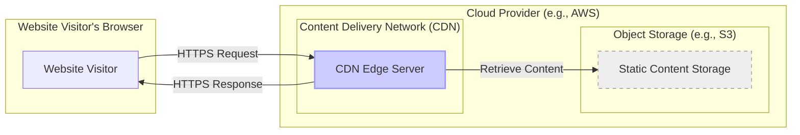

# BUSINESS POSTURE

The project "web" from the provided GitHub repository (https://github.com/modernweb-dev/web) appears to be a web application, likely a website or web service.  Assuming this is a typical web project, the business priorities and goals are likely centered around providing information, services, or functionality to users via the internet.

Business Priorities and Goals:

- Provide online presence and information to users.
- Offer services or functionality through a web interface.
- Ensure website availability and accessibility.
- Maintain website performance and responsiveness.
- Protect website content and data integrity.
- Potentially collect user data for analytics or service delivery.

Business Risks:

- Availability disruption leading to loss of business or reputation.
- Data breach compromising sensitive user data or business information.
- Website defacement or malicious content injection damaging reputation.
- Performance issues leading to poor user experience and abandonment.
- Legal and compliance risks related to data privacy and security.
- Supply chain vulnerabilities in dependencies and build process.

# SECURITY POSTURE

Existing Security Controls:

- security control: Version Control - Source code is managed in a GitHub repository, providing version history and access control. (Implemented in: GitHub)
- security control: Code Review -  Likely implemented through GitHub pull requests, although not explicitly stated. (Potentially implemented in: Development Workflow)

Accepted Risks:

- accepted risk: Lack of formal security testing -  Without explicit security testing mentioned, there's an accepted risk of vulnerabilities in the application.
- accepted risk: Basic security configuration -  Assuming default configurations for web server and application components, there's a risk of misconfigurations.
- accepted risk: Dependency vulnerabilities -  Without dependency scanning, there's a risk of using vulnerable third-party libraries.

Recommended Security Controls:

- security control: Implement automated security scanning (SAST/DAST) in the CI/CD pipeline.
- security control: Regularly perform dependency vulnerability scanning and updates.
- security control: Implement a Web Application Firewall (WAF) to protect against common web attacks.
- security control: Configure secure headers (e.g., Content Security Policy, HSTS) on the web server.
- security control: Implement input validation and output encoding throughout the application.
- security control: Establish a process for security incident response.

Security Requirements:

- Authentication:
    - requirement: If the application requires user accounts, implement strong password policies and multi-factor authentication (MFA).
    - requirement: For API access, use secure API authentication mechanisms like API keys or OAuth 2.0.
- Authorization:
    - requirement: Implement role-based access control (RBAC) to manage user permissions and access to resources.
    - requirement: Ensure proper authorization checks are performed before granting access to sensitive data or functionality.
- Input Validation:
    - requirement: Validate all user inputs on both client-side and server-side to prevent injection attacks (e.g., SQL injection, Cross-Site Scripting).
    - requirement: Sanitize user inputs before storing or displaying them to prevent stored XSS.
- Cryptography:
    - requirement: Use HTTPS for all communication to protect data in transit.
    - requirement: If storing sensitive data, encrypt it at rest using strong encryption algorithms.
    - requirement: Properly manage cryptographic keys and secrets, avoiding hardcoding them in the application.

# DESIGN

## C4 CONTEXT



Context Diagram Elements:

- Element:
    - Name: Website Visitors
    - Type: Person
    - Description: Users who access the web application through the internet using web browsers or other clients.
    - Responsibilities: Access and use the web application's features and content.
    - Security controls: Client-side security controls within their browsers, network security of their internet connection.
- Element:
    - Name: Web Project
    - Type: System
    - Description: The web application being designed and developed, providing services and content to users.
    - Responsibilities: Serve web pages, process user requests, interact with external services, manage data (if any).
    - Security controls: Authentication, authorization, input validation, session management, error handling, logging, monitoring, secure configuration, vulnerability management.
- Element:
    - Name: External Services
    - Type: System
    - Description: Any external systems or services that the web application interacts with, such as third-party APIs, CDNs, or databases (if external).
    - Responsibilities: Provide data, functionality, or infrastructure services to the web application.
    - Security controls: API authentication, secure communication protocols, access control lists, rate limiting.

## C4 CONTAINER



Container Diagram Elements:

- Element:
    - Name: Web Server
    - Type: Container - Web Server
    - Description:  Handles incoming HTTP requests from website visitors, serves static content, and potentially acts as a reverse proxy. Examples: Nginx, Apache, Caddy.
    - Responsibilities:  Receive user requests, serve static files, enforce security policies (e.g., HTTPS, secure headers), logging, request routing.
    - Security controls: HTTPS configuration, secure headers (CSP, HSTS, etc.), access logging, request filtering, rate limiting, vulnerability management of web server software.
- Element:
    - Name: Static Content
    - Type: Container - File System
    - Description: Stores static files of the website, such as HTML, CSS, JavaScript, images, and other assets.
    - Responsibilities:  Store and serve static website files.
    - Security controls: Access control to the file system, integrity monitoring of files, protection against unauthorized modification.

## DEPLOYMENT

Deployment Architecture Option: Cloud-based Static Website Hosting (e.g., AWS S3, Netlify, Vercel)



Deployment Diagram Elements:

- Element:
    - Name: Website Visitor
    - Type: Person
    - Description: End-user accessing the website through their web browser.
    - Responsibilities: Initiate requests to access website content.
    - Security controls: Browser security features, personal device security.
- Element:
    - Name: CDN Edge Server
    - Type: Infrastructure - Server
    - Description:  Content Delivery Network server geographically distributed to cache and serve website content closer to users, improving performance and availability.
    - Responsibilities: Cache static content, serve content to users, handle HTTPS requests, provide DDoS protection.
    - Security controls: CDN provider's security controls, HTTPS termination, DDoS mitigation, access control to CDN configuration.
- Element:
    - Name: Static Content Storage
    - Type: Infrastructure - Object Storage
    - Description: Cloud-based object storage service used to store the static website files.
    - Responsibilities: Store website files securely and reliably, provide access to CDN for content retrieval.
    - Security controls: Access control policies (IAM), encryption at rest, versioning, data replication, CDN access restrictions.

## BUILD

Build Process using GitHub Actions (Example):

```mermaid
flowchart LR
    A[Developer] -->|Code Commit| B(GitHub Repository);
    B -->|GitHub Actions Trigger| C{Build Pipeline};
    C --> D[Linting & Formatting];
    C --> E[Static Analysis Security Testing (SAST)];
    D & E --> F[Build Artifacts (Static Files)];
    F --> G[Deployment to CDN/Storage];
    G --> H[Deployed Website];
    style C fill:#ccf,stroke:#99f,stroke-width:2px
```

Build Process Description:

1.  Developer commits code changes to the GitHub repository.
2.  GitHub Actions pipeline is triggered by code commit.
3.  Build Pipeline performs the following steps:
    - Linting and Formatting: Code is checked for style and formatting issues.
    - Static Analysis Security Testing (SAST): Source code is scanned for potential security vulnerabilities.
4.  Build Artifacts (Static Files):  Processed and optimized static files are generated.
5.  Deployment to CDN/Storage: Build artifacts are deployed to the CDN or object storage for hosting.
6.  Deployed Website: Website is updated with the new build artifacts.

Build Process Security Controls:

- security control: Secure Code Repository (GitHub) - Access control, audit logs, branch protection.
- security control: Automated Build Pipeline (GitHub Actions) - Defined workflow, version controlled, secrets management for deployment credentials.
- security control: Linting and Formatting - Enforces code quality and consistency, reducing potential errors.
- security control: Static Analysis Security Testing (SAST) - Identifies potential security vulnerabilities in the source code early in the development cycle.
- security control: Artifact Integrity - Ensure build artifacts are not tampered with during the build and deployment process (e.g., using checksums).
- security control: Secure Deployment Credentials - Securely store and manage deployment credentials, avoiding hardcoding or exposure.

# RISK ASSESSMENT

Critical Business Processes:

- Website Availability: Ensuring the website is accessible to users 24/7.
- Content Delivery: Providing accurate and up-to-date information to users.
- Website Integrity: Maintaining the website's content and functionality without unauthorized modifications.

Data Sensitivity:

- Assuming this is a static website, data sensitivity is likely low.
- If the website collects any user data (e.g., through contact forms or analytics), the sensitivity would increase depending on the type of data collected (e.g., PII).
- For a basic static website, the primary data to protect is the website content itself and potentially website access logs.
- Sensitivity level: Low to Medium (depending on data collection).

# QUESTIONS & ASSUMPTIONS

Questions:

- What is the specific purpose of this web project? (e.g., blog, portfolio, marketing website, application frontend)
- Are there any user accounts or user-generated content involved?
- Does the website collect any user data? If so, what type of data and for what purpose?
- Are there any specific compliance requirements (e.g., GDPR, HIPAA)?
- What is the expected traffic volume and user base?
- Are there any existing security policies or guidelines that need to be followed?
- What is the tolerance for downtime and data loss?

Assumptions:

- The project is a static website or a frontend application primarily serving static content.
- There is no backend server-side application logic directly within this repository.
- Deployment is likely to a cloud-based static website hosting service or CDN.
- Security is a concern, but specific security requirements are not explicitly defined in the input.
- Standard web security best practices are applicable.
- The project is intended for public access over the internet.