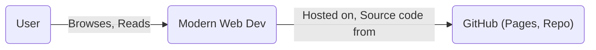
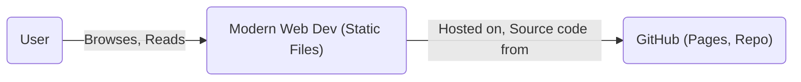
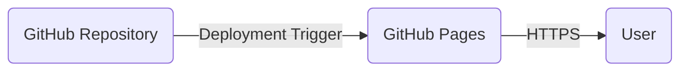
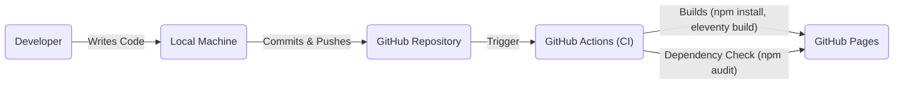

Okay, let's create a design document for the Modern Web Dev project, focusing on aspects relevant to threat modeling.

# BUSINESS POSTURE

Business Priorities and Goals:

*   Provide a comprehensive and up-to-date resource for web developers.
*   Offer guides, tools, and documentation to simplify modern web development.
*   Foster a community around modern web development best practices.
*   Maintain a fast, accessible, and user-friendly website.
*   Ensure the project is easily maintainable and extensible.

Most Important Business Risks:

*   Availability: Website downtime or performance degradation impacting user experience and credibility.
*   Integrity: Unauthorized modification of content, leading to misinformation and reputational damage.
*   Confidentiality: While the project primarily deals with public information, any potential collection of user data (e.g., analytics, future features) must be protected.
*   Maintainability: Inability to easily update and maintain the project, leading to outdated information and security vulnerabilities.
*   Reputation: Negative user experience, inaccurate information, or security breaches could damage the project's reputation.

# SECURITY POSTURE

Existing Security Controls:

*   security control: Static Site Generation (SSG): Using a static site generator (Eleventy) inherently reduces the attack surface compared to dynamic websites with server-side logic and databases.
*   security control: HTTPS: The GitHub Pages deployment (implied) enforces HTTPS, encrypting communication between the user and the website.
*   security control: Content Security Policy (CSP): While not explicitly configured in the repository, a CSP is a recommended best practice and should be implemented.
*   security control: Dependency Management: Using npm for dependency management allows for tracking and updating dependencies, reducing the risk of known vulnerabilities.
*   security control: Code Reviews: The open-source nature of the project encourages community code reviews, potentially identifying security issues.
*   security control: Limited User Input: The current project scope appears to have limited user input, reducing the risk of injection attacks.

Accepted Risks:

*   accepted risk: Reliance on GitHub Pages: The project's availability and security are partially dependent on GitHub's infrastructure and security practices.
*   accepted risk: Limited Dynamic Functionality: The static nature of the site limits the potential for dynamic features that might require server-side processing and introduce new security considerations.
*   accepted risk: Open Source Contributions: While beneficial, accepting contributions from external sources introduces a risk of malicious or poorly written code.

Recommended Security Controls:

*   security control: Implement a strong Content Security Policy (CSP) to mitigate XSS and data injection attacks.
*   security control: Regularly audit and update dependencies to address known vulnerabilities. Use tools like `npm audit` or Dependabot.
*   security control: Implement Subresource Integrity (SRI) for included scripts and stylesheets to ensure they haven't been tampered with.
*   security control: Establish a clear contribution guideline and security review process for all pull requests.
*   security control: Consider using a Web Application Firewall (WAF) if the site's traffic and risk profile warrant it (e.g., Cloudflare).
*   security control: If any user data collection is implemented, ensure compliance with relevant privacy regulations (e.g., GDPR, CCPA).

Security Requirements:

*   Authentication: Currently not applicable, as the site is primarily read-only. If user accounts or personalized content are added, strong authentication mechanisms (e.g., multi-factor authentication) and secure password storage (e.g., hashing with salt) are required.
*   Authorization: Currently not applicable. If roles or permissions are introduced, a robust authorization system is needed to control access to content and functionality.
*   Input Validation: If any forms or user input mechanisms are added, rigorous input validation is crucial to prevent injection attacks (XSS, etc.).
*   Cryptography: HTTPS is already enforced. If sensitive data is handled, appropriate cryptographic algorithms and key management practices must be used.

# DESIGN

## C4 CONTEXT

Element Descriptions:

*   Element:
    *   Name: User
    *   Type: Person
    *   Description: A web developer or anyone interested in learning about modern web development.
    *   Responsibilities: Browses the website, reads content, potentially interacts with community features (if added).
    *   Security controls: Browser security settings, awareness of phishing and social engineering.

*   Element:
    *   Name: Modern Web Dev
    *   Type: Software System
    *   Description: The static website providing information and resources on modern web development.
    *   Responsibilities: Serves content to users, provides a user-friendly interface.
    *   Security controls: SSG, HTTPS, CSP (recommended), SRI (recommended).

*   Element:
    *   Name: GitHub (Pages, Repo)
    *   Type: External System
    *   Description: Platform hosting the website's source code and serving it via GitHub Pages.
    *   Responsibilities: Version control, hosting, deployment.
    *   Security controls: GitHub's internal security measures, HTTPS.

## C4 CONTAINER

Since this is a static site, the container diagram is essentially the same as the context diagram. The "container" is the website itself.

Element Descriptions:

*   Element:
    *   Name: User
    *   Type: Person
    *   Description: A web developer seeking information.
    *   Responsibilities: Browses the website.
    *   Security controls: Browser security settings.

*   Element:
    *   Name: Modern Web Dev (Static Files)
    *   Type: Container (Static Website)
    *   Description: The collection of HTML, CSS, JavaScript, and image files generated by Eleventy.
    *   Responsibilities: Delivering content to the user's browser.
    *   Security controls: SSG, HTTPS, CSP (recommended), SRI (recommended).

*   Element:
    *   Name: GitHub (Pages, Repo)
    *   Type: External System
    *   Description: Platform hosting the website and source code.
    *   Responsibilities: Version control, hosting, deployment.
    *   Security controls: GitHub's internal security measures, HTTPS.

## DEPLOYMENT

Deployment Solutions:

1.  GitHub Pages (Current): Simple and convenient, directly integrated with the repository.
2.  Netlify/Vercel: Offer similar functionality to GitHub Pages with additional features like serverless functions (if needed in the future).
3.  Cloud Provider (AWS S3 + CloudFront, Azure Static Web Apps, Google Cloud Storage): More control over infrastructure and configuration.

Chosen Solution: GitHub Pages (as currently implemented)

Element Descriptions:

*   Element:
    *   Name: GitHub Repository
    *   Type: Code Repository
    *   Description: Stores the project's source code and triggers deployments.
    *   Responsibilities: Version control, deployment trigger.
    *   Security controls: Access controls, branch protection rules.

*   Element:
    *   Name: GitHub Pages
    *   Type: Hosting Platform
    *   Description: Hosts the static website files and serves them to users.
    *   Responsibilities: Hosting, HTTPS.
    *   Security controls: GitHub's internal security measures, HTTPS enforcement.

*   Element:
    *   Name: User
    *   Type: Person
    *   Description: Accesses the website via a web browser.
    *   Responsibilities: Browsing the website.
    *   Security controls: Browser security settings.

## BUILD

Build Process Description:

1.  Developer: A developer writes code and makes changes locally.
2.  Local Machine: The developer's local environment where code is edited and tested.
3.  Commit & Push: Changes are committed to the Git repository and pushed to GitHub.
4.  GitHub Repository: The central repository storing the project's code.
5.  GitHub Actions (CI): A continuous integration workflow is triggered on push (or pull request).
    *   Dependency Check: `npm audit` (or a similar tool) is run to check for known vulnerabilities in dependencies.  This should be configured as a GitHub Action.
    *   Build: The project is built using `npm install` (to install dependencies) and `eleventy` (to generate the static site).
    *   Linting (Recommended): Add linters for HTML, CSS, and JavaScript to enforce code style and identify potential issues.
    *   Tests (Recommended): If any tests are added (e.g., for JavaScript utilities), they should be run as part of the CI process.
6.  GitHub Pages: The built static files are deployed to GitHub Pages.

Security Controls in Build Process:

*   security control: Dependency Scanning: `npm audit` (or similar) is used to identify vulnerable dependencies.
*   security control: Code Review: Pull requests are reviewed before merging, allowing for manual security checks.
*   security control: CI/CD: GitHub Actions automates the build and deployment process, ensuring consistency and reducing manual errors.
*   security control: (Recommended) Linting: Linters help identify potential code quality and security issues.
*   security control: (Recommended) Static Analysis: Consider integrating a static analysis tool (e.g., SonarQube) for deeper code analysis.

# RISK ASSESSMENT

Critical Business Processes:

*   Content Delivery: Ensuring users can access the website's content reliably and efficiently.
*   Content Integrity: Maintaining the accuracy and trustworthiness of the information provided.
*   Community Engagement (Future): If community features are added, ensuring a safe and positive environment.

Data to Protect:

*   Source Code: While public, unauthorized modifications could lead to website defacement or the introduction of vulnerabilities.  Sensitivity: Low (Public Repository).
*   Website Content: The articles, guides, and other information on the site. Sensitivity: Low (Publicly Available).
*   User Data (Potentially): If any user data is collected in the future (e.g., analytics, comments, accounts), this data would require protection. Sensitivity: Depends on the specific data collected (Potentially High).

# QUESTIONS & ASSUMPTIONS

Questions:

*   Are there any plans to add dynamic features or user input mechanisms to the website?
*   Will any user data be collected, even for analytics purposes?
*   What is the expected traffic volume and growth rate for the website?
*   Are there any specific compliance requirements (e.g., GDPR, CCPA) that need to be considered?
*   What is the process for handling security vulnerabilities reported by external researchers?

Assumptions:

*   BUSINESS POSTURE: The primary goal is to provide information; monetization or user data collection is not a primary concern.
*   SECURITY POSTURE: The project has a relatively low risk profile due to its static nature. GitHub's security infrastructure is considered reliable.
*   DESIGN: The website will remain primarily static, with limited or no dynamic functionality. No user accounts or personalized content are planned.