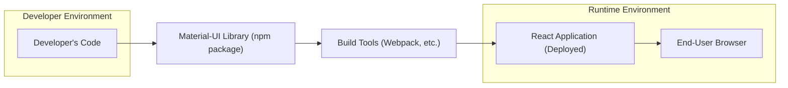
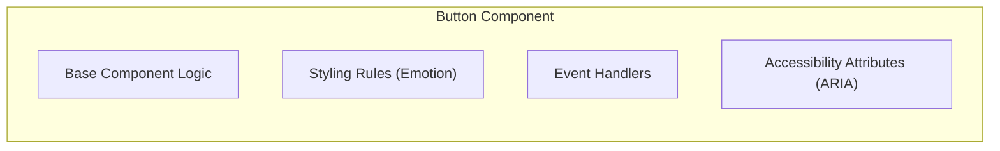
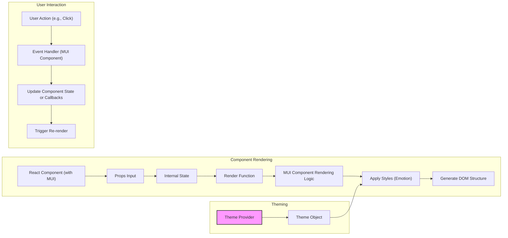

# Project Design Document: Material-UI Library

**Version:** 1.1
**Date:** October 26, 2023
**Author:** AI Software Architect

## 1. Introduction

This document provides a detailed design overview of the Material-UI (now known as MUI Core) library, specifically tailored for subsequent threat modeling activities. It aims to clearly articulate the system's structure, key components, interactions, and data flows to facilitate the identification of potential security vulnerabilities.

## 2. Project Overview

Material-UI (MUI Core) is a widely adopted open-source React component library implementing Google's Material Design specification. It offers a rich set of pre-built, customizable, and accessible UI components that developers integrate into their web applications to create consistent and user-friendly interfaces.

## 3. Goals

* Deliver a clear, concise, and comprehensive architectural description of the Material-UI library.
* Identify and describe the core components and their interactions within the library and with consuming applications.
* Detail the data flow within the library and its interaction with the host React application and the end-user's browser.
* Enumerate the key dependencies of the Material-UI library.
* Proactively highlight potential areas of security concern to guide future threat modeling efforts.

## 4. Scope

This design document focuses on the client-side architecture and functionalities of the Material-UI library as it is integrated into a developer's React application. While the document primarily addresses client-side aspects, it will briefly touch upon Server-Side Rendering (SSR) considerations where they have security implications. Specific integrations with backend systems and the internal workings of the documentation website are outside the primary scope.

## 5. Architectural Overview

Material-UI's architecture is centered around reusable React components. Understanding its structure involves examining different layers of abstraction.

### 5.1. High-Level System Context

* **Developer's Code:** The source code of the application being built, which imports and utilizes Material-UI components.
* **Material-UI Library (npm package):** The distributed library containing the component implementations, styles, and utilities.
* **Build Tools (Webpack, etc.):** Tools used to bundle the developer's application code and the Material-UI library for deployment.
* **React Application (Deployed):** The bundled application running in the end-user's browser.
* **End-User Browser:** The environment where the application and Material-UI components are rendered and interacted with.

### 5.2. Internal Architectural Layers

Material-UI can be conceptually divided into the following layers:

* **Core Components:** The fundamental UI building blocks (e.g., `"Button"`, `"TextField"`, `"Checkbox"`). These components encapsulate presentation and behavior.
* **Styling and Theming:** Mechanisms for defining and applying styles to components. This includes the theme provider, style overrides, and CSS-in-JS solutions (`emotion`).
* **Layout and Grid System:** Components and utilities for structuring the layout of applications (e.g., `"Grid"`, `"Box"`).
* **Utility Functions and Hooks:** Helper functions and React hooks that provide common functionalities and abstractions used within the components.
* **Accessibility (A11y) Features:** Built-in support for accessibility standards, including ARIA attributes and keyboard navigation.
* **Iconography:**  The set of Material Design icons provided as React components (`@mui/icons-material`).

### 5.3. Component Structure Example

* **Base Component Logic:** The core React logic defining the component's state, props, and rendering behavior.
* **Styling Rules (Emotion):** CSS-in-JS styles defined using the Emotion library, determining the component's visual appearance.
* **Event Handlers:** Functions that handle user interactions like clicks and keyboard events.
* **Accessibility Attributes (ARIA):**  Attributes that provide semantic information to assistive technologies.

## 6. Data Flow Deep Dive

The data flow involves how data is processed and rendered within Material-UI components and the surrounding React application.

* **Component Rendering:**
    * **React Component (with MUI):** A React component in the developer's application that utilizes Material-UI components.
    * **Props Input:** Data passed down to the component through its props.
    * **Internal State:**  State managed within the component using React's `useState` or class component state.
    * **Render Function:** The React component's render method, which determines what to display.
    * **MUI Component Rendering Logic:** The internal logic of the Material-UI component responsible for rendering its specific UI elements.
    * **Apply Styles (Emotion):**  Emotion processes the component's styles and applies them to the rendered elements.
    * **Generate DOM Structure:** The final HTML elements are created and added to the DOM.
* **User Interaction:**
    * **User Action (e.g., Click):** An interaction performed by the user in the browser.
    * **Event Handler (MUI Component):**  A function within the Material-UI component that responds to the user action.
    * **Update Component State or Callbacks:** The event handler may update the component's internal state or trigger callback functions passed as props.
    * **Trigger Re-render:** State updates cause React to re-render the component.
* **Theming:**
    * **Theme Provider:** A component from `@mui/material/styles` that makes the application's theme available to all components.
    * **Theme Object:** A JavaScript object defining the application's color palette, typography, and other design tokens.
    * **Apply Styles (Emotion):** The theme object is used by Emotion to dynamically generate styles based on the current theme.

## 7. Dependencies Breakdown

Material-UI relies on a set of core dependencies and development-time tools.

* **Core Runtime Dependencies:**
    * **`react`:** The fundamental library for building UI components.
    * **`@emotion/react`:**  Used for styling React components with CSS-in-JS.
    * **`@emotion/styled`:**  A utility for creating styled components using Emotion.
    * **`prop-types`:**  For defining and validating the types of component props.
    * **`clsx`:**  A utility for conditionally joining class names.
    * **`@mui/system`:** Provides foundational styling utilities and the theme engine.

* **Key Development Dependencies:**
    * **`typescript`:**  Used for static type checking.
    * **`webpack` / `rollup` / `parcel`:** Module bundlers for packaging the library.
    * **`babel`:**  A JavaScript compiler for transpiling code.
    * **`jest` / `@testing-library/react`:**  Testing frameworks and utilities.
    * **`eslint` / `prettier`:**  Code linting and formatting tools.

## 8. Security Considerations for Threat Modeling

This section outlines potential security concerns that should be thoroughly investigated during the threat modeling process.

* **Cross-Site Scripting (XSS) Vulnerabilities:**
    * **Injection through Props:** If consuming applications pass unsanitized user-provided data as props to Material-UI components that render it directly.
    * **Custom Component Overrides:**  Insecure implementations of custom components or overrides of Material-UI components that introduce XSS vectors.
    * **Server-Side Rendering (SSR) Context:** Potential for XSS if SSR is not configured correctly, leading to the injection of malicious scripts during the initial render.
* **Dependency Vulnerabilities:**
    * **Transitive Dependencies:** Vulnerabilities in the dependencies of Material-UI's direct dependencies. Regular dependency scanning and updates are crucial.
    * **Outdated Dependencies:** Using older versions of dependencies with known security flaws.
* **Client-Side Data Handling:**
    * **Sensitive Data in Props/State:**  Accidental exposure of sensitive information through component props or state that might be visible in client-side debugging tools.
* **Accessibility (A11y) and Security:**
    * While primarily an accessibility concern, improper focus management or ARIA attribute usage could potentially be exploited in certain social engineering or UI redressing attacks.
* **Denial of Service (DoS) Potential:**
    * **Complex Rendering Logic:**  Components with computationally expensive rendering logic that could be exploited to cause performance issues or DoS.
    * **Uncontrolled Resource Consumption:** Potential for memory leaks or other resource exhaustion issues if components are not properly managed.
* **Supply Chain Security:**
    * **Compromised Packages:** Risks associated with using compromised versions of the Material-UI library or its dependencies from package registries.
    * **Build Pipeline Security:** Ensuring the security of the build and release processes to prevent malicious code injection.
* **Prototype Pollution Risks:**
    * While less likely in the core library, potential risks if developers extend or modify Material-UI components in ways that inadvertently introduce prototype pollution vulnerabilities.
* **Server-Side Rendering Specific Risks:**
    * **Hydration Mismatches:**  Inconsistencies between the server-rendered HTML and the client-rendered DOM, potentially leading to unexpected behavior or security issues.
    * **Exposure of Server-Side Secrets:**  Accidental inclusion of server-side secrets in the initial HTML payload.

## 9. Deployment Considerations

Material-UI is deployed as part of a standard React application deployment process.

* **Build Process:**  The application and Material-UI are bundled using tools like Webpack, creating optimized static assets (JavaScript, CSS, images).
* **Static Asset Hosting:** The bundled assets are typically served from a web server or a Content Delivery Network (CDN).
* **Server-Side Rendering (Optional):**  For applications using SSR, a Node.js server or a similar environment is required to handle server-side rendering of components.
* **Dependency Management:**  Ensuring that the correct versions of Material-UI and its dependencies are deployed.

## 10. Future Directions

* **Ongoing Component Development:**  Continuous addition of new components and features to expand the library's capabilities.
* **Performance Enhancements:**  Efforts to optimize the rendering performance and reduce the bundle size of the library.
* **Improved Theming and Customization:**  Further enhancements to the theming system to provide greater flexibility in styling components.
* **React Server Components Integration:** Potential future integration with React Server Components for improved performance and data fetching.

## 11. Glossary of Terms

* **Material-UI (MUI Core):** The core React component library implementing Material Design.
* **React:** A declarative JavaScript library for building user interfaces.
* **Component:** A reusable and independent building block in React applications.
* **Props:** Data passed from a parent component to a child component.
* **State:** Data managed within a component that can change over time, triggering re-renders.
* **JSX:** A syntax extension to JavaScript that allows writing HTML-like structures within JavaScript code.
* **DOM:** Document Object Model, the tree-like representation of the HTML document in the browser.
* **SSR:** Server-Side Rendering, rendering React components on the server and sending the initial HTML to the client.
* **CDN:** Content Delivery Network, a distributed network of servers that delivers web content to users based on their geographic location.
* **Emotion:** A library for writing CSS styles with JavaScript.
* **Theming:**  A system for defining and applying consistent styles across an application.
* **ARIA:** Accessible Rich Internet Applications, a set of attributes that provide semantic information to assistive technologies.

This improved design document provides a more detailed and structured overview of the Material-UI library, explicitly focusing on aspects relevant to threat modeling. The enhanced security considerations section offers a more comprehensive starting point for identifying potential vulnerabilities.