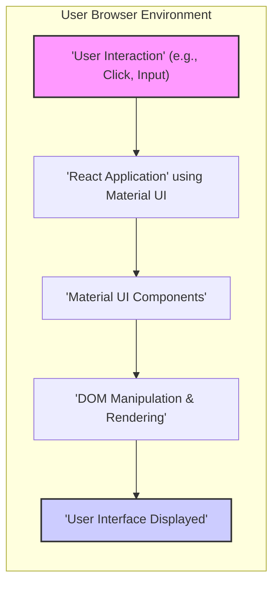
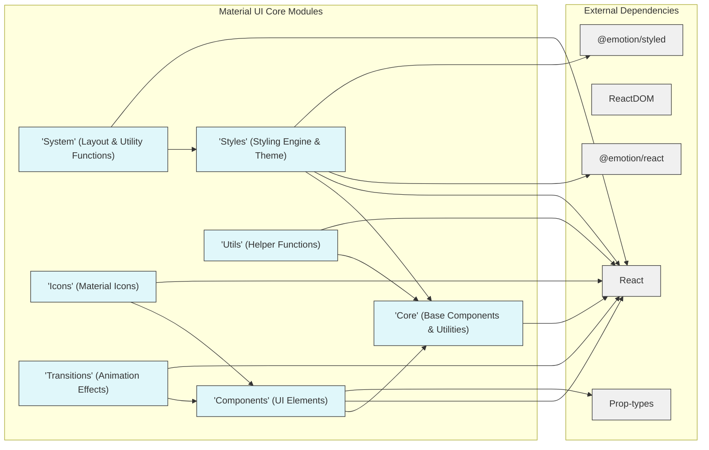
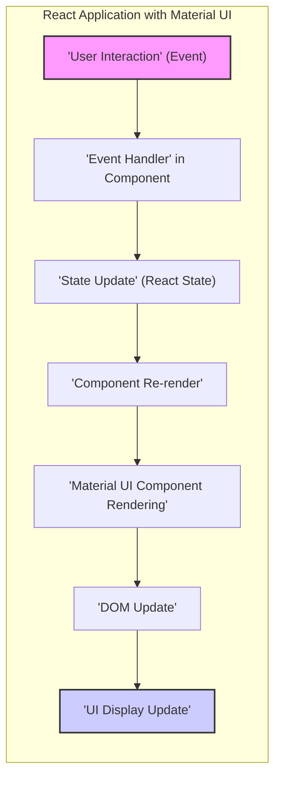

# Material UI Project Design Document for Threat Modeling

## 1. Introduction

### 1.1. Purpose of this Document

This document details the design of the Material UI (MUI) project, a widely used React UI library. Its primary purpose is to serve as the foundation for threat modeling. It outlines the system architecture, core components, technology stack, and initial security considerations to facilitate the identification and mitigation of potential security vulnerabilities. This document is a living document and will be updated as the project evolves.

### 1.2. Project Overview (Material UI)

Material UI is a comprehensive React UI component library implementing Google's Material Design specification. It empowers developers to build user interfaces for web applications with reusable and customizable components. Material UI's key objectives are:

*   **Accessibility:** Ensuring components are accessible and adhere to accessibility best practices (WCAG).
*   **Customization:** Providing extensive theming and styling options for component appearance tailoring.
*   **Responsiveness:** Designing components to adapt seamlessly to various screen sizes and devices.
*   **Developer Experience:** Offering a well-documented, intuitive, and efficient API for developers.
*   **Performance:** Optimizing components for efficient rendering and minimal performance overhead.

Material UI is fundamentally a client-side library, operating within the user's web browser. It interacts with the Document Object Model (DOM) to render UI elements and respond to user interactions within the browser environment.

### 1.3. Target Audience

This document is intended for:

*   **Security Engineers:** To understand the architecture and identify potential threat vectors for threat modeling and security assessments.
*   **Development Team:** To gain a deeper understanding of the system design and security implications of using Material UI components.
*   **Quality Assurance Team:** To understand the system for designing effective security testing strategies and test cases.
*   **Project Stakeholders:** To obtain a high-level overview of the project's architecture and security posture.

## 2. System Architecture

### 2.1. High-Level Architecture

Material UI is a client-side UI library designed to be integrated into React applications. It does not include a backend component itself. The library provides React components that developers utilize within their applications. When rendered by React, these components manipulate the DOM in the user's browser to display the user interface.

*   **'User Interaction'**: Users interact with the web application through their browser (e.g., form submissions, button clicks, keyboard input).
*   **'React Application' using Material UI**: The React application, incorporating Material UI, receives and processes these user interactions.
*   **'Material UI Components'**: React components from the Material UI library are employed within the application's code to define the UI structure and behavior. These components handle rendering logic and user interaction within their scope.
*   **'DOM Manipulation & Rendering'**: React and Material UI components collaborate to manipulate the Document Object Model (DOM) and render the user interface within the browser. This involves creating, updating, and removing DOM elements based on the application's state and component logic.
*   **'User Interface Displayed'**: The final rendered UI is presented to the user within their web browser. All processing and rendering occur client-side.

**Key Architectural Characteristics:**

*   **Client-Side Operation:** Material UI operates exclusively within the client's browser, meaning all code execution and UI rendering happens on the user's machine. This has significant security implications as all client-side code is potentially exposed and controllable by the user.
*   **Component-Based Architecture:** Built upon React's component-based architecture, promoting modularity and reusability. Security considerations need to be applied at the component level.
*   **DOM Manipulation Focus:** Relies heavily on DOM manipulation for rendering and user interaction. Vulnerabilities related to DOM manipulation, such as XSS, are relevant.
*   **React Dependency:** Requires React as a fundamental dependency. Security vulnerabilities in React itself could indirectly affect Material UI and applications using it.

### 2.2. Component Architecture

Material UI is organized into distinct modules, each responsible for specific functionalities. Understanding these modules is crucial for targeted threat modeling, as vulnerabilities may be localized within particular components or modules.

*   **'Core'**: Contains fundamental components, hooks, and context providers used across Material UI. This module provides the building blocks for other modules and is critical for the library's overall functionality. Security issues here could have widespread impact.
*   **'Components'**: The primary module containing UI components (e.g., Button, TextField, Dialog, Table). These components are built using the 'Core', 'Styles', and 'System' modules. This is a key area for security review as it handles user interactions and data display. Input validation and output encoding within these components are crucial.
*   **'Styles'**: Provides the styling engine and theme system, leveraging Emotion for CSS-in-JS. It enables extensive customization of component appearance. CSS-in-JS introduces potential risks related to style injection vulnerabilities if not handled carefully.
*   **'System'**: Offers layout and utility functions for responsive design and component styling, including grid systems and spacing utilities. Layout logic, if flawed, could potentially lead to denial-of-service or unexpected UI behavior.
*   **'Utils'**: Contains helper functions and utilities used throughout the library, such as color manipulation and data validation helpers. While utilities themselves might not be direct vulnerability points, their incorrect usage within components could lead to issues.
*   **'Icons'**: Provides Material Icons as React components for easy integration of icons into UI elements. Icon components themselves are less likely to be direct vulnerability points, but their usage context should be considered.
*   **'Transitions'**: Offers components and utilities for adding animations and transitions to UI elements. Animation logic, if complex, might have subtle performance or unexpected behavior issues, though security vulnerabilities are less likely here.
*   **'External Dependencies'**: Material UI relies on external libraries like React, ReactDOM, prop-types, and Emotion. Vulnerabilities in these dependencies can directly impact Material UI. Dependency management and security scanning are essential.

### 2.3. Data Flow

Data flow within Material UI applications follows React's unidirectional data flow principles. Data flows downwards from parent to child components via props. User interactions trigger state updates, leading to component re-rendering and UI updates.

*   **'User Interaction' (Event)**: A user action in the browser (e.g., typing, clicking) generates an event.
*   **'Event Handler' in Component**: A React component, often a Material UI component or a component using Material UI, handles this event. Event handlers are crucial points for security checks, especially for user input.
*   **'State Update' (React State)**: The event handler updates the component's state using React's state management mechanisms (`useState`, `setState`, `useReducer`). State management is central to React applications, and improper state handling can lead to unexpected behavior or vulnerabilities.
*   **'Component Re-render'**: React detects the state change and triggers a re-render of the component and its child components. Re-rendering is the core mechanism for UI updates in React.
*   **'Material UI Component Rendering'**: During re-render, Material UI components are rendered based on the updated state and props. This is where Material UI components generate the DOM structure based on their logic and styling.
*   **'DOM Update'**: React efficiently updates the DOM to reflect changes in the rendered components using its reconciliation algorithm. DOM updates are the final step in reflecting changes in the UI.
*   **'UI Display Update'**: The user interface in the browser is updated to reflect the new state and rendered components, providing visual feedback to the user.

**Data Flow Security Characteristics:**

*   **Unidirectional Data Flow**: Data flows downwards, simplifying data management and debugging but requiring careful prop handling to prevent unintended data exposure or manipulation.
*   **State-Driven Rendering**: UI updates are driven by state changes. Secure state management practices are essential to prevent vulnerabilities arising from state manipulation.
*   **Event-Driven Interactions**: User interactions drive application behavior. Secure event handling, including input validation and sanitization, is critical.
*   **React's Reconciliation**: React's DOM reconciliation optimizes performance but doesn't inherently address security. Security considerations must be built into component logic and data handling.

## 3. Technology Stack

Material UI is built using a modern web development technology stack. Understanding the technologies is important for identifying technology-specific vulnerabilities and attack vectors.

*   **3.1. Programming Languages:**
    *   **JavaScript (ES6+):** The primary language for the library's logic, component implementation, and interactivity. JavaScript vulnerabilities, especially client-side, are relevant.
    *   **JSX (JavaScript XML):** Used for declarative React component structure definition. JSX itself doesn't introduce direct vulnerabilities, but how it's used within components is crucial.
    *   **CSS (Cascading Style Sheets):** Used for styling, although Material UI primarily employs CSS-in-JS with Emotion. CSS vulnerabilities, especially related to injection, are relevant even with CSS-in-JS.

*   **3.2. Frameworks and Libraries:**
    *   **React:** The core framework for building user interfaces, managing component lifecycle, and handling DOM updates. React vulnerabilities directly impact Material UI.
    *   **ReactDOM:** React library for interacting with the DOM in web browsers. ReactDOM's correct usage is crucial to prevent DOM-related vulnerabilities.
    *   **Emotion:** CSS-in-JS library for styling components, providing theming and dynamic styling. Emotion's security is relevant to Material UI's styling system.

*   **3.3. Build and Deployment Tools:**
    *   **Node.js and npm/yarn:** Used for package management, development server, and build processes. Vulnerabilities in Node.js or npm/yarn toolchains can impact the development and build process.
    *   **Webpack/Rollup/Babel:** Likely used for bundling, transpiling, and optimizing the library for distribution. (Refer to `package.json` and build scripts for specifics). Build tool vulnerabilities can compromise the distributed library.
    *   **GitHub Actions (or similar CI/CD):** Likely used for automated testing, building, and publishing. CI/CD pipeline security is crucial to prevent supply chain attacks.

*   **3.4. Dependencies:**
    *   **prop-types:** For runtime type checking of React component props. While primarily for development, incorrect prop type definitions *could* lead to unexpected behavior.
    *   **@emotion/react, @emotion/styled:** Core Emotion libraries for CSS-in-JS. Security of these libraries is directly relevant.
    *   **clsx:** Utility for conditionally joining class names. Low security risk in itself.
    *   **@babel/runtime:** Babel runtime dependencies for transpiled code. Security of Babel runtime is relevant.
    *   **(And other dependencies listed in `package.json`):** A comprehensive dependency list is in the project's `package.json` file on GitHub. Regularly auditing and scanning these dependencies for vulnerabilities is critical. Tools like `npm audit` or Snyk can be used.

## 4. Security Considerations (Initial)

This section outlines initial security considerations for Material UI to guide threat modeling. These points will be further explored and expanded upon in a dedicated threat modeling exercise.

*   **4.1. Input Validation and Sanitization:**
    *   Material UI components handling user input (e.g., `TextField`, `Autocomplete`, `Select`) must ensure robust input validation and sanitization to prevent client-side injection vulnerabilities, primarily Cross-Site Scripting (XSS). For example, ensure user-provided text is properly encoded before being rendered in the DOM.
    *   While Material UI is client-side, developers using it must validate and sanitize data passed to and from these components, especially when interacting with external APIs or backend systems. Material UI itself doesn't handle backend communication, but applications using it do.
    *   Consider validating input types, lengths, and formats to prevent unexpected data from being processed by components.

*   **4.2. Dependency Vulnerability Management:**
    *   Material UI relies on numerous dependencies (React, Emotion, etc.). Proactive dependency management is crucial.
    *   Regularly scan dependencies for known vulnerabilities using tools like `npm audit`, `yarn audit`, or Snyk. Implement automated dependency scanning in the CI/CD pipeline.
    *   Update dependencies promptly to patch known vulnerabilities. Follow security advisories for React, Emotion, and other core dependencies.
    *   Mitigate supply chain attack risks by verifying dependency integrity (e.g., using checksums or package lock files) and using reputable package registries.

*   **4.3. Rendering Logic and DOM Manipulation Security:**
    *   Carefully review component rendering logic to prevent improper DOM manipulation that could introduce XSS vulnerabilities. Ensure that dynamic content is rendered safely and that user-controlled data is not directly inserted into HTML without proper encoding.
    *   Pay attention to components that render user-provided content, HTML strings, or URLs. These are potential XSS injection points.
    *   If server-side rendering (SSR) is used with Material UI (e.g., with Next.js), ensure SSR context is also secure and doesn't introduce vulnerabilities during the rendering process.

*   **4.4. Client-Side Security Best Practices:**
    *   As a client-side library, Material UI's security is inherently linked to client-side security principles.
    *   XSS is a primary concern. Implement Content Security Policy (CSP) to mitigate XSS risks in applications using Material UI.
    *   Be mindful of client-side data storage (if applicable in applications using Material UI). Avoid storing sensitive data in local storage or cookies if possible, or encrypt it appropriately.
    *   Ensure that client-side logic within components does not expose sensitive information or create client-side vulnerabilities.

*   **4.5. Accessibility and Security Interplay:**
    *   While accessibility is a core principle, ensure accessibility features do not inadvertently introduce security vulnerabilities.
    *   Correctly use ARIA attributes and roles to enhance accessibility without creating security loopholes. For example, ensure ARIA attributes don't override or bypass security mechanisms.
    *   Test accessibility features for potential security implications, especially in scenarios involving screen readers or assistive technologies, as these might interact with the UI in unexpected ways.

## 5. Conclusion

This design document provides a comprehensive overview of Material UI's architecture, technology stack, and initial security considerations. It serves as a solid foundation for conducting a thorough threat modeling exercise. By understanding the components, data flow, and technologies, security engineers and the development team can effectively identify, analyze, and mitigate potential security threats associated with using Material UI in web applications. The next crucial step is to perform a detailed threat modeling process based on this document, focusing on specific components, data interactions, and potential attack vectors to identify concrete threats and develop targeted mitigation strategies. This document should be used as a reference point throughout the project lifecycle and updated as the project evolves and new security insights emerge.