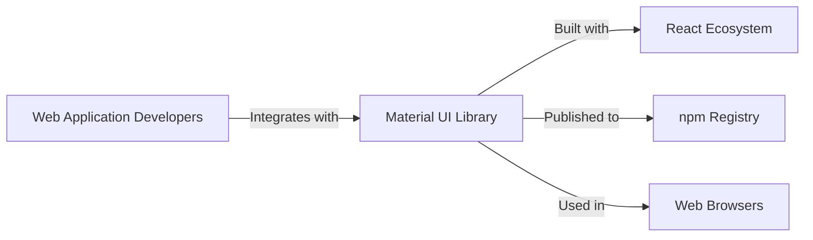
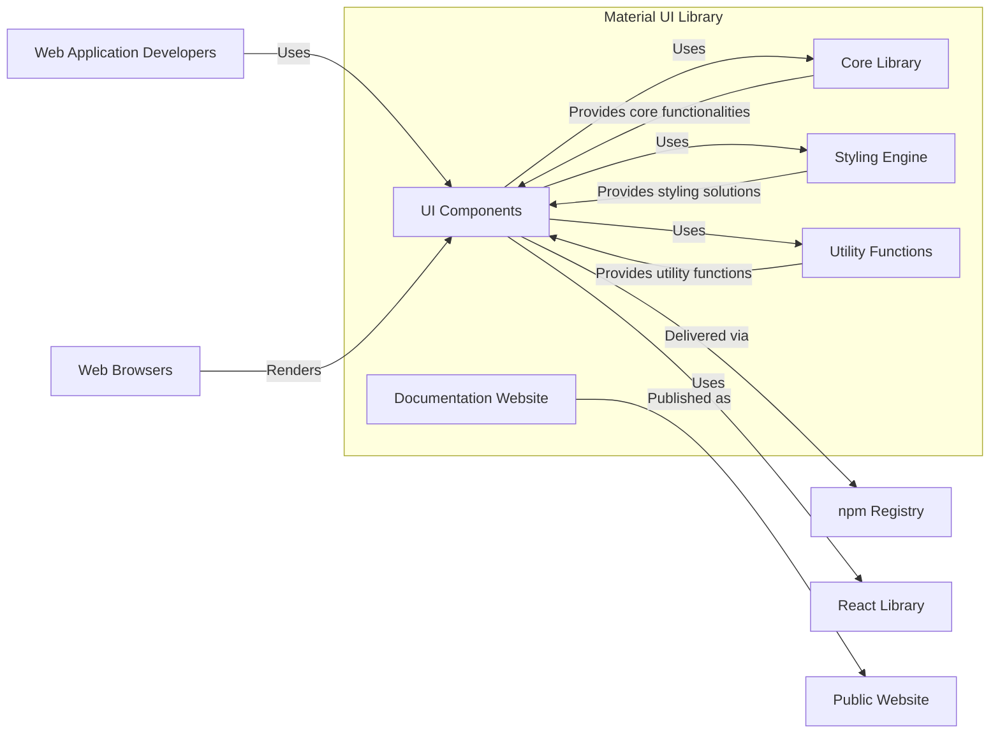
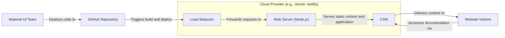
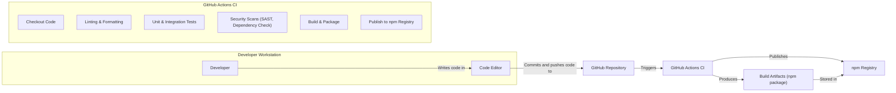

# BUSINESS POSTURE

Material UI is a popular open-source React UI framework. Its primary business priority is to provide a comprehensive, accessible, and performant library of UI components that enables developers to build user interfaces efficiently and consistently. The project aims to foster a strong community and maintain its position as a leading UI framework in the React ecosystem.

Business goals include:
- Maintaining a high-quality, well-documented component library.
- Ensuring accessibility and responsiveness of components.
- Providing excellent developer experience and ease of use.
- Growing and supporting a vibrant community of users and contributors.
- Staying up-to-date with the latest React and web development best practices.

Most important business risks:
- Security vulnerabilities in the library could damage reputation and user trust.
- Performance issues could lead to negative user experiences and adoption decline.
- Lack of accessibility could limit user base and create legal compliance issues for users.
- Poor documentation or developer experience could hinder adoption and community growth.
- Stagnation or failure to adapt to new technologies could lead to obsolescence.

# SECURITY POSTURE

Existing security controls:
- security control: GitHub repository with public visibility (location: github.com).
- security control: Community contributions and code reviews (location: GitHub pull requests).
- security control: Dependency management using npm/yarn (location: package.json, yarn.lock/package-lock.json).
- security control: Standard JavaScript/TypeScript development practices (location: codebase).
- accepted risk: Reliance on open-source dependencies, which may have their own vulnerabilities.
- accepted risk: Public nature of the repository means potential exposure of development practices.

Recommended security controls:
- security control: Automated security scanning of dependencies (e.g., using Dependabot, Snyk).
- security control: Static Application Security Testing (SAST) tools integrated into the build process.
- security control: Regular security audits of the codebase by security experts.
- security control: Security vulnerability reporting and response process.
- security control: Secure coding guidelines for contributors.

Security requirements:
- Authentication: Not directly applicable to Material UI library itself, as it's a client-side component library. Authentication is the responsibility of the applications using Material UI.
- Authorization: Not directly applicable to Material UI library itself. Authorization is the responsibility of the applications using Material UI.
- Input validation: Material UI components should be designed to handle various types of input gracefully and prevent common front-end vulnerabilities like Cross-Site Scripting (XSS). Components should sanitize or escape user-provided data when rendering.
- Cryptography: Not directly applicable to Material UI library itself in terms of implementing cryptographic algorithms. However, Material UI should not introduce vulnerabilities that could weaken the security of applications using cryptography. If Material UI handles sensitive data (even indirectly), it should do so securely and avoid storing or transmitting sensitive data unnecessarily in client-side storage or logs.

# DESIGN

## C4 CONTEXT

Elements of context diagram:
- Name: Material UI Library
  - Type: Software System
  - Description: A React UI framework providing a set of reusable and accessible components for building web applications.
  - Responsibilities: Provide UI components, maintain quality, ensure accessibility, offer good developer experience.
  - Security controls: Input validation within components to prevent XSS, secure coding practices.
- Name: Web Application Developers
  - Type: Person
  - Description: Developers who use Material UI to build web applications.
  - Responsibilities: Integrate Material UI into their projects, use components correctly, report issues and contribute.
  - Security controls: Secure development practices in their applications, proper usage of UI components.
- Name: React Ecosystem
  - Type: Software System
  - Description: The broader React JavaScript library and related tools and libraries that Material UI is built upon.
  - Responsibilities: Provide the underlying framework for Material UI, maintain React library and ecosystem.
  - Security controls: Security of React library itself, community security practices.
- Name: npm Registry
  - Type: Software System
  - Description: A public registry for JavaScript packages, used to distribute and manage Material UI library.
  - Responsibilities: Host and distribute Material UI packages, ensure package integrity.
  - Security controls: Package signing, vulnerability scanning of packages, access controls.
- Name: Web Browsers
  - Type: Software System
  - Description: Software used by end-users to access web applications built with Material UI.
  - Responsibilities: Render web applications, execute JavaScript code, provide a secure browsing environment.
  - Security controls: Browser security features (CSP, XSS protection, etc.), sandboxing, regular updates.

## C4 CONTAINER

Elements of container diagram:
- Name: UI Components
  - Type: Container (React Components)
  - Description: The set of pre-built UI components (buttons, text fields, modals, etc.) that developers use in their applications.
  - Responsibilities: Provide reusable UI elements, handle user interactions, render UI, implement input validation.
  - Security controls: Input validation within component logic, secure rendering practices to prevent XSS.
- Name: Core Library
  - Type: Container (JavaScript/TypeScript Modules)
  - Description: Core functionalities and base classes used by UI components, including theming, accessibility utilities, and common logic.
  - Responsibilities: Provide foundational functionalities, manage theming, handle accessibility concerns, offer utility functions.
  - Security controls: Secure implementation of core functionalities, no storage of sensitive data, secure handling of user inputs if any.
- Name: Styling Engine
  - Type: Container (JavaScript/TypeScript Modules)
  - Description: The system responsible for applying styles to components, handling theming, and providing styling utilities.
  - Responsibilities: Manage component styling, provide theming capabilities, ensure consistent look and feel.
  - Security controls: Secure styling practices to prevent CSS injection, proper handling of user-provided styles if allowed.
- Name: Utility Functions
  - Type: Container (JavaScript/TypeScript Modules)
  - Description: Collection of utility functions used across the library for common tasks like data manipulation, DOM manipulation, and more.
  - Responsibilities: Provide reusable utility functions, simplify common tasks.
  - Security controls: Secure implementation of utility functions, avoid introducing vulnerabilities through utility functions.
- Name: Documentation Website
  - Type: Container (Web Application)
  - Description: A website providing documentation, examples, and guides for using Material UI.
  - Responsibilities: Document library features, provide usage examples, offer developer guides, community forum.
  - Security controls: Standard web application security practices, input validation on website forms, protection against website vulnerabilities (XSS, CSRF, etc.).
- Name: npm Registry
  - Type: External System
  - Description: Public registry for JavaScript packages.
  - Responsibilities: Host and distribute Material UI packages.
  - Security controls: Package signing, vulnerability scanning.
- Name: Web Browsers
  - Type: External System
  - Description: Software used by end-users to access web applications.
  - Responsibilities: Render web applications, execute JavaScript.
  - Security controls: Browser security features.
- Name: Web Application Developers
  - Type: Person
  - Description: Developers using Material UI.
  - Responsibilities: Integrate and use Material UI components.
  - Security controls: Secure coding practices in their applications.

## DEPLOYMENT

Material UI library itself is not deployed as a standalone application. It is published to npm registry and then integrated into web applications developed by other developers. The deployment architecture described here is for the *documentation website* of Material UI, as it is a publicly accessible web application.

Deployment Architecture for Documentation Website (Example - simplified):

Elements of deployment diagram (Documentation Website):
- Name: Cloud Provider (e.g., Vercel, Netlify)
  - Type: Infrastructure
  - Description: Cloud platform hosting the documentation website.
  - Responsibilities: Provide infrastructure, manage servers, handle deployments, ensure uptime.
  - Security controls: Cloud provider security controls (physical security, network security, access controls), platform security features.
- Name: Load Balancer
  - Type: Infrastructure Component
  - Description: Distributes incoming traffic across web servers.
  - Responsibilities: Load balancing, traffic routing, high availability.
  - Security controls: DDoS protection, TLS termination, traffic filtering.
- Name: Web Server (Node.js)
  - Type: Software Component
  - Description: Node.js server serving the documentation website application.
  - Responsibilities: Serve static files, run application logic, handle HTTP requests.
  - Security controls: Web server hardening, secure configuration, input validation, output encoding.
- Name: CDN (Content Delivery Network)
  - Type: Infrastructure Component
  - Description: Network of servers distributing static content globally for faster access.
  - Responsibilities: Caching static content, content delivery, performance optimization.
  - Security controls: CDN security features (DDoS protection, WAF), secure content delivery (HTTPS).
- Name: Material UI Team
  - Type: Person
  - Description: Developers and maintainers of Material UI.
  - Responsibilities: Develop and maintain the documentation website, deploy updates.
  - Security controls: Secure development practices, access controls to deployment infrastructure.
- Name: Website Visitors
  - Type: Person
  - Description: Users accessing the Material UI documentation website.
  - Responsibilities: Access documentation, learn about Material UI.
  - Security controls: Browser security features.
- Name: GitHub Repository
  - Type: Software System
  - Description: Source code repository for the documentation website.
  - Responsibilities: Store source code, manage version control, trigger CI/CD pipelines.
  - Security controls: Access controls, code review process, branch protection.

## BUILD

Build Process for Material UI Library:

Elements of build diagram:
- Name: Developer
  - Type: Person
  - Description: Software developer contributing to Material UI.
  - Responsibilities: Write code, fix bugs, implement features, contribute to the project.
  - Security controls: Secure coding practices, local development environment security.
- Name: Code Editor
  - Type: Tool
  - Description: Development environment used by developers (e.g., VS Code, IntelliJ).
  - Responsibilities: Code editing, local testing, version control integration.
  - Security controls: Code editor security features, plugins security.
- Name: GitHub Repository
  - Type: Code Repository
  - Description: Central repository for Material UI source code.
  - Responsibilities: Version control, code storage, collaboration platform.
  - Security controls: Access controls, branch protection, code review process.
- Name: GitHub Actions CI
  - Type: CI/CD System
  - Description: Automated build and deployment pipeline using GitHub Actions.
  - Responsibilities: Automate build process, run tests, perform security checks, publish packages.
  - Security controls: Secure CI/CD configuration, secrets management, build environment security.
    - Name: Checkout Code
      - Type: CI Step
      - Description: Retrieves source code from GitHub repository.
      - Responsibilities: Obtain latest code version.
      - Security controls: Access control to repository.
    - Name: Linting & Formatting
      - Type: CI Step
      - Description: Checks code style and formatting.
      - Responsibilities: Enforce code quality standards.
      - Security controls: Static code analysis for style and potential issues.
    - Name: Tests
      - Type: CI Step
      - Description: Runs unit and integration tests.
      - Responsibilities: Verify code functionality and prevent regressions.
      - Security controls: Testing for security-related issues, secure test environment.
    - Name: Security Scans (SAST, Dependency Check)
      - Type: CI Step
      - Description: Performs static application security testing and dependency vulnerability checks.
      - Responsibilities: Identify potential security vulnerabilities in code and dependencies.
      - Security controls: SAST tools, dependency scanning tools, vulnerability databases.
    - Name: Build & Package
      - Type: CI Step
      - Description: Compiles code and packages it into npm package.
      - Responsibilities: Create distributable package.
      - Security controls: Secure build process, artifact integrity checks.
    - Name: Publish to npm Registry
      - Type: CI Step
      - Description: Publishes the built package to npm registry.
      - Responsibilities: Distribute the library to users.
      - Security controls: Secure publishing process, package signing, access control to npm registry.
- Name: npm Registry
  - Type: Package Registry
  - Description: Public registry for JavaScript packages.
  - Responsibilities: Host and distribute Material UI packages.
  - Security controls: Package signing, vulnerability scanning, access controls.
- Name: Build Artifacts (npm package)
  - Type: Data
  - Description: The packaged and built Material UI library ready for distribution.
  - Responsibilities: Distributable library package.
  - Security controls: Integrity checks, signing.

# RISK ASSESSMENT

Critical business processes we are trying to protect:
- Maintaining the integrity and availability of the Material UI library.
- Ensuring the security and reliability of the UI components for users.
- Protecting the reputation and trust of the Material UI project.
- Supporting the community and fostering continued adoption.

Data we are trying to protect and their sensitivity:
- Source code: High sensitivity. Confidentiality and integrity are crucial to prevent unauthorized modifications or exposure of vulnerabilities.
- Build artifacts (npm packages): High sensitivity. Integrity is crucial to ensure users receive untampered and secure packages.
- Documentation website content: Medium sensitivity. Integrity and availability are important for user experience and project reputation.
- User data on documentation website (if any, e.g., forum accounts): Low to medium sensitivity depending on the data collected. Confidentiality and integrity are relevant.

# QUESTIONS & ASSUMPTIONS

Questions:
- What is the process for reporting and handling security vulnerabilities in Material UI?
- Are there any existing security audits or penetration testing reports for Material UI?
- What are the specific tools used for SAST and dependency scanning in the build process?
- What is the process for managing and rotating secrets used in the build and deployment pipelines?
- Are there any specific compliance requirements (e.g., WCAG for accessibility) that Material UI needs to adhere to?

Assumptions:
- BUSINESS POSTURE: The primary goal is to provide a secure, reliable, and high-quality UI library for the React ecosystem. Community growth and developer experience are also important business priorities.
- SECURITY POSTURE: Security is a significant concern for the Material UI project, given its widespread use. The project aims to follow secure development practices and address security vulnerabilities proactively.
- DESIGN: The architecture is modular and component-based. The build and deployment processes are automated using CI/CD pipelines. The documentation website is hosted on a cloud platform.