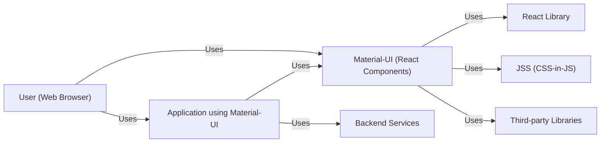
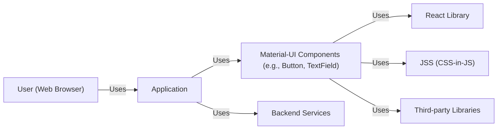
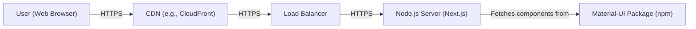
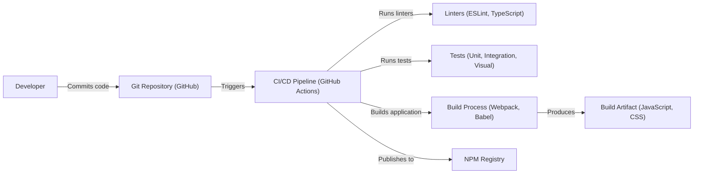

Okay, let's create a design document for the Material-UI project, focusing on aspects relevant for threat modeling.

# BUSINESS POSTURE

Material-UI is a popular open-source project providing React components that implement Google's Material Design.  It's used by a wide range of companies, from small startups to large enterprises, to build user interfaces.

Priorities and Goals:

*   Provide a comprehensive and well-documented library of UI components.
*   Maintain high code quality and test coverage.
*   Ensure accessibility and responsiveness of components.
*   Foster a strong community and encourage contributions.
*   Maintain compatibility with a wide range of browsers and devices.
*   Provide easy customization and theming options.

Business Risks:

*   Reputational Damage: Vulnerabilities in Material-UI could be exploited in downstream applications, leading to security breaches and reputational damage for both Material-UI and its users.
*   Supply Chain Attacks: Compromise of the Material-UI build or distribution process could allow attackers to inject malicious code into the library.
*   Loss of Community Trust: Failure to address security concerns promptly and transparently could erode trust within the community.
*   Legal Liability: In severe cases, vulnerabilities could lead to legal action against the project maintainers or users.
*   Reduced Adoption: Security concerns could deter new users from adopting Material-UI.

# SECURITY POSTURE

Existing Security Controls:

*   security control: Code Reviews: All contributions go through a code review process by maintainers. (Described in contributing guidelines).
*   security control: Static Analysis: The project uses linters (ESLint) and type checking (TypeScript) to identify potential code quality and security issues. (Described in contributing guidelines and visible in the repository structure).
*   security control: Dependency Management: The project uses tools like Dependabot to automatically update dependencies and address known vulnerabilities. (Visible in the repository configuration).
*   security control: Testing: The project has a comprehensive test suite, including unit tests, integration tests, and visual regression tests. (Visible in the repository structure and CI configuration).
*   security control: Documentation: Security considerations are documented, including guidelines for reporting vulnerabilities. (Described in the security policy).
*   security control: Content Security Policy (CSP): Examples and documentation may include CSP recommendations for mitigating XSS risks. (May be present in documentation or examples).
*   security control: Community Engagement: The project has an active community that helps identify and report potential issues. (Visible on GitHub).

Accepted Risks:

*   accepted risk: Third-Party Dependencies: While efforts are made to keep dependencies up-to-date, there's an inherent risk associated with relying on third-party code.
*   accepted risk: User-Controlled Input: Material-UI components often handle user input, and while some input validation is built-in, it's ultimately the responsibility of the application developer to ensure proper sanitization and validation.
*   accepted risk: Cross-Site Scripting (XSS): While Material-UI strives to prevent XSS vulnerabilities, the complex nature of web development means that there's always a potential risk, especially when dealing with user-generated content.

Recommended Security Controls:

*   security control: Regular Security Audits: Conduct periodic security audits, both internal and external, to identify potential vulnerabilities.
*   security control: Enhanced Input Validation Guidance: Provide more explicit guidance and examples on how to securely handle user input within Material-UI components.
*   security control: Subresource Integrity (SRI): Consider using SRI for externally hosted resources (if any) to ensure their integrity.
*   security control: Security Training for Maintainers: Provide regular security training for core maintainers to keep them up-to-date on the latest threats and best practices.

Security Requirements:

*   Authentication: Not directly applicable to Material-UI itself, as it's a UI component library. Authentication is the responsibility of the application using Material-UI.
*   Authorization: Similar to authentication, authorization is handled at the application level, not within Material-UI itself.
*   Input Validation: Material-UI components should perform basic input validation where appropriate (e.g., checking for valid email formats, number ranges), but comprehensive validation and sanitization are the responsibility of the application.
*   Cryptography: Material-UI does not directly handle cryptographic operations. Any cryptographic needs are the responsibility of the application.
*   Output Encoding: Material-UI should properly encode output to prevent XSS vulnerabilities. This is particularly important when rendering user-provided data.

# DESIGN

## C4 CONTEXT

Element Descriptions:

*   Element:
    *   Name: User
    *   Type: Person
    *   Description: A person interacting with a web application that uses Material-UI.
    *   Responsibilities: Interacts with the application's UI.
    *   Security controls: Browser security features, user-implemented security practices.

*   Element:
    *   Name: Material-UI
    *   Type: Software System
    *   Description: A library of React components implementing Material Design.
    *   Responsibilities: Provides UI components, handles user interactions, manages component state.
    *   Security controls: Code reviews, static analysis, dependency management, testing, documentation.

*   Element:
    *   Name: React Library
    *   Type: Software System
    *   Description: JavaScript library for building user interfaces.
    *   Responsibilities: Manages the component tree, handles rendering, and updates the DOM.
    *   Security controls: React's built-in security features, community audits.

*   Element:
    *   Name: JSS
    *   Type: Software System
    *   Description: CSS-in-JS solution used by Material-UI for styling.
    *   Responsibilities: Generates CSS from JavaScript objects.
    *   Security controls: JSS's built-in security features, community audits.

*   Element:
    *   Name: Third-party Libraries
    *   Type: Software System
    *   Description: Other libraries used by Material-UI.
    *   Responsibilities: Provide various functionalities.
    *   Security controls: Dependency management, security audits of dependencies.

*   Element:
    *   Name: Application using Material-UI
    *   Type: Software System
    *   Description: Web application built using Material-UI components.
    *   Responsibilities: Implements business logic, handles user authentication and authorization, interacts with backend services.
    *   Security controls: Application-specific security controls, secure coding practices.

*   Element:
    *   Name: Backend Services
    *   Type: Software System
    *   Description: Backend services that the application interacts with.
    *   Responsibilities: Provides data and business logic.
    *   Security controls: Backend security controls, API security.

## C4 CONTAINER

Element Descriptions:

*   Element:
    *   Name: User
    *   Type: Person
    *   Description: A person interacting with a web application that uses Material-UI.
    *   Responsibilities: Interacts with the application's UI.
    *   Security controls: Browser security features, user-implemented security practices.

*   Element:
    *   Name: Application
    *   Type: Container: Web Application
    *   Description: The web application built using Material-UI.
    *   Responsibilities: Implements business logic, handles user interactions, manages application state.
    *   Security controls: Application-specific security controls, secure coding practices.

*   Element:
    *   Name: Material-UI Components
    *   Type: Container: Library
    *   Description: Individual Material-UI components (e.g., Button, TextField, Dialog).
    *   Responsibilities: Provide specific UI elements and functionality.
    *   Security controls: Code reviews, static analysis, testing.

*   Element:
    *   Name: React Library
    *   Type: Container: Library
    *   Description: JavaScript library for building user interfaces.
    *   Responsibilities: Manages the component tree, handles rendering, and updates the DOM.
    *   Security controls: React's built-in security features, community audits.

*   Element:
    *   Name: JSS
    *   Type: Container: Library
    *   Description: CSS-in-JS solution used by Material-UI for styling.
    *   Responsibilities: Generates CSS from JavaScript objects.
    *   Security controls: JSS's built-in security features, community audits.

*   Element:
    *   Name: Third-party Libraries
    *   Type: Container: Library
    *   Description: Other libraries used by Material-UI.
    *   Responsibilities: Provide various functionalities.
    *   Security controls: Dependency management, security audits of dependencies.

*   Element:
    *   Name: Backend Services
    *   Type: Container: API/Database
    *   Description: Backend services that the application interacts with.
    *   Responsibilities: Provides data and business logic.
    *   Security controls: Backend security controls, API security.

## DEPLOYMENT

Possible Deployment Solutions:

1.  Static Hosting (e.g., Netlify, Vercel, AWS S3 + CloudFront): Suitable for applications that are primarily client-side rendered.
2.  Server-Side Rendering (SSR) with Node.js (e.g., using Next.js or a custom Node.js server):  Provides better SEO and initial load performance.
3.  Containerized Deployment (e.g., Docker, Kubernetes):  Offers flexibility and scalability.

Chosen Solution (for detailed description): Server-Side Rendering (SSR) with Node.js and Next.js, deployed on a platform like Vercel or AWS Amplify.

Element Descriptions:

*   Element:
    *   Name: User
    *   Type: Person
    *   Description: A person interacting with the deployed application.
    *   Responsibilities: Accesses the application through a web browser.
    *   Security controls: Browser security features, user-implemented security practices.

*   Element:
    *   Name: CDN
    *   Type: Infrastructure Node
    *   Description: Content Delivery Network (e.g., CloudFront)
    *   Responsibilities: Caches static assets and serves them to users from edge locations.
    *   Security controls: CDN's built-in security features (e.g., DDoS protection, WAF).

*   Element:
    *   Name: Load Balancer
    *   Type: Infrastructure Node
    *   Description: Distributes traffic across multiple server instances.
    *   Responsibilities: Ensures high availability and scalability.
    *   Security controls: Load balancer's security features (e.g., SSL termination, health checks).

*   Element:
    *   Name: Node.js Server (Next.js)
    *   Type: Infrastructure Node
    *   Description: Server running the Next.js application, which uses Material-UI.
    *   Responsibilities: Handles server-side rendering, API requests, and other server-side logic.
    *   Security controls: Server security configuration, secure coding practices, regular updates.

*   Element:
    *   Name: Material-UI Package (npm)
    *   Type: Software System
    *   Description: The Material-UI package fetched from the npm registry.
    *   Responsibilities: Provides the Material-UI components.
    *   Security controls: npm's security features, dependency management.

## BUILD

Build Process Description:

1.  Developer commits code to the GitHub repository.
2.  GitHub Actions (CI/CD pipeline) is triggered.
3.  Linters (ESLint, TypeScript) are run to check for code style and type errors.
4.  Tests (unit, integration, visual regression) are run to ensure code quality and functionality.
5.  The build process (using tools like Webpack and Babel) compiles and bundles the code.
6.  Build artifacts (JavaScript, CSS) are produced.
7.  The artifacts are published to the npm registry.

Security Controls in Build Process:

*   security control: Static Application Security Testing (SAST): Linters (ESLint) and TypeScript compiler act as SAST tools, identifying potential vulnerabilities during development.
*   security control: Software Composition Analysis (SCA): Dependabot (or similar tools) scans dependencies for known vulnerabilities.
*   security control: Automated Testing: Comprehensive test suite helps prevent regressions and catch security issues early.
*   security control: Code Review: All code changes are reviewed by maintainers before merging.
*   security control: Build Automation: GitHub Actions ensures a consistent and reproducible build process.

# RISK ASSESSMENT

Critical Business Processes:

*   Providing a reliable and secure UI component library.
*   Maintaining the trust and confidence of the developer community.
*   Ensuring the long-term sustainability of the project.

Data to Protect:

*   Source Code: High sensitivity. Compromise could lead to the introduction of malicious code.
*   Contributor Information: Low to moderate sensitivity. Includes names, email addresses, and GitHub profiles.
*   Issue and Pull Request Data: Low to moderate sensitivity. May contain discussions about vulnerabilities or potential security issues.
*   Usage Data (if collected): Potentially sensitive, depending on the nature of the data. Should be anonymized and handled with care.

# QUESTIONS & ASSUMPTIONS

Questions:

*   Are there any specific compliance requirements (e.g., GDPR, HIPAA) that applications using Material-UI need to adhere to?
*   What level of security assurance is provided for third-party dependencies?
*   What is the process for handling security vulnerabilities reported by external researchers?
*   Is there any sensitive data (e.g., API keys, user credentials) stored or processed by Material-UI itself (excluding applications built with it)? The answer should be no.
*   Are there any plans to implement more advanced security features, such as built-in XSS protection or input sanitization?

Assumptions:

*   BUSINESS POSTURE: The primary goal is to provide a high-quality, open-source UI library, and security is a high priority but balanced with usability and development speed.
*   SECURITY POSTURE: The project follows common security best practices, but there's always room for improvement.
*   DESIGN: The design is primarily client-side, with server-side rendering being an optional deployment choice. The library itself does not handle sensitive data or authentication/authorization.
*   Applications built with Material-UI are responsible for their own security, including authentication, authorization, and data protection.
*   Material-UI does not directly handle any user authentication or authorization.
*   The project relies on community contributions and open-source development practices.