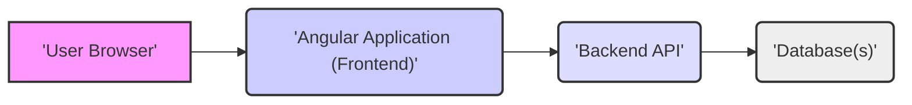
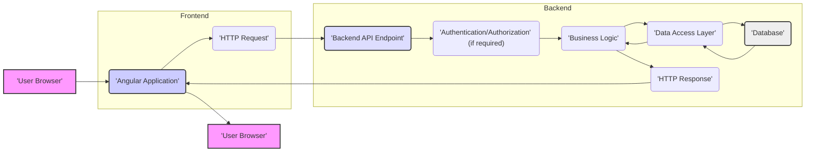

# Project Design Document: Angular Seed Advanced Application

**Version:** 1.1
**Date:** October 26, 2023
**Author:** AI Software Architect

## 1. Introduction

This document provides an enhanced architectural design for the Angular Seed Advanced project, based on the repository found at [https://github.com/nathanwalker/angular-seed-advanced](https://github.com/nathanwalker/angular-seed-advanced). This revised document aims to provide a more detailed and nuanced understanding of the system's components, their interactions, data flow, and key technologies, specifically tailored for effective threat modeling.

## 2. Goals and Objectives

The primary goals of this project remain consistent: to offer a robust and scalable foundation for building advanced Angular applications. Key objectives include:

*   Providing a well-structured and maintainable codebase adhering to Angular best practices.
*   Implementing and showcasing advanced Angular features and development techniques.
*   Offering a solid and extensible starting point for complex application development endeavors.

## 3. Architectural Overview

The Angular Seed Advanced project adheres to a client-server architecture, with a clear separation of concerns between the frontend and backend. The frontend is implemented as a Single Page Application (SPA) using the Angular framework. The backend is responsible for providing APIs that facilitate data access and business logic execution.

**Components:**

*   **User Browser:** The web browser environment where the Angular application is executed and with which users interact.
*   **Angular Application (Frontend):** A Single Page Application (SPA) built using the Angular framework and TypeScript. It manages the user interface, handles user interactions, orchestrates communication with the backend API, and manages the application's state within the browser.
*   **Backend API:** A server-side application responsible for implementing the core business logic, managing data persistence, and potentially handling authentication and authorization. Based on the "advanced" nature and common practices, this is highly likely implemented using Node.js with frameworks such as Express.js, NestJS, or similar.
*   **Database(s):**  The persistent storage layer for the application's data. The specific database technology is not explicitly dictated by the seed project but could encompass a variety of relational databases (e.g., PostgreSQL, MySQL) or NoSQL databases (e.g., MongoDB, Couchbase), depending on the application's specific data requirements.

## 4. Component Details

### 4.1. Angular Application (Frontend)

*   **Technology:** Angular framework (likely a recent version), TypeScript, HTML, CSS (or preprocessors like Sass/SCSS).
*   **Functionality:**
    *   Rendering and managing user interface components, ensuring a responsive and interactive user experience.
    *   Handling user interactions, capturing input, and triggering corresponding application logic.
    *   Managing application state, potentially leveraging state management libraries like NgRx, Akita, or RxJS Behavior Subjects for complex data flows.
    *   Implementing client-side routing and navigation between different application views or modules.
    *   Communicating with the Backend API via asynchronous HTTP requests (utilizing Angular's `HttpClient` and RxJS Observables).
    *   Performing client-side data validation to improve user experience and reduce unnecessary backend load.
    *   Potentially handling UI-specific logic and data transformations before sending to the backend or displaying to the user.
*   **Key Modules/Features (Based on "Advanced" nature):**
    *   **Lazy Loading of Modules:**  Implementing lazy loading strategies for modules to optimize initial application load times and improve performance.
    *   **Comprehensive State Management:** Utilizing a robust state management solution for predictable and manageable data flow within the application.
    *   **Internationalization (i18n):** Supporting multiple languages and locales for a global user base.
    *   **Theming and Customization:** Providing mechanisms for customizing the visual appearance of the application.
    *   **Robust Testing Framework:**  Implementing comprehensive unit, integration, and end-to-end tests to ensure application quality and stability.
    *   **Efficient Build Process:** Leveraging the Angular CLI for building, optimizing, and deploying the application, including features like Ahead-of-Time (AOT) compilation.
    *   **Reactive Programming with RxJS:**  Extensive use of RxJS for handling asynchronous operations, event streams, and complex data transformations.
*   **Potential Subcomponents:**
    *   **Components:** Reusable UI building blocks responsible for rendering specific parts of the user interface and handling user interactions within those parts.
    *   **Services:** Encapsulating reusable business logic, data access logic (interacting with the backend API), and utility functions.
    *   **Modules:**  Organizing related components, services, directives, and pipes into logical units, often representing specific features or functionalities.
    *   **Routes:** Defining the navigation paths within the application and mapping them to specific components or modules.
    *   **Route Guards:** Implementing logic to control access to specific routes based on user authentication, authorization, or other conditions.
    *   **HTTP Interceptors:**  Allowing for the interception and modification of HTTP requests and responses for tasks like adding authentication headers, logging, or error handling.

### 4.2. Backend API

*   **Likely Technology:** Node.js with frameworks such as Express.js, NestJS, Koa.js, or similar.
*   **Functionality:**
    *   Receiving and processing API requests originating from the Angular application.
    *   Implementing the core business logic of the application, orchestrating data manipulation and interactions between different parts of the system.
    *   Managing data persistence, interacting with the underlying database(s) to retrieve, create, update, and delete data.
    *   Potentially handling user authentication (verifying user identity) and authorization (controlling access to resources based on user roles or permissions).
    *   Exposing well-defined API endpoints, typically following RESTful principles or potentially using GraphQL.
    *   Implementing security measures to protect the API from unauthorized access and malicious attacks.
*   **Potential Subcomponents:**
    *   **Controllers:** Handling incoming HTTP requests, validating input, invoking appropriate service logic, and returning HTTP responses.
    *   **Services:** Implementing the core business logic of the application, often orchestrating interactions between data access layers and other services.
    *   **Data Access Layer (Repositories/DAOs):**  Abstracting database interactions, providing a consistent interface for accessing and manipulating data, and potentially handling database-specific logic.
    *   **Models/Entities:** Representing the data structures used within the application, often mapping to database tables or collections.
    *   **Middleware:**  Implementing cross-cutting concerns such as logging, authentication, authorization, request parsing, and error handling.
    *   **Authentication/Authorization Module:**  Managing user authentication (e.g., using JWT, sessions, OAuth 2.0) and authorization (e.g., role-based access control, policy-based access control).

### 4.3. Database(s)

*   **Technology (Unspecified):** Could be a relational database (e.g., PostgreSQL, MySQL, Microsoft SQL Server), a NoSQL document database (e.g., MongoDB, Couchbase), a NoSQL key-value store (e.g., Redis, Memcached), or a graph database, depending on the application's data modeling and performance requirements.
*   **Functionality:**
    *   Providing persistent storage for the application's data, ensuring data durability and availability.
    *   Offering mechanisms for efficient data retrieval, creation, update, and deletion operations.
    *   Enforcing data integrity through constraints, relationships, and validation rules.
    *   Potentially providing features like indexing, transactions, and replication for performance and reliability.

## 5. Data Flow

The typical data flow within the application involves a sequence of interactions between the frontend, backend, and database:

**Detailed Flow:**

1. **User Interaction:** The user initiates an action within the Angular application in their browser (e.g., clicking a button, submitting a form).
2. **HTTP Request:** The Angular application constructs and sends an HTTP request (e.g., GET, POST, PUT, DELETE) to a specific endpoint exposed by the Backend API.
3. **Backend API Endpoint:** The request is received by the appropriate handler (controller) in the Backend API.
4. **Authentication/Authorization (if required):**  The backend may perform authentication to verify the user's identity and authorization to ensure the user has the necessary permissions to access the requested resource or perform the requested action.
5. **Business Logic Execution:** The controller invokes the relevant service(s) to execute the core business logic associated with the request.
6. **Data Access Layer Interaction:** The service layer interacts with the data access layer (repositories/DAOs) to perform database operations.
7. **Database Interaction:** The data access layer executes queries or commands against the database to retrieve, create, update, or delete data.
8. **Data Retrieval/Modification:** The database returns the requested data or acknowledges the data modification to the data access layer.
9. **Business Logic Processing:** The data access layer passes the data back to the service layer, where further processing or transformation might occur.
10. **HTTP Response Construction:** The backend API constructs an HTTP response, including a status code and potentially data (e.g., JSON), indicating the outcome of the request.
11. **HTTP Response Transmission:** The backend sends the HTTP response back to the Angular application.
12. **Data Processing and Rendering:** The Angular application receives the response, processes the data (if any), and updates the user interface accordingly.

## 6. Security Considerations (Preliminary)

This section outlines potential security considerations relevant to each component, providing a foundation for subsequent threat modeling activities.

*   **Angular Application (Frontend):**
    *   **Cross-Site Scripting (XSS):**  Vulnerability where malicious scripts can be injected into the application and executed in other users' browsers. Mitigation: Implement proper input sanitization, output encoding, and utilize Angular's built-in security features.
    *   **Cross-Site Request Forgery (CSRF):**  Attack where a malicious website, email, or program causes a user's web browser to perform an unwanted action on a trusted site when the user is authenticated. Mitigation: Implement anti-CSRF tokens (e.g., using Angular's `HttpClient` features and backend support).
    *   **Dependency Vulnerabilities:**  Security flaws in third-party libraries used by the application. Mitigation: Regularly update dependencies and use tools to scan for vulnerabilities.
    *   **Data Security in Transit:**  Ensuring data exchanged between the browser and the backend is encrypted. Mitigation: Enforce HTTPS for all communication.
    *   **Sensitive Data Exposure:**  Accidental exposure of sensitive information in the client-side code or local storage. Mitigation: Avoid storing sensitive data client-side; if necessary, encrypt it appropriately.
    *   **Open Redirects:**  Vulnerability where an attacker can manipulate the application to redirect users to a malicious site. Mitigation: Avoid relying on user-provided data for redirects.

*   **Backend API:**
    *   **Authentication and Authorization Flaws:**  Weak or improperly implemented authentication and authorization mechanisms. Mitigation: Use robust authentication protocols (e.g., OAuth 2.0, JWT) and implement fine-grained authorization controls.
    *   **Injection Attacks:**  Vulnerabilities like SQL Injection, NoSQL Injection, and Command Injection, where attackers can inject malicious code into database queries or system commands. Mitigation: Use parameterized queries or ORM/ODMs with proper escaping, and validate all user inputs.
    *   **Broken Authentication and Session Management:**  Flaws in how user sessions are managed, potentially allowing attackers to hijack sessions. Mitigation: Implement secure session management practices, including using secure cookies and proper session expiration.
    *   **Security Misconfiguration:**  Improperly configured servers, databases, or API endpoints. Mitigation: Follow security hardening guidelines and regularly review configurations.
    *   **Insecure Direct Object References (IDOR):**  Vulnerability where attackers can access resources by manipulating object identifiers. Mitigation: Implement proper authorization checks based on user identity and permissions.
    *   **Rate Limiting and Denial of Service (DoS):**  Lack of protection against excessive requests that can overwhelm the server. Mitigation: Implement rate limiting and other DoS prevention mechanisms.
    *   **Dependency Vulnerabilities:**  Similar to the frontend, backend dependencies can also have vulnerabilities. Mitigation: Regularly update dependencies and use vulnerability scanning tools.
    *   **Exposure of Sensitive Data:**  Accidental exposure of sensitive information in API responses or logs. Mitigation: Carefully control what data is returned in API responses and implement secure logging practices.

*   **Database(s):**
    *   **Unauthorized Access:**  Lack of proper access controls allowing unauthorized users or applications to access sensitive data. Mitigation: Implement strong authentication and authorization mechanisms, and restrict access based on the principle of least privilege.
    *   **Data Breaches:**  Security incidents leading to the unauthorized disclosure of sensitive data. Mitigation: Implement encryption at rest and in transit, and regularly audit security controls.
    *   **Injection Attacks (SQL/NoSQL Injection):**  As mentioned in the Backend API section, databases are vulnerable to injection attacks if input is not properly sanitized. Mitigation: Use parameterized queries and follow secure coding practices.
    *   **Insufficient Auditing:**  Lack of proper logging and monitoring of database access and modifications. Mitigation: Implement comprehensive auditing to detect and investigate suspicious activity.
    *   **Backup Security:**  Insecurely stored or managed database backups. Mitigation: Encrypt backups and store them in a secure location.

## 7. Deployment

The deployment process for the Angular Seed Advanced project typically involves these stages:

*   **Frontend Deployment:**
    *   Building the Angular application using the Angular CLI (`ng build --prod`). This generates optimized static assets (HTML, CSS, JavaScript).
    *   Deploying these static assets to a web server (e.g., Nginx, Apache), a cloud storage service configured for static website hosting (e.g., AWS S3, Google Cloud Storage, Azure Blob Storage), or a Content Delivery Network (CDN) for improved performance and scalability.
*   **Backend API Deployment:**
    *   Building and packaging the backend application (e.g., creating a Docker image).
    *   Deploying the backend application to a server environment. This can involve:
        *   **Cloud Platforms:** Deploying to platforms like AWS (e.g., EC2, ECS, Fargate, Lambda), Azure (e.g., Virtual Machines, Azure App Service, Azure Container Instances), or Google Cloud Platform (e.g., Compute Engine, Cloud Run, Cloud Functions).
        *   **Container Orchestration:** Using tools like Kubernetes or Docker Swarm to manage and scale containerized backend applications.
        *   **Traditional Servers:** Deploying directly to physical or virtual servers.
*   **Database Deployment:**
    *   Deploying and managing the database instance. This can involve:
        *   **Managed Database Services:** Utilizing managed database services offered by cloud providers (e.g., AWS RDS, Azure SQL Database, Google Cloud SQL). These services handle many operational tasks like backups, patching, and scaling.
        *   **Self-Managed Databases:**  Deploying and managing database instances on virtual machines or bare-metal servers. This requires more operational overhead but offers greater control.
        *   **Database-as-a-Service (DBaaS):** Utilizing specialized database services like MongoDB Atlas or Couchbase Cloud.

## 8. Technologies Used

*   **Frontend:**
    *   Angular (latest stable version or a specific version as defined in `package.json`)
    *   TypeScript
    *   HTML5
    *   CSS3 (or preprocessors like Sass/SCSS, Less)
    *   JavaScript
    *   RxJS (Reactive Extensions for JavaScript)
    *   Angular CLI (Command-Line Interface)
    *   Potentially State Management Libraries (e.g., NgRx, Akita, RxJS Behavior Subjects)
    *   Potentially UI Component Libraries (e.g., Angular Material, PrimeNG, NG-Bootstrap)
    *   Testing Frameworks (e.g., Jasmine, Karma, Cypress, Protractor)
*   **Backend:**
    *   Node.js (specific version as defined in `package.json`)
    *   Potentially Backend Frameworks (e.g., Express.js, NestJS, Koa.js)
    *   Potentially Database ORM/ODM Libraries (e.g., Sequelize, TypeORM, Mongoose)
    *   Potentially Authentication/Authorization Libraries (e.g., Passport.js, Auth0 libraries)
*   **Database:**
    *   Unspecified (e.g., PostgreSQL, MySQL, MongoDB, Couchbase, Redis, etc.)
*   **Development Tools:**
    *   Git (for version control)
    *   npm or Yarn (for package management)
    *   Integrated Development Environment (IDE) like VS Code, WebStorm
    *   Docker (for containerization)
*   **Deployment Technologies (Examples):**
    *   AWS (Amazon Web Services)
    *   Azure (Microsoft Azure)
    *   Google Cloud Platform (GCP)
    *   Kubernetes
    *   Docker

This improved design document provides a more detailed and comprehensive understanding of the Angular Seed Advanced project's architecture, specifically tailored to facilitate effective threat modeling. By outlining the components, data flow, and potential security considerations in greater detail, this document serves as a valuable resource for identifying and mitigating potential vulnerabilities.