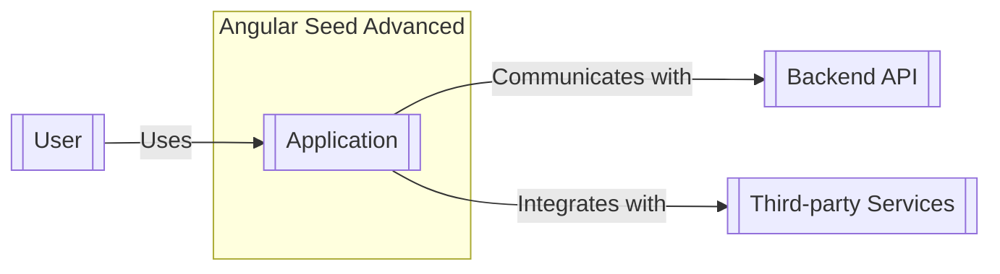
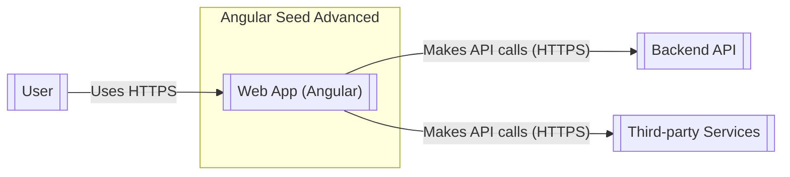
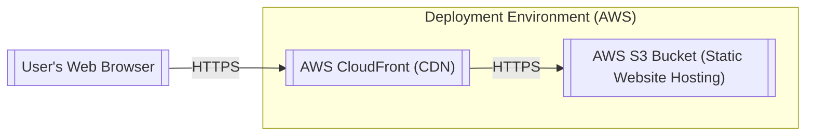
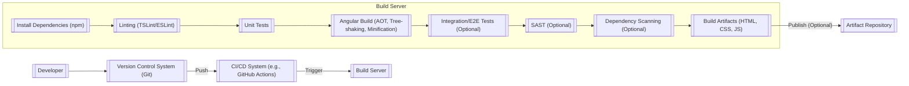

# BUSINESS POSTURE

Business Priorities and Goals:

*   Provide a highly scalable and maintainable starting point for Angular web applications.
*   Showcase best practices for Angular development, including modular design, component architecture, and testing.
*   Offer a platform for learning and experimentation with advanced Angular features and techniques.
*   Facilitate rapid prototyping and development of new Angular applications.
*   Support multiple platforms (web, NativeScript for mobile, and Electron for desktop).
*   Integrate with various backend services and APIs.

Most Important Business Risks:

*   Vulnerabilities in the application could lead to data breaches or unauthorized access to backend systems.
*   Poorly written or untested code could result in application instability, performance issues, or functional defects.
*   Lack of adherence to security best practices could expose the application to common web vulnerabilities (XSS, CSRF, etc.).
*   Inadequate dependency management could introduce vulnerable third-party libraries.
*   Insufficient logging and monitoring could hinder incident response and troubleshooting.
*   Failure to properly handle user authentication and authorization could lead to unauthorized access.

# SECURITY POSTURE

Existing Security Controls:

*   security control: The project README.md mentions "Security" and links to the Angular security guide (https://angular.io/guide/security), indicating awareness of security best practices.
*   security control: Use of a linter (TSLint or ESLint, configuration not directly visible in the provided repository snippet but highly likely given the project's nature) to enforce coding standards and potentially identify some security-related issues.
*   security control: Dependency management using npm, allowing for version pinning and auditing of dependencies (although specific security-focused auditing practices are not explicitly mentioned).
*   security control: The project structure promotes modularity and separation of concerns, which can indirectly improve security by limiting the impact of potential vulnerabilities.

Accepted Risks:

*   accepted risk: The repository is a seed project, meaning it's intended as a starting point.  Complete security hardening is likely left to the implementers who use the seed.
*   accepted risk: The level of built-in input validation and sanitization is unknown without deeper code analysis.  Reliance on Angular's built-in mechanisms is likely, but explicit custom validation may be needed depending on the application's use case.
*   accepted risk: The project's documentation doesn't explicitly detail specific security configurations for production deployments (e.g., HTTPS, secure cookie settings, CORS policies).

Recommended Security Controls:

*   Implement a robust Content Security Policy (CSP) to mitigate XSS attacks.
*   Use HttpOnly and Secure flags for cookies to protect against session hijacking.
*   Implement Cross-Site Request Forgery (CSRF) protection, potentially using Angular's built-in mechanisms or server-side tokens.
*   Integrate security linters and static analysis tools (e.g., SonarQube) into the build process.
*   Perform regular dependency vulnerability scanning (e.g., npm audit, Snyk).
*   Implement comprehensive input validation and sanitization on both the client-side and server-side (if applicable).
*   Establish a secure coding policy and provide security training for developers.
*   Implement logging and monitoring to detect and respond to security incidents.
*   Consider using a web application firewall (WAF) to protect against common web attacks.

Security Requirements:

*   Authentication:
    *   The seed project itself does not implement authentication, it is a responsibility of application that will use it.
    *   If authentication is required by an application using this seed, it should use a secure and industry-standard method (e.g., OAuth 2.0, OpenID Connect).
    *   Implement secure password storage (e.g., using bcrypt or Argon2).
    *   Implement multi-factor authentication (MFA) where appropriate.
*   Authorization:
    *   The seed project itself does not implement authorization, it is a responsibility of application that will use it.
    *   Implement role-based access control (RBAC) or attribute-based access control (ABAC) to restrict access to sensitive data and functionality.
    *   Ensure that authorization checks are performed on the server-side, not solely on the client-side.
*   Input Validation:
    *   Validate all user inputs on both the client-side (for user experience) and the server-side (for security).
    *   Use a whitelist approach to input validation, allowing only known-good characters and patterns.
    *   Sanitize user inputs to prevent XSS attacks.
*   Cryptography:
    *   Use strong, industry-standard cryptographic algorithms and libraries.
    *   Store sensitive data (e.g., passwords, API keys) securely, using appropriate hashing and encryption techniques.
    *   Use HTTPS for all communication between the client and server.
    *   Regularly review and update cryptographic configurations to address emerging threats.

# DESIGN

## C4 CONTEXT

Element Descriptions:

*   Element:
    *   Name: User
    *   Type: Person
    *   Description: A person interacting with the Angular application through a web browser, mobile device, or desktop application.
    *   Responsibilities: Interacts with the application's user interface, provides input, and receives output.
    *   Security controls: Browser security features, device security, user awareness of phishing and other social engineering attacks.
*   Element:
    *   Name: Application
    *   Type: Software System
    *   Description: The Angular web application built using the seed project.
    *   Responsibilities: Provides the user interface, handles user interactions, communicates with backend services, and manages application state.
    *   Security controls: Input validation, output encoding, authentication, authorization, session management, error handling, CSP, CSRF protection.
*   Element:
    *   Name: Backend API
    *   Type: Software System
    *   Description: A backend API that the Angular application communicates with to retrieve and store data.
    *   Responsibilities: Provides data and services to the Angular application, enforces business logic, and manages data persistence.
    *   Security controls: Authentication, authorization, input validation, rate limiting, secure communication (HTTPS), data encryption at rest and in transit.
*   Element:
    *   Name: Third-party Services
    *   Type: Software System
    *   Description: External services that the Angular application integrates with (e.g., analytics, social media, payment gateways).
    *   Responsibilities: Provide specific functionalities or data to the Angular application.
    *   Security controls: Secure communication (HTTPS), API keys, authentication and authorization mechanisms specific to each service.

## C4 CONTAINER

Element Descriptions:

*   Element:
    *   Name: User
    *   Type: Person
    *   Type: Person
    *   Description: A person interacting with the Angular application through a web browser, mobile device, or desktop application.
    *   Responsibilities: Interacts with the application's user interface, provides input, and receives output.
    *   Security controls: Browser security features, device security, user awareness of phishing and other social engineering attacks.
*   Element:
    *   Name: Web App (Angular)
    *   Type: Container: Angular Application
    *   Description: The Angular application running in a web browser, mobile device, or desktop application.
    *   Responsibilities: Renders the user interface, handles user input, communicates with the backend API, and manages application state.
    *   Security controls: Input validation, output encoding, authentication, authorization, session management, error handling, CSP, CSRF protection.
*   Element:
    *   Name: Backend API
    *   Type: Container: API Application
    *   Description: A backend API that the Angular application communicates with to retrieve and store data.
    *   Responsibilities: Provides data and services to the Angular application, enforces business logic, and manages data persistence.
    *   Security controls: Authentication, authorization, input validation, rate limiting, secure communication (HTTPS), data encryption at rest and in transit.
*   Element:
    *   Name: Third-party Services
    *   Type: Container: API Application
    *   Description: External services that the Angular application integrates with (e.g., analytics, social media, payment gateways).
    *   Responsibilities: Provide specific functionalities or data to the Angular application.
    *   Security controls: Secure communication (HTTPS), API keys, authentication and authorization mechanisms specific to each service.

## DEPLOYMENT

Possible Deployment Solutions:

1.  Static Web Hosting (e.g., AWS S3 + CloudFront, Netlify, Firebase Hosting, GitHub Pages): Suitable for purely client-side Angular applications.
2.  Server-Side Rendering (SSR) with Node.js (e.g., using Angular Universal): Improves SEO and initial load time. Requires a Node.js server.
3.  Containerized Deployment (e.g., Docker, Kubernetes): Provides flexibility and scalability, especially for complex applications with multiple services.
4.  Platform-as-a-Service (PaaS) (e.g., Heroku, AWS Elastic Beanstalk): Simplifies deployment and management.

Chosen Solution (for detailed description): Static Web Hosting with AWS S3 and CloudFront.

Deployment Diagram:

Element Descriptions:

*   Element:
    *   Name: User's Web Browser
    *   Type: Software System
    *   Description: The user's web browser, which downloads and executes the Angular application.
    *   Responsibilities: Renders the user interface, handles user input, and communicates with the backend API.
    *   Security controls: Browser security features (e.g., same-origin policy, CSP), HTTPS.
*   Element:
    *   Name: AWS CloudFront (CDN)
    *   Type: Infrastructure Node
    *   Description: Amazon's Content Delivery Network, which caches the Angular application's static assets at edge locations around the world.
    *   Responsibilities: Serves static assets (HTML, CSS, JavaScript, images) to users with low latency, reduces load on the origin server (S3 bucket).
    *   Security controls: HTTPS, WAF integration, DDoS protection.
*   Element:
    *   Name: AWS S3 Bucket (Static Website Hosting)
    *   Type: Infrastructure Node
    *   Description: Amazon's Simple Storage Service, configured to host the Angular application's static assets.
    *   Responsibilities: Stores the application's files and serves them to CloudFront.
    *   Security controls: Bucket policies, access control lists (ACLs), server-side encryption, versioning.

## BUILD

Build Process:

The build process for the Angular Seed Advanced project likely involves the following steps:

1.  Developer writes code and commits changes to a version control system (e.g., Git).
2.  A build automation tool (e.g., npm scripts, Angular CLI) is triggered, either manually or automatically (e.g., by a CI/CD system like GitHub Actions, Jenkins, CircleCI).
3.  Dependencies are installed (npm install).
4.  Linting is performed (e.g., TSLint, ESLint) to enforce code style and identify potential errors.
5.  Unit tests are executed.
6.  The Angular application is compiled (e.g., using the Angular CLI's build command). This typically involves:
    *   Ahead-of-Time (AOT) compilation: Compiles Angular templates into JavaScript code during the build process, improving performance and security.
    *   Tree-shaking: Removes unused code, reducing the application's size.
    *   Minification and uglification: Optimizes the code for production, making it smaller and harder to reverse-engineer.
7.  (Optional) Integration tests and end-to-end tests are executed.
8.  (Optional) Static analysis security testing (SAST) tools are run to identify potential vulnerabilities.
9.  (Optional) Dependency vulnerability scanning is performed.
10. The build artifacts (HTML, CSS, JavaScript, images) are packaged and prepared for deployment.
11. (Optional) The artifacts are published to a repository (e.g., npm registry, artifact server).

Build Diagram:

Security Controls in Build Process:

*   Linting: Helps enforce secure coding practices and identify potential vulnerabilities.
*   Unit/Integration/E2E Tests: Ensure that security-related functionality (e.g., authentication, authorization) works as expected.
*   SAST: Detects vulnerabilities in the application's source code.
*   Dependency Scanning: Identifies vulnerable third-party libraries.
*   AOT Compilation: Reduces the risk of template injection vulnerabilities.
*   CI/CD: Automates the build process, ensuring consistency and reducing the risk of human error.

# RISK ASSESSMENT

Critical Business Processes:

*   User authentication and authorization.
*   Data access and management.
*   Application functionality and availability.
*   Integration with backend services and third-party APIs.

Data Sensitivity:

*   The seed project itself does not handle sensitive data directly.
*   Applications built using the seed may handle various types of data, depending on their purpose.  The sensitivity of this data will vary. Examples include:
    *   Personally Identifiable Information (PII):  High sensitivity. Requires strong protection (encryption, access controls, compliance with regulations like GDPR and CCPA).
    *   Financial Data: High sensitivity. Requires strong protection (encryption, PCI DSS compliance).
    *   User Credentials: High sensitivity. Requires secure storage (hashing, salting) and protection against unauthorized access.
    *   Application Data: Sensitivity varies depending on the specific data.
    *   Configuration Data: May contain sensitive information (e.g., API keys, database credentials). Requires secure storage and access control.

# QUESTIONS & ASSUMPTIONS

Questions:

*   What specific backend services will applications built using this seed interact with?  This will influence the security requirements for those integrations.
*   What level of user authentication and authorization is required for applications built using this seed?
*   What types of data will applications built using this seed handle?
*   What are the specific deployment environments for applications built using this seed?
*   Are there any specific compliance requirements (e.g., GDPR, CCPA, HIPAA, PCI DSS) that applications built using this seed must adhere to?
*   What is the expected user base and traffic volume for applications built using this seed? This will impact scalability and performance considerations.

Assumptions:

*   BUSINESS POSTURE: The primary goal is to provide a solid foundation for building Angular applications, with security being a significant but not necessarily the *top* priority.  It's assumed that implementers will add their own security measures as needed.
*   SECURITY POSTURE: The project relies heavily on Angular's built-in security features and assumes that developers using the seed will have a basic understanding of web security principles.
*   DESIGN: The application will primarily be a client-side Angular application, potentially interacting with a backend API. The specific architecture of the backend API is not defined. The deployment environment is likely to be a static web hosting service or a PaaS.