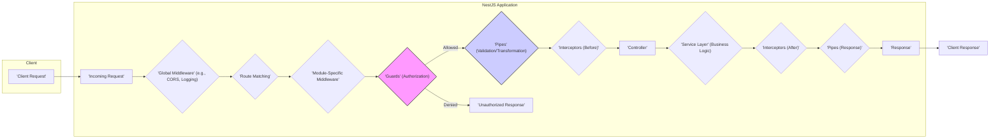
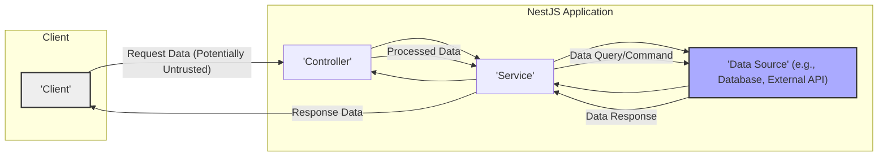

# Project Design Document: NestJS Framework (Improved)

**Version:** 1.1
**Date:** October 26, 2023
**Author:** AI Software Architect

## 1. Introduction

This document provides a detailed architectural overview of the NestJS framework, specifically tailored for security professionals and those involved in threat modeling activities. It describes the key components, their interactions, and the typical request and data flow within a NestJS application. This document serves as a foundational resource for identifying potential threats and vulnerabilities. The target project is the open-source NestJS framework available at [https://github.com/nestjs/nest](https://github.com/nestjs/nest).

## 2. Goals and Objectives

The primary goal of this document is to provide a comprehensive and security-focused architectural description of NestJS to facilitate effective threat modeling and security assessments. Specific objectives include:

*   Clearly defining the core components of a NestJS application and their respective responsibilities from a security perspective.
*   Providing a detailed understanding of the request processing lifecycle, highlighting potential interception and manipulation points.
*   Mapping the flow of data within the framework, identifying potential areas of data exposure or compromise.
*   Highlighting built-in security features and common security considerations when developing with NestJS.
*   Serving as a basis for identifying potential threats, vulnerabilities, and attack vectors within NestJS applications.

## 3. System Architecture

NestJS is a progressive Node.js framework designed for building efficient and scalable server-side applications. It leverages TypeScript and incorporates principles from Object-Oriented Programming (OOP), Functional Programming (FP), and Reactive Programming (RP). The architecture is modular, centered around modules, controllers, providers, and a robust middleware system.

### 3.1. Key Components

*   **Modules:**  Fundamental organizational units that encapsulate related components (controllers, providers, etc.). From a security perspective, modules help in isolating concerns and managing dependencies, which can impact the attack surface.
*   **Controllers:** Handle incoming client requests and return responses. They define API endpoints and are the first point of contact for external interactions, making them a critical area for input validation and authorization checks.
*   **Providers:**  A broad category encompassing services, repositories, factories, and more. They are designed for dependency injection, promoting code reusability and testability. Services often contain core business logic and interact with data sources, making them crucial for data security.
*   **Services:**  Specific providers that encapsulate business logic. They often handle data manipulation and interaction with external systems. Security considerations include proper authorization for data access and secure handling of sensitive information.
*   **Middleware:** Functions executed sequentially during the request lifecycle, before reaching the route handler. They can perform tasks like logging, authentication, and request modification. Middleware plays a vital role in implementing security policies and preventing common attacks.
*   **Guards:** Determine if a request should be handled by a specific route handler based on certain conditions (e.g., user roles, permissions). Guards are essential for implementing authorization and access control.
*   **Interceptors:**  Functions that can intercept and transform requests or responses. They can be used for logging, data serialization, and even caching. From a security perspective, interceptors can be used for tasks like sanitizing output or adding security headers.
*   **Pipes:**  Used for request data transformation and validation. They operate on route handler arguments and are crucial for preventing injection attacks by ensuring data conforms to expected formats and constraints.
*   **Exception Filters:**  Centralized handlers for exceptions thrown during the request processing lifecycle. They ensure consistent error responses and can prevent the leakage of sensitive information through error messages.
*   **Gateways (for WebSockets):** Enable real-time, bidirectional communication. Security considerations include authentication and authorization for WebSocket connections, as well as protection against abuse.
*   **Microservices:** NestJS supports building microservice architectures. Security in this context involves securing inter-service communication (e.g., using mutual TLS) and managing distributed authentication and authorization.

### 3.2. Request Lifecycle

The following diagram illustrates the typical request lifecycle in a NestJS application, highlighting key security checkpoints:

**Description of the Request Lifecycle Stages (with Security Focus):**

*   **'Client Request'**: The client initiates an HTTP request. Potential threats at this stage include malicious requests crafted to exploit vulnerabilities.
*   **'Incoming Request'**: The request is received by the NestJS application.
*   **'Global Middleware' (e.g., CORS, Logging)**: Global middleware functions are executed first. This is where initial security measures like CORS policy enforcement and request logging can be implemented.
*   **'Route Matching'**: NestJS determines the appropriate controller and handler. Incorrect route configurations could expose unintended endpoints.
*   **'Module-Specific Middleware'**: Middleware specific to the handling module is executed. This allows for more granular security policies based on the module's functionality.
*   **'Guards' (Authorization)**: **Crucial security checkpoint.** Guards determine if the current user is authorized to access the requested resource. Improperly configured guards can lead to unauthorized access.
*   **'Pipes' (Validation/Transformation)**: **Critical for preventing injection attacks.** Pipes validate and transform request data, ensuring it conforms to expected formats and preventing malicious input from reaching the application logic.
*   **'Interceptors (Before)'**: Interceptors can perform actions before the route handler. This could include tasks like request sanitization or adding security-related headers.
*   **'Controller'**: The appropriate controller method is invoked. Secure coding practices within controllers are essential to prevent vulnerabilities.
*   **'Service Layer' (Business Logic)**: The controller often delegates business logic to services. Security considerations here include secure data access, proper handling of sensitive information, and preventing business logic flaws.
*   **'Interceptors (After)'**: Interceptors can modify the response. This can be used to add security headers or sanitize output before it's sent to the client.
*   **'Pipes (Response)'**: Pipes can transform the response data. This can be used to ensure sensitive information is not inadvertently included in the response.
*   **'Response'**: The NestJS application sends a response back to the client.
*   **'Client Response'**: The client receives the response.

## 4. Data Flow

Data flows through a NestJS application primarily through the request-response cycle and interactions with data sources.

**Description of Data Flow (with Security Focus):**

*   **'Client'**: The source of data, which can be potentially malicious or untrusted.
*   **'Request Data (Potentially Untrusted)'**: Data sent from the client. This is a primary entry point for attacks, emphasizing the importance of input validation.
*   **'Controller'**: Receives the request data. Controllers should implement initial input validation and sanitization before passing data to the service layer.
*   **'Processed Data'**: Data passed between the controller and service. This data should be validated and sanitized to prevent issues in the business logic.
*   **'Service'**: Processes the data and interacts with data sources. Services must implement secure data access practices and avoid exposing sensitive information.
*   **'Data Source' (e.g., Database, External API)**: Stores or provides data. Secure communication and authentication are crucial when interacting with data sources. Data at rest should also be protected (e.g., encryption).
*   **'Data Query/Command'**: Requests sent to the data source. These should be carefully constructed to prevent injection attacks (e.g., parameterized queries).
*   **'Data Response'**: Data retrieved from the data source. This data should be handled securely and sanitized before being sent back to the client.
*   **'Response Data'**: Data sent back to the client. Ensure sensitive information is not inadvertently included in the response and consider output encoding to prevent XSS.

**Key Data Flow Security Considerations:**

*   **Input Validation at Entry Points:**  Validate all data received from external sources (clients, APIs).
*   **Data Sanitization:** Sanitize data to remove potentially harmful characters or code.
*   **Secure Data Storage:** Protect sensitive data at rest using encryption and appropriate access controls.
*   **Secure Data Transmission:** Use HTTPS for all communication to encrypt data in transit.
*   **Output Encoding:** Encode data before sending it to the client to prevent XSS attacks.
*   **Least Privilege Principle:** Grant only necessary data access permissions to components.

## 5. Key Technologies and Dependencies

NestJS relies on several core technologies and dependencies, each with its own security considerations:

*   **Node.js:** The runtime environment. Security vulnerabilities in Node.js itself can impact NestJS applications. Keeping Node.js updated is crucial.
*   **TypeScript:** The primary language. While TypeScript adds type safety, it doesn't inherently prevent all security vulnerabilities.
*   **Express or Fastify:** The underlying HTTP framework. Security vulnerabilities in these frameworks can affect NestJS applications. Staying updated with security patches is important.
*   **Reflect-metadata:** Used for dependency injection. While not directly a security risk, understanding its role is important for understanding the framework's internals.
*   **rxjs:** Used for reactive programming. Security considerations are generally less direct but understanding asynchronous operations is important for preventing race conditions or other timing-related vulnerabilities.
*   **npm Packages:** NestJS applications rely on numerous npm packages. **Dependency vulnerabilities are a significant concern.** Regularly auditing and updating dependencies is essential. Tools like `npm audit` or `yarn audit` should be used.

## 6. Security Considerations

NestJS provides several features and encourages best practices to enhance security:

*   **Built-in Guards for Authorization:** Facilitates implementing robust access control.
*   **Pipes for Validation:** Encourages strong input validation to prevent injection attacks.
*   **Middleware for Security Policies:** Allows implementing security measures like CORS, HSTS, and CSP.
*   **Exception Filters for Controlled Error Handling:** Prevents leaking sensitive information through error messages.
*   **Integration with Security Libraries:**  NestJS can be easily integrated with popular security libraries like `helmet` for setting security headers.

**Common Security Best Practices for NestJS Development:**

*   **Principle of Least Privilege:** Grant only necessary permissions to users and components.
*   **Secure Configuration Management:** Avoid hardcoding secrets and use environment variables or dedicated secret management tools.
*   **Regular Security Audits:** Conduct regular security assessments and penetration testing.
*   **Keep Dependencies Updated:** Regularly update Node.js, npm packages, and the NestJS framework itself to patch known vulnerabilities.
*   **Secure Coding Practices:** Follow secure coding guidelines to prevent common vulnerabilities.
*   **Rate Limiting and Throttling:** Implement mechanisms to prevent abuse and denial-of-service attacks.
*   **Logging and Monitoring:** Implement comprehensive logging and monitoring to detect and respond to security incidents.

## 7. Deployment Architecture (Typical Scenarios and Security Implications)

The deployment architecture significantly impacts the security posture of a NestJS application. Common deployment scenarios include:

*   **Cloud Platforms (AWS, Azure, GCP):**
    *   **Security Implications:** Leverage cloud provider security features like firewalls, security groups, IAM roles, and managed services for databases and secrets management. Ensure proper configuration of these services.
*   **Container Orchestration Platforms (Kubernetes):**
    *   **Security Implications:** Secure container images, implement network policies, manage secrets securely within Kubernetes, and regularly scan for vulnerabilities in container images.
*   **Platform as a Service (PaaS) providers:**
    *   **Security Implications:** Rely on the PaaS provider's security measures but understand their limitations and ensure proper configuration of application settings and environment variables.
*   **Traditional Servers:**
    *   **Security Implications:** Responsible for managing all aspects of security, including operating system hardening, firewall configuration, and software updates.

**General Deployment Security Considerations:**

*   **Network Segmentation:** Isolate the application and its components within the network.
*   **Firewall Configuration:** Restrict access to necessary ports and services.
*   **Secure Secrets Management:** Avoid storing secrets directly in code or configuration files. Use environment variables, dedicated secret management services, or vault solutions.
*   **Regular Security Updates:** Keep the operating system, runtime environment, and all dependencies updated.
*   **Intrusion Detection and Prevention Systems (IDPS):** Implement IDPS to detect and prevent malicious activity.

## 8. Potential Threat Areas

Based on the architecture and security considerations, the following are potential threat areas that warrant further investigation during threat modeling:

*   **Injection Vulnerabilities:** SQL injection, NoSQL injection, command injection, and cross-site scripting (XSS) due to insufficient input validation and output encoding.
*   **Broken Authentication and Authorization:** Weak or flawed authentication mechanisms, insecure storage of credentials, and improperly configured authorization rules leading to unauthorized access.
*   **Sensitive Data Exposure:** Exposure of sensitive information due to insecure storage, transmission, or logging practices.
*   **XML External Entities (XXE):** If the application parses XML data, it could be vulnerable to XXE attacks.
*   **Broken Access Control:**  Users accessing resources they should not have access to due to flaws in authorization logic.
*   **Security Misconfiguration:** Improperly configured security settings in the framework, underlying libraries, or deployment environment.
*   **Cross-Site Request Forgery (CSRF):** Attackers tricking authenticated users into performing unintended actions.
*   **Insecure Deserialization:**  Deserializing untrusted data can lead to remote code execution.
*   **Using Components with Known Vulnerabilities:**  Exploiting vulnerabilities in outdated dependencies.
*   **Insufficient Logging and Monitoring:**  Lack of visibility into security events and potential breaches.

## 9. Out of Scope

This document focuses on the architectural design of the NestJS framework and general security considerations for applications built with it. The following are explicitly considered out of scope:

*   Detailed analysis of specific third-party libraries beyond their general function within the NestJS ecosystem.
*   Specific implementation details of individual NestJS applications or their business logic.
*   Detailed configurations of specific deployment environments or infrastructure.
*   Performance optimization strategies.
*   Detailed code-level analysis or vulnerability scanning results.

This document provides a comprehensive architectural overview of NestJS with a strong focus on security, intended to serve as a valuable resource for threat modeling and security assessments. The identified potential threat areas should be further analyzed and mitigated based on the specific context of individual NestJS applications.
