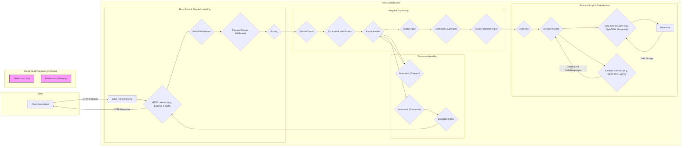

# Project Design Document: NestJS Framework

**1. Introduction**

This document provides a detailed architectural design of the NestJS framework. It outlines the key components, their interactions, and the overall structure of the framework. This document is intended to serve as a comprehensive reference for understanding the system architecture and will be used as the basis for subsequent threat modeling activities. The focus is on providing the necessary detail to identify potential security vulnerabilities.

**2. Goals and Objectives**

The primary goal of this document is to clearly and comprehensively articulate the design of the NestJS framework to effectively facilitate threat modeling. Specific objectives include:

*   Clearly identifying all key architectural components and their specific responsibilities within the framework.
*   Precisely mapping the interactions and data flow between these components, including error handling paths.
*   Highlighting potential areas of security concern at each stage of the request lifecycle and within different components.
*   Providing a well-structured and easily understandable overview for security analysts, developers, and operations teams.
*   Serving as a definitive reference point for discussions regarding the framework's security posture.

**3. Target Audience**

This document is intended for a technical audience involved in various aspects of the NestJS framework:

*   Security engineers and analysts responsible for performing threat modeling, security assessments, and penetration testing of NestJS applications and the framework itself.
*   Software architects and developers involved in the design, development, and maintenance of the NestJS framework and applications built upon it.
*   DevOps engineers responsible for the deployment, configuration, and monitoring of NestJS applications in different environments.
*   Technical product owners and managers who need a deep understanding of the framework's architecture and security implications.

**4. System Architecture**

NestJS is a progressive Node.js framework for building efficient and scalable server-side applications. It leverages TypeScript and combines elements of Object-Oriented Programming (OOP), Functional Programming (FP), and Reactive Programming (RP). Its modular architecture, inspired by Angular, promotes maintainability and testability.

**5. Key Components**

*   **Client Application:** The initiator of requests to the NestJS application. This could be a web browser, a mobile application, another backend service, or a command-line interface.
*   **Entry Point (main.ts):** The bootstrap file where the NestJS application module is initialized and the HTTP listener is started. This is the initial point of contact for incoming requests.
*   **HTTP Listener (e.g., Express, Fastify):** The underlying Node.js HTTP server that handles incoming network requests. NestJS provides an abstraction layer, allowing developers to choose between different server implementations.
*   **Global Middleware:** Functions that are executed for every incoming request before it reaches the route handlers. Examples include logging, CORS handling, and security headers.
*   **Request-Scoped Middleware:** Middleware that is specific to a particular route or a set of routes, offering more granular control over request processing.
*   **Routing:** The mechanism that maps incoming request URLs and methods to specific controller methods. NestJS uses decorators to define routes.
*   **Global Guards:** Classes that determine whether a request should be handled by a route handler. They have access to the execution context and can be used for authentication and authorization.
*   **Controller-Level Guards:** Guards applied specifically to a controller or its methods, providing more fine-grained authorization control.
*   **Route Handler:** The specific method within a controller that is responsible for processing a particular request and generating a response.
*   **Global Pipes:** Classes that transform or validate request input data across the entire application. They help ensure data integrity and security.
*   **Controller-Level Pipes:** Pipes applied specifically to a controller or its methods, allowing for customized data transformation and validation.
*   **Route Parameter Pipes:** Pipes that operate specifically on route parameters, allowing for validation and transformation of these values.
*   **Controller:** Classes annotated with `@Controller()` that define a set of related route handlers. They act as the entry point for specific sets of application logic.
*   **Service/Provider:** Classes annotated with `@Injectable()` that encapsulate business logic and data access logic. They are designed to be reusable and testable. Dependency injection is a core principle here.
*   **Data Access Layer (e.g., TypeORM, Mongoose):**  Handles the interaction with databases. This layer abstracts away the specific database implementation.
*   **Database:** The persistent storage system used by the application.
*   **External Services (e.g., REST APIs, gRPC):**  External systems or APIs that the NestJS application interacts with to fulfill requests.
*   **Interceptor (Request):** Functions that can intercept a request before it reaches the route handler, allowing for tasks like logging or modifying the request.
*   **Interceptor (Response):** Functions that can intercept the response before it is sent back to the client, allowing for tasks like transforming the response data or adding headers.
*   **Exception Filters:** Functions that catch exceptions thrown during the request processing lifecycle and format them into appropriate HTTP responses.
*   **Tasks/Cron Jobs:**  Scheduled background processes that can be defined and managed within the NestJS application.
*   **WebSockets Gateway:**  Enables real-time, bidirectional communication between the client and the server using WebSockets.

**6. Data Flow**

The typical data flow for an incoming HTTP request to a NestJS application follows these steps:

1. A **Client Application** sends an **HTTP Request** to the NestJS application.
2. The request is received by the **HTTP Listener**.
3. **Global Middleware** functions are executed in order.
4. **Request-Scoped Middleware** functions specific to the route are executed.
5. The **Routing** module matches the request to a specific **Controller** and **Route Handler**.
6. **Global Guards** are executed to determine if the request should proceed. If a guard returns `false`, the request is terminated.
7. **Controller-Level Guards** are executed for more specific authorization.
8. **Global Pipes** are applied to the request body and query parameters for validation and transformation.
9. **Controller-Level Pipes** are applied for more specific data processing.
10. **Route Parameter Pipes** are applied to validate and transform route parameters.
11. The **Route Handler** in the **Controller** is invoked.
12. **Request Interceptors** are executed before the route handler logic.
13. The **Controller** typically interacts with one or more **Services/Providers** to execute business logic.
14. **Services/Providers** may interact with the **Data Access Layer** to retrieve or persist data in the **Database**.
15. **Services/Providers** may also make calls to **External Services**.
16. The **Route Handler** returns a response.
17. **Response Interceptors** are executed to modify the response before it's sent.
18. If an exception occurs at any point, **Exception Filters** handle the error and format an error response.
19. The **HTTP Listener** sends the **HTTP Response** back to the **Client Application**.

**7. Security Considerations (Detailed)**

The architecture of NestJS incorporates several features and best practices that directly impact security:

*   **Input Validation and Sanitization:**
    *   **Pipes:** NestJS pipes provide a robust mechanism for validating and transforming request input data. Utilizing built-in validation pipes (e.g., `ValidationPipe`) with libraries like `class-validator` is crucial for preventing injection attacks and ensuring data integrity.
    *   **Custom Pipes:** Developers can create custom pipes for specific validation or sanitization needs.
*   **Authentication and Authorization:**
    *   **Guards:** NestJS guards are the primary mechanism for implementing authentication and authorization. They control access to specific routes based on user roles, permissions, or other criteria.
    *   **Passport Integration:** NestJS seamlessly integrates with Passport.js, a popular authentication middleware for Node.js, supporting various authentication strategies (e.g., JWT, OAuth).
    *   **Custom Guards:** Developers can create custom guards to implement complex authorization logic.
*   **Protection Against Common Web Vulnerabilities:**
    *   **Middleware:** Global middleware can be used to implement security headers (e.g., `Strict-Transport-Security`, `X-Content-Type-Options`, `X-Frame-Options`), helping to mitigate common attacks like cross-site scripting (XSS) and clickjacking.
    *   **CORS Configuration:**  Properly configuring CORS middleware is essential to prevent unauthorized requests from different origins.
    *   **CSRF Protection:** While not built-in, middleware can be integrated to implement Cross-Site Request Forgery (CSRF) protection.
*   **Secure Communication:**
    *   **HTTPS:**  Deployment environments should enforce HTTPS to encrypt communication between the client and the server. NestJS itself doesn't handle TLS termination but relies on the underlying server or a reverse proxy.
*   **Error Handling and Logging:**
    *   **Exception Filters:**  Properly implemented exception filters prevent sensitive information from being leaked in error messages.
    *   **Logging:**  Integrating a robust logging mechanism allows for monitoring application behavior and detecting potential security incidents. Sensitive information should be carefully excluded from logs.
*   **Dependency Management:**
    *   Regularly auditing and updating dependencies is crucial to address known vulnerabilities in third-party libraries. Tools like `npm audit` or `yarn audit` should be used.
*   **Rate Limiting and Throttling:**
    *   Middleware can be used to implement rate limiting to protect against denial-of-service attacks.
*   **Secure Configuration:**
    *   Sensitive configuration data (e.g., database credentials, API keys) should be stored securely, preferably using environment variables or dedicated secrets management solutions, and never hardcoded.
*   **Output Encoding:**
    *   While NestJS focuses on the backend, developers need to be mindful of output encoding in the frontend to prevent XSS vulnerabilities when rendering data received from the NestJS API.

**8. Deployment Considerations**

NestJS applications can be deployed in various environments:

*   **Cloud Platforms (AWS, Azure, GCP):** Utilizing services like EC2, Azure App Service, Google Cloud Run, or serverless functions.
*   **Containerized Environments (Docker, Kubernetes):** Containerizing NestJS applications allows for scalable and portable deployments.
*   **Platform-as-a-Service (PaaS):** Services like Heroku or Netlify can simplify deployment and management.
*   **Traditional Servers:** Deploying directly on physical or virtual servers.

Security considerations during deployment include:

*   **Network Security:** Properly configuring firewalls and network access controls.
*   **Infrastructure Security:** Securing the underlying infrastructure where the application is deployed.
*   **Secrets Management:** Securely managing environment variables and API keys.
*   **Regular Security Updates:** Keeping the operating system and other system software up-to-date.

**9. Technologies Used**

*   **Node.js:** The runtime environment.
*   **TypeScript:** The primary programming language.
*   **Express or Fastify:** The underlying HTTP server frameworks.
*   **Reflect Metadata:** Used extensively for dependency injection and decorator functionality.
*   **Various Libraries:**  A rich ecosystem of Node.js libraries for tasks like database interaction (e.g., TypeORM, Mongoose), validation (`class-validator`), caching, and more.

**10. Future Considerations**

*   More detailed design documentation for specific modules and features within the framework.
*   Inclusion of diagrams illustrating asynchronous processing and event-driven architectures.
*   Further elaboration on security best practices and recommended configurations within the framework documentation.

**11. Terminology**

*   **Module:** A class annotated with `@Module()` that organizes related components (controllers, providers, etc.).
*   **Controller:** A class annotated with `@Controller()` that defines route handlers for specific endpoints.
*   **Provider:** A class annotated with `@Injectable()` that can be injected as a dependency into other components. This includes services, repositories, factories, and more.
*   **Interceptor:** A class annotated with `@Injectable()` that can intercept and transform requests or responses.
*   **Pipe:** A class annotated with `@Injectable()` that transforms or validates input data.
*   **Guard:** A class annotated with `@Injectable()` that determines whether a request should be handled by a route handler (authorization).
*   **Exception Filter:** A class annotated with `@Catch()` that handles exceptions thrown during the request lifecycle.
*   **Decorator:** A TypeScript feature used to add metadata to classes, methods, and properties, enabling features like routing and dependency injection.
*   **Dependency Injection (DI):** A design pattern where components receive their dependencies from external sources rather than creating them themselves.
*   **Inversion of Control (IoC):** A principle where the framework controls the flow of the application, rather than the application controlling the framework.

This improved design document provides a more comprehensive and detailed overview of the NestJS framework's architecture, with a strong focus on security considerations relevant for threat modeling.