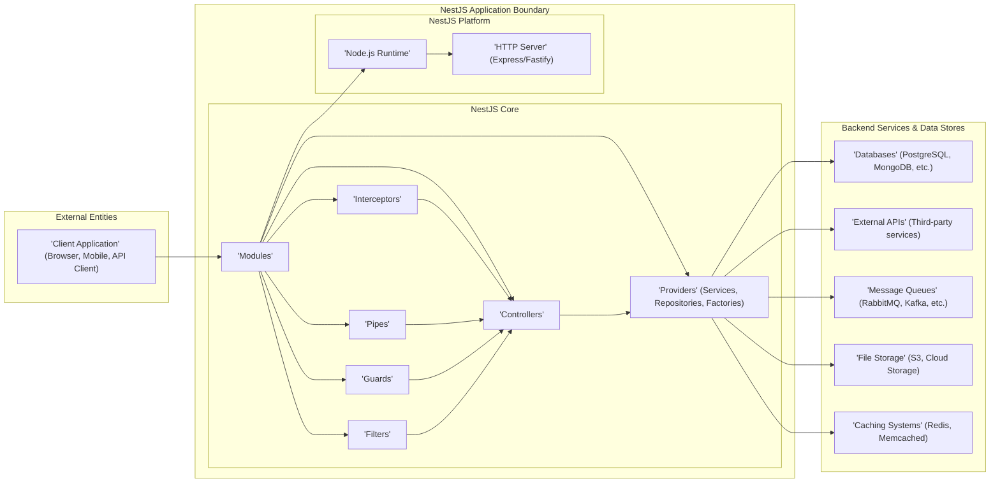
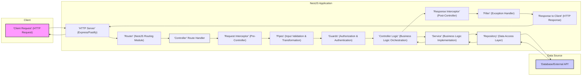

# Project Design Document: NestJS Framework for Threat Modeling (Improved)

## 1. Project Overview

### 1.1. Project Name
NestJS Framework

### 1.2. Project Description
NestJS is a progressive Node.js framework designed for building efficient, reliable, and scalable server-side applications. It leverages modern JavaScript and TypeScript, embracing principles from Object-Oriented Programming (OOP), Functional Programming (FP), and Reactive Programming (RP). NestJS provides a robust and opinionated architecture, promoting modularity, testability, and maintainability, making it suitable for complex backend systems. This document provides a detailed design overview of the NestJS framework specifically tailored for threat modeling and security analysis. It aims to facilitate the identification of potential vulnerabilities in applications built using NestJS.

### 1.3. Project Goals
*   To deliver a precise and comprehensive architectural blueprint of the NestJS framework, focusing on security-relevant aspects.
*   To clearly delineate key components within a NestJS application and illustrate their interactions, emphasizing data flow and trust boundaries.
*   To pinpoint potential security vulnerabilities and critical areas requiring focused threat modeling efforts.
*   To serve as a practical guide for security architects, developers, and threat modeling practitioners when analyzing NestJS applications.
*   To enable proactive security measures by providing a structured understanding of the framework's security landscape.

### 1.4. Target Audience
*   Security Architects and Security Engineers responsible for securing NestJS applications.
*   Developers utilizing NestJS for building backend services and APIs.
*   Threat Modeling Practitioners conducting security assessments of NestJS projects.
*   DevSecOps Engineers integrating security into the development lifecycle of NestJS applications.
*   Anyone seeking a deeper understanding of the security architecture of the NestJS framework.

## 2. Architecture Overview

### 2.1. High-Level Architecture Diagram

### 2.2. Architectural Layers

NestJS applications are structured into logical layers to promote separation of concerns and maintainability. These layers are crucial for understanding trust boundaries and potential attack vectors.

*   **External Entities Layer:** Represents systems and users outside the NestJS application's control, including client applications, external APIs, and other services. This is the untrusted zone.
*   **NestJS Application Layer:** The core trusted zone, encompassing the NestJS framework and the application code. This layer is further divided into:
    *   **NestJS Core:** Contains the fundamental building blocks of a NestJS application, responsible for request handling, business logic, and security enforcement.
    *   **NestJS Platform:** The underlying runtime environment and HTTP server that NestJS relies upon. Vulnerabilities here can impact all NestJS applications.
*   **Backend Services & Data Stores Layer:** Represents external dependencies that the NestJS application interacts with. While often considered trusted in the context of application logic, vulnerabilities in these systems or insecure interactions can pose significant risks.

### 2.3. Key Components (Detailed Security Perspective)

*   **Modules:**
    *   Description: Modules are organizational units that encapsulate related Controllers, Providers, and other Modules. They define application boundaries and manage dependencies.
    *   Functionality: Encapsulation, dependency injection scope, feature modularization, lazy-loading.
    *   Security Relevance:
        *   **Trust Boundaries:** Modules can define implicit trust boundaries. Improperly designed module boundaries might expose internal components unintentionally.
        *   **Dependency Management:**  Modules manage dependencies. Vulnerable dependencies introduced at the module level can affect all components within that module.
        *   **Circular Dependencies:**  Circular dependencies between modules can complicate security analysis and potentially create unexpected execution paths.
*   **Controllers:**
    *   Description: Controllers are responsible for handling incoming client requests and orchestrating responses. They act as the entry points to the application logic.
    *   Functionality: Request routing, request delegation to services, response construction, HTTP method handling, parameter extraction.
    *   Security Relevance:
        *   **Input Validation Entry Point:** Controllers are the first point of contact for external input. Lack of input validation in controllers is a primary source of vulnerabilities (Injection, XSS, etc.).
        *   **Authorization Enforcement Point:** Controllers often implement or delegate authorization checks to Guards to control access to specific routes and functionalities.
        *   **Rate Limiting and Throttling:** Controllers are suitable places to implement rate limiting and throttling to protect against abuse and DoS attacks.
*   **Providers (Services, Repositories, Factories):**
    *   Description: Providers encapsulate reusable business logic, data access operations, and object creation. Services contain core application logic, Repositories handle database interactions, and Factories create complex objects.
    *   Functionality: Business logic implementation, data persistence and retrieval, external API interactions, complex object instantiation, dependency injection.
    *   Security Relevance:
        *   **Business Logic Vulnerabilities:** Flaws in service logic can lead to business logic bypasses, data manipulation, and privilege escalation.
        *   **Data Access Layer Security:** Repositories interacting with databases must implement secure data access practices to prevent SQL/NoSQL injection and data breaches.
        *   **Credential Management:** Providers might handle sensitive credentials for accessing databases or external APIs. Secure credential management is crucial.
        *   **Data Sanitization and Encoding:** Providers handling data before persistence or sending to external systems should perform necessary sanitization and encoding to prevent injection and data integrity issues.
*   **Interceptors:**
    *   Description: Interceptors provide a mechanism to intercept and modify request processing or response handling. They can be used for logging, caching, transformation, and security enforcement.
    *   Functionality: Request/response transformation, logging, caching, exception handling, security context enrichment, input/output sanitization.
    *   Security Relevance:
        *   **Security Policy Enforcement:** Interceptors can enforce security policies like logging security-relevant events, adding security headers, or sanitizing input/output.
        *   **Potential for Bypass:** Misconfigured or poorly designed interceptors can inadvertently bypass security checks or introduce new vulnerabilities.
        *   **Performance Impact:**  Overly complex interceptors can negatively impact application performance, potentially leading to DoS vulnerabilities.
*   **Pipes:**
    *   Description: Pipes transform and validate request input data before it reaches route handlers. They are essential for data integrity and security.
    *   Functionality: Input validation, data transformation, data sanitization, type conversion, default value assignment.
    *   Security Relevance:
        *   **Input Validation is Key:** Pipes are the primary mechanism for input validation in NestJS. Properly implemented pipes are crucial for preventing injection attacks, data corruption, and unexpected application behavior.
        *   **Custom Validation Logic:** Pipes allow for custom validation logic, enabling enforcement of complex business rules and security constraints on input data.
        *   **Error Handling:** Pipes handle validation errors gracefully, preventing application crashes and providing informative error responses (while avoiding sensitive information disclosure).
*   **Guards:**
    *   Description: Guards determine whether a request should be handled by a route handler based on authorization and authentication criteria. They act as access control mechanisms.
    *   Functionality: Authentication, authorization, role-based access control (RBAC), attribute-based access control (ABAC), permission checks.
    *   Security Relevance:
        *   **Authorization Enforcement:** Guards are the core component for enforcing authorization policies. Weak or bypassed guards directly lead to unauthorized access and privilege escalation.
        *   **Authentication Integration:** Guards often integrate with authentication mechanisms (e.g., JWT, OAuth 2.0) to verify user identity before granting access.
        *   **Context-Aware Authorization:** Guards can access request context (headers, user information, etc.) to make context-aware authorization decisions.
*   **Filters:**
    *   Description: Filters handle exceptions thrown during request processing. They allow for customizing error responses and logging exceptions.
    *   Functionality: Exception handling, error response formatting, error logging, centralized error management.
    *   Security Relevance:
        *   **Prevent Information Disclosure:** Filters should prevent sensitive error details (stack traces, internal server errors) from being exposed to clients, which could aid attackers.
        *   **Consistent Error Handling:** Filters ensure consistent error responses across the application, improving security posture by preventing inconsistent behavior that might reveal vulnerabilities.
        *   **Centralized Error Logging:** Filters provide a centralized point for logging exceptions, aiding in security monitoring and incident response.

## 3. Data Flow Diagram (Detailed)

### 3.1. Detailed Data Flow Description

1.  **Client Request:** An external client (browser, mobile app, API client) initiates an HTTP request targeting a specific endpoint of the NestJS application.
2.  **HTTP Server:** The underlying HTTP server (Express or Fastify) receives the request and passes it to the NestJS framework.
3.  **Router:** The NestJS Router module analyzes the request URL and method to determine the appropriate Controller and route handler to process the request.
4.  **Controller Route Handler:** The designated Controller's route handler is invoked, becoming the entry point for application logic execution.
5.  **Request Interceptor (Pre-Controller):** If Request Interceptors are configured for this route, they are executed *before* the route handler logic. They can modify the request, perform pre-processing, logging, or even short-circuit the request.
6.  **Pipes (Input Validation & Transformation):** Pipes associated with the route handler's parameters are executed. They validate and transform the incoming request data, ensuring data integrity and security. Validation failures will typically result in an exception being thrown and handled by Filters.
7.  **Guards (Authorization & Authentication):** Guards associated with the route handler are executed to enforce authorization and authentication policies. Guards determine if the request is authorized to proceed based on user identity, roles, permissions, etc. If authorization fails, an exception is thrown.
8.  **Controller Logic (Business Logic Orchestration):** If the request passes through Pipes and Guards, the core logic within the Controller's route handler is executed. This logic typically orchestrates the interaction with Services to fulfill the request.
9.  **Service (Business Logic Implementation):** The Controller often delegates business logic execution to Services. Services contain the core application logic, independent of HTTP request handling.
10. **Repository (Data Access Layer):** Services frequently interact with Repositories to access and manipulate data in databases or external data sources. Repositories abstract away the data access details and provide a consistent interface for data operations.
11. **Data Source Interaction:** Repositories interact with databases, external APIs, or other data sources to retrieve or persist data as required by the business logic.
12. **Response Interceptor (Post-Controller):** After the Controller logic and Service/Repository interactions are complete, Response Interceptors (if configured) are executed *before* the response is sent back to the client. They can modify the response, perform post-processing, logging, or add security headers.
13. **Filter (Exception Handler):** If any exception occurs during the request processing pipeline (Pipes, Guards, Controller logic, Interceptors), NestJS's exception handling mechanism invokes Filters. Filters catch exceptions, log them, and format error responses to be sent back to the client.
14. **Response to Client:** Finally, the HTTP server sends the formatted response (either a successful response or an error response generated by a Filter) back to the originating client.

## 4. Technology Stack (Security Implications)

*   **Programming Language:** TypeScript (primarily), JavaScript (supported)
    *   Security Implication: TypeScript's strong typing can help reduce type-related errors and vulnerabilities compared to pure JavaScript. However, both languages are susceptible to common web application vulnerabilities.
*   **Runtime Environment:** Node.js
    *   Security Implication: Node.js runtime vulnerabilities can directly impact NestJS applications. Keeping Node.js updated is crucial. Node.js's event-driven, non-blocking architecture can be vulnerable to DoS if not properly handled (e.g., through rate limiting).
*   **HTTP Server Framework:** Express (default), Fastify (optional, configurable)
    *   Security Implication: The chosen HTTP server framework's security posture is critical. Both Express and Fastify are mature frameworks, but vulnerabilities can be discovered. Fastify is generally considered to have a stronger focus on performance and security by default.
*   **Dependency Injection:** Built-in Dependency Injection container
    *   Security Implication: Dependency Injection can improve code organization and testability, but insecurely configured or vulnerable dependencies can be easily injected and exploited.
*   **Reflection:** Reflect Metadata API
    *   Security Implication: Reflection is used extensively by NestJS. While not directly a security vulnerability, excessive reliance on reflection might introduce performance overhead and potentially expose internal application structure if not carefully managed.
*   **Reactive Programming:** RxJS (Reactive Extensions for JavaScript)
    *   Security Implication: RxJS itself doesn't introduce direct security vulnerabilities, but improper use of reactive streams, especially with user input or external data, could lead to unexpected behavior or vulnerabilities if not handled securely.
*   **Testing Framework:** Jest (recommended), Supertest (for integration testing)
    *   Security Implication: Robust testing, including security testing, is essential for identifying vulnerabilities early in the development lifecycle. Jest and Supertest are valuable tools for building secure NestJS applications.
*   **Package Manager:** npm or yarn
    *   Security Implication: Package managers are used to install dependencies. Vulnerabilities in dependencies are a significant security risk. Using `npm audit` or `yarn audit` and dependency scanning tools is crucial for managing dependency security.

## 5. Deployment Architecture (Security Considerations)

NestJS applications can be deployed in diverse environments, each with its own security landscape.

*   **Cloud Platforms (AWS, GCP, Azure):**
    *   Security Implication: Cloud platforms offer various security services (firewalls, WAFs, IAM, secret management). Properly leveraging these services is crucial for securing NestJS deployments in the cloud. Misconfigurations in cloud security settings are common vulnerabilities.
*   **Containerized Environments (Docker, Kubernetes):**
    *   Security Implication: Container security is paramount. Vulnerable container images, insecure container configurations, and Kubernetes misconfigurations can expose NestJS applications to attacks. Container image scanning and Kubernetes security best practices are essential.
*   **Serverless Environments (AWS Lambda, Google Cloud Functions, Azure Functions):**
    *   Security Implication: Serverless environments introduce unique security considerations. Function permissions, secure secrets management, and cold start vulnerabilities need to be addressed. Serverless functions often have limited runtime environments, which can impact the feasibility of certain security measures.
*   **Traditional Servers (On-premise, VPS):**
    *   Security Implication: Traditional server deployments require manual security hardening, including OS patching, firewall configuration, and intrusion detection systems. Maintaining server security is a continuous effort.

Common deployment architecture components and their security implications:

*   **Load Balancers:**
    *   Security Implication: Load balancers can provide basic DoS protection and SSL termination. However, misconfigured load balancers can introduce vulnerabilities or bypass security controls.
*   **Reverse Proxies (Nginx, Apache):**
    *   Security Implication: Reverse proxies are crucial for security. They can handle SSL termination, enforce security headers, provide WAF functionality, and hide the application server's internal structure. Insecure reverse proxy configurations are a common source of vulnerabilities.
*   **Databases:**
    *   Security Implication: Database security is critical. SQL/NoSQL injection, data breaches, and unauthorized access to databases are major threats. Secure database configurations, access control, and encryption are essential.
*   **Caching Layers (Redis, Memcached):**
    *   Security Implication: Caching systems can improve performance but might introduce security risks if sensitive data is cached insecurely or if the caching system itself is vulnerable.
*   **Monitoring and Logging:**
    *   Security Implication: Robust monitoring and logging are essential for security incident detection and response. Inadequate logging can hinder security investigations. Securely storing and managing logs is also important.

## 6. Security Considerations (Expanded)

### 6.1. General Security Best Practices for NestJS Applications (Detailed)

*   **Input Validation (Pipes are Key):**
    *   Action: Implement Pipes for *all* controller inputs. Use built-in validation pipes and create custom pipes for complex validation logic.
    *   Example Vulnerabilities Prevented: SQL Injection, NoSQL Injection, Command Injection, Cross-Site Scripting (XSS), Path Traversal, Buffer Overflow, Data Integrity Issues.
    *   Specific Techniques: Whitelisting allowed input, input length limits, regular expression validation, data type validation, custom validation functions.
*   **Output Encoding (Interceptors & Services):**
    *   Action: Encode output data appropriately based on the context (e.g., HTML encoding for web pages, JSON encoding for APIs). Use Interceptors or Services to handle output encoding consistently.
    *   Example Vulnerabilities Prevented: Cross-Site Scripting (XSS).
    *   Specific Techniques: HTML entity encoding, URL encoding, JavaScript escaping, JSON stringification.
*   **Authentication and Authorization (Guards are Essential):**
    *   Action: Implement robust authentication (e.g., JWT, OAuth 2.0, Session-based) and fine-grained authorization using Guards. Define clear roles and permissions.
    *   Example Vulnerabilities Prevented: Unauthorized Access, Privilege Escalation, Data Breaches, Account Takeover.
    *   Specific Techniques: JWT verification, OAuth 2.0 flows, RBAC, ABAC, policy-based authorization, secure session management, multi-factor authentication (MFA).
*   **Secure Dependency Management (npm/yarn audit & Dependency Scanning):**
    *   Action: Regularly audit dependencies using `npm audit` or `yarn audit`. Use dependency vulnerability scanning tools (e.g., Snyk, OWASP Dependency-Check) in CI/CD pipelines. Keep dependencies updated.
    *   Example Vulnerabilities Prevented: Exploitation of known vulnerabilities in third-party libraries.
    *   Specific Techniques: Dependency pinning, vulnerability scanning automation, security updates, SBOM (Software Bill of Materials) generation.
*   **Rate Limiting and Throttling (Interceptors & Guards):**
    *   Action: Implement rate limiting and throttling at the Controller or Interceptor level to prevent brute-force attacks, DoS attacks, and API abuse.
    *   Example Vulnerabilities Prevented: Brute-force attacks, DoS attacks, API abuse, resource exhaustion.
    *   Specific Techniques: Token bucket algorithm, leaky bucket algorithm, fixed window counters, sliding window counters, API gateway rate limiting.
*   **Logging and Monitoring (Interceptors & Filters):**
    *   Action: Implement comprehensive logging of security-relevant events (authentication failures, authorization violations, input validation errors, exceptions). Use centralized logging and monitoring systems.
    *   Example Vulnerabilities Detected: Security incidents, attacks in progress, system anomalies, performance issues.
    *   Specific Techniques: Structured logging, security event logging standards (e.g., Common Event Format - CEF), SIEM integration, anomaly detection.
*   **Error Handling and Information Disclosure (Filters are Crucial):**
    *   Action: Implement Filters to handle exceptions gracefully and prevent sensitive information (stack traces, internal errors) from being disclosed in error responses. Provide generic error messages to clients.
    *   Example Vulnerabilities Prevented: Information Disclosure, aiding attackers in reconnaissance.
    *   Specific Techniques: Custom exception filters, generic error responses, error logging to secure locations, masking sensitive data in error messages.
*   **Secure Configuration Management (Environment Variables & Secret Management):**
    *   Action: Store sensitive configuration data (API keys, database credentials, secrets) securely using environment variables or dedicated secret management services (e.g., HashiCorp Vault, AWS Secrets Manager, Azure Key Vault). Avoid hardcoding secrets.
    *   Example Vulnerabilities Prevented: Exposure of sensitive credentials in code or configuration files, unauthorized access to secrets.
    *   Specific Techniques: Environment variables, secret management services, configuration encryption, least privilege access to secrets.
*   **HTTPS/TLS (Reverse Proxy & Load Balancer Configuration):**
    *   Action: Enforce HTTPS/TLS for all communication to protect data in transit. Configure reverse proxies and load balancers for SSL termination and redirection to HTTPS.
    *   Example Vulnerabilities Prevented: Man-in-the-Middle (MITM) attacks, eavesdropping, data interception.
    *   Specific Techniques: SSL/TLS certificate management, HSTS (HTTP Strict Transport Security), secure cipher suites, TLS 1.2+ enforcement.
*   **CORS (Cross-Origin Resource Sharing) (Middleware Configuration):**
    *   Action: Configure CORS policies restrictively to allow only trusted origins to access the application's resources. Avoid wildcard CORS configurations (`*`).
    *   Example Vulnerabilities Prevented: Cross-Site Request Forgery (CSRF), unauthorized access from untrusted origins.
    *   Specific Techniques: Origin whitelisting, method and header restrictions, credential handling in CORS.
*   **Security Headers (Reverse Proxy & Interceptor Configuration):**
    *   Action: Implement security headers (Content-Security-Policy, X-Frame-Options, X-XSS-Protection, Strict-Transport-Security, Referrer-Policy, Feature-Policy) to enhance client-side security. Configure these headers in reverse proxies or using Interceptors.
    *   Example Vulnerabilities Mitigated: Cross-Site Scripting (XSS), Clickjacking, MIME-sniffing vulnerabilities, insecure content loading.
    *   Specific Techniques: Content-Security-Policy directives, X-Frame-Options modes, X-XSS-Protection modes, HSTS max-age and includeSubDomains, Referrer-Policy values, Feature-Policy directives.

### 6.2. NestJS Specific Security Considerations (Deep Dive)

*   **Module Boundaries (Design & Review):**
    *   Action: Carefully design module boundaries to enforce separation of concerns and minimize the impact of vulnerabilities within a module. Regularly review module dependencies and access control.
    *   Security Focus: Trust boundary analysis, minimizing blast radius of vulnerabilities, access control within modules.
*   **Dependency Injection Security (Provider Scrutiny):**
    *   Action: Scrutinize injected Providers for potential vulnerabilities. Ensure Providers are securely implemented and do not introduce security flaws. Be cautious with dynamically injected or user-provided Providers.
    *   Security Focus: Provider code review, dependency chain analysis, preventing injection of malicious Providers.
*   **Interceptor Security (Implementation & Testing):**
    *   Action: Implement Interceptors securely. Thoroughly test Interceptors to ensure they function as intended and do not introduce bypasses or vulnerabilities. Avoid overly complex Interceptor logic that might be difficult to secure.
    *   Security Focus: Interceptor code review, bypass testing, performance impact assessment, secure exception handling within Interceptors.
*   **Pipe Security (Comprehensive Validation):**
    *   Action: Leverage Pipes extensively for comprehensive input validation. Use a combination of built-in and custom Pipes to cover all input validation requirements. Regularly review and update Pipes as application requirements evolve.
    *   Security Focus: Input validation coverage analysis, custom pipe security review, validation error handling, preventing validation bypasses.
*   **Guard Security (Robust Authorization Logic):**
    *   Action: Implement robust and well-tested Guards for authorization. Ensure Guards accurately enforce authorization policies and are not easily bypassed. Regularly review and update Guard logic as roles and permissions change.
    *   Security Focus: Authorization logic review, bypass testing, role and permission management, secure authentication integration.
*   **Filter Security (Information Leakage Prevention):**
    *   Action: Configure Filters to prevent information leakage in error responses. Ensure Filters handle exceptions securely and log errors appropriately without exposing sensitive details to clients.
    *   Security Focus: Error response analysis, information disclosure prevention, secure error logging, consistent error handling.

## 7. Threat Modeling Focus Areas (Prioritized)

Based on the architecture, security considerations, and common web application vulnerabilities, prioritize the following areas during threat modeling for NestJS applications:

*   **Input Validation Vulnerabilities (Controllers & Pipes):**
    *   Focus: Identify potential injection vulnerabilities (SQL, NoSQL, Command, XSS) and data integrity issues arising from insufficient or improper input validation in Controllers and Pipes.
    *   Threats: Injection attacks, data manipulation, application crashes, unexpected behavior.
    *   Techniques: Input fuzzing, manual code review of Controllers and Pipes, penetration testing of input validation mechanisms.
*   **Authorization and Authentication Bypass (Guards & Controller Logic):**
    *   Focus: Analyze Guards and Controller logic for weaknesses in authorization and authentication mechanisms that could lead to unauthorized access to protected resources or functionalities.
    *   Threats: Unauthorized access, privilege escalation, data breaches, account takeover.
    *   Techniques: Access control matrix analysis, role and permission review, penetration testing of authorization mechanisms, authentication bypass attempts.
*   **Data Access Control Vulnerabilities (Providers & Repositories):**
    *   Focus: Examine Providers (Services and Repositories) for vulnerabilities related to insecure data access control, potentially leading to data breaches, unauthorized data modification, or data leakage.
    *   Threats: Data breaches, unauthorized data modification, data leakage, information disclosure.
    *   Techniques: Data flow analysis, code review of Providers and Repositories, database access control review, penetration testing of data access layers.
*   **Dependency Vulnerabilities (Package Management):**
    *   Focus: Assess the application's dependencies for known vulnerabilities and establish a process for regular dependency updates and vulnerability scanning.
    *   Threats: Exploitation of known vulnerabilities in third-party libraries, supply chain attacks.
    *   Techniques: Dependency scanning tools (Snyk, OWASP Dependency-Check), `npm audit`/`yarn audit`, SBOM analysis, vulnerability database research.
*   **Configuration Security (Deployment & Infrastructure):**
    *   Focus: Review application configuration, deployment configurations, and infrastructure configurations for potential misconfigurations that could expose sensitive information, weaken security posture, or introduce vulnerabilities.
    *   Threats: Information disclosure, insecure defaults, misconfiguration exploitation, unauthorized access to infrastructure.
    *   Techniques: Configuration review checklists, security hardening guides, infrastructure security assessments, penetration testing of deployment environment.
*   **Error Handling and Information Disclosure (Filters & Global Exception Handling):**
    *   Focus: Analyze Filters and global exception handling mechanisms to ensure they do not inadvertently disclose sensitive information to clients in error responses.
    *   Threats: Information disclosure, aiding attackers in reconnaissance, exposing internal application details.
    *   Techniques: Error response analysis, code review of Filters and exception handling logic, penetration testing of error handling mechanisms.
*   **Business Logic Vulnerabilities (Services & Controllers):**
    *   Focus: Examine the business logic implemented in Services and Controllers for potential flaws that could be exploited to manipulate application behavior, bypass security controls, or compromise data integrity.
    *   Threats: Business logic bypasses, data manipulation, fraud, denial of service, privilege escalation.
    *   Techniques: Business logic flow analysis, use case abuse analysis, code review of Services and Controllers, penetration testing of business logic workflows.
*   **Session Management and Cookie Security (Authentication & Guards):**
    *   Focus: If sessions are used, analyze session management mechanisms and cookie security settings to prevent session hijacking, session fixation, and related session-based attacks.
    *   Threats: Session hijacking, session fixation, account takeover, unauthorized access.
    *   Techniques: Session management review, cookie security analysis, penetration testing of session handling, secure session configuration review.
*   **API Security (Controllers & API Gateway):**
    *   Focus: For NestJS applications exposing APIs, focus on API-specific threats such as API abuse, broken authentication, lack of authorization, injection attacks targeting APIs, and API rate limiting.
    *   Threats: API abuse, data breaches, unauthorized access to APIs, DoS attacks on APIs, injection attacks targeting APIs.
    *   Techniques: API security testing tools, API penetration testing, API documentation review, API gateway security configuration review, OWASP API Security Top 10 analysis.

This improved design document provides a more in-depth and actionable foundation for threat modeling NestJS applications. By leveraging this document, security teams and developers can proactively identify and mitigate potential security risks, building more secure and resilient NestJS-based systems.