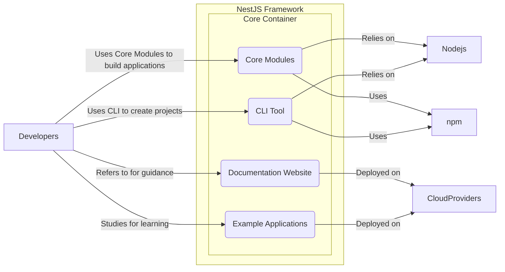
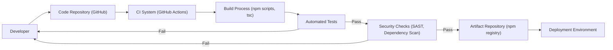

# BUSINESS POSTURE

- Business priorities and goals:
    - Provide a robust and scalable framework for building efficient Node.js server-side applications.
    - Enhance developer productivity and experience through a well-structured and feature-rich framework.
    - Foster a strong and active community around the NestJS framework.
    - Promote the adoption of NestJS as a leading framework for enterprise-grade Node.js applications.
- Most important business risks:
    - Security vulnerabilities within the framework could lead to application breaches, damaging user trust and hindering adoption.
    - Performance bottlenecks or scalability limitations could restrict the framework's applicability for large-scale enterprise applications.
    - Lack of comprehensive documentation or a steep learning curve could deter developers from adopting NestJS.
    - Dependency on external libraries and the Node.js ecosystem introduces supply chain risks.

# SECURITY POSTURE

- Existing security controls:
    - security control: Code review process on GitHub pull requests to ensure code quality and identify potential vulnerabilities. Implemented in: GitHub repository contribution workflow.
    - security control: Dependency management using `package-lock.json` or similar to ensure consistent and reproducible builds. Implemented in: Project repository.
    - security control: Public issue reporting on GitHub to allow community members to report potential security vulnerabilities. Implemented in: GitHub issue tracker.
- Accepted risks:
    - accepted risk: As an open-source project, vulnerability disclosure might be public before a patch is available, potentially leading to zero-day exploits.
    - accepted risk: Reliance on community contributions for security vulnerability identification and fixes, which might introduce delays in response times.
- Recommended security controls:
    - security control: Implement automated Static Application Security Testing (SAST) tools in the Continuous Integration/Continuous Deployment (CI/CD) pipeline to detect potential code-level vulnerabilities.
    - security control: Integrate Dependency Vulnerability Scanning tools to automatically identify and alert on known vulnerabilities in project dependencies.
    - security control: Establish a documented process for handling security vulnerabilities, including triage, patching, and disclosure, potentially involving a dedicated security team or point of contact.
- Security requirements:
    - Authentication:
        - Requirement: NestJS applications should be able to implement various authentication mechanisms such as JWT, OAuth 2.0, and session-based authentication.
        - Requirement: The framework should provide modules and guidance to easily integrate authentication strategies.
    - Authorization:
        - Requirement: NestJS applications should support role-based access control (RBAC) and potentially attribute-based access control (ABAC) to manage user permissions.
        - Requirement: The framework should offer mechanisms to define and enforce authorization policies at different levels (e.g., controller, service).
    - Input Validation:
        - Requirement: NestJS should encourage and facilitate input validation to prevent common injection attacks (e.g., SQL injection, Cross-Site Scripting).
        - Requirement: The framework should provide utilities or integrate with validation libraries to simplify input validation processes.
    - Cryptography:
        - Requirement: NestJS applications might need to handle sensitive data, and the framework should not hinder the implementation of cryptographic operations.
        - Requirement: While not directly providing cryptographic primitives, NestJS documentation and examples should promote secure cryptographic practices when handling sensitive data.

# DESIGN

## C4 CONTEXT

```mermaid
flowchart LR
    subgraph NestJS Ecosystem
        center("NestJS Framework")
    end
    Developers -- "Uses to build applications" --> NestJS Ecosystem
    EndUsers -- "Uses applications built with" --> NestJS Ecosystem
    Nodejs -- "Runtime environment" --> NestJS Ecosystem
    npm -- "Package manager" --> NestJS Ecosystem
    Databases -- "Data storage" --> NestJS Ecosystem
    CloudProviders -- "Deployment platform" --> NestJS Ecosystem
    ThirdPartyLibraries -- "Extends functionality" --> NestJS Ecosystem
```

- Context Diagram Elements:
    - - Name: NestJS Framework
        - Type: Software System
        - Description: A progressive Node.js framework for building efficient and scalable server-side applications. It provides a structured approach to application development using TypeScript and incorporates elements of OOP, FP, and FRP.
        - Responsibilities: Provides core functionalities for building server-side applications, including routing, dependency injection, modules, controllers, services, and exception handling.
        - Security controls: Implements security best practices in framework design, provides security-related modules and documentation, and addresses reported security vulnerabilities.
    - - Name: Developers
        - Type: Person
        - Description: Software engineers who use the NestJS framework to develop and build server-side applications.
        - Responsibilities: Utilize NestJS framework to create, test, and deploy applications, adhere to security best practices while developing applications.
        - Security controls: Responsible for implementing security controls within their applications built using NestJS, following security guidelines provided by NestJS and general security best practices.
    - - Name: End Users
        - Type: Person
        - Description: Users who interact with applications built using the NestJS framework.
        - Responsibilities: Consume services provided by applications built with NestJS.
        - Security controls: Subject to security controls implemented in the applications they use, which are built using NestJS.
    - - Name: Node.js
        - Type: Software System
        - Description: The JavaScript runtime environment on which NestJS and NestJS applications are executed.
        - Responsibilities: Provides the runtime environment for NestJS applications, manages JavaScript execution, and provides access to system resources.
        - Security controls: Node.js security updates and patches, runtime environment security configurations.
    - - Name: npm (or yarn)
        - Type: Software System
        - Description: Package managers used to distribute and install NestJS framework and its dependencies.
        - Responsibilities: Package and distribute NestJS framework, manage dependencies for NestJS projects.
        - Security controls: npm/yarn security scanning for package vulnerabilities, package integrity checks.
    - - Name: Databases
        - Type: Software System
        - Description: Various database systems (e.g., PostgreSQL, MySQL, MongoDB) used by NestJS applications for data persistence.
        - Responsibilities: Store and retrieve data for NestJS applications.
        - Security controls: Database access controls, encryption at rest and in transit, database security configurations.
    - - Name: Cloud Providers (e.g., AWS, Azure, GCP)
        - Type: Software System
        - Description: Cloud platforms used to deploy and host NestJS applications.
        - Responsibilities: Provide infrastructure and services for deploying and running NestJS applications.
        - Security controls: Cloud provider security controls (IAM, network security groups, encryption), infrastructure security configurations.
    - - Name: Third-Party Libraries
        - Type: Software System
        - Description: External libraries and packages used by NestJS framework and applications to extend functionality.
        - Responsibilities: Provide additional features and functionalities to NestJS framework and applications.
        - Security controls: Dependency vulnerability scanning, vetting of third-party libraries before inclusion.

## C4 CONTAINER



- Container Diagram Elements:
    - - Name: Core Modules
        - Type: Container - Node.js Library
        - Description: The core NestJS framework library, distributed via npm, providing the fundamental building blocks for NestJS applications (modules, decorators, controllers, services, etc.).
        - Responsibilities: Provides the core functionalities of the NestJS framework, including dependency injection, routing, middleware support, and module system.
        - Security controls: Code review, SAST in CI/CD, dependency vulnerability scanning, secure coding practices.
    - - Name: CLI Tool (@nestjs/cli)
        - Type: Container - Node.js Application
        - Description: Command-line interface tool for NestJS, used by developers to create, build, and manage NestJS projects. Distributed via npm.
        - Responsibilities: Project scaffolding, code generation, building and serving NestJS applications, managing modules and components.
        - Security controls: Input validation for CLI commands, secure handling of project templates, update mechanism for CLI tool itself.
    - - Name: Documentation Website (docs.nestjs.com)
        - Type: Container - Web Application
        - Description: Official documentation website for NestJS, providing guides, API references, and examples.
        - Responsibilities: Provide comprehensive documentation for NestJS framework, tutorials, and API references.
        - Security controls: Web application security best practices, HTTPS, Content Security Policy, regular security updates for website platform.
    - - Name: Example Applications (nestjs/nest-cli, nestjs/nest-starter)
        - Type: Container - Node.js Applications
        - Description: Example applications and starter projects demonstrating various features and best practices of NestJS. Available on GitHub and sometimes distributed via npm.
        - Responsibilities: Serve as learning resources and starting points for developers using NestJS.
        - Security controls: Secure coding practices in example applications, regular updates to dependencies, showcasing security best practices in examples.

## DEPLOYMENT

- Deployment Architectures:
    - Option 1: Developer Machine (Local Development) - NestJS applications are run directly on developer's local machine for development and testing.
    - Option 2: Cloud Platform (e.g., AWS, Azure, GCP) - NestJS applications are deployed to cloud platforms using services like EC2, Azure VMs, Google Compute Engine, or containerized using services like ECS, AKS, GKE.
    - Option 3: On-Premise Servers - NestJS applications are deployed to traditional on-premise servers within a company's data center.

- Detailed Deployment Architecture (Cloud Platform - Containerized):

```mermaid
flowchart LR
    subgraph Cloud Provider
        subgraph Container Orchestration Service (e.g., Kubernetes)
            subgraph Worker Node 1
                NestAppInstance1("NestJS Application Instance 1")
            end
            subgraph Worker Node 2
                NestAppInstance2("NestJS Application Instance 2")
            end
            LoadBalancer("Load Balancer")
        end
        DatabaseService("Database Service (e.g., RDS, Cloud SQL)")
    end
    EndUsers -- "Requests" --> LoadBalancer
    LoadBalancer -- "Routes requests" --> NestAppInstance1 & NestAppInstance2
    NestAppInstance1 & NestAppInstance2 -- "Data access" --> DatabaseService
```

- Deployment Diagram Elements (Cloud Platform - Containerized):
    - - Name: Cloud Provider (e.g., AWS, Azure, GCP)
        - Type: Infrastructure Environment
        - Description: The cloud platform providing the infrastructure and services to host the NestJS application.
        - Responsibilities: Provides compute, network, and storage resources, manages the container orchestration service and database service.
        - Security controls: Cloud provider security controls (IAM, network security groups, security monitoring), infrastructure security configurations.
    - - Name: Container Orchestration Service (e.g., Kubernetes)
        - Type: Platform Service
        - Description: A service for automating deployment, scaling, and management of containerized applications.
        - Responsibilities: Orchestrates container deployment, manages scaling and health checks, provides service discovery and load balancing within the cluster.
        - Security controls: Kubernetes RBAC, network policies, pod security policies, container image security scanning, secrets management.
    - - Name: Worker Node 1 & Worker Node 2
        - Type: Compute Instance (Virtual Machine or Physical Server)
        - Description: Compute instances within the container orchestration cluster where NestJS application instances are deployed.
        - Responsibilities: Run containerized NestJS application instances, provide compute resources.
        - Security controls: Operating system security hardening, container runtime security, host-based intrusion detection.
    - - Name: NestJS Application Instance 1 & NestJS Application Instance 2
        - Type: Software Instance (Container)
        - Description: Running instances of the containerized NestJS application.
        - Responsibilities: Handle incoming requests, execute application logic, interact with database service.
        - Security controls: Application-level security controls (authentication, authorization, input validation), secure coding practices, container security best practices.
    - - Name: Load Balancer
        - Type: Network Service
        - Description: Distributes incoming traffic across multiple NestJS application instances for high availability and scalability.
        - Responsibilities: Distribute traffic, perform health checks on application instances, provide SSL termination.
        - Security controls: SSL/TLS encryption, DDoS protection, access control lists, security monitoring.
    - - Name: Database Service (e.g., RDS, Cloud SQL)
        - Type: Data Storage Service
        - Description: Managed database service provided by the cloud provider.
        - Responsibilities: Store and manage application data, provide data persistence and scalability.
        - Security controls: Database access controls, encryption at rest and in transit, database security configurations, regular backups.

## BUILD



- Build Process Description:
    - Developers commit code changes to the GitHub repository.
    - Continuous Integration (CI) system (e.g., GitHub Actions) is triggered on code changes.
    - The build process is executed, typically using npm scripts to compile TypeScript code, bundle modules, and prepare artifacts.
    - Automated tests (unit, integration, and potentially end-to-end tests) are run to ensure code quality and functionality.
    - If tests pass, security checks are performed, including Static Application Security Testing (SAST) to identify potential code vulnerabilities and dependency vulnerability scanning to detect known vulnerabilities in dependencies.
    - If security checks pass, build artifacts (e.g., npm packages) are published to an artifact repository (e.g., npm registry).
    - From the artifact repository, the application can be deployed to various deployment environments.

- Build Process Security Controls:
    - security control: Code Repository (GitHub) - Access control to the repository, branch protection rules, code review process. Implemented in: GitHub repository settings.
    - security control: CI System (GitHub Actions) - Secure CI/CD pipeline configuration, secrets management for CI/CD workflows, access control to CI/CD workflows. Implemented in: GitHub Actions configuration.
    - security control: Build Process (npm scripts, tsc) - Use of trusted build tools and scripts, minimizing dependencies in build process, build process isolation. Implemented in: `package.json` scripts, build environment configuration.
    - security control: Automated Tests - Comprehensive test suite to catch functional and security-related issues early in the development lifecycle. Implemented in: Project test suite.
    - security control: Security Checks (SAST, Dependency Scan) - Integration of SAST tools and dependency vulnerability scanners in the CI/CD pipeline to automatically detect vulnerabilities. Implemented in: CI/CD workflow configuration, security scanning tools integration.
    - security control: Artifact Repository (npm registry) - Access control to the artifact repository, package signing and verification, vulnerability scanning of published packages. Implemented in: npm registry security features, package signing process.

# RISK ASSESSMENT

- Critical business processes we are trying to protect:
    - Development, build, and distribution of the NestJS framework.
    - Maintaining the integrity and availability of the NestJS framework for developers and applications built upon it.
    - Protecting the reputation and trust associated with the NestJS framework.
- Data we are trying to protect and their sensitivity:
    - Source code of the NestJS framework - High sensitivity (confidentiality and integrity are critical).
    - Build artifacts (npm packages) - Medium sensitivity (integrity and availability are important).
    - Documentation content - Low sensitivity (availability and integrity are important).
    - Website user data (if any, e.g., forum accounts) - Low to medium sensitivity depending on the data collected (confidentiality and integrity are relevant).

# QUESTIONS & ASSUMPTIONS

- Questions:
    - What specific SAST and Dependency Vulnerability Scanning tools are currently used or planned to be used in the NestJS project's CI/CD pipeline?
    - Is there a documented security incident response plan for the NestJS project?
    - Are there regular penetration testing or security audits conducted on the NestJS framework or its infrastructure?
    - What is the process for reporting and handling security vulnerabilities discovered by the community?
- Assumptions:
    - Security is a significant concern for the NestJS project and its maintainers.
    - The NestJS project aims to follow secure software development lifecycle (SSDLC) best practices.
    - The primary distribution channel for the NestJS framework is npm.
    - The NestJS project benefits from the security practices and infrastructure provided by GitHub and npm.