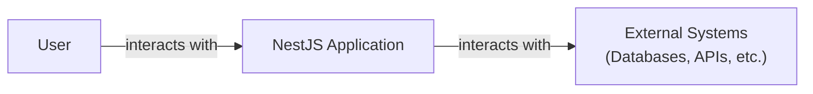
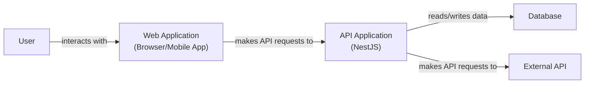
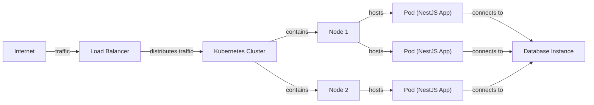
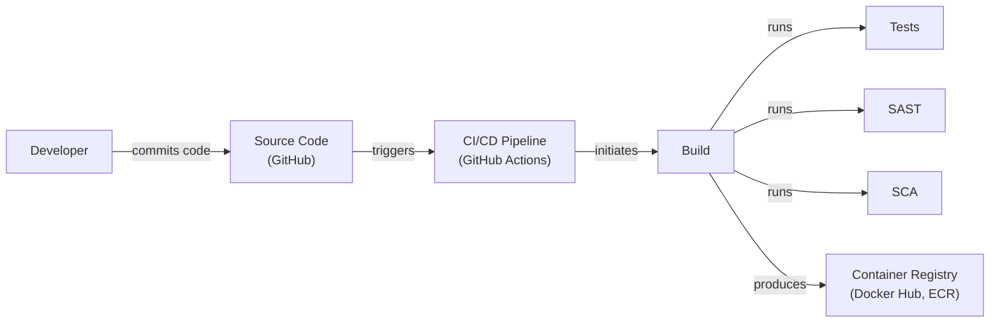

# BUSINESS POSTURE

Business Priorities and Goals:

*   Provide a robust, scalable, and maintainable application framework for building server-side Node.js applications.
*   Offer a modular architecture inspired by Angular, promoting code organization and reusability.
*   Support various application types, including REST APIs, GraphQL APIs, microservices, and WebSockets.
*   Integrate seamlessly with popular libraries and tools within the Node.js ecosystem.
*   Provide excellent developer experience with comprehensive documentation, tooling, and community support.
*   Maintain a high level of performance and efficiency.
*   Ensure the framework itself is secure and promotes secure coding practices.

Business Risks:

*   Security vulnerabilities within the framework itself could expose applications built with NestJS to attacks.
*   Inadequate documentation or support could lead to developers implementing insecure or inefficient solutions.
*   Lack of compatibility with key libraries or tools could limit the framework's adoption and usefulness.
*   Performance bottlenecks within the framework could impact the scalability of applications.
*   Failure to keep up with the evolving Node.js ecosystem could lead to obsolescence.
*   Reputational damage due to security incidents or poor developer experience.

# SECURITY POSTURE

Existing Security Controls:

*   security control: The framework encourages the use of established security best practices through its structure and documentation. (Described in documentation)
*   security control: NestJS provides built-in support for input validation using libraries like class-validator. (Described in documentation)
*   security control: NestJS offers modules and guidance for implementing authentication and authorization mechanisms, including JWT, Passport, and guards. (Described in documentation)
*   security control: The framework supports various data serialization and deserialization methods, helping to prevent injection vulnerabilities. (Described in documentation)
*   security control: NestJS encourages the use of dependency injection, which can improve testability and reduce the risk of hardcoded secrets. (Described in documentation)
*   security control: Regular updates and security patches are released to address vulnerabilities. (Described in GitHub repository and documentation)
*   security control: Community support and active issue tracking help identify and resolve security concerns. (Described in GitHub repository)
*   security control: NestJS promotes secure coding practices by providing mechanisms for handling errors and exceptions gracefully. (Described in documentation)
*   security control: NestJS supports the use of secure transport protocols like HTTPS. (Described in documentation)
*   security control: NestJS provides mechanisms for implementing rate limiting and other defenses against denial-of-service attacks. (Described in documentation)

Accepted Risks:

*   accepted risk: Developers may choose to bypass or misconfigure security features, leading to vulnerabilities in their applications.
*   accepted risk: Third-party libraries used within NestJS applications may introduce their own security risks.
*   accepted risk: The framework may not cover all possible attack vectors, and developers must remain vigilant about emerging threats.

Recommended Security Controls:

*   security control: Implement a robust code review process to ensure that security best practices are followed consistently.
*   security control: Integrate static application security testing (SAST) and dynamic application security testing (DAST) tools into the development pipeline.
*   security control: Conduct regular penetration testing to identify and address vulnerabilities.
*   security control: Implement a comprehensive security monitoring and logging system.
*   security control: Establish a clear vulnerability disclosure and response process.

Security Requirements:

*   Authentication:
    *   Support for various authentication mechanisms, including JWT, OAuth 2.0, and OpenID Connect.
    *   Secure storage of user credentials (e.g., hashing and salting passwords).
    *   Protection against common authentication attacks (e.g., brute-force, credential stuffing).
*   Authorization:
    *   Role-based access control (RBAC) or attribute-based access control (ABAC).
    *   Fine-grained control over access to resources and functionalities.
    *   Protection against privilege escalation attacks.
*   Input Validation:
    *   Validation of all user inputs against predefined schemas or rules.
    *   Protection against common injection attacks (e.g., SQL injection, cross-site scripting, command injection).
    *   Sanitization of user inputs to remove potentially harmful characters.
*   Cryptography:
    *   Use of strong cryptographic algorithms and protocols.
    *   Secure key management practices.
    *   Protection of sensitive data in transit and at rest.

# DESIGN

## C4 CONTEXT

Element List:

*   Element:
    *   Name: User
    *   Type: Person
    *   Description: Represents a user interacting with the NestJS application.
    *   Responsibilities: Initiates requests, views responses, provides input.
    *   Security controls: Authentication, authorization, session management (implemented within the NestJS Application).

*   Element:
    *   Name: NestJS Application
    *   Type: Software System
    *   Description: The application built using the NestJS framework.
    *   Responsibilities: Handles user requests, processes data, interacts with external systems, enforces business logic, provides responses.
    *   Security controls: Input validation, authentication, authorization, output encoding, error handling, session management, data protection, logging, and monitoring.

*   Element:
    *   Name: External Systems
    *   Type: Software System
    *   Description: Represents external systems that the NestJS application interacts with, such as databases, APIs, message queues, etc.
    *   Responsibilities: Varies depending on the specific system.
    *   Security controls: Dependent on the specific external system; the NestJS application should use secure communication protocols and authentication mechanisms when interacting with these systems.

## C4 CONTAINER

Element List:

*   Element:
    *   Name: User
    *   Type: Person
    *   Description: Represents a user interacting with the system.
    *   Responsibilities: Initiates requests, views responses, provides input.
    *   Security controls: Authentication, authorization, session management (implemented within the Web Application and API Application).

*   Element:
    *   Name: Web Application
    *   Type: Container: Browser/Mobile App
    *   Description: The client-side application that interacts with the NestJS API.
    *   Responsibilities: Renders user interface, handles user input, makes API requests.
    *   Security controls: Input validation, output encoding, protection against cross-site scripting (XSS) and cross-site request forgery (CSRF).

*   Element:
    *   Name: API Application
    *   Type: Container: NestJS Application
    *   Description: The server-side application built using NestJS.
    *   Responsibilities: Handles API requests, processes data, interacts with the database and external APIs, enforces business logic, provides API responses.
    *   Security controls: Input validation, authentication, authorization, output encoding, error handling, session management, data protection, logging, and monitoring.

*   Element:
    *   Name: Database
    *   Type: Container: Database
    *   Description: The database used to store application data.
    *   Responsibilities: Stores and retrieves data.
    *   Security controls: Access control, encryption at rest, auditing.

*   Element:
    *   Name: External API
    *   Type: Container: External System
    *   Description: An external API that the NestJS application interacts with.
    *   Responsibilities: Varies depending on the specific API.
    *   Security controls: Dependent on the specific external API; the NestJS application should use secure communication protocols and authentication mechanisms.

## DEPLOYMENT

Possible Deployment Solutions:

1.  Traditional Server Deployment (e.g., EC2 instance, virtual machine)
2.  Platform as a Service (PaaS) (e.g., Heroku, AWS Elastic Beanstalk)
3.  Containerized Deployment (e.g., Docker, Kubernetes)
4.  Serverless Deployment (e.g., AWS Lambda, Azure Functions, Google Cloud Functions)

Chosen Solution: Containerized Deployment (Docker, Kubernetes)

Element List:

*   Element:
    *   Name: Internet
    *   Type: External
    *   Description: The public internet.
    *   Responsibilities: Routes traffic to the load balancer.
    *   Security controls: Network firewalls, intrusion detection/prevention systems.

*   Element:
    *   Name: Load Balancer
    *   Type: Infrastructure Node
    *   Description: Distributes incoming traffic across multiple instances of the NestJS application.
    *   Responsibilities: Distributes traffic, health checks.
    *   Security controls: SSL/TLS termination, DDoS protection.

*   Element:
    *   Name: Kubernetes Cluster
    *   Type: Infrastructure Node
    *   Description: A cluster of nodes managed by Kubernetes.
    *   Responsibilities: Orchestrates container deployment, scaling, and management.
    *   Security controls: Network policies, role-based access control (RBAC), pod security policies.

*   Element:
    *   Name: Node 1, Node 2
    *   Type: Infrastructure Node
    *   Description: Individual machines (physical or virtual) within the Kubernetes cluster.
    *   Responsibilities: Runs containerized applications.
    *   Security controls: Operating system hardening, security updates.

*   Element:
    *   Name: Pod 1, Pod 2, Pod 3
    *   Type: Container Instance
    *   Description: Instances of the NestJS application running within Docker containers.
    *   Responsibilities: Handles API requests, processes data.
    *   Security controls: Container image security scanning, resource limits, least privilege principle.

*   Element:
    *   Name: Database Instance
    *   Type: Infrastructure Node
    *   Description: The database instance used by the NestJS application.
    *   Responsibilities: Stores and retrieves data.
    *   Security controls: Access control, encryption at rest, auditing, regular backups.

## BUILD

Build Process Description:

1.  Developer commits code changes to the source code repository (GitHub).
2.  The commit triggers the CI/CD pipeline (GitHub Actions).
3.  The CI/CD pipeline initiates the build process.
4.  The build process includes the following steps:
    *   Compilation: The NestJS application code is compiled.
    *   Testing: Unit tests, integration tests, and end-to-end tests are executed.
    *   Static Application Security Testing (SAST): A SAST tool (e.g., SonarQube) analyzes the source code for security vulnerabilities.
    *   Software Composition Analysis (SCA): An SCA tool (e.g., Snyk) identifies and analyzes open-source dependencies for known vulnerabilities.
    *   Containerization: The application is packaged into a Docker container image.
5.  If all tests and security checks pass, the container image is pushed to a container registry (e.g., Docker Hub, Amazon ECR).

Security Controls:

*   security control: CI/CD pipeline enforces automated build and testing processes.
*   security control: SAST tool identifies vulnerabilities in the application code.
*   security control: SCA tool identifies vulnerabilities in open-source dependencies.
*   security control: Container image security scanning detects vulnerabilities in the container image.
*   security control: Least privilege principle applied to build agents and service accounts.
*   security control: Build artifacts are digitally signed to ensure integrity.

# RISK ASSESSMENT

Critical Business Processes:

*   User authentication and authorization.
*   Data processing and storage.
*   API request handling.
*   Interaction with external systems.

Data Sensitivity:

*   User credentials (highly sensitive).
*   Application data (sensitivity varies depending on the specific application).
*   Configuration data (potentially sensitive).
*   Logs (potentially sensitive, depending on the logging level and content).

# QUESTIONS & ASSUMPTIONS

Questions:

*   What specific types of applications will be built using NestJS (e.g., REST APIs, GraphQL APIs, microservices)?
*   What are the specific external systems that NestJS applications will interact with?
*   What are the performance and scalability requirements for NestJS applications?
*   What is the expected development team size and experience level?
*   What is the organization's existing security infrastructure and policies?
*   What is the budget for security tools and services?
*   What are the regulatory compliance requirements (e.g., GDPR, HIPAA)?

Assumptions:

*   BUSINESS POSTURE: The organization prioritizes security and is willing to invest in necessary resources.
*   SECURITY POSTURE: The development team has a basic understanding of security best practices.
*   DESIGN: The deployment environment will be a Kubernetes cluster.
*   DESIGN: The build process will use GitHub Actions.
*   DESIGN: The application will use a relational database.
*   DESIGN: The application will interact with at least one external API.