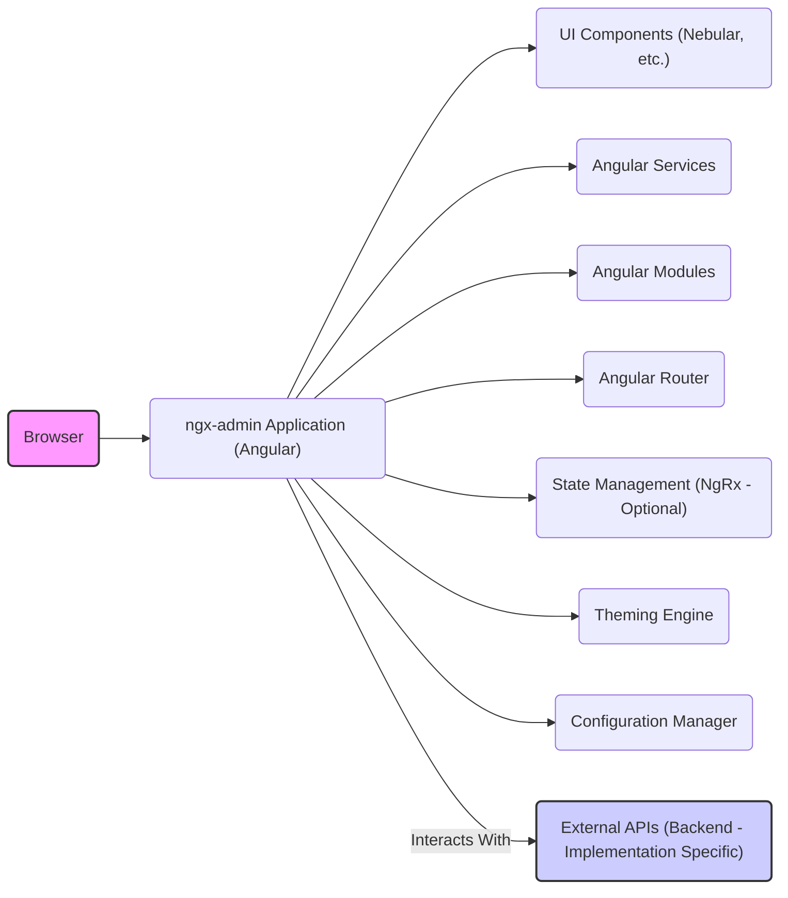
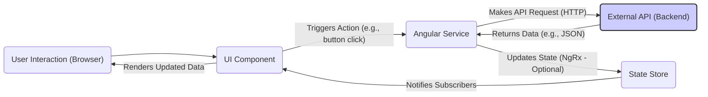

## Project Design Document: ngx-admin (Improved)

**1. Introduction**

This document provides an enhanced architectural overview of the `ngx-admin` project, an open-source Angular admin dashboard template. This document is specifically designed to serve as a robust foundation for subsequent threat modeling activities. It meticulously outlines the system's components, data flow, key interactions, and security considerations relevant to the template itself. It's crucial to understand that this document focuses on the `ngx-admin` *template* and not on any specific backend implementation that a developer might integrate with it.

**2. Goals and Objectives**

The primary goal of `ngx-admin` is to offer developers a versatile and customizable starting point for building admin user interfaces. Key objectives include:

*   Providing a comprehensive set of pre-built and reusable UI components and layouts.
*   Establishing a modular and easily extensible architecture based on Angular best practices.
*   Serving as a practical demonstration of effective Angular development patterns.
*   Accelerating the development process for admin dashboard applications.
*   Offering extensive theming and customization capabilities to match branding requirements.

**3. System Architecture**

`ngx-admin` is fundamentally a client-side application constructed using the Angular framework. It's important to reiterate that it does not inherently include any backend functionality. The template is architected to facilitate seamless integration with diverse backend services through well-defined APIs.

**3.1. High-Level Architecture**

*   **Browser:** The end-user's web browser, responsible for rendering and executing the `ngx-admin` application's code.
*   **ngx-admin Application (Angular):** The core of the template, built upon the Angular framework. It encompasses various modules, components, services, and configuration settings.
*   **UI Components (Nebular, etc.):**  Reusable UI elements like buttons, forms, tables, and charts, primarily sourced from libraries like Nebular and potentially other third-party component libraries.
*   **Angular Services:**  Angular services encapsulate business logic, handle data interactions (typically with external APIs), and manage application state.
*   **Angular Modules:**  Logical groupings of related components, services, and other Angular artifacts, providing structure and maintainability to the application. Examples include feature modules (e.g., dashboard, users) and shared modules.
*   **Angular Router:**  Manages navigation within the application, mapping URLs to specific components and views, enabling a single-page application experience.
*   **State Management (NgRx - Optional):**  A library (NgRx is a common choice) used for managing the application's state in a predictable and centralized manner, facilitating complex data flows and component communication. Its use is optional but often present in `ngx-admin` implementations.
*   **Theming Engine:**  Provides the functionality to customize the visual appearance of the application, including colors, typography, and layout styles.
*   **Configuration Manager:**  Handles application-wide settings and parameters, such as API base URLs and other environment-specific configurations.
*   **External APIs (Backend - Implementation Specific):**  The backend services that the `ngx-admin` application communicates with to fetch and persist data. This is *not* part of the `ngx-admin` template itself and is the responsibility of the developer integrating the template.

**3.2. Component-Level Architecture**

The `ngx-admin` template is organized into several key modules and components, providing a structured approach to building admin interfaces:

*   **Core Module:** Contains essential singleton services, interceptors, and application-wide configurations that are loaded once at application startup.
*   **Theme Module:**  Manages the application's visual theme, layout structure (e.g., sidebars, headers), and related styling configurations.
*   **Auth Module (Example/Placeholder):** Often includes basic authentication UI elements and service stubs. This is typically a starting point and requires significant customization and integration with a real backend authentication system.
*   **Dashboard Module:**  Houses components and services related to the main dashboard view, often displaying key metrics and visualizations.
*   **UI Features Module:**  Serves as a showcase of the various UI components available within the template, demonstrating their usage and customization options.
*   **Forms Module:**  Provides examples and pre-built components for handling user input through forms, including validation and data submission patterns.
*   **Tables Module:**  Demonstrates different approaches to displaying and interacting with tabular data, often integrating with data grid libraries.
*   **Charts Module:**  Integrates charting libraries (e.g., Chart.js, ECharts) to visualize data in various graphical formats.
*   **E-commerce Module (Example):**  A sample module illustrating a potential application of `ngx-admin` in an e-commerce context, providing example components and data structures.
*   **Miscellaneous Modules:**  May include utility modules, shared components, or feature-specific modules depending on the specific implementation.

**3.3. Data Flow**

The data flow within `ngx-admin` primarily involves user interactions triggering actions that lead to data being fetched from or sent to external APIs. State management (if implemented) plays a crucial role in managing data within the application.

*   **User Interaction (Browser):** The user interacts with the application through the browser's interface (e.g., clicking a button, filling out a form).
*   **UI Component:** The specific Angular component that handles the user interaction and initiates the subsequent data flow.
*   **Angular Service:** The component often delegates the task of data fetching or manipulation to a dedicated Angular service.
*   **External API (Backend):** The service makes an HTTP request (e.g., GET, POST, PUT, DELETE) to an external API endpoint provided by the backend system.
*   **State Store (NgRx - Optional):** If NgRx is used, the service updates the application's state within the central state store based on the data received from the API.
*   **State Notification:** Components that are subscribed to specific parts of the state are notified of the changes.
*   **Data Rendering:** The UI component re-renders its view to reflect the updated data, providing feedback to the user.

**4. Security Considerations (Pre-Threat Model)**

While `ngx-admin` is a frontend template, several security considerations are paramount, especially when integrating it with a backend system:

*   **Client-Side Security:**
    *   **Cross-Site Scripting (XSS):**  Vulnerabilities in UI components or custom code could allow attackers to inject malicious scripts, potentially compromising user data or actions. Proper input sanitization and output encoding are crucial to mitigate this risk.
    *   **Dependency Vulnerabilities:**  The project relies on numerous third-party libraries (e.g., Angular, Nebular, various npm packages). Outdated or vulnerable dependencies can introduce security risks. Regularly updating dependencies and using vulnerability scanning tools is essential.
    *   **Sensitive Data Handling in the Browser:**  Avoid storing sensitive information directly in the browser's local storage or session storage if possible. If necessary, ensure proper encryption and understand the associated risks.
    *   **Source Code Exposure:** As a client-side application, the source code is inherently exposed. Avoid embedding sensitive secrets or API keys directly within the client-side code.
*   **Build Process Security:**
    *   **Supply Chain Attacks:**  Ensure the integrity of the build process and the sources of dependencies to prevent the introduction of malicious code during the build.
*   **Integration with Backend (Critical Security Boundary):**
    *   The security of the overall application heavily relies on the security of the backend APIs that `ngx-admin` interacts with. This includes robust authentication, authorization, input validation, and protection against common web application vulnerabilities (e.g., SQL injection, CSRF).
    *   **Cross-Origin Resource Sharing (CORS):**  Properly configure CORS on the backend to restrict which origins can access the APIs, preventing unauthorized access from malicious websites.
    *   **Authentication and Authorization Implementation:** The `ngx-admin` template often provides basic authentication examples, but developers *must* replace these with secure and robust authentication mechanisms integrated with their backend (e.g., OAuth 2.0, OpenID Connect). Implement proper authorization logic to control user access to different parts of the application and data based on their roles and permissions.
*   **Third-Party Libraries:**
    *   Carefully evaluate the security posture of any third-party libraries used in the project. Regularly check for known vulnerabilities and keep libraries updated.

**5. Deployment Considerations**

`ngx-admin` applications are typically deployed as static websites, often utilizing services designed for hosting single-page applications:

*   **Netlify:** A popular platform for deploying and hosting static websites and web applications.
*   **Vercel:** Another widely used platform offering similar capabilities for frontend deployments.
*   **AWS S3 with CloudFront:**  Leveraging Amazon's Simple Storage Service (S3) for storage and CloudFront for content delivery network (CDN) capabilities.
*   **Google Cloud Storage with Cloud CDN:**  Similar to AWS, utilizing Google's cloud storage and CDN services.
*   **Azure Blob Storage with Azure CDN:** Microsoft's equivalent services for static website hosting and content delivery.

Deployment involves building the Angular application (generating static HTML, CSS, and JavaScript files) and uploading these files to the chosen hosting platform.

**6. Technologies Used**

*   **Angular:** The primary frontend framework for building the user interface.
*   **TypeScript:** The statically typed superset of JavaScript used for Angular development.
*   **HTML:**  The markup language for structuring the user interface content.
*   **CSS/SCSS:**  For styling the application's visual presentation. SCSS (Sassy CSS) is often used for its enhanced features and organization.
*   **Nebular:** A comprehensive UI component library specifically designed for Angular applications, providing a rich set of pre-built components.
*   **NgRx (Optional):** A reactive state management library for Angular, based on the Redux pattern.
*   **RxJS:**  A library for reactive programming in JavaScript, heavily used within Angular for handling asynchronous operations.
*   **Node.js and npm/yarn:**  Used for managing project dependencies, running build scripts, and development tooling.
*   **Various other third-party libraries:**  May include libraries for charting (e.g., Chart.js, ECharts), icons (e.g., Font Awesome), and other specific functionalities.

**7. Future Considerations**

*   **Regular Security Audits and Penetration Testing:**  Conducting periodic security assessments by qualified professionals is crucial to identify and address potential vulnerabilities proactively.
*   **Automated Dependency Scanning:**  Implementing automated tools to scan project dependencies for known vulnerabilities as part of the CI/CD pipeline.
*   **Enhanced Security Documentation and Best Practices:**  Providing more detailed guidance and best practices for developers on securing `ngx-admin` implementations, particularly regarding backend integration.
*   **Integration with Security Information and Event Management (SIEM) Systems:**  For larger deployments, consider how the frontend application can contribute to overall security monitoring and logging.

This improved design document provides a more detailed and security-focused overview of the `ngx-admin` project's architecture. It emphasizes the separation between the frontend template and the backend implementation, highlighting the critical security considerations at the integration point. This document serves as a valuable resource for conducting thorough threat modeling and designing secure applications based on the `ngx-admin` template.