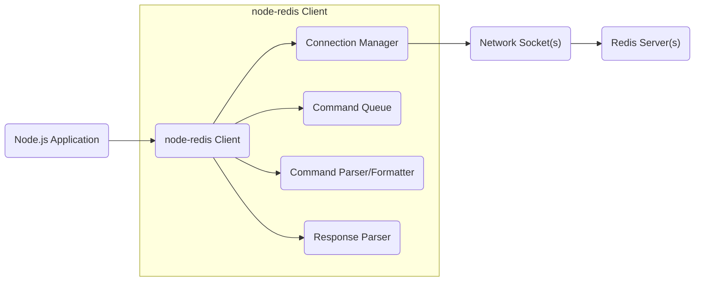
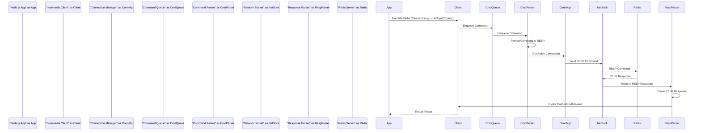

## Project Design Document: node-redis Client Library

**Version:** 1.1
**Date:** October 26, 2023
**Author:** AI Software Architect

### 1. Introduction

This document provides a detailed design overview of the `node-redis` client library, a popular and widely used asynchronous Node.js client for interacting with Redis servers. This document aims to clearly articulate the architecture, key components, and data flow of the library, serving as a foundational resource for subsequent threat modeling activities and general understanding of the system.

### 2. Goals

*   Provide a comprehensive and detailed architectural overview of the `node-redis` library.
*   Clearly identify and describe the responsibilities and interactions of key components within the library.
*   Illustrate the complete data flow within the library and between the client and the Redis server.
*   Proactively highlight potential security considerations arising from the design and its interactions.
*   Serve as a definitive reference for conducting thorough threat modeling exercises and security assessments.

### 3. Scope

This document covers the core functionalities and architectural elements of the `node-redis` library, including:

*   Management of connections to single Redis instances, Redis Sentinel setups, and Redis Cluster deployments.
*   Execution of a wide range of Redis commands and handling their respective responses.
*   Implementation of Pub/Sub messaging patterns for real-time data streaming.
*   Support for Redis scripting using the EVAL command.
*   Mechanisms for robust error handling, including connection errors and command execution failures, and reconnection strategies.
*   Basic authentication procedures for securing access to Redis servers.
*   Implementation of TLS/SSL encryption for establishing secure and confidential connections.
*   Support for monitoring and introspection of the Redis connection state.

This document does not cover:

*   Specific implementation details of application logic that utilizes the `node-redis` library.
*   Internal operational details and implementation specifics of the Redis server itself.
*   In-depth performance benchmarking and optimization strategies for `node-redis`.

### 4. High-Level Architecture

The `node-redis` library acts as a crucial intermediary, facilitating communication between a Node.js application and one or more Redis servers. It abstracts away the complexities of establishing and managing connections, formatting commands according to the Redis protocol (RESP), transmitting these commands, and parsing the responses received from the server.

**Components:**

*   **"Node.js Application":** The application code written in Node.js that leverages the `node-redis` library to interact with the underlying Redis data store.
*   **"node-redis Client":** The primary interface and central orchestrator of the library's functionalities. It exposes methods for executing Redis commands and managing the connection lifecycle.
*   **"Connection Manager":**  The component responsible for establishing, maintaining, and managing connections to the Redis server(s). This includes connection pooling, handling reconnection attempts, negotiating TLS/SSL, and managing authentication credentials.
*   **"Command Queue":**  A queue that stores commands received from the application, ensuring they are processed and sent to the Redis server in the correct order, especially important for asynchronous operations and pipelining.
*   **"Command Parser/Formatter":**  This component takes the JavaScript representation of Redis commands and their arguments and encodes them into the Redis Serialization Protocol (RESP) format, which is the standard communication protocol for Redis.
*   **"Response Parser":**  Responsible for receiving the raw byte stream from the network socket and decoding the RESP formatted responses sent back by the Redis server into usable JavaScript data types.
*   **"Network Socket(s)":** The underlying TCP or TLS/SSL sockets that provide the communication channel for sending commands to and receiving responses from the Redis server(s).
*   **"Redis Server(s)":** The backend in-memory data store that receives, processes, and responds to commands sent by the `node-redis` client.

### 5. Component Details

#### 5.1. Connection Manager

*   **Responsibilities:**
    *   Establishing new connections to Redis servers based on provided configuration parameters (host, port, password, TLS/SSL options, Sentinel/Cluster configurations).
    *   Maintaining a pool of active and ready connections to optimize command execution performance and resource utilization.
    *   Implementing robust reconnection strategies, including backoff algorithms and retry mechanisms, to handle transient network issues or server unavailability.
    *   Handling the authentication handshake with the Redis server, securely transmitting credentials if required.
    *   Managing the TLS/SSL handshake process, ensuring secure and encrypted communication channels when configured.
    *   Supporting various connection topologies, including connections to single Redis instances, Redis Sentinel for high availability, and Redis Cluster for scalability and data sharding.
*   **Key Features:**
    *   Configurable connection pooling with options to set minimum and maximum connection limits.
    *   Automatic reconnection attempts with customizable delay and exponential backoff strategies.
    *   Support for password-based authentication as well as more advanced authentication methods if supported by the Redis server.
    *   Comprehensive configuration options for TLS/SSL, including specifying certificates, private keys, and enabling/disabling certificate verification.
    *   Emits events to notify the application about connection status changes, such as successful connection, disconnection, and connection errors.

#### 5.2. Command Queue

*   **Responsibilities:**
    *   Temporarily storing Redis commands received from the application before they are dispatched to the Redis server.
    *   Maintaining the order of command execution, ensuring commands are sent in the sequence they were received, crucial for maintaining data consistency.
    *   Facilitating command pipelining, allowing multiple commands to be grouped and sent to the server in a single network request, reducing latency.
    *   Potentially implementing mechanisms for command prioritization or cancellation, although this is less common in standard usage scenarios.
*   **Key Features:**
    *   Implements a FIFO (First-In, First-Out) queue to guarantee sequential processing of commands.
    *   Provides support for pipelining, significantly improving performance for batch operations.
    *   Associates callback functions with each queued command, ensuring the correct response is delivered to the originating request.

#### 5.3. Command Parser/Formatter

*   **Responsibilities:**
    *   Taking the high-level JavaScript function calls representing Redis commands (e.g., `client.get('key')`, `client.set('key', 'value')`) and translating them into the low-level RESP format.
    *   Properly encoding different data types (strings, numbers, buffers) into the appropriate RESP representations.
    *   Ensuring that commands are formatted strictly according to the Redis protocol specification to ensure successful parsing by the server.
*   **Key Features:**
    *   Implements the complete set of RESP encoding rules, covering various data types and command structures.
    *   Supports a wide range of Redis command arguments and options, ensuring flexibility in interacting with the server.
    *   Performs efficient conversion of JavaScript data structures into the corresponding RESP byte sequences.

#### 5.4. Response Parser

*   **Responsibilities:**
    *   Receiving the raw byte stream of data transmitted from the Redis server over the network socket.
    *   Parsing the incoming data stream according to the RESP format to reconstruct the server's response.
    *   Converting the RESP formatted response back into native JavaScript data types (strings, numbers, arrays, objects, booleans).
    *   Invoking the appropriate callback function that was originally associated with the executed command, delivering the parsed response.
    *   Handling different types of RESP responses, including simple strings, errors, integers, bulk strings, and arrays.
*   **Key Features:**
    *   Implements the complete set of RESP decoding rules, handling various response types.
    *   Includes robust error handling to manage invalid or unexpected responses from the Redis server.
    *   Maps RESP error codes to corresponding JavaScript error objects, providing meaningful error information to the application.

### 6. Data Flow

The typical data flow for executing a Redis command using the `node-redis` library involves a series of well-defined steps:

**Detailed Steps:**

1. The **"Node.js App"** initiates a Redis operation by calling a method on the **"node-redis Client"** object, specifying the command and its arguments (e.g., `client.get('mykey')`).
2. The **"node-redis Client"** receives the command and enqueues it in the **"Command Queue"**.
3. The **"Command Queue"** dequeues the command, making it ready for processing.
4. The **"Command Parser"** takes the dequeued command and formats it into the Redis Serialization Protocol (RESP) format, preparing it for network transmission.
5. The **"Command Parser"** requests an active connection from the **"Connection Manager"**.
6. The **"Connection Manager"** provides an available **"Network Socket"** connection to the Redis server.
7. The formatted RESP command is sent over the **"Network Socket"** to the **"Redis Server"**.
8. The **"Redis Server"** processes the received command and generates a RESP formatted response.
9. The **"Redis Server"** sends the RESP response back over the **"Network Socket"**.
10. The **"Response Parser"** receives the raw RESP response from the **"Network Socket"**.
11. The **"Response Parser"** parses the RESP response, converting it back into JavaScript data types.
12. The **"Response Parser"** invokes the callback function associated with the original command on the **"node-redis Client"**, passing the parsed result.
13. The **"node-redis Client"** returns the result to the originating **"Node.js App"**.

### 7. Security Considerations

Based on the design and functionality of the `node-redis` library, several potential security considerations need to be addressed:

*   **Connection Security (Confidentiality and Integrity):**
    *   Failure to enable TLS/SSL encryption exposes sensitive data transmitted between the client and the Redis server to potential eavesdropping and tampering by malicious actors.
    *   Improperly configured TLS/SSL settings, such as using outdated protocols or weak ciphers, can create vulnerabilities and weaken the encryption.
*   **Authentication (Authorization):**
    *   Using weak or default passwords for Redis authentication makes the server susceptible to unauthorized access and data breaches.
    *   Storing Redis authentication credentials insecurely within the application's configuration or codebase increases the risk of compromise.
*   **Command Injection Vulnerabilities:**
    *   If user-supplied data is directly incorporated into Redis commands without proper sanitization and validation, it can lead to command injection attacks on the Redis server, allowing attackers to execute arbitrary commands. (Note: While `node-redis` facilitates command execution, the responsibility for preventing command injection primarily lies with the application logic using the library).
*   **Denial of Service (DoS) Attacks:**
    *   Malicious actors could potentially overload the Redis server by sending a large volume of requests or executing computationally intensive commands. While `node-redis` itself doesn't initiate such attacks, it provides the means for them to occur.
    *   Improperly configured connection pools or insufficient connection limits could lead to resource exhaustion and denial of service if the Redis server becomes unresponsive or overloaded.
*   **Dependency Vulnerabilities:**
    *   Security vulnerabilities present in the `node-redis` library itself or its underlying dependencies could be exploited by attackers to compromise the application or the Redis server. Regular updates and security audits are crucial.
*   **Replay Attacks:**
    *   Without proper encryption and mechanisms to prevent replay attacks (e.g., nonces, timestamps), attackers could intercept network traffic and replay valid commands to perform unauthorized actions.
*   **Man-in-the-Middle (MitM) Attacks:**
    *   In the absence of TLS/SSL encryption, attackers positioned between the client and the server can intercept, inspect, and potentially modify communication, compromising data confidentiality and integrity.

### 8. Deployment Considerations

The security posture of applications utilizing the `node-redis` client is significantly influenced by the deployment environment and configuration:

*   **Network Security:** Ensuring that communication between the Node.js application and the Redis server occurs over a trusted and secured network infrastructure is paramount. Network segmentation and firewall rules can help restrict access.
*   **Containerization Security:** When deploying the application and Redis server in containers, adhering to secure containerization best practices is essential. This includes using minimal base images, implementing proper resource limits, and regularly scanning for vulnerabilities.
*   **Cloud Environment Security:** Leveraging cloud-specific security features provided by platforms like AWS, Azure, or GCP, such as Virtual Private Clouds (VPCs), security groups, and IAM roles, can significantly enhance the security of the deployment.
*   **Access Control and Least Privilege:** Implementing strict access control policies and adhering to the principle of least privilege for both the application and the Redis server is crucial to limit the potential impact of a security breach.

### 9. Assumptions and Constraints

*   It is assumed that the `node-redis` library is the primary method of communication between the Node.js application and the Redis server.
*   The application utilizing `node-redis` is responsible for implementing proper input validation and sanitization techniques to prevent command injection vulnerabilities.
*   The Redis server is assumed to be configured with appropriate security measures in place, such as requiring authentication, implementing network access controls, and keeping the server software up-to-date.

### 10. Future Considerations

*   Exploring integration with more advanced authentication and authorization mechanisms offered by Redis, such as Access Control Lists (ACLs).
*   Further enhancements to connection management capabilities to improve resilience and fault tolerance in high-availability deployments.
*   Improvements to error handling and logging mechanisms to facilitate better debugging, security monitoring, and incident response.

This revised design document provides a more detailed and comprehensive overview of the `node-redis` client library's architecture, components, and data flow. This enhanced information will be invaluable for conducting thorough threat modeling exercises, identifying potential security vulnerabilities, and implementing appropriate security mitigations.