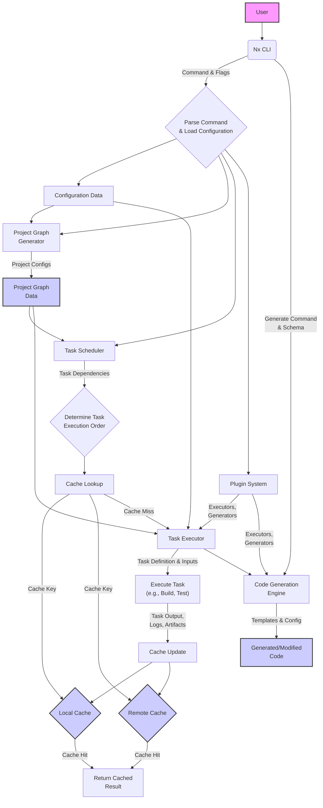

# Project Design Document: Nx Build System

**Version:** 1.1
**Date:** October 26, 2023
**Author:** Gemini (AI Language Model)

## 1. Introduction

This document provides a detailed architectural design of the Nx build system, focusing on aspects relevant to security considerations and threat modeling. It outlines the key components, their interactions, data flows, and potential security vulnerabilities. This document serves as a foundation for subsequent threat modeling activities, enabling a comprehensive understanding of potential security weaknesses and attack surfaces.

## 2. Goals

*   Provide a comprehensive and detailed architectural overview of the Nx build system.
*   Clearly define the responsibilities and interactions of key components, emphasizing security-relevant aspects.
*   Illustrate the data flow within the system, highlighting potential points of data manipulation or interception.
*   Serve as a robust foundation for identifying potential security threats, vulnerabilities, and attack vectors during threat modeling.

## 3. Scope

This document focuses on the core functionalities of the Nx build system, including:

*   Dynamic project graph creation and management.
*   Intelligent task scheduling and distributed execution capabilities.
*   Sophisticated caching mechanisms for task results, including local and remote options.
*   Extensible code generation and scaffolding features.
*   The plugin system and its impact on core functionalities.
*   Configuration management and resolution.

This document does not cover:

*   In-depth analysis of specific integrations with individual frontend frameworks (e.g., Angular, React), unless directly relevant to Nx's core functionality.
*   Low-level implementation details of individual components' internal logic.
*   User interface elements beyond the command-line interface (CLI) and their direct interaction with the core system.

## 4. Architectural Overview

Nx is a smart and extensible build system designed to manage and optimize development within monorepos. It achieves this by constructing a detailed understanding of project dependencies and task relationships, enabling efficient task scheduling, caching, and code generation. The system's architecture is modular, relying on a plugin system for extensibility and adaptability to various project types and workflows. Security is a key consideration, especially given its role in the software development lifecycle.

## 5. Key Components

*   **Nx CLI ("Command Line Interface"):**
    *   The primary entry point for user interaction with Nx.
    *   Responsible for parsing user commands, validating input, and orchestrating actions across other components.
    *   Handles authentication and authorization for certain operations (e.g., accessing remote cache).
    *   Relies on underlying operating system commands and file system access.
*   **Project Graph Generator:**
    *   Analyzes project configurations (e.g., `package.json`, `tsconfig.json`, project-specific configuration files) to dynamically construct a dependency graph of projects within the monorepo.
    *   Identifies explicit and implicit dependencies between projects.
    *   Sensitive to changes in configuration files, triggering graph regeneration.
    *   The generated graph is a critical piece of data used for task scheduling and impact analysis.
*   **Task Runner ("Task Execution Engine"):**
    *   Responsible for orchestrating the execution of tasks (e.g., build, test, lint) for specific projects.
    *   Utilizes the Project Graph to determine the correct and optimized order of task execution, considering dependencies.
    *   Supports parallel task execution, potentially across multiple machines in a distributed setup.
    *   Delegates actual task execution to configured executors (defined in project configurations or plugins).
    *   Manages task inputs and outputs for caching purposes.
*   **Cache ("Task Result Caching Mechanism"):**
    *   Stores the results (outputs, logs, artifacts) of previously executed tasks.
    *   Keyed by a hash of task inputs (including code, configuration, and dependencies) to ensure correctness.
    *   Supports both local (file system) and remote (e.g., cloud storage, shared network drives) caching.
    *   Remote cache access requires authentication and authorization.
    *   Handles cache invalidation based on changes to task inputs.
*   **Code Generation Engine ("Code Scaffolding and Generation"):**
    *   Provides capabilities for generating boilerplate code, libraries, applications, and other project artifacts.
    *   Operates based on schematics or generators defined by Nx plugins or custom configurations.
    *   Modifies files within the workspace, potentially introducing new code or altering existing code.
    *   Relies on templates and configuration to generate code.
*   **Plugin System ("Extensibility Framework"):**
    *   Allows extending Nx's core functionality with custom executors, generators, project graph processors, and more.
    *   Plugins can be developed internally or installed from external sources (e.g., npm).
    *   Executors define how specific tasks (e.g., `build`, `test`) are executed.
    *   Plugins have access to Nx's internal APIs and can significantly alter its behavior.
    *   Plugin installation and management introduce supply chain security considerations.
*   **Configuration Files ("Workspace and Project Configuration"):**
    *   Various JSON-based configuration files define the behavior of Nx and projects within the workspace.
    *   Examples include:
        *   `nx.json`: Global Nx configuration, including task pipeline configuration, cache settings, and plugin registrations.
        *   `workspace.json` (or `angular.json`): Defines projects, targets (tasks), executors, and configurations for each project.
        *   Project-specific configuration files (e.g., `tsconfig.json`, `.eslintrc.js`, Jest configuration).
    *   These files are crucial for defining how Nx operates and are potential targets for malicious modification.

## 6. Data Flow

**Detailed Data Flow Description:**

*   A **User** initiates an action by providing a **Command & Flags** to the **Nx CLI**.
*   The **Nx CLI** parses the command, loads relevant **Configuration Data**, and prepares for execution.
*   The **Project Graph Generator** analyzes **Project Configs** to produce the **Project Graph Data**, representing project dependencies.
*   The **Task Scheduler** utilizes the **Project Graph Data** to determine the optimal **Task Execution Order** based on **Task Dependencies**.
*   Before executing a task, a **Cache Lookup** is performed using a generated **Cache Key**.
*   The lookup checks both **Local Cache** and **Remote Cache**.
    *   If a **Cache Hit** occurs in either cache, the **Return Cached Result** is used, skipping task execution.
    *   If a **Cache Miss** occurs, the **Task Executor** is invoked.
*   The **Task Executor** receives the **Task Definition & Inputs** and proceeds to **Execute Task** (e.g., build, test).
*   The executed task produces **Task Output, Logs, Artifacts**.
*   The **Cache Update** mechanism stores these results in both **Local Cache** and **Remote Cache**.
*   The **Code Generation Engine** can be invoked by the CLI with a **Generate Command & Schema**.
*   The engine uses **Templates & Config** to produce **Generated/Modified Code**.
*   The **Plugin System** provides **Executors, Generators** that are used by the **Task Executor** and **Code Generation Engine**.

## 7. Security Considerations (Detailed for Threat Modeling)

*   **Dependency Management & Supply Chain Security:**
    *   **Threat:** Vulnerabilities in Nx's own dependencies or project dependencies could be exploited. Malicious plugins or dependencies could be introduced, leading to code execution or data breaches.
    *   **Attack Vectors:** Compromised npm packages, dependency confusion attacks, typosquatting.
    *   **Mitigation Considerations:** Employ dependency scanning tools, verify package integrity, use private registries for internal plugins, enforce strict dependency versioning.
*   **Code Execution & Plugin Security:**
    *   **Threat:** Nx executes arbitrary code defined in project configurations and within plugins. Malicious or compromised plugins could execute harmful commands on the developer's machine or in the CI/CD environment.
    *   **Attack Vectors:** Exploiting vulnerabilities in plugin code, social engineering to install malicious plugins, compromised plugin repositories.
    *   **Mitigation Considerations:** Implement a plugin review process, enforce code signing for plugins, restrict plugin capabilities, use sandboxing or containerization for task execution.
*   **Caching Mechanism Vulnerabilities:**
    *   **Threat:** Cache poisoning could allow an attacker to inject malicious artifacts or manipulate build outputs by compromising the cache. Unauthorized access to the remote cache could expose sensitive build artifacts.
    *   **Attack Vectors:** Exploiting weaknesses in cache key generation, compromising remote cache storage credentials, man-in-the-middle attacks on cache communication.
    *   **Mitigation Considerations:** Secure remote cache storage with strong authentication and authorization, use content-addressable storage for cache entries, implement integrity checks for cached data, use HTTPS for cache communication.
*   **Project Graph Manipulation Risks:**
    *   **Threat:** If an attacker can influence the project graph (e.g., by modifying configuration files), they might be able to manipulate task execution order, skip security checks, or introduce malicious dependencies.
    *   **Attack Vectors:** Unauthorized modification of configuration files, exploiting vulnerabilities in the graph generation process.
    *   **Mitigation Considerations:** Implement strict access control on configuration files, use version control with code review for changes, monitor for unexpected changes to the project graph.
*   **Code Generation Security Flaws:**
    *   **Threat:** Security flaws in code generators (either built-in or within plugins) could introduce vulnerabilities into the generated code, leading to exploitable weaknesses in the final application.
    *   **Attack Vectors:** Exploiting vulnerabilities in generator logic, using malicious templates, injecting insecure code snippets.
    *   **Mitigation Considerations:** Secure code review of generators, input validation within generators, use secure coding practices in template development.
*   **Command Injection Vulnerabilities:**
    *   **Threat:** If user input or configuration values are not properly sanitized, there's a risk of command injection through the CLI or when executing tasks.
    *   **Attack Vectors:** Passing malicious arguments to Nx commands, injecting malicious code into configuration files.
    *   **Mitigation Considerations:** Thorough input validation and sanitization, avoid direct execution of shell commands with user-provided input, use parameterized commands where possible.
*   **Access Control and Authorization:**
    *   **Threat:** Insufficient access controls could allow unauthorized users to execute sensitive Nx commands, modify configurations, or access the remote cache.
    *   **Attack Vectors:** Weak authentication mechanisms, lack of role-based access control.
    *   **Mitigation Considerations:** Implement strong authentication for remote cache access, enforce authorization checks for sensitive commands, follow the principle of least privilege.

## 8. Deployment

Nx is primarily deployed as a development dependency within a project's repository and is utilized in various environments:

*   **Local Development Environments:** Developers install Nx as a dev dependency using package managers. Security considerations include protecting developer machines from malicious plugins or commands.
*   **Continuous Integration/Continuous Deployment (CI/CD) Pipelines:** Nx commands are integrated into CI/CD pipelines for automated builds, tests, and deployments. Security is paramount here, as compromised pipelines can lead to supply chain attacks. Secrets management for remote cache access is crucial.
*   **Developer Collaboration Platforms:** When teams collaborate, consistent and secure Nx configurations are important. Sharing of cached artifacts (if using a remote cache) needs to be secured.

## 9. Technologies Used

*   **Node.js:** The runtime environment for Nx, requiring attention to Node.js security best practices.
*   **npm/yarn/pnpm:** Package managers, which themselves have security considerations regarding package integrity and supply chain.
*   **TypeScript:** The primary language for Nx development, requiring secure coding practices.
*   **JSON:** Used for configuration files, which need to be parsed securely to avoid injection vulnerabilities.

## 10. Dependencies

*   Numerous npm packages for core functionalities and integrations. These dependencies represent a significant attack surface and require careful monitoring for vulnerabilities.
    *   **Direct Dependencies of Nx:**  These are critical and require thorough security vetting.
    *   **Transitive Dependencies:**  Vulnerabilities can be introduced through dependencies of dependencies.
    *   **Plugin Dependencies:**  Plugins introduce their own set of dependencies, expanding the attack surface.
*   Potentially framework-specific CLI tools (e.g., Angular CLI, React Scripts), which also have their own security considerations.

## 11. Future Considerations

*   **Enhanced Plugin Security and Verification:** Implementing stricter plugin verification processes, including code signing and security audits.
*   **Granular Access Control for Nx Features:** Introducing more fine-grained permissions for executing specific Nx commands and accessing resources.
*   **Built-in Secrets Management Integration:** Providing secure mechanisms for managing secrets used by Nx and its plugins (e.g., for remote cache access).
*   **Improved Monitoring and Auditing:** Enhancing logging and auditing capabilities to track Nx actions and detect suspicious activity.
*   **Integration with Security Scanning Tools:** Facilitating integration with static and dynamic analysis tools to identify vulnerabilities in project code and Nx configurations.

This improved design document provides a more detailed and security-focused overview of the Nx build system, serving as a more robust foundation for subsequent threat modeling activities.