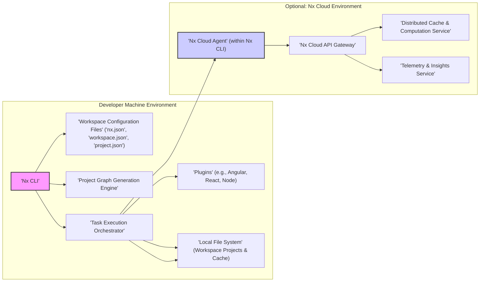
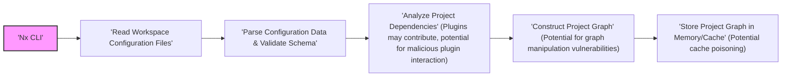
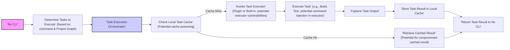
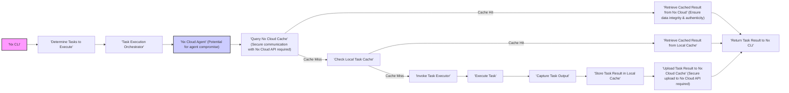

# Project Design Document: Nx Monorepo Tool for Threat Modeling (Improved)

## 1. Project Overview

*   **Project Name:** Nx Monorepo Tool
*   **Project Repository:** [https://github.com/nrwl/nx](https://github.com/nrwl/nx)
*   **Project Description:** Nx is an intelligent and extensible build system designed to streamline the development, testing, and deployment of applications within monorepos. It integrates seamlessly with modern front-end and back-end technologies, offering features like dependency visualization, optimized build processes, code generation, and task orchestration. Nx is particularly valuable for large, complex projects and organizations adopting a monorepo strategy.
*   **Purpose of this Document:** This document provides a detailed architectural blueprint of Nx, specifically tailored for threat modeling activities. It dissects the system into key components, elucidates data flow pathways, and highlights potential security considerations. The ultimate goal is to equip security professionals and developers with the necessary information to proactively identify, analyze, and mitigate potential security vulnerabilities inherent in Nx-based projects. This document will serve as the foundation for subsequent threat modeling exercises.

## 2. System Architecture Overview

The core of Nx architecture revolves around a command-line interface (CLI) that serves as the primary interaction point for developers. Nx operates within the context of a workspace, which is a directory containing multiple projects managed as a single unit. A central concept in Nx is the Project Graph, which dynamically represents the dependencies between projects within the workspace. This graph is crucial for optimizing build processes and understanding project relationships. Nx's functionality can be extended through a plugin system, allowing integration with diverse frameworks and tools. Optionally, Nx Cloud can be integrated to provide distributed caching and computation capabilities, especially beneficial in CI/CD pipelines.

Here's a refined high-level architectural diagram:

**Refined Key Architectural Components:**

*   **Nx CLI ('Nx CLI'):** The command-line interface is the user's gateway to Nx functionalities. It handles command parsing, workspace configuration loading, project graph creation, task orchestration, plugin management, and optional Nx Cloud interaction.
*   **Workspace Configuration Files ('Workspace Configuration Files'):** These JSON files (`nx.json`, `workspace.json`/`angular.json`, `project.json`) are the declarative heart of an Nx workspace. They define the monorepo structure, project settings, task configurations (build, test, lint, etc.), and Nx-specific behaviors.
*   **Project Graph Generation Engine ('Project Graph Generation Engine'):** This component is responsible for constructing and maintaining the dependency graph of projects within the workspace. It analyzes configuration files and, depending on plugins, may also inspect source code to accurately represent project interdependencies.
*   **Task Execution Orchestrator ('Task Execution Orchestrator'):** This engine manages the execution of tasks defined in project configurations. It leverages the Project Graph for dependency-aware task scheduling, parallelization, and caching (both local and distributed via Nx Cloud). It interacts with plugins to execute framework-specific tasks.
*   **Plugins ('Plugins'):** Plugins are modular extensions that augment Nx's capabilities. They provide support for specific frameworks (Angular, React, Node.js, etc.), integrate with external tools (linters, test runners), and offer custom executors and code generators.
*   **Nx Cloud Agent ('Nx Cloud Agent'):**  An optional component embedded within the Nx CLI that facilitates communication with Nx Cloud services. It handles authentication, cache interaction, and computation distribution (if enabled).
*   **Nx Cloud API Gateway ('Nx Cloud API Gateway'):** The entry point to Nx Cloud services, responsible for routing requests, authentication, and authorization.
*   **Distributed Cache & Computation Service ('Distributed Cache & Computation Service'):**  The core Nx Cloud service providing distributed caching of task outputs and, in enterprise versions, distributed task execution across multiple machines.
*   **Telemetry & Insights Service ('Telemetry & Insights Service'):** Nx Cloud component that collects and provides insights into build performance, task execution metrics, and workspace analysis.
*   **Local File System ('Local File System'):** The file system on the developer's machine or CI/CD environment where the Nx workspace, project source code, build artifacts, and local cache are stored.

## 3. Component Breakdown and Data Flow (Detailed)

### 3.1. Nx CLI ('Nx CLI')

*   **Detailed Functionality:**
    *   **Command Line Argument Parsing:** Robustly parses command-line arguments, options, and project names, ensuring correct interpretation of user commands.
    *   **Workspace Configuration Loading & Validation:** Loads and validates workspace configuration files (`nx.json`, `workspace.json`, `project.json`), checking for schema compliance and semantic correctness to prevent misconfigurations.
    *   **Project Graph Management:** Generates, updates, and caches the Project Graph. Provides commands to visualize and analyze the graph.
    *   **Task Scheduling & Orchestration:**  Creates task execution plans based on the Project Graph, task dependencies, and command parameters. Manages task parallelization and execution order.
    *   **Plugin Discovery & Loading:** Discovers and loads Nx plugins specified in `nx.json`, managing plugin lifecycle and interactions.
    *   **Nx Cloud Communication (via Nx Cloud Agent):** Establishes secure communication with Nx Cloud API for cache lookups, cache updates, computation distribution, and telemetry reporting. Handles authentication and authorization with Nx Cloud.
    *   **User Interface & Logging:** Provides a user-friendly command-line interface with informative output, progress indicators, and detailed logging for debugging and monitoring.

*   **Data Flow (Detailed Command Execution - e.g., `nx build my-app`):**
    1.  **Command Input:** User enters `nx build my-app` in the terminal.
    2.  **Command Parsing:** Nx CLI parses the command, identifying the target project (`my-app`) and task (`build`).
    3.  **Workspace Configuration Load:** Nx CLI reads and parses `nx.json`, `workspace.json`, and `project.json` files to understand workspace and project configurations.
    4.  **Project Graph Retrieval:** Nx CLI retrieves the cached Project Graph or regenerates it if necessary, ensuring an up-to-date dependency representation.
    5.  **Task Identification & Dependency Analysis:** Based on the command and Project Graph, Nx CLI identifies the 'build' task for 'my-app' and analyzes its dependencies.
    6.  **Task Execution Plan Generation:** Nx CLI creates a task execution plan, considering dependencies and potential parallelization opportunities.
    7.  **Task Orchestration via Task Execution Engine:** Nx CLI hands over the task execution plan to the Task Execution Orchestrator.
    8.  **Executor Invocation (Plugin Interaction):** The Task Execution Orchestrator invokes the appropriate executor for the 'build' task, potentially utilizing plugins (e.g., `@nx/angular` plugin for Angular projects).
    9.  **Task Execution & Output Handling:** The executor executes the build process. Nx CLI captures and displays task execution status, logs, and output to the terminal.
    10. **Result Handling & Caching:**  Task Execution Orchestrator handles task results, potentially storing them in the local cache and/or Nx Cloud cache (if configured).

### 3.2. Workspace Configuration Files ('Workspace Configuration Files')

*   **Types (Detailed):**
    *   `nx.json`:  Workspace-level Nx configuration.
        *   Defines task runner configuration (e.g., default task runner, task pipeline).
        *   Configures computation caching (local and Nx Cloud).
        *   Specifies plugin configurations and plugin paths.
        *   Sets workspace-wide code generation defaults.
        *   Manages Nx Cloud connection settings (if applicable).
    *   `workspace.json` (or `angular.json` for Angular workspaces): Workspace project definitions.
        *   Lists all projects within the workspace, mapping project names to their root directories.
        *   Defines project types (application, library).
        *   Sets default project configurations and schematics.
    *   `project.json`: Project-specific configuration.
        *   Defines project targets (tasks like 'build', 'test', 'lint', 'e2e') and their configurations.
        *   Specifies executors for each target (e.g., `@nx/webpack:webpack`, `@nx/jest:jest`).
        *   Configures executor options and parameters.
        *   Declares project dependencies (implicit and explicit).
        *   Defines tags and labels for project categorization.

*   **Functionality (Detailed):**
    *   **Workspace Structure Definition:**  Establishes the logical and physical structure of the monorepo, organizing projects and their relationships.
    *   **Project Configuration & Customization:** Allows fine-grained configuration of individual projects, tailoring build processes, testing strategies, and linting rules.
    *   **Task Definition & Execution Customization:** Enables developers to define custom tasks (targets) and specify how these tasks are executed using executors and options.
    *   **Dependency Management (Declarative):** Provides a declarative way to define dependencies between projects, enabling Nx to understand project relationships and optimize build processes.
    *   **Nx Feature Configuration:**  Configures core Nx features like task runners, caching, and plugin usage, allowing customization of Nx's behavior at the workspace and project levels.

*   **Data Flow (Detailed):**
    1.  **Configuration Read on Startup:** Nx CLI reads and parses these configuration files during workspace initialization and command execution.
    2.  **Project Graph Input:** Configuration data from these files is a primary input for the Project Graph Generation Engine to build the dependency graph.
    3.  **Task Execution Configuration:** The Task Execution Orchestrator reads task configurations from `project.json` to determine which executor to invoke and with what options.
    4.  **Plugin Configuration:** Plugins read configurations from `nx.json` and `project.json` to customize their behavior and integrate with the workspace.
    5.  **Settings for Nx Features:**  `nx.json` settings control the behavior of various Nx features, such as caching and task runners, influencing the overall system operation.

### 3.3. Project Graph ('Project Graph')

*   **Functionality (Detailed):**
    *   **Explicit & Implicit Dependency Modeling:** Represents both explicitly declared dependencies (in `project.json`) and implicitly inferred dependencies (e.g., imports in source code, based on plugin capabilities).
    *   **Directed Acyclic Graph (DAG) Representation:**  Stores project dependencies as a DAG, ensuring correct task execution order and preventing circular dependencies.
    *   **Affected Project Analysis:** Enables efficient identification of projects affected by code changes, crucial for incremental builds and targeted testing.
    *   **Visualization & Analysis Capabilities:**  Provides APIs and tools (Nx Devtools, CLI commands) to visualize and analyze the Project Graph, aiding in understanding workspace structure and dependencies.
    *   **Performance Optimization:**  The Project Graph is central to Nx's performance optimizations, enabling parallel task execution, efficient caching, and incremental builds.

*   **Data Flow (Detailed):**
    1.  **Generation from Configuration & Source Code:** The Project Graph Generation Engine constructs the graph by analyzing workspace configuration files and potentially scanning project source code (depending on plugins and configuration).
    2.  **Input to Task Execution Orchestrator:** The Task Execution Orchestrator heavily relies on the Project Graph to determine task dependencies, schedule task execution, and optimize build processes.
    3.  **Affected Project Determination:** Nx CLI uses the Project Graph to identify affected projects for commands like `nx affected`, enabling targeted actions.
    4.  **Visualization & Analysis by Tools:** Nx Devtools and CLI commands consume the Project Graph data to provide visualizations and analysis reports to developers.
    5.  **Caching & Persistence:** The Project Graph is typically cached to improve performance. It may be persisted to disk or memory for faster retrieval.

### 3.4. Task Execution Orchestrator ('Task Execution Orchestrator')

*   **Functionality (Detailed):**
    *   **Dependency-Aware Task Scheduling:** Schedules tasks based on the Project Graph, ensuring that dependent tasks are executed in the correct order.
    *   **Parallel Task Execution:** Maximizes build speed by executing independent tasks in parallel, leveraging available system resources.
    *   **Local & Distributed Caching Integration:** Seamlessly integrates with both local and Nx Cloud caches to avoid redundant task executions, significantly accelerating build times.
    *   **Executor Management & Invocation:** Manages executors defined in `project.json`, invoking them with the correct options and context. Handles both built-in executors and plugin-provided executors.
    *   **Task Status Tracking & Reporting:** Tracks the status of each task execution, providing real-time feedback and reporting task completion, failures, and caching information.
    *   **Error Handling & Task Retry Mechanisms:** Implements error handling for task failures and may include retry mechanisms for transient errors.

*   **Data Flow (Detailed):**
    1.  **Receives Task Execution Plan:** Receives a task execution plan from the Nx CLI, outlining the tasks to be executed and their dependencies.
    2.  **Cache Lookup (Local & Nx Cloud):** Before executing a task, it checks both the local cache and, if configured, the Nx Cloud cache for previously computed results.
    3.  **Executor Invocation:** If no cache hit is found, it invokes the appropriate executor (built-in or plugin-provided) based on the task configuration in `project.json`.
    4.  **Task Execution & Monitoring:** Monitors the execution of the task, capturing output and logging information.
    5.  **Result Caching (Local & Nx Cloud):** Upon successful task completion, it stores the task results in the local cache and, optionally, uploads them to the Nx Cloud cache.
    6.  **Result Delivery to Nx CLI:** Returns task execution results, status, and output back to the Nx CLI for display to the user.

### 3.5. Plugins ('Plugins')

*   **Functionality (Detailed):**
    *   **Framework-Specific Tooling:** Provide executors, generators, and schematics tailored for specific frameworks (Angular, React, Node.js, etc.), simplifying development workflows.
    *   **Tool Integration (Linters, Formatters, Test Runners):** Integrate with popular development tools, providing executors to run linters (ESLint), formatters (Prettier), test runners (Jest, Cypress), and more.
    *   **Custom Executor & Task Definition:** Allow developers to define custom executors and tasks to extend Nx's capabilities and adapt it to specific project needs.
    *   **Code Generation & Scaffolding:** Offer generators to automate the creation of projects, components, modules, and other code artifacts, promoting consistency and efficiency.
    *   **Workspace Modification Schematics:** Provide schematics to modify workspace configurations, project structures, and dependencies, enabling automated workspace updates and refactoring.

*   **Types of Plugins (Detailed):**
    *   **Official Nx Plugins (e.g., `@nx/angular`, `@nx/react`, `@nx/node`):** Developed and maintained by the Nx team, providing core framework support and high-quality integrations.
    *   **Community Plugins:** Developed and maintained by the Nx community, offering a wide range of integrations and extensions. Quality and security may vary.
    *   **Custom Plugins (Workspace Plugins):** Developed by users specifically for their workspace, allowing for highly tailored functionality. Security is the responsibility of the workspace developers.

*   **Data Flow (Detailed):**
    1.  **Plugin Discovery & Loading by Nx CLI:** Nx CLI discovers and loads plugins based on configurations in `nx.json` during startup.
    2.  **Executor & Generator Registration:** Plugins register their provided executors, generators, and schematics with Nx, making them available for use in workspace configurations and CLI commands.
    3.  **Executor Invocation by Task Execution Engine:** The Task Execution Orchestrator invokes plugin-provided executors when executing tasks defined in `project.json`.
    4.  **Generator & Schematic Invocation by Nx CLI:** Nx CLI uses plugin-provided generators and schematics when users execute code generation or workspace modification commands (e.g., `nx generate`).
    5.  **Configuration & Project Graph Interaction:** Plugins can interact with workspace configuration files and the Project Graph to customize their behavior and integrate deeply with the Nx ecosystem.

### 3.6. Nx Cloud (Optional) - Components and Data Flow

*   **Nx Cloud Agent ('Nx Cloud Agent'):**
    *   **Functionality:**
        *   **Authentication & Authorization:** Handles authentication with Nx Cloud API using API keys or other credentials.
        *   **Cache Query & Retrieval:** Queries the Nx Cloud Distributed Cache for task results and retrieves cached outputs.
        *   **Cache Upload:** Uploads task results to the Nx Cloud Distributed Cache.
        *   **Computation Distribution Request (Enterprise):** Initiates requests for computation distribution to Nx Cloud (Enterprise feature).
        *   **Telemetry Data Collection & Transmission:** Collects and transmits telemetry data to Nx Cloud for insights and analytics.
    *   **Data Flow:**
        *   Communicates with Nx Cloud API Gateway for all Nx Cloud interactions.
        *   Receives cache hit/miss responses from Nx Cloud.
        *   Sends task results and telemetry data to Nx Cloud.

*   **Nx Cloud API Gateway ('Nx Cloud API Gateway'):**
    *   **Functionality:**
        *   **API Request Routing:** Routes incoming API requests to the appropriate Nx Cloud services.
        *   **Authentication & Authorization:** Authenticates and authorizes requests from Nx Cloud Agents, ensuring secure access to Nx Cloud services.
        *   **Rate Limiting & Security Controls:** Implements rate limiting and other security controls to protect Nx Cloud services from abuse.
    *   **Data Flow:**
        *   Receives requests from Nx Cloud Agents.
        *   Forwards requests to Distributed Cache & Computation Service and Telemetry & Insights Service.
        *   Returns responses to Nx Cloud Agents.

*   **Distributed Cache & Computation Service ('Distributed Cache & Computation Service'):**
    *   **Functionality:**
        *   **Distributed Cache Storage & Retrieval:** Stores and retrieves task results in a distributed cache, accessible across machines and CI/CD environments.
        *   **Cache Invalidation & Management:** Manages cache invalidation and eviction policies to ensure cache consistency.
        *   **Computation Distribution (Enterprise):**  Distributes task execution across multiple machines (Enterprise feature), orchestrating remote task execution.
    *   **Data Flow:**
        *   Receives cache queries and upload requests from Nx Cloud API Gateway.
        *   Stores and retrieves task results from the distributed cache storage.
        *   Manages distributed task execution workflows (Enterprise).

*   **Telemetry & Insights Service ('Telemetry & Insights Service'):**
    *   **Functionality:**
        *   **Telemetry Data Aggregation & Storage:** Aggregates and stores telemetry data received from Nx Cloud Agents.
        *   **Insights Dashboard & Analytics:** Provides dashboards and analytics based on telemetry data, visualizing build performance, task execution metrics, and workspace insights.
    *   **Data Flow:**
        *   Receives telemetry data from Nx Cloud API Gateway.
        *   Stores and processes telemetry data.
        *   Provides data for dashboards and analytics accessible to users.

## 4. Enhanced Security Considerations for Threat Modeling

Building upon the previous security considerations, here's an expanded list with more specific threat examples and potential areas of focus for threat modeling:

*   **Nx CLI Input Validation & Command Injection:**
    *   **Threat:** Command injection vulnerabilities through maliciously crafted inputs to Nx CLI commands (project names, task names, options).
    *   **Example Scenarios:**
        *   `nx build "; rm -rf /"` - Attempt to execute a destructive command via project name.
        *   `nx affected:apps --base=HEAD --head='$(malicious_command)'` - Injecting commands through command-line arguments.
    *   **Threat Modeling Focus:** Input validation routines in Nx CLI command parsing, sanitization of user-provided strings before execution, secure handling of shell commands.

*   **Workspace Configuration Parsing Vulnerabilities:**
    *   **Threat:** Exploiting vulnerabilities in JSON parsing of `nx.json`, `workspace.json`, `project.json` to achieve code execution or denial of service.
    *   **Example Scenarios:**
        *   Maliciously crafted JSON files with deeply nested structures to cause parser exhaustion (DoS).
        *   Exploiting JSON parsing vulnerabilities to inject code or manipulate internal Nx state.
    *   **Threat Modeling Focus:** Security of JSON parsing libraries used by Nx, robustness against malformed or malicious JSON inputs, input validation of configuration values.

*   **Plugin Security & Malicious Plugins:**
    *   **Threat:** Installation and execution of malicious Nx plugins (community or custom) that could compromise the workspace or developer machine.
    *   **Example Scenarios:**
        *   A plugin that steals environment variables or source code.
        *   A plugin that injects malicious code into build artifacts.
        *   A plugin with vulnerabilities that are exploited to gain unauthorized access.
    *   **Threat Modeling Focus:** Plugin installation process security, plugin permission model (if any), code review and security auditing of plugins, mechanisms to verify plugin integrity and origin.

*   **Task Execution Security & Executor Vulnerabilities:**
    *   **Threat:** Vulnerabilities in task executors (built-in or plugin-provided) leading to command injection, privilege escalation, or sandbox escapes during task execution.
    *   **Example Scenarios:**
        *   An executor vulnerable to command injection through task options or environment variables.
        *   An executor that improperly handles file system access, leading to unauthorized file access or modification.
        *   Sandbox escape vulnerabilities in executors designed to run in isolated environments.
    *   **Threat Modeling Focus:** Security of built-in executors, security review of plugin-provided executors, input validation within executors, isolation and sandboxing of task execution environments, secure handling of environment variables and secrets during task execution.

*   **Nx Cloud Security (If Used) - Expanded Threats:**
    *   **Threat:** Security vulnerabilities in communication with Nx Cloud, data breaches in Nx Cloud storage, unauthorized access to Nx Cloud resources.
    *   **Example Scenarios:**
        *   Man-in-the-middle attacks on communication between Nx CLI and Nx Cloud API (lack of proper TLS/SSL).
        *   Unauthorized access to cached task results in Nx Cloud due to weak access controls.
        *   Data breaches in Nx Cloud storage exposing sensitive build artifacts or telemetry data.
        *   Compromised Nx Cloud API keys leading to unauthorized access.
    *   **Threat Modeling Focus:** Security of Nx Cloud API (authentication, authorization, input validation), encryption of data in transit and at rest, security of Nx Cloud infrastructure, access control mechanisms for Nx Cloud resources, secure API key management.

*   **Project Graph Manipulation & Dependency Confusion:**
    *   **Threat:** Attackers manipulating the Project Graph to alter task execution order, bypass security checks, or introduce malicious dependencies.
    *   **Example Scenarios:**
        *   Exploiting vulnerabilities in dependency analysis to inject malicious projects into the graph.
        *   Altering project dependencies in configuration files to force execution of malicious tasks in unintended order.
        *   Dependency confusion attacks where malicious packages with the same name as internal projects are introduced.
    *   **Threat Modeling Focus:** Security of Project Graph generation process, integrity checks for Project Graph data, validation of project dependencies, mechanisms to prevent dependency confusion attacks.

*   **Access Control & Workspace File Security:**
    *   **Threat:** Unauthorized access and modification of workspace configuration files and project source code, leading to compromised builds or security breaches.
    *   **Example Scenarios:**
        *   Workspace files with overly permissive permissions (e.g., world-writable) allowing unauthorized modification.
        *   Lack of access control mechanisms within Nx to restrict access to sensitive workspace resources.
        *   Insider threats modifying configurations or code to introduce vulnerabilities.
    *   **Threat Modeling Focus:** File system permissions for workspace files, access control mechanisms within Nx (if any), security best practices for managing workspace access, secure storage of sensitive information within the workspace.

## 5. Refined Data Flow Diagrams for Threat Modeling

### 5.1. Project Graph Generation Data Flow (Refined)

### 5.2. Task Execution Data Flow (Local) (Refined)

### 5.3. Task Execution Data Flow (with Nx Cloud) (Refined)

This improved design document provides a more detailed and security-focused foundation for threat modeling the Nx monorepo tool. The enhanced component breakdown, expanded security considerations, and refined data flow diagrams should facilitate a more comprehensive and effective threat modeling process. Remember to use this document as a starting point and tailor your threat model to the specific context and configuration of your Nx-based projects.