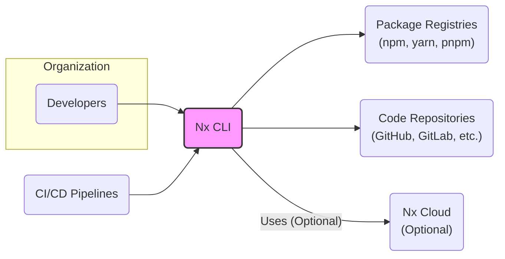
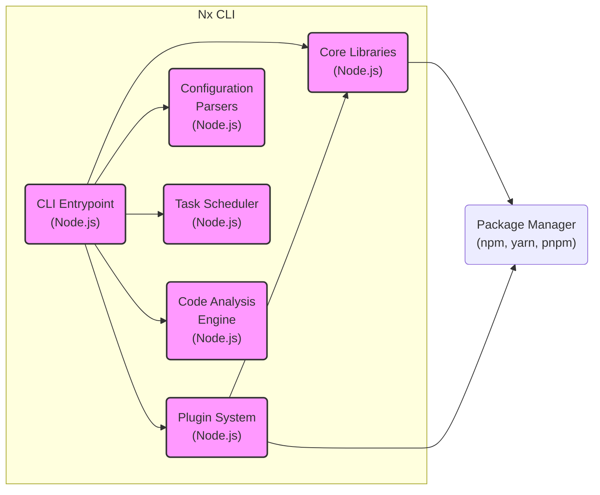
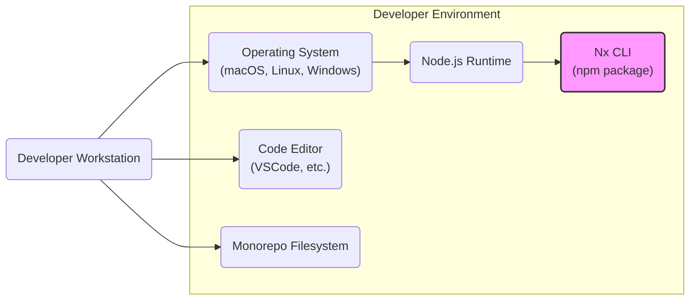
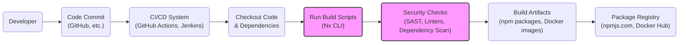

# BUSINESS POSTURE

Nx is a suite of extensible open-source tools for monorepos, which helps organizations scale and maintain their software development. The primary business goal of Nx is to improve developer productivity, code sharing, and maintainability across multiple projects within a single repository. By providing a unified and efficient development experience, Nx aims to reduce development costs, accelerate delivery cycles, and improve the overall quality of software products built using monorepos.

Key business priorities for Nx include:
- Enhancing developer experience and productivity.
- Facilitating code reuse and consistency across projects.
- Simplifying monorepo management and scaling.
- Supporting a wide range of technologies and frameworks.
- Fostering a strong and active community around the tool.

The most important business risks associated with Nx are:
- Security vulnerabilities within Nx itself could impact all projects within the monorepo, potentially leading to widespread security breaches.
- Complexity of monorepo setup and management using Nx might introduce configuration errors or operational challenges.
- Performance bottlenecks in Nx or the monorepo structure could slow down development and build processes.
- Dependency on the Nx ecosystem and community for ongoing support and security updates.
- Potential for misconfiguration or misuse of Nx features leading to security weaknesses in developed applications.

# SECURITY POSTURE

Existing security controls for the Nx project and its ecosystem are primarily based on standard open-source practices and GitHub platform security features.

Security controls:
- security control: GitHub repository security features, including branch protection rules, vulnerability scanning for dependencies, and security advisories. Implemented by: GitHub platform.
- security control: Open-source community review and contributions, which can help identify and address potential security issues. Implemented by: Nx community and maintainers.
- security control: Automated testing, including unit tests, integration tests, and end-to-end tests, to ensure code quality and prevent regressions. Implemented by: Nx CI pipelines (GitHub Actions).
- security control: Code linters and formatters to enforce code consistency and potentially catch basic code quality issues. Implemented by: Nx development tooling and CI pipelines.

Accepted risks:
- accepted risk: Reliance on the open-source community for security vulnerability discovery and patching.
- accepted risk: Potential for vulnerabilities in third-party dependencies used by Nx.
- accepted risk: Security of user-contributed plugins and extensions is not centrally controlled.
- accepted risk: Misconfiguration of Nx by users leading to security issues in their projects.

Recommended security controls to implement:
- recommended security control: Regular security audits and penetration testing of Nx core components and critical plugins.
- recommended security control: Implement static application security testing (SAST) and dependency scanning in the Nx CI/CD pipeline to automatically detect vulnerabilities.
- recommended security control: Establish a clear security vulnerability reporting and response process for Nx.
- recommended security control: Provide security guidelines and best practices for Nx users to secure their monorepos and applications.
- recommended security control: Implement signed releases of Nx CLI and plugins to ensure integrity and prevent tampering.

Security requirements for Nx and projects built with Nx:
- Authentication:
    - Nx CLI itself does not require authentication for local usage.
    - Nx Cloud, as an optional service, requires authentication for users to access its features. Authentication mechanism should be secure (e.g., OAuth 2.0, SAML).
    - Security requirement: If Nx Cloud is used, ensure strong authentication mechanisms are in place to protect access to sensitive data and features.
- Authorization:
    - Nx CLI authorization is primarily file-system based, relying on user permissions to access and modify files within the monorepo.
    - Nx Cloud authorization should control access to projects, workspaces, and features based on user roles and permissions.
    - Security requirement: Implement fine-grained authorization controls within Nx Cloud to manage user access and permissions.
- Input Validation:
    - Nx CLI commands and configuration files should rigorously validate user inputs to prevent command injection, path traversal, and other input-based vulnerabilities.
    - Nx plugins should also adhere to input validation best practices.
    - Security requirement: Implement robust input validation for all Nx CLI commands, configuration files, and plugin inputs.
- Cryptography:
    - Nx itself might not directly handle sensitive cryptographic operations in its core functionality.
    - However, Nx Cloud might require cryptography for secure storage of secrets, API keys, and other sensitive data.
    - Projects built with Nx might require cryptography for various security functions.
    - Security requirement: If Nx Cloud stores sensitive data, ensure proper encryption at rest and in transit. Provide guidance and tools for Nx users to implement cryptography securely in their projects.

# DESIGN

## C4 CONTEXT

Context Diagram Description:

- Context Diagram Elements:
    - Context Diagram Element:
        - Name: Developers
        - Type: Person
        - Description: Software developers who use Nx CLI to build, test, and manage applications within a monorepo.
        - Responsibilities: Develop and maintain applications using Nx, execute Nx commands, configure Nx workspace.
        - Security controls: User authentication to developer machines, access control to code repositories, secure coding practices.
    - Context Diagram Element:
        - Name: CI/CD Pipelines
        - Type: System
        - Description: Automated systems that build, test, and deploy applications managed by Nx.
        - Responsibilities: Automate build, test, and deployment processes using Nx CLI, integrate with package registries and code repositories.
        - Security controls: Secure CI/CD pipeline configuration, secrets management for credentials, access control to deployment environments.
    - Context Diagram Element:
        - Name: Package Registries (npm, yarn, pnpm)
        - Type: System
        - Description: Repositories for storing and distributing JavaScript packages, used by Nx to manage dependencies and publish build artifacts.
        - Responsibilities: Provide packages required by Nx and projects, host published packages.
        - Security controls: Package registry security policies, vulnerability scanning of packages, access control to publish packages.
    - Context Diagram Element:
        - Name: Code Repositories (GitHub, GitLab, etc.)
        - Type: System
        - Description: Version control systems where the monorepo code is stored and managed, used by Nx for project structure and code analysis.
        - Responsibilities: Store source code, manage version history, provide access control to code.
        - Security controls: Code repository access control, branch protection rules, audit logging.
    - Context Diagram Element:
        - Name: Nx CLI
        - Type: System
        - Description: The core command-line interface tool provided by Nx, used by developers and CI/CD pipelines to interact with the monorepo.
        - Responsibilities: Project generation, build orchestration, task execution, dependency management, code analysis, plugin management.
        - Security controls: Input validation, secure command execution, plugin security management, logging and auditing.
    - Context Diagram Element:
        - Name: Nx Cloud (Optional)
        - Type: System
        - Description: An optional cloud service that integrates with Nx to provide distributed caching, computation acceleration, and insights into monorepo projects.
        - Responsibilities: Distributed build caching, remote task execution, project insights and analytics, user management.
        - Security controls: Authentication and authorization, data encryption at rest and in transit, access control to cloud resources, security monitoring and logging.

## C4 CONTAINER

Container Diagram Description:

- Container Diagram Elements:
    - Container Diagram Element:
        - Name: CLI Entrypoint
        - Type: Node.js Application
        - Description: The main entry point for the Nx command-line interface, responsible for parsing commands, routing to appropriate modules, and handling user interactions.
        - Responsibilities: Command parsing, argument validation, command routing, output formatting, error handling.
        - Security controls: Input validation for CLI arguments, secure command execution, logging of user commands.
    - Container Diagram Element:
        - Name: Core Libraries
        - Type: Node.js Libraries
        - Description: A collection of core Nx libraries providing fundamental functionalities such as project graph management, task execution framework, and utility functions.
        - Responsibilities: Project graph construction, task scheduling and execution, dependency analysis, utility functions.
        - Security controls: Secure coding practices, input validation within libraries, unit and integration testing.
    - Container Diagram Element:
        - Name: Plugin System
        - Type: Node.js Libraries
        - Description: The plugin system allows extending Nx functionality with custom builders, generators, and schematics.
        - Responsibilities: Plugin loading and management, plugin API exposure, plugin execution environment.
        - Security controls: Plugin validation and sandboxing (if feasible), secure plugin API design, documentation on plugin security best practices.
    - Container Diagram Element:
        - Name: Configuration Parsers
        - Type: Node.js Libraries
        - Description: Modules responsible for parsing and validating Nx configuration files (e.g., nx.json, workspace.json, project.json).
        - Responsibilities: Configuration file parsing, schema validation, configuration object creation.
        - Security controls: Schema validation to prevent misconfiguration, input validation for configuration values, secure parsing logic to prevent injection attacks.
    - Container Diagram Element:
        - Name: Task Scheduler
        - Type: Node.js Libraries
        - Description: Manages the execution of tasks (build, test, lint, etc.) in an efficient and optimized manner, including dependency analysis and caching.
        - Responsibilities: Task dependency resolution, task execution scheduling, caching mechanism, parallel task execution.
        - Security controls: Secure task execution environment, prevention of command injection in task execution, secure caching mechanism.
    - Container Diagram Element:
        - Name: Code Analysis Engine
        - Type: Node.js Libraries
        - Description: Provides code analysis capabilities, such as dependency graph generation, affected project detection, and impact analysis.
        - Responsibilities: Code parsing and analysis, dependency graph construction, affected project detection, impact analysis.
        - Security controls: Secure code parsing logic, prevention of code injection during analysis, secure handling of code metadata.
    - Container Diagram Element:
        - Name: Package Manager (npm, yarn, pnpm)
        - Type: Container
        - Description: The package manager used by Nx to install dependencies and manage project packages.
        - Responsibilities: Package installation, dependency resolution, package locking.
        - Security controls: Reliance on package manager's security features, vulnerability scanning of installed packages, using package lock files to ensure dependency integrity.

## DEPLOYMENT

Nx CLI itself is primarily deployed on developer machines and CI/CD environments. There isn't a traditional "deployment" in the sense of a web application. However, the usage environments can be considered deployment contexts.

Deployment Architecture: Developer Workstation

Deployment Diagram Description: Developer Workstation

- Deployment Diagram Elements:
    - Deployment Diagram Element:
        - Name: Developer Workstation
        - Type: Physical Device
        - Description: A developer's personal computer used for software development with Nx.
        - Responsibilities: Running Nx CLI, developing code, testing applications locally.
        - Security controls: Operating system security controls, endpoint security software, user authentication, physical security of the workstation.
    - Deployment Diagram Element:
        - Name: Operating System (macOS, Linux, Windows)
        - Type: Software
        - Description: The operating system running on the developer workstation.
        - Responsibilities: Providing a secure and stable environment for running Node.js and Nx CLI.
        - Security controls: OS security updates, firewall, user access control, anti-malware software.
    - Deployment Diagram Element:
        - Name: Node.js Runtime
        - Type: Software
        - Description: The JavaScript runtime environment required to execute Nx CLI.
        - Responsibilities: Executing Nx CLI code, providing JavaScript execution environment.
        - Security controls: Keeping Node.js runtime updated with security patches, secure Node.js configuration.
    - Deployment Diagram Element:
        - Name: Nx CLI (npm package)
        - Type: Software
        - Description: The Nx CLI npm package installed on the developer workstation.
        - Responsibilities: Providing Nx CLI functionality to the developer.
        - Security controls: Integrity of npm package installation, regular updates to the latest Nx CLI version.
    - Deployment Diagram Element:
        - Name: Code Editor (VSCode, etc.)
        - Type: Software
        - Description: Code editor used by developers to write and edit code within the monorepo.
        - Responsibilities: Code editing, integration with Nx CLI (via plugins or terminal).
        - Security controls: Code editor security features, plugin security, secure coding practices within the editor.
    - Deployment Diagram Element:
        - Name: Monorepo Filesystem
        - Type: Data Storage
        - Description: The local filesystem directory where the monorepo code is stored.
        - Responsibilities: Storing source code, configuration files, and project artifacts.
        - Security controls: Filesystem permissions, access control to the monorepo directory, data encryption at rest (optional).

## BUILD

Build Process Description:

The build process for projects within an Nx monorepo typically involves the following steps, focusing on security controls:

1. Developer Code Commit: Developers commit code changes to a version control system (e.g., GitHub).
2. CI/CD System Trigger: A CI/CD system (e.g., GitHub Actions, Jenkins) is triggered by code commits.
3. Checkout Code & Dependencies: The CI/CD system checks out the code from the repository and installs project dependencies using a package manager (npm, yarn, pnpm). Security control: Ensure secure access to the code repository and package registry. Use dependency lock files to ensure consistent and verifiable dependencies.
4. Run Build Scripts (Nx CLI): The CI/CD system executes build scripts defined in the Nx workspace, using Nx CLI to orchestrate the build process. Security control: Ensure build scripts are secure and do not introduce vulnerabilities. Leverage Nx's task scheduling and caching to optimize build performance and reduce attack surface.
5. Security Checks (SAST, Linters, Dependency Scan): Automated security checks are performed as part of the build process. This includes:
    - Static Application Security Testing (SAST): Tools analyze the source code for potential security vulnerabilities. Security control: Integrate SAST tools into the CI/CD pipeline and address identified vulnerabilities.
    - Code Linters: Linters enforce code quality and style guidelines, which can indirectly improve security. Security control: Use linters to enforce secure coding practices and catch potential code quality issues.
    - Dependency Scanning: Tools scan project dependencies for known vulnerabilities. Security control: Integrate dependency scanning tools and remediate identified vulnerabilities by updating dependencies.
6. Build Artifacts: If security checks pass, build artifacts are generated. These can include npm packages, Docker images, or other deployable artifacts. Security control: Ensure build artifacts are generated securely and are free from vulnerabilities.
7. Package Registry: Build artifacts are published to a package registry (e.g., npmjs.com, Docker Hub) for distribution and deployment. Security control: Secure access to the package registry, use signed commits and releases to ensure artifact integrity, implement access control to published packages.

# RISK ASSESSMENT

Critical business processes protected by Nx:
- Software Development Lifecycle: Nx streamlines and manages the entire software development lifecycle within a monorepo, from project creation to deployment.
- Code Management and Collaboration: Nx facilitates code sharing, consistency, and collaboration across multiple teams and projects within a single repository.
- Build and Deployment Automation: Nx enables efficient and automated build and deployment processes for monorepo projects.

Data being protected and its sensitivity:
- Source Code: Highly sensitive. Source code is the intellectual property of the organization and its compromise can lead to significant business damage, including loss of competitive advantage, security breaches, and reputational harm.
- Configuration Files (nx.json, project.json, etc.): Medium to High sensitivity. Configuration files contain settings and parameters that define the behavior of Nx and projects. Misconfiguration or unauthorized modification can lead to security vulnerabilities or operational issues.
- Build Artifacts (npm packages, Docker images): Medium sensitivity. Build artifacts are the deployable outputs of the build process. Compromised build artifacts can lead to deployment of vulnerable or malicious software.
- Developer Credentials (if Nx Cloud is used): Highly sensitive. Developer credentials provide access to Nx Cloud services and potentially other sensitive resources. Compromise of these credentials can lead to unauthorized access and data breaches.

# QUESTIONS & ASSUMPTIONS

Questions:
- What is the intended scope of security for this design document? Is it focused on the security of the Nx tool itself, or the security of projects built using Nx, or both? (Assumption: Focus is on both, with emphasis on Nx tool as it impacts all projects).
- Are there specific compliance requirements or security standards that Nx or projects built with Nx need to adhere to? (Assumption: General security best practices are the primary focus, without specific compliance mandates mentioned).
- What is the expected usage of Nx Cloud? Is it considered a critical component or an optional enhancement? (Assumption: Nx Cloud is optional, and the core functionality of Nx CLI is the primary focus).
- What is the threat model for Nx? Who are the potential threat actors and what are their motivations? (Assumption: Threat actors include external attackers, malicious insiders, and accidental misconfigurations).

Assumptions:
- BUSINESS POSTURE: The organization using Nx prioritizes developer productivity and efficient monorepo management, but also recognizes the importance of security for its software development processes.
- SECURITY POSTURE: The current security posture relies on standard open-source practices and GitHub platform security features. There is room for improvement in proactive security measures like security audits and automated security testing.
- DESIGN: The design focuses on the core Nx CLI and its interaction with developers, CI/CD systems, and package registries. Nx Cloud is considered an optional component. The deployment context is primarily developer workstations and CI/CD environments.