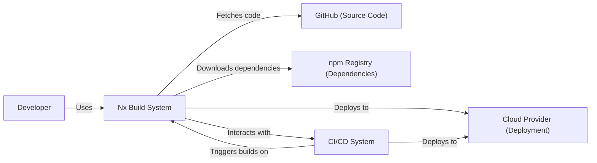
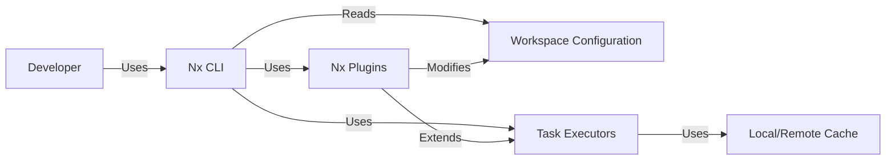
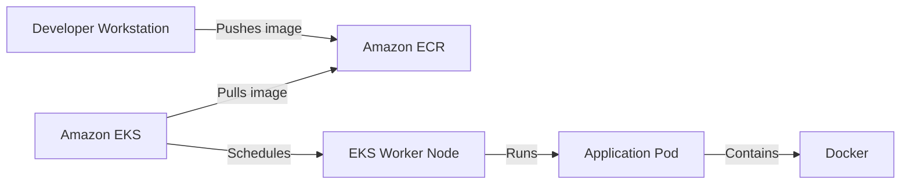
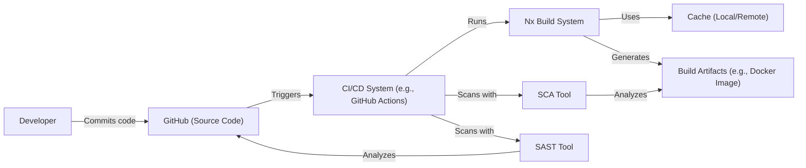

Okay, let's create a design document for the Nx project, focusing on aspects relevant for threat modeling.

# BUSINESS POSTURE

Nx is a build system and development tool, aiming to improve developer productivity and code quality, particularly in monorepo setups.  The business priorities and goals it addresses are:

*   Faster Build Times: Reducing the time it takes to build, test, and deploy software. This directly impacts developer productivity and time-to-market.
*   Improved Code Quality: Enforcing consistency, best practices, and code standards across large projects and teams. This reduces bugs and technical debt.
*   Simplified Monorepo Management: Providing tools and structure to manage large, complex codebases in a single repository. This enables code sharing and collaboration.
*   Scalability: Allowing projects to grow without significant performance degradation in build and development processes.
*   Enhanced Collaboration: Facilitating collaboration between developers working on different parts of a large application.
*   Ecosystem Integration: Seamlessly integrating with popular frontend and backend frameworks and tools.

Based on these, the most important business risks that need to be addressed are:

*   Compromise of the Build System: An attacker gaining control of the Nx build system could inject malicious code into applications, leading to widespread compromise.
*   Supply Chain Attacks: Vulnerabilities in Nx itself or its dependencies could be exploited to compromise projects using Nx.
*   Data Leakage: Sensitive information (e.g., API keys, credentials) stored insecurely within the monorepo or exposed during the build process could be leaked.
*   Unauthorized Code Modification: Developers (or attackers) making unauthorized changes to the codebase, bypassing established controls.
*   Denial of Service: Attacks targeting the build system or its infrastructure, preventing developers from building and deploying software.
*   Inconsistent Security Practices: Different teams or projects within the monorepo applying inconsistent security controls, leading to vulnerabilities.

# SECURITY POSTURE

Existing security controls and accepted risks (based on the public repository and common practices):

*   security control: Code Reviews: Nx promotes code reviews through its structure and tooling (e.g., affected commands). Implemented through pull request workflows in GitHub.
*   security control: Dependency Management: Nx uses package managers (npm, yarn, pnpm) to manage dependencies.  Security relies on the security practices of these package managers and the vigilance of developers in updating dependencies. Described in package.json files and lock files.
*   security control: Linting and Static Analysis: Nx integrates with linters (e.g., ESLint) and static analysis tools to enforce code quality and identify potential security issues. Configured through project configuration files.
*   security control: Testing: Nx encourages unit, integration, and end-to-end testing, which can help identify security vulnerabilities. Configured through project configuration files and testing frameworks.
*   security control: Open Source: Nx is open source, allowing for community scrutiny and contributions to security.
*   accepted risk: Third-Party Dependencies: Nx relies on numerous third-party dependencies. Vulnerabilities in these dependencies could impact Nx and projects using it.
*   accepted risk: User Configuration: Nx provides extensive configuration options. Misconfiguration by users could introduce security vulnerabilities.
*   accepted risk: Local Development Environment: Nx operates within the developer's local environment. The security of this environment is outside the direct control of Nx.

Recommended Security Controls (High Priority):

*   Implement Software Composition Analysis (SCA): Integrate SCA tools to automatically scan dependencies for known vulnerabilities and provide remediation guidance.
*   Enforce Signed Commits: Require developers to sign their commits, ensuring the integrity and authenticity of code changes.
*   Harden CI/CD Pipelines: Secure the CI/CD pipelines used to build and deploy projects using Nx, including access controls, secret management, and vulnerability scanning.
*   Provide Security Guidelines: Offer clear and comprehensive security guidelines for users on how to securely configure and use Nx.

Security Requirements:

*   Authentication:
    *   Not directly applicable to Nx itself, as it's a local development tool. However, authentication is crucial for accessing the source code repository (e.g., GitHub) and any CI/CD systems.
*   Authorization:
    *   Not directly applicable to Nx itself. Authorization is relevant for accessing the source code repository and CI/CD systems, as well as any cloud resources used during deployment.
*   Input Validation:
    *   Nx itself should validate user inputs (e.g., command-line arguments, configuration files) to prevent injection vulnerabilities.
    *   Projects built with Nx should implement robust input validation to prevent common web vulnerabilities (e.g., XSS, SQL injection).
*   Cryptography:
    *   Nx should use secure cryptographic practices when handling sensitive data (e.g., API keys, credentials), if applicable. This is more relevant to projects built *with* Nx than to Nx itself.
    *   Projects built with Nx should use appropriate cryptographic libraries and algorithms for secure communication and data storage.

# DESIGN

## C4 CONTEXT

Element Descriptions:

*   Element:
    *   Name: Developer
    *   Type: Person
    *   Description: A software developer who uses Nx to build, test, and deploy applications.
    *   Responsibilities: Writing code, configuring Nx, running Nx commands, reviewing code.
    *   Security controls: Strong passwords, multi-factor authentication for accessing GitHub and CI/CD, secure local development environment.

*   Element:
    *   Name: Nx Build System
    *   Type: Software System
    *   Description: The core Nx build system and command-line interface.
    *   Responsibilities: Managing the monorepo, building projects, running tests, enforcing code quality, coordinating deployments.
    *   Security controls: Input validation, dependency management, integration with linters and static analysis tools.

*   Element:
    *   Name: GitHub (Source Code)
    *   Type: Software System
    *   Description: The source code repository hosting the monorepo.
    *   Responsibilities: Storing code, managing versions, facilitating collaboration.
    *   Security controls: Access controls, branch protection rules, code review requirements, signed commits.

*   Element:
    *   Name: npm Registry (Dependencies)
    *   Type: Software System
    *   Description: The public registry for npm packages.
    *   Responsibilities: Providing access to open-source libraries and dependencies.
    *   Security controls: Vulnerability scanning (by npm), package signing (optional).

*   Element:
    *   Name: Cloud Provider (Deployment)
    *   Type: Software System
    *   Description: A cloud platform (e.g., AWS, Azure, GCP) where applications are deployed.
    *   Responsibilities: Providing infrastructure and services for running applications.
    *   Security controls: IAM, network security, encryption, logging and monitoring.

*   Element:
    *   Name: CI/CD System
    *   Type: Software System
    *   Description: A continuous integration and continuous delivery system (e.g., Jenkins, GitHub Actions, CircleCI).
    *   Responsibilities: Automating builds, tests, and deployments.
    *   Security controls: Access controls, secret management, pipeline security, vulnerability scanning.

## C4 CONTAINER

Element Descriptions:

*   Element:
    *   Name: Developer
    *   Type: Person
    *   Description: A software developer interacting with the Nx CLI.
    *   Responsibilities: Running Nx commands, configuring projects, writing code.
    *   Security controls: Secure local development environment.

*   Element:
    *   Name: Nx CLI
    *   Type: Application
    *   Description: The command-line interface for interacting with Nx.
    *   Responsibilities: Parsing commands, reading configuration, executing tasks.
    *   Security controls: Input validation.

*   Element:
    *   Name: Workspace Configuration
    *   Type: Data
    *   Description: Configuration files (e.g., nx.json, workspace.json, project.json) that define the structure and settings of the monorepo.
    *   Responsibilities: Defining projects, dependencies, build targets, and other settings.
    *   Security controls: Code reviews, validation of configuration changes.

*   Element:
    *   Name: Local/Remote Cache
    *   Type: Data
    *   Description: A cache that stores the results of previous builds to speed up subsequent builds.
    *   Responsibilities: Storing and retrieving build artifacts.
    *   Security controls: Access controls (for remote cache), integrity checks.

*   Element:
    *   Name: Task Executors
    *   Type: Application
    *   Description: Components that execute specific tasks (e.g., building, testing, linting).
    *   Responsibilities: Running commands, managing dependencies, interacting with external tools.
    *   Security controls: Secure execution environment, sandboxing (if applicable).

*   Element:
    *   Name: Nx Plugins
    *   Type: Application
    *   Description: Extensions that add functionality to Nx.
    *   Responsibilities: Providing additional features, integrating with other tools.
    *   Security controls: Code reviews, security audits, dependency scanning.

## DEPLOYMENT

Nx projects can be deployed in various ways, depending on the project type and target environment. Common deployment solutions include:

1.  Static Website Hosting (e.g., Netlify, Vercel, AWS S3 + CloudFront)
2.  Containerized Deployment (e.g., Docker, Kubernetes)
3.  Serverless Functions (e.g., AWS Lambda, Azure Functions, Google Cloud Functions)
4.  Traditional Server Deployment (e.g., VMs, bare metal)

Let's describe a containerized deployment using Docker and Kubernetes on AWS:

Element Descriptions:

*   Element:
    *   Name: Developer Workstation
    *   Type: Infrastructure
    *   Description: The developer's local machine where code is written and Nx commands are run.
    *   Responsibilities: Building Docker images, pushing images to ECR.
    *   Security controls: Secure local development environment, strong authentication to AWS.

*   Element:
    *   Name: Amazon ECR
    *   Type: Infrastructure
    *   Description: Amazon Elastic Container Registry, a managed Docker registry.
    *   Responsibilities: Storing Docker images.
    *   Security controls: IAM roles and policies, image scanning, private repository access.

*   Element:
    *   Name: Amazon EKS
    *   Type: Infrastructure
    *   Description: Amazon Elastic Kubernetes Service, a managed Kubernetes service.
    *   Responsibilities: Orchestrating container deployments, managing worker nodes.
    *   Security controls: IAM roles and policies, network policies, pod security policies, cluster security groups.

*   Element:
    *   Name: EKS Worker Node
    *   Type: Infrastructure
    *   Description: A virtual machine (EC2 instance) that runs application containers.
    *   Responsibilities: Running containers, providing resources (CPU, memory, storage).
    *   Security controls: Hardened AMIs, security updates, network segmentation.

*   Element:
    *   Name: Application Pod
    *   Type: Infrastructure
    *   Description: A Kubernetes pod that runs one or more application containers.
    *   Responsibilities: Running the application code.
    *   Security controls: Resource limits, security context, network policies.

*   Element:
    *   Name: Docker
    *   Type: Application
    *   Description: Container runtime.
    *   Responsibilities: Running containers based on Docker images.
    *   Security controls: Docker Content Trust, secure base images, vulnerability scanning.

## BUILD

The build process for Nx projects typically involves the following steps:

1.  Developer writes code and commits changes to the source code repository (GitHub).
2.  A CI/CD system (e.g., GitHub Actions) is triggered by the commit.
3.  The CI/CD system checks out the code and installs Nx.
4.  Nx analyzes the changes and determines which projects are affected.
5.  Nx runs the build targets for the affected projects (e.g., build, test, lint).
6.  Nx uses its caching mechanism to speed up the build process.
7.  If the build is successful, Nx may create build artifacts (e.g., Docker images, compiled code).
8.  The CI/CD system may then deploy the artifacts to the target environment.

Security Controls in the Build Process:

*   Software Composition Analysis (SCA): Scans dependencies for known vulnerabilities.
*   Static Application Security Testing (SAST): Analyzes source code for potential security issues.
*   Signed Commits: Ensures the integrity and authenticity of code changes.
*   Secure CI/CD Pipeline: Access controls, secret management, pipeline security.
*   Build Artifact Integrity: Ensuring the integrity of build artifacts (e.g., using checksums, signing).
*   Least Privilege: Running build processes with the minimum necessary privileges.

# RISK ASSESSMENT

*   Critical Business Processes:
    *   Software Development Lifecycle: The entire process of building, testing, and deploying software.
    *   Continuous Integration and Continuous Delivery: Automated pipelines for building and deploying software.
    *   Monorepo Management: Managing a large codebase in a single repository.

*   Data to Protect:
    *   Source Code: The intellectual property of the organization. (Sensitivity: High)
    *   Configuration Files: May contain sensitive information like API keys, database credentials. (Sensitivity: High)
    *   Build Artifacts: Could contain vulnerabilities or be tampered with. (Sensitivity: High)
    *   Dependencies: Vulnerabilities in dependencies can be exploited. (Sensitivity: High)
    *   Developer Credentials: Access to source code repositories, CI/CD systems, and cloud providers. (Sensitivity: High)

# QUESTIONS & ASSUMPTIONS

*   Questions:
    *   What specific cloud providers are used for deployment?
    *   What CI/CD systems are integrated with Nx?
    *   Are there any specific compliance requirements (e.g., PCI DSS, HIPAA)?
    *   What is the process for managing secrets (e.g., API keys, credentials)?
    *   What is the level of security awareness and training among developers?
    *   Are there any existing security policies or standards that apply to the monorepo?
    *   Is there a dedicated security team responsible for the security of the build system and applications?
    *   What is the process for responding to security incidents?

*   Assumptions:
    *   Developers have a basic understanding of security best practices.
    *   The source code repository (GitHub) is configured with appropriate access controls and branch protection rules.
    *   The CI/CD system is securely configured and managed.
    *   Dependencies are regularly updated to address known vulnerabilities.
    *   The organization has a process for responding to security vulnerabilities.
    *   The local development environments of developers are reasonably secure.
    *   The deployment environments (e.g., cloud providers) are configured with appropriate security controls.
    *   Nx itself is used and configured as intended by its developers, without significant modifications.