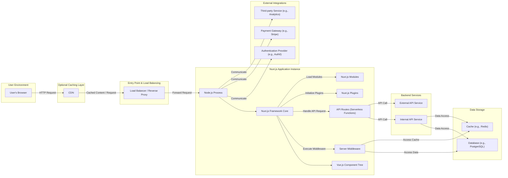
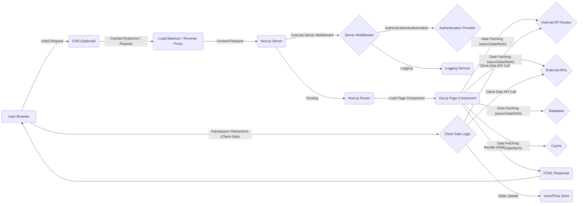

## Project Design Document: Nuxt.js Application (Improved)

**1. Introduction**

This document provides a detailed design of a typical Nuxt.js web application, specifically tailored for threat modeling. It aims to clearly articulate the application's architecture, key components, data flow, and inherent security considerations. This document will serve as the primary input for subsequent threat modeling exercises.

**2. Goals and Objectives**

*   Provide a precise and comprehensive description of a standard Server-Side Rendered (SSR) Nuxt.js application architecture, highlighting security-relevant aspects.
*   Clearly identify and describe the function of each key component and the nature of their interactions.
*   Illustrate the complete lifecycle of data within the application, from user input to persistent storage and external communication.
*   Proactively highlight potential areas of security concern and common web application vulnerabilities within the Nuxt.js context, preparing for detailed threat analysis.
*   Serve as a definitive reference for security assessments, secure development practices, and ongoing security maintenance.

**3. High-Level Architecture**

This design focuses on a Server-Side Rendered (SSR) Nuxt.js application to encompass a broader range of potential threats.

**4. Key Components and Interactions**

*   **User's Browser:** The client-side application where the user interacts. Executes JavaScript, renders HTML, and sends HTTP requests.
*   **CDN (Optional):** A geographically distributed network that caches static assets (JavaScript, CSS, images) to reduce latency and improve performance for users.
*   **Load Balancer / Reverse Proxy:** Distributes incoming traffic across multiple Nuxt.js application instances for scalability and high availability. Also acts as a security gateway, potentially handling SSL termination and basic security filtering.
*   **Nuxt.js Application Instance:**
    *   **Node.js Process:** The runtime environment executing the Nuxt.js application code. Responsible for handling requests, rendering pages, and executing server-side logic.
    *   **Nuxt.js Framework Core:** The core framework that manages routing, server-side rendering, application lifecycle, and provides utilities for development.
    *   **Vue.js Component Tree:** The hierarchical structure of Vue.js components that define the user interface. These include pages, layouts, and reusable components.
    *   **Server Middleware:** Custom functions that intercept incoming HTTP requests before they reach route handlers. Used for tasks like authentication, authorization, logging, request modification, and setting security headers.
    *   **API Routes (Serverless Functions):** Optional server-side endpoints defined within the `server/api` directory. These functions handle specific backend logic and can interact with databases or external services. Often deployed as serverless functions in production.
    *   **Nuxt.js Plugins:** Custom JavaScript functions that extend the functionality of Vue.js and Nuxt.js. They can be used to inject dependencies, register global components, or interact with the application lifecycle.
    *   **Nuxt.js Modules:**  Extend Nuxt.js functionality by providing pre-built integrations and features. Examples include modules for handling environment variables, integrating with CSS frameworks, or connecting to external services.
*   **Backend Services:**
    *   **Internal API Service:** A separate backend service (potentially microservices) owned by the same organization, providing core business logic and data.
    *   **External API Service:** Third-party APIs used to access external data or functionalities.
*   **Data Storage:**
    *   **Database (e.g., PostgreSQL):** Persistent storage for application data, user information, and other critical data.
    *   **Cache (e.g., Redis):**  A temporary data store used to improve performance by caching frequently accessed data.
*   **External Integrations:**
    *   **Authentication Provider (e.g., Auth0):** A service used to manage user authentication and authorization.
    *   **Payment Gateway (e.g., Stripe):** A third-party service for processing online payments.
    *   **Third-party Service (e.g., Analytics):** External services used for tracking user behavior, logging errors, or other functionalities.

**5. Data Flow (Detailed)**

This section outlines the detailed flow of data during a typical user interaction in an SSR Nuxt.js application.

*   **Initial Request:** A user in their browser initiates a request (e.g., navigates to a URL, submits a form).
*   **CDN Handling (Optional):** The CDN checks if a cached version of the requested resource exists. If so, it serves the cached content directly to the user, bypassing the application server.
*   **Load Balancer / Reverse Proxy Routing:** The request reaches the load balancer or reverse proxy, which routes it to one of the available Nuxt.js application instances.
*   **Server Middleware Processing:** The Nuxt.js application instance receives the request. Server middleware functions are executed in a defined order. These functions can:
    *   Authenticate and authorize the user.
    *   Log the request.
    *   Modify request headers or body.
    *   Set security headers (e.g., Content-Security-Policy, X-Frame-Options).
    *   Redirect the user.
*   **Routing:** Nuxt.js determines the appropriate page component to render based on the requested URL, using its built-in routing mechanism.
*   **Data Fetching (Optional):** Before rendering the page component, Nuxt.js may execute data fetching methods (e.g., `asyncData`, `fetch`) within the component or its dependencies. This can involve:
    *   **Internal API Calls:** Making requests to API routes defined within the Nuxt.js application (`server/api`).
    *   **External API Calls:** Making requests to external API services.
    *   **Database Queries:** Directly querying the database (less common in the frontend layer, often handled by API routes).
    *   **Cache Retrieval:** Fetching data from the cache.
*   **Component Rendering:** Vue.js renders the page component and its child components into HTML on the server, incorporating the fetched data.
*   **HTML Response:** The Nuxt.js server sends the fully rendered HTML to the user's browser. This includes the initial page content and references to JavaScript and CSS assets.
*   **Client-Side Hydration:** The browser receives the HTML and downloads the necessary JavaScript bundles. Vue.js "hydrates" the static HTML, attaching event listeners and making the application interactive.
*   **Subsequent Interactions (Client-Side):** For subsequent navigation or data updates, the application can perform client-side routing and data fetching using JavaScript, potentially bypassing the full server-side rendering process for improved performance. These interactions can involve:
    *   **Client-Side API Calls:** Making requests to internal or external APIs directly from the browser.
    *   **State Management Updates:** Updating the application's state using libraries like Vuex or Pinia.

**6. Security Considerations (Detailed)**

This section provides a more granular breakdown of potential security concerns.

*   **Client-Side Vulnerabilities:**
    *   **Cross-Site Scripting (XSS):**
        *   **Stored XSS:** Malicious scripts injected into the database and rendered on the page for other users.
        *   **Reflected XSS:** Malicious scripts injected through URL parameters or form submissions and immediately reflected back to the user.
        *   **DOM-based XSS:** Vulnerabilities in client-side JavaScript code that manipulate the DOM based on user input.
    *   **Insecure Dependencies:** Using client-side JavaScript libraries with known vulnerabilities.
    *   **Sensitive Data Exposure:** Accidentally exposing API keys, secrets, or other sensitive information in client-side JavaScript code or HTML source.
    *   **Client-Side Logic Tampering:** Malicious users manipulating client-side JavaScript to bypass security checks or alter application behavior.
*   **Server-Side Vulnerabilities:**
    *   **Server-Side Request Forgery (SSRF):** The server making requests to internal or external resources based on user-controlled input, potentially exposing internal services.
    *   **Injection Attacks:**
        *   **SQL Injection:** Exploiting vulnerabilities in database queries to gain unauthorized access or manipulate data.
        *   **NoSQL Injection:** Similar to SQL injection but targeting NoSQL databases.
        *   **Command Injection:** Executing arbitrary system commands on the server through user-controlled input.
    *   **Authentication and Authorization Issues:**
        *   **Broken Authentication:** Weak password policies, insecure session management, lack of multi-factor authentication.
        *   **Broken Authorization:** Improperly implemented access controls, allowing users to access resources they shouldn't.
    *   **Session Management Vulnerabilities:** Insecure storage or handling of session tokens, session fixation, session hijacking.
    *   **Exposure of Sensitive Information:** Logging sensitive data in server logs or error messages.
    *   **Insecure Dependencies:** Using server-side Node.js modules with known vulnerabilities.
    *   **Path Traversal:** Allowing users to access files or directories outside of the intended web root.
*   **API Security:**
    *   **Broken Authentication and Authorization:** Lack of proper authentication and authorization mechanisms for API endpoints.
    *   **Mass Assignment:** Allowing users to modify unintended object properties through API requests.
    *   **Insecure Direct Object References (IDOR):** Exposing internal object IDs without proper authorization checks, allowing users to access resources they shouldn't.
    *   **Lack of Input Validation:** Not properly validating and sanitizing user input to API endpoints, leading to injection vulnerabilities.
    *   **Rate Limiting and Abuse Prevention:** Lack of mechanisms to prevent abuse of API endpoints through excessive requests.
*   **Third-Party Integrations:**
    *   **Insecure Authentication with External Providers:** Weak OAuth configurations or insecure handling of access tokens.
    *   **Exposure of API Keys and Secrets:** Storing API keys and secrets for third-party services insecurely.
    *   **Vulnerabilities in Third-Party Libraries:** Using third-party libraries with known security flaws.
*   **Deployment Security:**
    *   **Insecure Server Configuration:** Misconfigured web servers (e.g., Nginx, Apache) or Node.js processes.
    *   **Exposed Environment Variables:** Storing sensitive information like database credentials or API keys in easily accessible environment variables.
    *   **Lack of Security Updates:** Not regularly updating server software, operating systems, and dependencies.
    *   **Insecure SSL/TLS Configuration:** Weak cipher suites or outdated TLS versions.
*   **Data Storage Security:**
    *   **Insufficient Data Encryption:** Not encrypting sensitive data at rest and in transit.
    *   **Weak Access Controls:** Improperly configured database access controls, allowing unauthorized access.
    *   **Lack of Regular Backups:** Insufficient backup procedures, leading to potential data loss.

**7. Deployment Considerations (Security Focused)**

*   **Node.js Server Deployment:**
    *   **Principle of Least Privilege:** Run the Node.js process with minimal necessary privileges.
    *   **Security Hardening:** Implement server hardening techniques, including disabling unnecessary services and configuring firewalls.
    *   **Process Isolation:** Consider using containerization (e.g., Docker) for process isolation.
    *   **Regular Security Audits:** Conduct regular security audits of the server configuration.
*   **Serverless Function Deployment:**
    *   **IAM Role Management:** Carefully manage IAM roles and permissions for serverless functions to restrict access to resources.
    *   **Secure Environment Variable Management:** Use secure methods for storing and accessing environment variables (e.g., AWS Secrets Manager, Azure Key Vault).
    *   **Function Concurrency Limits:** Configure concurrency limits to prevent denial-of-service attacks.
*   **Static Site Generation (SSG) Deployment:**
    *   **Secure Build Process:** Ensure the build process is secure and free from vulnerabilities.
    *   **Content Security Policy (CSP):** Implement a strong CSP to mitigate XSS attacks.
    *   **Secure Hosting Environment:** Choose a hosting provider with robust security measures.

**8. Data Handled**

This application may handle the following types of data:

*   **User Credentials:** Usernames, passwords (hashed), email addresses.
*   **Personal Identifiable Information (PII):** Names, addresses, phone numbers, potentially other sensitive personal data depending on the application's purpose.
*   **Session Data:** Session tokens, user preferences.
*   **Application Data:** Data specific to the application's functionality.
*   **Payment Information (if applicable):** Credit card details, billing addresses (handled through secure payment gateways).
*   **API Keys and Secrets:** Credentials for accessing external services.

**9. Trust Boundaries**

Identifying trust boundaries is crucial for threat modeling. Key trust boundaries in this architecture include:

*   **User's Browser to CDN/Load Balancer:** The network connection between the user's browser and the initial entry point. SSL/TLS encryption is essential here.
*   **CDN/Load Balancer to Nuxt.js Server:** The internal network connection.
*   **Nuxt.js Server to Backend Services:** Communication between the frontend and backend services. Authentication and authorization are critical.
*   **Nuxt.js Server to Databases:** Access to sensitive data requires strong authentication and authorization.
*   **Nuxt.js Server to External Integrations:** Secure handling of API keys and communication protocols.

This improved design document provides a more detailed and security-focused overview of a Nuxt.js application, making it a more effective foundation for threat modeling activities.