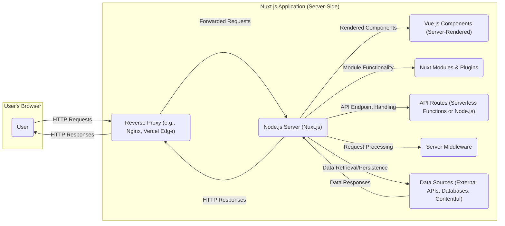
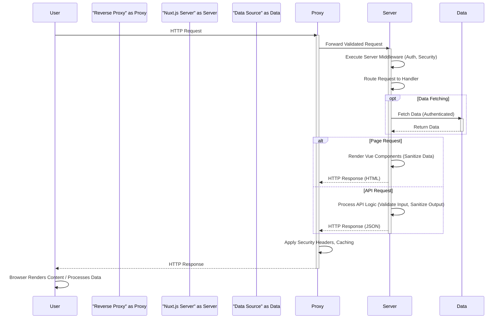

# Project Design Document: Nuxt.js Application

**Version:** 1.1
**Date:** October 26, 2023
**Author:** Gemini (AI Language Model)
**Project:** Nuxt.js Application (Based on https://github.com/nuxt/nuxt.js)

## 1. Introduction

This document outlines the design of a typical application built using the Nuxt.js framework, with a strong emphasis on aspects relevant to security threat modeling. It provides a detailed overview of the architecture, key components, and data flow, serving as the foundation for identifying potential threats and vulnerabilities. This document focuses on common patterns and features of Nuxt.js applications rather than a specific implementation, aiming to be broadly applicable.

## 2. Goals and Objectives

*   Clearly define the architectural components of a typical Nuxt.js application with a security lens.
*   Illustrate the data flow within the application, highlighting security-sensitive pathways.
*   Identify key interaction points and trust boundaries relevant to security.
*   Provide a robust basis for identifying potential threats, vulnerabilities, and attack vectors.
*   Serve as a comprehensive reference point for security analysis, risk assessment, and mitigation strategies.

## 3. System Architecture

A Nuxt.js application typically adopts a client-server architecture, leveraging Node.js for server-side rendering (SSR) and providing a rich user experience through a Vue.js frontend.

### 3.1. High-Level Architecture

### 3.2. Component Breakdown

*   **User:** The end-user interacting with the application via a web browser. Their browser environment and any installed extensions represent a potential attack surface.
*   **Reverse Proxy:** Handles incoming user requests, providing essential security functions such as:
    *   SSL/TLS termination, encrypting communication.
    *   Load balancing, distributing traffic to prevent overload.
    *   Web Application Firewall (WAF) capabilities, filtering malicious requests.
    *   Caching, improving performance and reducing server load.
    *   Security header enforcement (e.g., HSTS, CSP).
*   **Node.js Server (Nuxt.js):** The core runtime environment for the Nuxt.js application, responsible for:
    *   Server-side rendering of Vue.js components, potentially introducing XSS vulnerabilities if not handled carefully.
    *   Routing and request handling, managing how incoming requests are processed.
    *   Execution of server middleware for tasks like authentication and authorization.
    *   Handling API routes, exposing backend functionality.
    *   Managing and executing Nuxt modules and plugins.
*   **Vue.js Components (Server-Rendered):** The UI building blocks, rendered on the server for initial page load. Security considerations include:
    *   Properly sanitizing data before rendering to prevent XSS.
    *   Avoiding the exposure of sensitive information in the rendered HTML.
*   **Nuxt Modules & Plugins:** Extend Nuxt.js functionality. Security implications include:
    *   Potential vulnerabilities in third-party modules (supply chain risks).
    *   Misconfigurations of modules that could expose sensitive data or introduce vulnerabilities.
*   **API Routes (Serverless Functions or Node.js):** Backend endpoints for data retrieval and manipulation. Critical security considerations:
    *   Input validation to prevent injection attacks.
    *   Authentication and authorization to control access.
    *   Secure data handling and sanitization.
    *   Protection against common web application vulnerabilities (OWASP Top Ten).
*   **Server Middleware:** Functions executed during the request lifecycle, used for:
    *   Authentication and authorization checks.
    *   Logging and monitoring.
    *   Request modification and enrichment.
    *   Security header implementation.
*   **Data Sources (External APIs, Databases, Contentful):** External systems where the application retrieves or persists data. Security considerations:
    *   Secure authentication and authorization mechanisms.
    *   Secure data transmission (HTTPS).
    *   Protection against data breaches and unauthorized access.
    *   Input sanitization when querying databases to prevent injection attacks.

## 4. Data Flow

The following describes the typical data flow within a Nuxt.js application, highlighting potential security checkpoints:

1. **User Initiates Request:** The user interacts with the application, triggering an HTTP request (e.g., navigating to a page, submitting a form). This is the initial entry point and a potential target for attacks.
2. **Reverse Proxy Receives Request:** The reverse proxy is the first point of contact. It performs crucial security checks:
    *   SSL/TLS handshake to establish a secure connection.
    *   WAF rules to filter out malicious requests.
    *   Rate limiting to prevent brute-force attacks.
3. **Request Forwarded to Nuxt.js Server:** The reverse proxy forwards the validated request to the Node.js server.
4. **Server Middleware Processing:** Nuxt.js executes configured middleware:
    *   Authentication middleware verifies user credentials.
    *   Authorization middleware checks user permissions.
    *   Security-related middleware sets headers (e.g., Content-Security-Policy).
5. **Routing and Page/API Route Handling:** Nuxt.js determines the appropriate handler based on the request URL.
6. **Data Fetching (Optional):** If the requested page or API route needs data:
    *   The server makes requests to data sources (APIs, databases).
    *   Secure connections and proper authentication are crucial here.
    *   Input validation on data received from external sources is important.
7. **Server-Side Rendering (SSR) or API Response Generation:**
    *   For page requests, Vue.js components are rendered on the server. Care must be taken to sanitize data to prevent XSS.
    *   For API requests, the server processes the request and generates a response (e.g., JSON). Proper output encoding is necessary to prevent injection attacks.
8. **Response Sent to Reverse Proxy:** The generated response is sent back to the reverse proxy.
9. **Reverse Proxy Processes Response:** The reverse proxy may add security headers and cache the response.
10. **Response Delivered to User:** The final response is sent to the user's browser.

## 5. Key Components and Interactions (Security Focus)

This section highlights key components and their interactions, specifically focusing on potential security vulnerabilities and attack vectors.

*   **User Interaction with Frontend (Vue.js Components):**
    *   **Input Fields and Forms:** Primary entry point for user-supplied data, highly susceptible to XSS if not properly handled. Client-side validation can improve UX but is not a security measure.
    *   **Client-Side Routing:** Manipulating the URL can sometimes bypass intended security checks if not implemented carefully on the server-side.
    *   **State Management (e.g., Vuex):** Storing sensitive data in the client-side store increases the risk of exposure if the application is compromised or if the user's device is insecure.
*   **Communication between Browser and Server:**
    *   **HTTP Requests and Responses:** All communication should occur over HTTPS to prevent eavesdropping and man-in-the-middle attacks. Sensitive data should never be transmitted over unencrypted connections.
    *   **Cookies and Local Storage:** Used for session management and storing user preferences. Cookies should be marked as `HttpOnly` and `Secure` to mitigate certain attacks. Sensitive data should be avoided in local storage.
    *   **WebSockets (if used):** Require secure establishment (`wss://`) and careful validation of messages to prevent injection and manipulation.
*   **Server-Side Rendering Process:**
    *   **Rendering Untrusted Data:**  A major source of XSS vulnerabilities. All user-supplied data and data from external sources must be properly encoded before being rendered into HTML.
    *   **Accessing Server-Side Resources:**  Ensure proper authorization checks before allowing rendering logic to access sensitive server-side resources or perform privileged actions.
*   **Nuxt Modules & Plugins:**
    *   **Third-Party Dependencies:** Regularly audit and update dependencies to patch known vulnerabilities. Use tools like `npm audit` or `yarn audit`. Consider using Software Composition Analysis (SCA) tools.
    *   **Module Configurations:** Review module configurations carefully to avoid exposing sensitive information (API keys, database credentials). Use environment variables for sensitive configuration.
*   **API Routes:**
    *   **Input Validation:** Implement robust server-side input validation to prevent injection attacks (SQL, NoSQL, command injection). Use allow-lists rather than deny-lists.
    *   **Authentication and Authorization:** Enforce strong authentication mechanisms (e.g., multi-factor authentication) and implement granular authorization controls to restrict access based on user roles and permissions.
    *   **Data Sanitization:** Sanitize data before storing it in databases to prevent stored XSS and other data integrity issues.
*   **Server Middleware:**
    *   **Authentication and Authorization Logic:** Ensure this logic is robust and correctly implemented to prevent unauthorized access. Avoid relying solely on client-side checks.
    *   **Request Modification:** Be cautious when modifying requests, as this could introduce vulnerabilities if not done securely.
*   **Interaction with Data Sources:**
    *   **Authentication and Authorization:** Use strong, dedicated credentials for accessing databases and APIs. Avoid embedding credentials directly in code.
    *   **Data Transfer Security:** Always use HTTPS to communicate with external services.
    *   **Input Sanitization for Database Queries:** Use parameterized queries or prepared statements to prevent SQL injection vulnerabilities.
*   **Reverse Proxy:**
    *   **SSL/TLS Configuration:** Ensure strong cipher suites and up-to-date TLS versions are configured.
    *   **Security Headers:** Implement security headers like `Content-Security-Policy`, `Strict-Transport-Security`, `X-Frame-Options`, `X-Content-Type-Options`, and `Referrer-Policy` to mitigate various attacks.
    *   **Rate Limiting and DDoS Protection:** Configure rate limiting to prevent brute-force attacks and consider using a DDoS protection service.

## 6. Security Considerations (Detailed)

This section expands on the preliminary security considerations, providing more specific examples and recommendations:

*   **Cross-Site Scripting (XSS):**
    *   **Threat:** Attackers inject malicious scripts into web pages viewed by other users.
    *   **Mitigation:**  Properly escape and sanitize user-supplied data before rendering it in Vue.js components. Use the `v-text` directive or template literals with caution. Leverage browser security features like Content Security Policy (CSP).
*   **Cross-Site Request Forgery (CSRF):**
    *   **Threat:** Attackers trick users into performing unintended actions on a web application in which they are authenticated.
    *   **Mitigation:** Implement anti-CSRF tokens (synchronizer tokens) in forms and AJAX requests. Utilize `SameSite` cookie attribute.
*   **Server-Side Request Forgery (SSRF):**
    *   **Threat:** Attackers manipulate the server to make requests to unintended internal or external resources.
    *   **Mitigation:**  Sanitize and validate user-provided URLs used in server-side requests. Use allow-lists for allowed destinations. Consider network segmentation to limit internal access.
*   **Injection Attacks (SQL, NoSQL, Command Injection):**
    *   **Threat:** Attackers inject malicious code into database queries or system commands.
    *   **Mitigation:**  Use parameterized queries or prepared statements for database interactions. Avoid constructing dynamic SQL queries from user input. Sanitize user input before executing system commands.
*   **Authentication and Authorization Flaws:**
    *   **Threat:** Unauthorized access to resources or functionality.
    *   **Mitigation:** Implement strong password policies, multi-factor authentication, and robust session management. Use role-based access control (RBAC) or attribute-based access control (ABAC).
*   **Session Management Issues:**
    *   **Threat:** Session hijacking, session fixation.
    *   **Mitigation:** Use secure, HTTP-only, and secure cookies. Implement session timeouts and regular session regeneration.
*   **Insecure Dependencies:**
    *   **Threat:** Exploiting known vulnerabilities in third-party libraries.
    *   **Mitigation:** Regularly audit and update dependencies. Use dependency scanning tools.
*   **Exposure of Sensitive Information:**
    *   **Threat:** Accidental disclosure of sensitive data.
    *   **Mitigation:** Avoid storing sensitive data unnecessarily. Encrypt sensitive data at rest and in transit. Sanitize logs and error messages.
*   **Denial of Service (DoS) and Distributed Denial of Service (DDoS):**
    *   **Threat:** Making the application unavailable to legitimate users.
    *   **Mitigation:** Implement rate limiting, use a WAF, and consider a DDoS protection service.
*   **Man-in-the-Middle (MITM) Attacks:**
    *   **Threat:** Attackers intercept communication between the user and the server.
    *   **Mitigation:** Enforce HTTPS for all communication. Use HSTS to instruct browsers to always use secure connections.

## 7. Assumptions and Dependencies

*   The application is deployed behind a properly configured reverse proxy with WAF capabilities.
*   Secure coding practices are followed by developers, including input validation and output encoding.
*   Regular security audits and penetration testing are conducted.
*   The underlying infrastructure (operating system, Node.js environment) is kept up-to-date with security patches.
*   Sensitive configuration data (API keys, database credentials) is managed securely using environment variables or a secrets management system.

## 8. Future Considerations

*   Detailed design of specific security features, such as authentication and authorization flows.
*   Implementation details of security logging and monitoring.
*   Integration with security information and event management (SIEM) systems.
*   Specific strategies for handling Personally Identifiable Information (PII) and compliance with relevant regulations (e.g., GDPR, CCPA).
*   Disaster recovery and business continuity planning.

This document provides a comprehensive security-focused design overview of a typical Nuxt.js application. It serves as a valuable resource for threat modeling, security analysis, and the development of robust security controls.