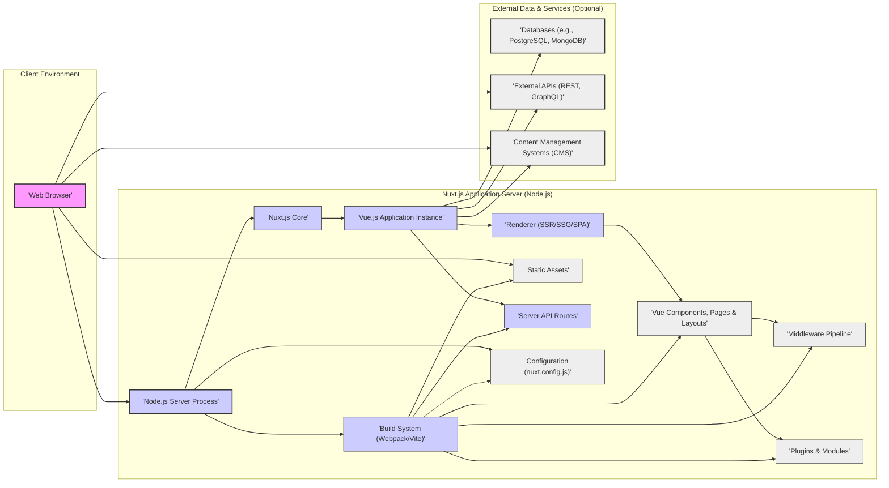

## Project Design Document: Nuxt.js (Improved)

**Version:** 1.1
**Date:** 2023-10-27
**Author:** AI Software Architect

### 1. Project Overview

*   **Project Name:** Nuxt.js
*   **Project Repository:** [https://github.com/nuxt/nuxt.js](https://github.com/nuxt/nuxt.js)
*   **Project Description:** Nuxt.js is a free and open-source web application framework based on Vue.js, designed to simplify and accelerate the development of modern web applications. It provides a structured approach to building universal Vue.js applications (Server-Side Rendered and Static Site Generated) as well as Single-Page Applications (SPAs). Nuxt.js offers built-in features and conventions for routing, state management (with Vuex integration), server-side rendering, static site generation, middleware, modules, and more. It aims to enhance developer productivity, improve application performance, and optimize SEO for Vue.js projects. Nuxt.js benefits from a large and active open-source community.
*   **Project Goals:**
    *   Provide a robust and flexible framework for building production-ready Vue.js applications.
    *   Simplify the complexities of server-side rendering and static site generation for Vue.js.
    *   Offer a modular and extensible architecture to accommodate diverse project requirements.
    *   Improve developer experience through intuitive conventions, powerful tooling, and hot reloading.
    *   Optimize web application performance, accessibility, and search engine optimization (SEO).
    *   Foster a thriving open-source community and ecosystem around Nuxt.js.
*   **Target Audience:**
    *   Frontend web developers proficient in JavaScript and Vue.js.
    *   Full-stack developers seeking a streamlined framework for Vue.js based projects.
    *   Teams and organizations requiring performant, SEO-friendly, and maintainable web applications.
    *   Developers interested in leveraging server-side rendering or static site generation with Vue.js.
    *   Individuals and companies contributing to the open-source Vue.js and Nuxt.js ecosystems.

### 2. System Architecture

#### 2.1. High-Level Architecture Diagram



#### 2.2. Component Descriptions

*   **'Web Browser' (Client Environment):**
    *   The user's web browser, acting as the client for the Nuxt.js application.
    *   Responsible for:
        *   Sending HTTP requests to the Nuxt.js server.
        *   Receiving and rendering HTML, CSS, and JavaScript.
        *   Executing client-side JavaScript code.
        *   Handling user interactions and events.
        *   Storing client-side data (e.g., cookies, local storage).

*   **'Node.js Server Process' (Nuxt.js Application Server):**
    *   The backend server environment powered by Node.js, hosting the Nuxt.js application.
    *   Key responsibilities:
        *   Receiving and processing HTTP requests from the browser.
        *   Serving static assets (images, fonts, etc.).
        *   Handling server-side rendering (SSR) or serving pre-rendered static pages (SSG).
        *   Executing server API routes for backend logic.
        *   Managing the Nuxt.js application lifecycle.

*   **'Nuxt.js Core':**
    *   The core framework logic of Nuxt.js, providing structure and features.
    *   Handles:
        *   Routing based on the `pages/` directory structure.
        *   Middleware execution for request processing.
        *   Plugin and module loading and integration.
        *   Configuration management from `nuxt.config.js`.
        *   Orchestration of the build process.

*   **'Vue.js Application Instance':**
    *   The instantiated Vue.js application at the heart of Nuxt.js.
    *   Composed of:
        *   Vue components (reusable UI elements).
        *   Pages (Vue components in `pages/` defining routes).
        *   Layouts (Vue components in `layouts/` for page structure).
        *   Optionally, Vuex store for centralized state management.
        *   Vue Router for client-side navigation (in SPA mode or client-side hydration).

*   **'Renderer (SSR/SSG/SPA)':**
    *   The rendering engine responsible for generating the application's UI output.
    *   Modes:
        *   **Server-Side Rendering (SSR):** Renders Vue components to HTML on the server for each request.
        *   **Static Site Generation (SSG):** Pre-renders pages to static HTML files during build time.
        *   **Single-Page Application (SPA):** Renders primarily on the client-side after initial HTML load (can be used in conjunction with SSR/SSG for parts of the application).
    *   Optimizes rendering for performance and SEO based on the chosen mode.

*   **'Vue Components, Pages & Layouts':**
    *   Building blocks of the Nuxt.js application's user interface.
    *   **Components:** Reusable Vue.js components located in the `components/` directory.
    *   **Pages:** Vue.js components in the `pages/` directory that define application routes and are automatically mapped to URLs.
    *   **Layouts:** Vue.js components in the `layouts/` directory that provide consistent structure and UI elements (headers, footers) around pages.

*   **'Middleware Pipeline':**
    *   A series of functions executed in a specific order before handling requests for pages or API routes.
    *   Used for:
        *   Authentication and authorization.
        *   Request logging and monitoring.
        *   Data fetching and pre-processing.
        *   Redirects and route protection.
    *   Can be defined globally or for specific pages/layouts.

*   **'Plugins & Modules':**
    *   Mechanisms for extending Nuxt.js functionality and integrating with external libraries and services.
    *   **Plugins:** Vue.js plugins or JavaScript modules executed during application initialization, often for client-side enhancements or library integrations.
    *   **Modules:** Nuxt.js modules are packages that extend core Nuxt.js features, add build-time configurations, server middleware, or integrate with backend services.

*   **'Static Assets':**
    *   Files in the `static/` directory served directly to the browser without processing.
    *   Typically includes:
        *   Images
        *   Fonts
        *   Favicons
        *   Other static files.
    *   Accessible at the application's root path.

*   **'Server API Routes':**
    *   Backend API endpoints defined within the `server/api/` directory (or custom server configurations).
    *   Handle server-side logic, data processing, and interactions with databases or external services.
    *   Accessed by the client-side application via HTTP requests (e.g., using `fetch` or `axios`).

*   **'Configuration (nuxt.config.js)':**
    *   The primary configuration file for Nuxt.js projects.
    *   Defines settings for:
        *   Application behavior.
        *   Modules and plugins.
        *   Build process (Webpack/Vite).
        *   Server configuration.
        *   Deployment options.

*   **'Build System (Webpack/Vite)':**
    *   Tools used to bundle, optimize, and transform the Nuxt.js application for deployment.
    *   **Webpack:** Historically the default bundler, handles module bundling, code splitting, and asset optimization.
    *   **Vite:** A modern, faster build tool increasingly adopted by Nuxt.js, known for its speed and developer experience.
    *   Manages tasks like:
        *   Compiling Vue components.
        *   Transpiling JavaScript.
        *   Optimizing assets (images, CSS).
        *   Generating production-ready bundles.

*   **'Databases (e.g., PostgreSQL, MongoDB)' (External Data & Services):**
    *   External database systems used to persist and manage application data.
    *   Accessed by the Nuxt.js server-side application or API routes.
    *   Examples: Relational databases (PostgreSQL, MySQL), NoSQL databases (MongoDB, Firestore).

*   **'External APIs (REST, GraphQL)' (External Data & Services):**
    *   External web services and APIs that the Nuxt.js application interacts with to fetch data or perform actions.
    *   Can be RESTful APIs, GraphQL APIs, or other types of web services.
    *   Accessed from both client-side and server-side code depending on the use case.

*   **'Content Management Systems (CMS)' (External Data & Services):**
    *   External platforms used to manage and deliver content for the Nuxt.js application.
    *   Nuxt.js can fetch content from CMS APIs to dynamically render content within the application.
    *   Examples: Headless CMS (Contentful, Strapi, Sanity), traditional CMS with REST APIs (WordPress).

### 3. Data Flow

#### 3.1. Data Flow Diagram

```mermaid
graph LR
    subgraph "Client Browser"
        A["'Browser Request'"]
        B["'Client-Side Logic & UI'"]
    end
    subgraph "Nuxt.js Server"
        C["'Node.js Server'"]
        D["'Nuxt.js Application'"]
        E["'Rendering Engine (SSR/SSG)'"]
        F["'Data Fetching (asyncData, fetch, API Calls)'"]
        G["'API Routes'"]
        H["'External APIs & CMS'"]
        I["'Databases'"]
        J["'Vuex State Management (Optional)'"]
    end

    A -- "Page Request / Navigation" --> C
    C -- "Application Logic & Routing" --> D
    D -- "Rendering Trigger" --> E
    E -- "Data Requirements" --> F
    F -- "API Request" --> G
    F -- "External API/CMS Request" --> H
    F -- "Database Query" --> I
    G -- "Data Response" --> F
    H -- "Data Response" --> F
    I -- "Data Response" --> F
    F -- "Data for Rendering" --> E
    E -- "Rendered HTML" --> C
    C -- "HTTP Response (HTML, Assets)" --> A
    A -- "Client-Side Hydration & Interaction" --> B
    B -- "Client API Request" --> G
    G -- "Data Response" --> B
    B -- "State Updates" --> J
    J -- "State Data" --> B

    style A fill:#f9f,stroke:#333,stroke-width:2px
    style B fill:#f9f,stroke:#333,stroke-width:1px
    style C fill:#ccf,stroke:#333,stroke-width:2px
    style D fill:#ccf,stroke:#333,stroke-width:1px
    style E fill:#ccf,stroke:#333,stroke-width:1px
    style F fill:#eee,stroke:#333,stroke-width:1px
    style G fill:#ccf,stroke:#333,stroke-width:1px
    style H fill:#eee,stroke:#333,stroke-width:2px
    style I fill:#eee,stroke:#333,stroke-width:2px
    style J fill:#ccf,stroke:#333,stroke-width:1px

    linkStyle 0,1,2,3,4,5,6,7,8,9,10,11,12,13,14,15,16,17,18,19,20,21 stroke:#333, stroke-width:1.5px;
```

#### 3.2. Data Flow Description

*   **Initial Page Request:**
    *   The 'Browser Request' initiates when a user navigates to a Nuxt.js application URL or reloads a page.
    *   The request is sent to the 'Node.js Server'.

*   **Server-Side Processing and Routing:**
    *   The 'Node.js Server' receives the request and passes it to the 'Nuxt.js Application'.
    *   Nuxt.js determines the appropriate page component based on the requested route.

*   **Rendering Trigger and Data Fetching:**
    *   The 'Rendering Engine (SSR/SSG)' is triggered to render the page.
    *   If data is required for rendering (e.g., dynamic content), the 'Data Fetching' process is initiated.
    *   Data fetching can involve:
        *   'API Request' to 'API Routes' within the Nuxt.js application.
        *   'External API/CMS Request' to 'External APIs & CMS' platforms.
        *   'Database Query' to 'Databases'.

*   **Data Retrieval and Response:**
    *   'API Routes', 'External APIs & CMS', or 'Databases' process the data requests.
    *   Data is retrieved and sent back as 'Data Response' to the 'Data Fetching' component.

*   **Rendering with Data:**
    *   The 'Data for Rendering' is passed to the 'Rendering Engine'.
    *   The 'Rendering Engine' renders the Vue components into HTML, incorporating the fetched data.

*   **Server Response to Browser:**
    *   The 'Rendered HTML' is sent back to the 'Node.js Server'.
    *   The 'Node.js Server' sends an 'HTTP Response' (containing HTML, CSS, JavaScript assets) back to the 'Browser Request'.

*   **Client-Side Hydration and Interaction:**
    *   The 'Browser Request' receives the 'HTTP Response' and renders the initial HTML.
    *   'Client-Side Hydration & Interaction' begins, where Vue.js takes over client-side control.
    *   'Client-Side Logic & UI' handles user interactions, dynamic updates, and further client-side routing (in SPA mode).

*   **Client-Side API Calls and State Management:**
    *   'Client-Side Logic & UI' can make 'Client API Request' to 'API Routes' for further data or actions.
    *   'API Routes' respond with 'Data Response' to the client.
    *   Optionally, 'State Updates' can be made to the 'Vuex State Management' for client-side state changes.
    *   'Vuex State Management' provides 'State Data' to the 'Client-Side Logic & UI' for reactive updates.

### 4. Technology Stack

*   **Core Technologies:**
    *   JavaScript (Primary programming language for both client and server-side).
    *   Vue.js (Progressive JavaScript framework for building user interfaces).
    *   Node.js (JavaScript runtime environment for server-side execution).
    *   HTML (Markup language for structuring web content).
    *   CSS (Stylesheet language for styling web content).

*   **Build and Development Tools:**
    *   Webpack or Vite (Module bundlers for packaging and optimizing application assets).
    *   npm, yarn, or pnpm (Package managers for managing project dependencies).
    *   Babel (JavaScript compiler for compatibility across browsers).
    *   ESLint (JavaScript linter for code quality and style consistency).
    *   Prettier (Code formatter for consistent code style).

*   **Routing and State Management (Optional):**
    *   Vue Router (Official routing library for Vue.js, integrated into Nuxt.js).
    *   Vuex (Official state management library for Vue.js, optional integration in Nuxt.js).

*   **Server-Side Framework (Implicit):**
    *   Koa (Underlying HTTP server framework used by Nuxt.js, though often abstracted).

*   **Deployment Environments:**
    *   **Server-based:**
        *   Traditional servers (e.g., Apache, Nginx with Node.js reverse proxy).
        *   Virtual Machines (VMs) or cloud instances (e.g., AWS EC2, Google Compute Engine).
        *   Containers (Docker, Kubernetes).
    *   **Serverless:**
        *   Vercel (Optimized platform for Nuxt.js deployment).
        *   Netlify (Serverless platform with excellent Nuxt.js support).
        *   AWS Lambda & API Gateway, Netlify Functions, etc. (Serverless function platforms).
    *   **Static Hosting (for SSG):**
        *   CDNs (Content Delivery Networks) like Cloudflare, AWS CloudFront.
        *   Static site hosting services (Netlify, Vercel, AWS S3, GitHub Pages).

### 5. Key Features Relevant to Security

*   **Server-Side Rendering (SSR) & Static Site Generation (SSG):**
    *   **Security Benefits:** Can improve initial load performance, potentially reducing the window for client-side vulnerabilities to be exploited during initial rendering. SSG reduces the server-side attack surface for static content.
    *   **Security Risks:**
        *   **Server-Side Vulnerabilities:** SSR introduces server-side execution of JavaScript, increasing the risk of server-side vulnerabilities (e.g., Node.js vulnerabilities, dependency vulnerabilities).
        *   **Injection Attacks (XSS):** If server-side rendering logic doesn't properly sanitize data before rendering, it can be vulnerable to Cross-Site Scripting (XSS) attacks.
        *   **Build Process Security (SSG):** For SSG, the build process becomes critical. Compromised build tools or dependencies could inject malicious content into static files.

*   **Routing and Middleware:**
    *   **Security Benefits:** Middleware provides a centralized mechanism to implement security measures like authentication, authorization, and input validation before requests reach application logic.
    *   **Security Risks:**
        *   **Route Misconfiguration:** Incorrectly configured routes or lack of proper authorization middleware can lead to unauthorized access to sensitive pages or functionalities.
        *   **Middleware Bypass:** Vulnerabilities in middleware logic could allow attackers to bypass security checks.
        *   **Exposure of Internal Routes:** Improperly secured API routes can expose backend logic and data.

*   **Modules and Plugins (Third-Party Dependencies):**
    *   **Security Risks:**
        *   **Dependency Vulnerabilities:** Nuxt.js projects rely on numerous npm packages (modules, plugins, dependencies). Vulnerabilities in these dependencies can be exploited.
        *   **Malicious Packages:** Risk of using compromised or malicious npm packages that could introduce backdoors or vulnerabilities.
        *   **Supply Chain Attacks:** Compromised package registries or build pipelines could lead to the injection of malicious code into dependencies.
    *   **Security Best Practices:**
        *   Regularly audit and update dependencies.
        *   Use dependency scanning tools to identify known vulnerabilities.
        *   Carefully evaluate the security and trustworthiness of third-party modules and plugins before using them.

*   **API Routes (Server Routes):**
    *   **Security Risks:**
        *   **Common Web API Vulnerabilities:** API routes are susceptible to standard web API vulnerabilities like:
            *   **Injection Attacks:** SQL Injection, NoSQL Injection, Command Injection if input is not properly validated and sanitized.
            *   **Authentication and Authorization Flaws:** Weak or missing authentication, insecure authorization mechanisms, privilege escalation vulnerabilities.
            *   **Broken Access Control:** Improperly implemented access control leading to unauthorized data access or modification.
            *   **Cross-Site Scripting (XSS) in API Responses:** If API responses are not properly encoded, they could be vulnerable to XSS if consumed by client-side code.
            *   **Insecure Direct Object References (IDOR):** Exposing internal object IDs that can be manipulated to access unauthorized resources.
            *   **Rate Limiting and Denial of Service (DoS):** Lack of rate limiting can make APIs vulnerable to DoS attacks.
        *   **Exposure of Sensitive Data:** API routes might inadvertently expose sensitive data if not designed and secured properly.
    *   **Security Best Practices:**
        *   Implement robust authentication and authorization mechanisms.
        *   Perform thorough input validation and sanitization on all API endpoints.
        *   Apply output encoding to prevent XSS vulnerabilities in API responses.
        *   Implement rate limiting and request throttling to mitigate DoS attacks.
        *   Follow secure API design principles (e.g., principle of least privilege, secure defaults).

*   **Configuration Management (nuxt.config.js):**
    *   **Security Risks:**
        *   **Exposure of Secrets:** Storing sensitive information (API keys, database credentials, secrets) directly in `nuxt.config.js` or committing it to version control is a major security risk.
        *   **Misconfiguration:** Incorrect configuration settings can weaken security (e.g., disabling security headers, insecure build options).
    *   **Security Best Practices:**
        *   **Environment Variables:** Use environment variables to manage sensitive configuration data.
        *   **Secrets Management:** Utilize dedicated secrets management solutions for production environments.
        *   **Secure Defaults:** Review and understand default Nuxt.js configurations and ensure they align with security best practices.

*   **Development vs. Production Environments:**
    *   **Security Risks:**
        *   **Development Mode Exposure:** Running a development build in production exposes debugging information, verbose error messages, and potentially insecure development features (hot reloading) that can be exploited by attackers.
    *   **Security Best Practices:**
        *   **Strict Separation:** Maintain clear separation between development and production environments.
        *   **Production Builds:** Always deploy production-optimized builds to production environments.
        *   **Disable Development Features:** Ensure development-specific features (e.g., hot reloading, verbose logging) are disabled in production.

*   **Content Security Policy (CSP):**
    *   **Security Benefits:** Nuxt.js can be configured to implement Content Security Policy (CSP) headers, which help mitigate XSS attacks by controlling the sources from which the browser is allowed to load resources.
    *   **Security Best Practices:**
        *   Implement and configure CSP headers appropriately for the application's needs.
        *   Regularly review and update CSP policies to ensure they remain effective and don't introduce usability issues.

### 6. Deployment Architecture Security Considerations

*   **Server-Based Deployment:**
    *   **Security Considerations:**
        *   **Operating System Hardening:** Secure the underlying operating system of the server (patching, minimal services, secure configurations).
        *   **Network Security:** Implement firewalls, intrusion detection/prevention systems (IDS/IPS) to protect the server and network.
        *   **Access Control:** Restrict access to the server and application to authorized personnel only.
        *   **Regular Security Audits:** Conduct periodic security audits and penetration testing of the server infrastructure and application.
        *   **Node.js Security:** Keep Node.js and npm dependencies updated to patch known vulnerabilities.
        *   **Reverse Proxy Security:** If using a reverse proxy (Nginx, Apache), ensure it is securely configured and hardened.

*   **Serverless Deployment:**
    *   **Security Considerations:**
        *   **Serverless Platform Security:** Rely on the security provided by the serverless platform provider (Vercel, Netlify, AWS). Understand the platform's security model and shared responsibility.
        *   **Function Security:** Secure serverless functions (API routes) by:
            *   Implementing proper authentication and authorization within functions.
            *   Validating and sanitizing input within functions.
            *   Following secure coding practices in function code.
            *   Minimizing function execution time and resource usage to reduce attack surface.
        *   **IAM Roles and Permissions:** Configure least privilege IAM roles and permissions for serverless functions to restrict access to other cloud resources.
        *   **Secrets Management (Serverless):** Utilize serverless platform's secrets management features or external secrets management services to securely store and access sensitive credentials.
        *   **Function Monitoring and Logging:** Implement monitoring and logging for serverless functions to detect and respond to security incidents.

*   **Static Hosting (for SSG applications):**
    *   **Security Considerations:**
        *   **Build Process Security:** Secure the build pipeline to prevent injection of malicious content into static files.
        *   **CDN Security:** Utilize a reputable CDN provider and configure CDN security features (e.g., DDoS protection, WAF).
        *   **Access Control (Static Assets):** Implement access control mechanisms (if needed) to restrict access to sensitive static assets.
        *   **HTTPS/TLS:** Enforce HTTPS for all static content delivery to protect data in transit.
        *   **Subresource Integrity (SRI):** Consider using Subresource Integrity (SRI) to ensure that resources fetched from CDNs have not been tampered with.

This improved design document provides a more comprehensive and security-focused overview of Nuxt.js architecture, data flow, and deployment considerations. It is intended to be a valuable resource for threat modeling and security analysis of Nuxt.js applications.