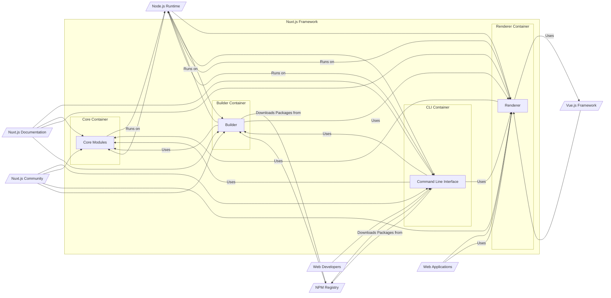
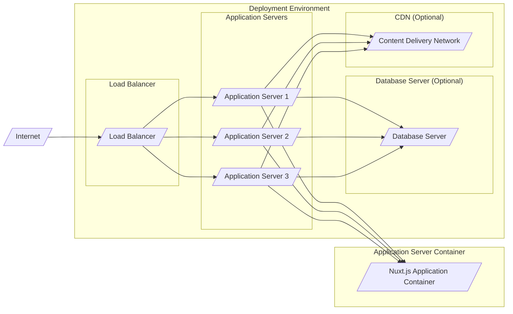
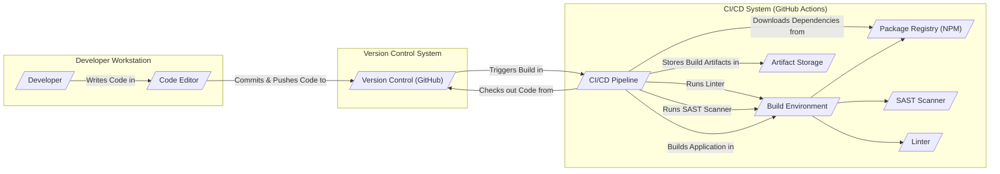

# BUSINESS POSTURE

- Business Priorities and Goals:
  - Nuxt.js aims to provide a streamlined and efficient framework for building modern web applications with Vue.js.
  - Key priorities include developer experience, performance, flexibility, and scalability of applications built with Nuxt.js.
  - The project strives to be a leading framework in the Vue.js ecosystem, empowering developers to create high-quality web applications quickly and effectively.
  - Nuxt.js is open-source and community-driven, relying on contributions and feedback from its users to improve and evolve.
  - A significant goal is to maintain a vibrant and active community around Nuxt.js, providing support, resources, and a collaborative environment for developers.

- Business Risks:
  - Security vulnerabilities in the framework itself could impact a large number of applications built with Nuxt.js, leading to potential reputational damage and security incidents for users.
  - Dependence on community contributions for security fixes and updates could lead to delays in addressing vulnerabilities if the community response is slow or insufficient.
  - Lack of dedicated security resources or formal security audits could increase the risk of overlooking critical security flaws in the framework.
  - Compatibility issues with underlying technologies (Node.js, Vue.js, JavaScript ecosystem) or breaking changes in dependencies could disrupt development workflows and application stability.
  - Negative perception or loss of trust in the framework due to security incidents or lack of responsiveness to security concerns could lead to decreased adoption and community engagement.

# SECURITY POSTURE

- Existing Security Controls:
  - security control: Open Source Codebase - The source code is publicly available on GitHub, allowing for community review and scrutiny, which can help identify potential security vulnerabilities. Implemented: GitHub Repository.
  - security control: Community Contributions - Security patches and vulnerability reports can be submitted by the community through GitHub pull requests and issue reports. Implemented: GitHub Contribution Model.
  - security control: Dependency Management - Nuxt.js uses `package-lock.json` or similar to manage dependencies, helping to ensure consistent and reproducible builds and potentially mitigate supply chain risks. Implemented: Package Management (npm/yarn).
  - security control: Regular Updates - The Nuxt.js team releases updates and bug fixes, which may include security patches. Implemented: Release Cycle (observed from GitHub releases).
  - security control: Documentation - Security considerations and best practices for Nuxt.js applications are documented in the official Nuxt.js documentation. Implemented: nuxtjs.org documentation.

- Accepted Risks:
  - accepted risk: Reliance on Community Security Audits -  The project may rely heavily on the community to identify and report security vulnerabilities, which might not be as comprehensive or timely as professional security audits.
  - accepted risk: Potential for Dependency Vulnerabilities - Nuxt.js depends on a large number of third-party libraries, which could introduce vulnerabilities. While dependency management helps, it doesn't eliminate the risk entirely.
  - accepted risk: Open Source Security Model - The open nature of the project means that vulnerability information is publicly accessible, potentially increasing the window of opportunity for attackers before patches are widely deployed.

- Recommended Security Controls:
  - security control: Implement Automated Security Scanning - Integrate automated security scanning tools (SAST, DAST, dependency scanning) into the CI/CD pipeline to proactively identify vulnerabilities in the codebase and dependencies.
  - security control: Establish a Security Response Process - Define a clear process for handling security vulnerability reports, including triage, patching, and public disclosure.
  - security control: Conduct Regular Security Audits - Perform periodic security audits by external security experts to identify and address potential security weaknesses in the framework.
  - security control: Security Champions Program -  Establish a security champions program within the core team and community to promote security awareness and best practices.
  - security control:  Provide Security Hardening Guides - Create and maintain security hardening guides and best practices documentation specifically for Nuxt.js applications, covering topics like secure configuration, input validation, and output encoding.

- Security Requirements:
  - Authentication:
    - Nuxt.js itself does not handle authentication directly, but applications built with Nuxt.js will likely require authentication mechanisms.
    - Security Requirement: Applications built with Nuxt.js should implement robust authentication mechanisms to verify user identities.
    - Security Requirement: Nuxt.js documentation should provide guidance on secure authentication practices within Nuxt.js applications, including integration with common authentication providers and strategies.
  - Authorization:
    - Similar to authentication, authorization is application-specific but crucial for secure Nuxt.js applications.
    - Security Requirement: Applications built with Nuxt.js should implement proper authorization controls to manage user access to resources and functionalities based on roles and permissions.
    - Security Requirement: Nuxt.js documentation should offer best practices for implementing authorization in Nuxt.js applications, covering role-based access control (RBAC) and attribute-based access control (ABAC) concepts.
  - Input Validation:
    - Nuxt.js applications, especially those interacting with user input or external data sources, must perform thorough input validation to prevent injection attacks.
    - Security Requirement: Nuxt.js applications should validate all user inputs on both the client-side and server-side to prevent common vulnerabilities like cross-site scripting (XSS) and SQL injection.
    - Security Requirement: Nuxt.js framework should encourage and facilitate secure input handling practices, potentially through built-in validation utilities or recommendations in the documentation.
  - Cryptography:
    - Nuxt.js applications may need to handle sensitive data that requires encryption in transit and at rest.
    - Security Requirement: Applications built with Nuxt.js should utilize strong cryptography for protecting sensitive data, including HTTPS for communication and appropriate encryption methods for data storage.
    - Security Requirement: Nuxt.js documentation should provide guidance on using cryptography securely within Nuxt.js applications, emphasizing best practices for key management and algorithm selection.

# DESIGN

## C4 CONTEXT

```mermaid
flowchart LR
    subgraph "Nuxt.js Ecosystem"
        center "Nuxt.js Framework"
    end
    User[/"Web Developers"/] --> center
    WebApp[/"Web Applications"/] --> center
    VueJS[/"Vue.js Framework"/] --> center
    NodeJS[/"Node.js Runtime"/] --> center
    NPM[/"NPM Registry"/] --> center
    Documentation[/"Nuxt.js Documentation"/] --> center
    Community[/"Nuxt.js Community"/] --> center

    center -- "Uses" --> VueJS
    center -- "Runs on" --> NodeJS
    center -- "Uses Packages from" --> NPM
    center -- "Builds" --> WebApp
    User -- "Develops with" --> center
    User -- "Uses" --> Documentation
    User -- "Participates in" --> Community
    WebApp -- "Deployed by" --> User
```

- Context Diagram Elements:
  - - Name: Nuxt.js Framework
    - Type: Software System
    - Description: Nuxt.js is a free and open-source web application framework based on Vue.js, providing structure and features for building modern web applications.
    - Responsibilities: Provides a framework for building Vue.js applications, including server-side rendering, routing, state management, and build tooling.
    - Security controls: Open source codebase, community review, dependency management.
  - - Name: Web Developers
    - Type: Person
    - Description: Developers who use Nuxt.js to build web applications.
    - Responsibilities: Develop web applications using Nuxt.js, deploy and maintain these applications, contribute to the Nuxt.js community.
    - Security controls: Responsible for secure coding practices in applications built with Nuxt.js, implementing security controls in their applications.
  - - Name: Web Applications
    - Type: Software System
    - Description: Web applications built using the Nuxt.js framework.
    - Responsibilities: Provide web-based functionalities to end-users, handle user requests, process data, and interact with other systems.
    - Security controls: Application-specific security controls implemented by developers, such as authentication, authorization, input validation, and data protection.
  - - Name: Vue.js Framework
    - Type: Software System
    - Description: The underlying JavaScript framework upon which Nuxt.js is built.
    - Responsibilities: Provides the core component model, reactivity system, and rendering engine for Nuxt.js applications.
    - Security controls: Vue.js security controls, community review, vulnerability patching by Vue.js team.
  - - Name: Node.js Runtime
    - Type: Software System
    - Description: The JavaScript runtime environment that Nuxt.js and Nuxt.js applications run on.
    - Responsibilities: Executes JavaScript code, provides server-side capabilities for Nuxt.js applications.
    - Security controls: Node.js security controls, security updates provided by Node.js foundation.
  - - Name: NPM Registry
    - Type: Software System
    - Description: A public registry of JavaScript packages used by Nuxt.js and its ecosystem.
    - Responsibilities: Hosts and distributes JavaScript packages, including Nuxt.js modules and dependencies.
    - Security controls: NPM security scanning, package verification, vulnerability reporting mechanisms.
  - - Name: Nuxt.js Documentation
    - Type: Information System
    - Description: Official documentation for Nuxt.js, providing guides, tutorials, and API references.
    - Responsibilities: Provides information and guidance to developers on how to use Nuxt.js, including security best practices.
    - Security controls: Documentation hosted on a secure platform, access controls to documentation content management system.
  - - Name: Nuxt.js Community
    - Type: Organization
    - Description: The community of developers, contributors, and users surrounding the Nuxt.js project.
    - Responsibilities: Contributes to the development of Nuxt.js, provides support to other users, reports bugs and security vulnerabilities.
    - Security controls: Community guidelines, code of conduct, moderation of community forums.

## C4 CONTAINER



- Container Diagram Elements:
  - - Name: Core Modules
    - Type: Container - Code Library
    - Description: Contains the core logic and functionalities of the Nuxt.js framework, including routing, data fetching, module system, and configuration management.
    - Responsibilities: Provides fundamental building blocks for Nuxt.js applications, manages framework lifecycle, handles core functionalities.
    - Security controls: Code review, unit testing, integration testing, vulnerability scanning of core modules.
  - - Name: Command Line Interface (CLI)
    - Type: Container - Application
    - Description: Provides command-line tools for developers to create, build, and manage Nuxt.js projects.
    - Responsibilities: Project scaffolding, development server, build process initiation, code generation, project management commands.
    - Security controls: Input validation for CLI commands, secure handling of project configuration, protection against command injection vulnerabilities.
  - - Name: Renderer
    - Type: Container - Application
    - Description: Responsible for rendering Vue.js components into HTML, handling server-side rendering (SSR) and static site generation (SSG).
    - Responsibilities: Server-side rendering of Vue.js applications, handling client-side hydration, managing application routes, serving static assets.
    - Security controls: Output encoding to prevent XSS vulnerabilities, secure handling of server-side data, protection against SSR-related vulnerabilities.
  - - Name: Builder
    - Type: Container - Application
    - Description: Handles the build process of Nuxt.js applications, including bundling, optimization, and code transformation.
    - Responsibilities: Compiling Vue.js components, bundling JavaScript and CSS assets, optimizing application performance, generating production-ready builds.
    - Security controls: Secure build pipeline, dependency vulnerability scanning during build, integrity checks of build artifacts, protection against build-time injection vulnerabilities.

## DEPLOYMENT

- Deployment Options:
  - Server Deployment (Node.js server): Nuxt.js application is deployed as a Node.js server, handling requests dynamically. Suitable for SSR applications.
  - Static Site Hosting (CDN): Nuxt.js application is pre-rendered into static HTML files and deployed to a CDN or static hosting service. Suitable for SSG applications.
  - Serverless Functions: Parts of Nuxt.js application logic can be deployed as serverless functions (e.g., API routes). Suitable for specific functionalities or microservices architecture.

- Detailed Deployment (Server Deployment - Node.js server):



- Deployment Diagram Elements (Server Deployment - Node.js server):
  - - Name: Load Balancer
    - Type: Infrastructure - Load Balancer
    - Description: Distributes incoming traffic across multiple application servers to ensure high availability and scalability.
    - Responsibilities: Traffic distribution, health checks of application servers, SSL termination (optional).
    - Security controls: DDoS protection, rate limiting, SSL/TLS encryption, access control lists.
  - - Name: Application Server 1, 2, 3
    - Type: Infrastructure - Virtual Machine/Container
    - Description: Servers hosting instances of the Nuxt.js application.
    - Responsibilities: Running the Nuxt.js application, handling HTTP requests, processing application logic, interacting with database and CDN.
    - Security controls: Operating system hardening, firewall configuration, intrusion detection system, regular security patching, access controls, security monitoring.
  - - Name: Database Server (Optional)
    - Type: Infrastructure - Database Server
    - Description: Database server used by the Nuxt.js application to store and retrieve data (e.g., PostgreSQL, MySQL, MongoDB).
    - Responsibilities: Data persistence, data management, database operations for the application.
    - Security controls: Database access controls, encryption at rest and in transit, database hardening, regular backups, vulnerability scanning.
  - - Name: CDN (Optional)
    - Type: Infrastructure - Content Delivery Network
    - Description: Caches and delivers static assets (e.g., JavaScript, CSS, images) to users from geographically distributed servers, improving performance.
    - Responsibilities: Caching static content, content delivery, reducing latency for users.
    - Security controls: CDN security features (e.g., DDoS protection, WAF), secure content delivery (HTTPS), access controls to CDN configuration.
  - - Name: Nuxt.js Application Container
    - Type: Container - Application Runtime
    - Description: Containerized environment running the Nuxt.js application code and dependencies.
    - Responsibilities: Execution of Nuxt.js application, isolation from other applications, resource management.
    - Security controls: Container image scanning, container runtime security, resource limits, network policies, security context configuration.

## BUILD



- Build Diagram Elements:
  - - Name: Developer
    - Type: Person
    - Description: Software developer working on the Nuxt.js project or applications built with Nuxt.js.
    - Responsibilities: Writing code, committing changes, initiating build processes.
    - Security controls: Secure development practices, code review, access control to development environment.
  - - Name: Code Editor
    - Type: Tool - IDE/Text Editor
    - Description: Integrated Development Environment or text editor used by developers to write code.
    - Responsibilities: Code editing, syntax highlighting, code completion, debugging.
    - Security controls: Secure code editor plugins, protection against malicious extensions.
  - - Name: Version Control (GitHub)
    - Type: Service - Version Control System
    - Description: GitHub repository used for storing and managing the Nuxt.js codebase.
    - Responsibilities: Source code management, version history, collaboration, pull requests, code review.
    - Security controls: Access controls, branch protection, audit logs, vulnerability scanning of repository.
  - - Name: CI/CD Pipeline (GitHub Actions)
    - Type: Service - Continuous Integration/Continuous Delivery
    - Description: Automated CI/CD pipeline using GitHub Actions to build, test, and potentially deploy Nuxt.js projects.
    - Responsibilities: Automated build process, testing, security checks, artifact generation, deployment automation.
    - Security controls: Secure CI/CD configuration, access controls to pipeline, secrets management, build environment security, audit logs.
  - - Name: Build Environment
    - Type: Environment - Containerized/Virtual Environment
    - Description: Isolated environment used for building the Nuxt.js project, including necessary tools and dependencies.
    - Responsibilities: Providing a consistent and reproducible build environment, executing build scripts, running security scans.
    - Security controls: Hardened build environment, minimal tools and dependencies, access controls, regular updates.
  - - Name: Package Registry (NPM)
    - Type: Service - Package Repository
    - Description: NPM registry used to download dependencies required for building Nuxt.js projects.
    - Responsibilities: Hosting and distributing JavaScript packages, dependency resolution.
    - Security controls: NPM security scanning, package verification, dependency vulnerability checks.
  - - Name: SAST Scanner
    - Type: Tool - Static Application Security Testing
    - Description: Static analysis security testing tool used to scan the codebase for potential security vulnerabilities during the build process.
    - Responsibilities: Identifying potential security flaws in the code without executing it.
    - Security controls: SAST tool configuration, vulnerability reporting, integration with CI/CD pipeline.
  - - Name: Linter
    - Type: Tool - Code Linter
    - Description: Code linting tool used to enforce code style and identify potential code quality issues during the build process.
    - Responsibilities: Code style enforcement, identifying potential bugs and code smells.
    - Security controls: Linter configuration, custom rule sets for security best practices.
  - - Name: Artifact Storage
    - Type: Service - Artifact Repository
    - Description: Storage location for build artifacts, such as compiled code, packages, and container images.
    - Responsibilities: Storing build artifacts, versioning, access control to artifacts.
    - Security controls: Access controls, encryption at rest, integrity checks of artifacts.

# RISK ASSESSMENT

- Critical Business Processes:
  - Development and maintenance of the Nuxt.js framework itself.
  - Providing a secure and reliable framework for web developers to build applications.
  - Maintaining the reputation and trust of the Nuxt.js project within the developer community.
  - Ensuring the continued adoption and growth of the Nuxt.js ecosystem.

- Data Sensitivity:
  - Source code of the Nuxt.js framework: High sensitivity. Confidentiality and integrity are crucial to prevent unauthorized modifications or exposure of vulnerabilities.
  - User data within applications built with Nuxt.js: Sensitivity varies depending on the application. Nuxt.js itself does not handle user data, but applications built with it might handle highly sensitive data (e.g., personal information, financial data). Security of this data is the responsibility of the application developers.
  - Build artifacts and release packages: Medium sensitivity. Integrity is important to ensure that users download and use genuine and untampered versions of Nuxt.js.
  - Documentation and website content: Low sensitivity. Availability and integrity are important for user experience and trust.

# QUESTIONS & ASSUMPTIONS

- Questions:
  - What is the formal security vulnerability reporting process for Nuxt.js?
  - Are there any plans for formal security audits of the Nuxt.js framework?
  - Is there a dedicated security team or security champion within the Nuxt.js core team?
  - What are the specific security considerations for Nuxt.js modules and plugins?
  - Are there any security-focused coding guidelines or best practices specifically for Nuxt.js development?

- Assumptions:
  - BUSINESS POSTURE:
    - The primary business goal is to provide a valuable and widely adopted open-source framework for web development.
    - Security is a significant concern for the Nuxt.js project due to its widespread use and potential impact of vulnerabilities.
  - SECURITY POSTURE:
    - The project relies heavily on community contributions for security.
    - Security controls are primarily focused on open-source best practices and community review.
    - There is room for improvement in proactive security measures like automated scanning and formal security processes.
  - DESIGN:
    - The C4 diagrams represent a simplified and generalized view of the Nuxt.js architecture.
    - Deployment scenarios are based on common web application deployment patterns.
    - The build process is assumed to be using standard JavaScript tooling and CI/CD practices.