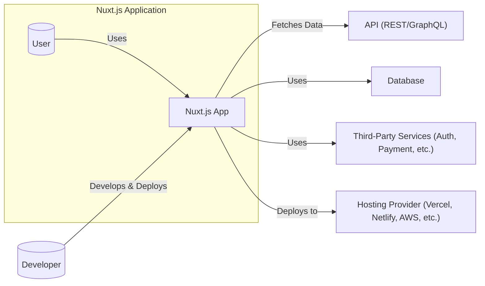
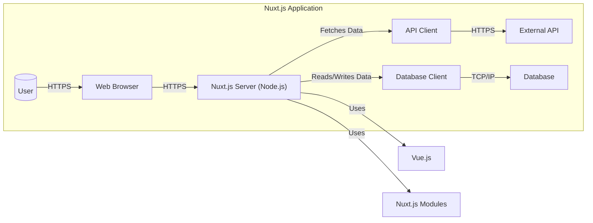
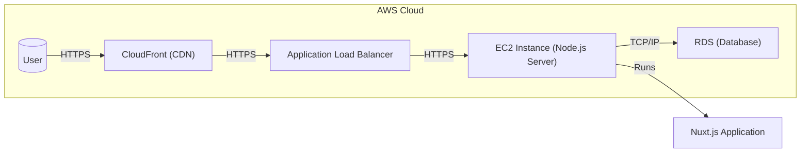
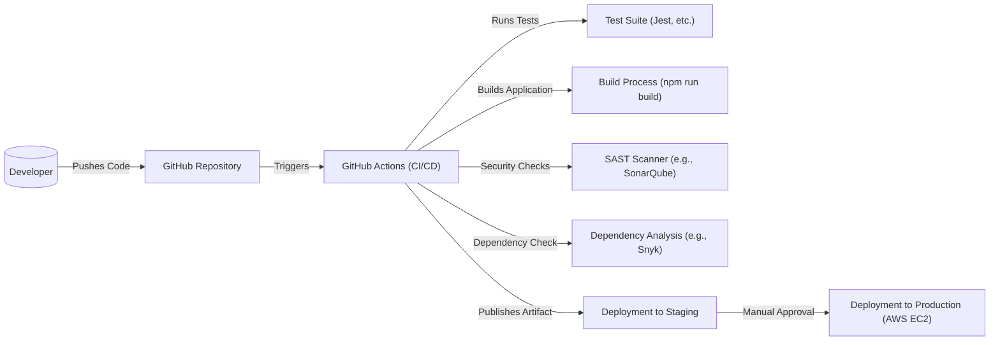

Okay, let's create a design document for the Nuxt.js project, keeping in mind its purpose and potential security considerations.

# BUSINESS POSTURE

Nuxt.js is a framework designed to simplify and enhance the development of Vue.js applications, particularly focusing on server-side rendering (SSR), static site generation (SSG), and single-page applications (SPAs).  It aims to improve developer experience, application performance (especially SEO and initial load times), and maintainability.

Business Priorities:

*   Developer Productivity:  Enable rapid development of Vue.js applications with a streamlined workflow.
*   Application Performance:  Deliver fast-loading, SEO-friendly web applications.
*   Scalability: Support the creation of applications that can handle growing traffic and complexity.
*   Maintainability:  Provide a structured framework that promotes code organization and reusability.
*   Community & Ecosystem:  Foster a strong community and a rich ecosystem of modules and extensions.

Business Risks:

*   Security Vulnerabilities:  Vulnerabilities in the framework itself or in its dependencies could expose applications built with Nuxt.js to attacks.
*   Performance Bottlenecks:  Improper use of the framework or inefficient configurations could lead to performance issues, negating its benefits.
*   Dependency Management Issues:  Reliance on third-party modules and libraries introduces risks related to their security and maintenance.
*   Breaking Changes:  Updates to Nuxt.js or its underlying technologies (Vue.js, Node.js) could introduce breaking changes, requiring code modifications.
*   Lack of Expertise:  Developers unfamiliar with Nuxt.js or SSR/SSG concepts may struggle to use the framework effectively, leading to suboptimal implementations.

# SECURITY POSTURE

Existing Security Controls:

*   security control: Secure Coding Practices: The Nuxt.js project itself (as seen in the GitHub repository) likely follows secure coding practices to minimize vulnerabilities. This is implied but needs verification through code review and contribution guidelines. Location: GitHub repository code and contribution guidelines.
*   security control: Dependency Management: Nuxt.js uses package managers (npm/yarn) to manage dependencies, allowing for version pinning and auditing. Location: `package.json` and `yarn.lock` files in the repository.
*   security control: Community Vetting: Being an open-source project, Nuxt.js benefits from community scrutiny, where potential vulnerabilities can be identified and reported by users and contributors. Location: GitHub Issues and Pull Requests.
*   security control: Regular Updates: The Nuxt.js team likely releases updates to address security vulnerabilities and bug fixes. Location: GitHub Releases and Changelog.
*   security control: Documentation: Nuxt.js provides documentation that may include security best practices and recommendations. Location: Nuxt.js official documentation.

Accepted Risks:

*   accepted risk: Third-Party Module Vulnerabilities: Nuxt.js applications often rely on third-party modules, which may introduce their own security risks.
*   accepted risk: Server-Side Rendering (SSR) Complexity: SSR introduces complexities related to security, such as protecting against Cross-Site Scripting (XSS) and ensuring proper data handling on the server.
*   accepted risk: Configuration Errors: Misconfiguration of Nuxt.js or its deployment environment can lead to security vulnerabilities.

Recommended Security Controls:

*   security control: Content Security Policy (CSP): Implement CSP to mitigate XSS attacks.
*   security control: HTTP Security Headers: Utilize headers like `Strict-Transport-Security`, `X-Frame-Options`, `X-Content-Type-Options`, and `X-XSS-Protection` to enhance security.
*   security control: Input Validation and Sanitization: Thoroughly validate and sanitize all user inputs, both on the client-side and server-side.
*   security control: Regular Security Audits: Conduct periodic security audits of Nuxt.js applications, including dependency analysis and penetration testing.
*   security control: Secure Configuration Management: Store sensitive configuration data (API keys, database credentials) securely, using environment variables or dedicated secrets management solutions.

Security Requirements:

*   Authentication:
    *   Implement secure authentication mechanisms, such as using established libraries or services (e.g., OAuth 2.0, OpenID Connect).
    *   Protect against common authentication vulnerabilities, like brute-force attacks, session hijacking, and credential stuffing.
    *   Use secure password storage mechanisms (e.g., hashing with salt).

*   Authorization:
    *   Implement appropriate authorization controls to restrict access to resources based on user roles and permissions.
    *   Follow the principle of least privilege.

*   Input Validation:
    *   Validate all user inputs on the server-side, regardless of client-side validation.
    *   Use a whitelist approach to define allowed input patterns.
    *   Sanitize inputs to prevent XSS and other injection attacks.

*   Cryptography:
    *   Use strong, industry-standard cryptographic algorithms for sensitive data storage and transmission.
    *   Manage cryptographic keys securely.
    *   Use HTTPS for all communication.

# DESIGN

## C4 CONTEXT

Context Diagram Element List:

*   1.  Name: User
    *   Type: Person
    *   Description: Represents a user interacting with the Nuxt.js application through a web browser.
    *   Responsibilities: Accessing and interacting with the application's features.
    *   Security controls: Browser-based security mechanisms (e.g., same-origin policy, cookies).

*   2.  Name: Nuxt.js App
    *   Type: Software System
    *   Description: The web application built using the Nuxt.js framework.
    *   Responsibilities: Rendering web pages, handling user interactions, managing data, and interacting with external services.
    *   Security controls: Input validation, output encoding, authentication, authorization, session management, CSP, HTTP security headers.

*   3.  Name: API (REST/GraphQL)
    *   Type: Software System
    *   Description: An external API that the Nuxt.js application uses to fetch or manipulate data.
    *   Responsibilities: Providing data and functionality to the Nuxt.js application.
    *   Security controls: API authentication, authorization, rate limiting, input validation, secure communication (HTTPS).

*   4.  Name: Database
    *   Type: Software System
    *   Description: A database used by the Nuxt.js application to store data.
    *   Responsibilities: Storing and retrieving data.
    *   Security controls: Database access controls, encryption at rest, encryption in transit, regular backups.

*   5.  Name: Third-Party Services (Auth, Payment, etc.)
    *   Type: Software System
    *   Description: External services used by the Nuxt.js application for specific functionalities.
    *   Responsibilities: Providing specialized services (e.g., authentication, payment processing).
    *   Security controls: Secure integration with the Nuxt.js application, adherence to the security standards of the third-party service.

*   6.  Name: Hosting Provider (Vercel, Netlify, AWS, etc.)
    *   Type: Software System
    *   Description: The platform where the Nuxt.js application is deployed and hosted.
    *   Responsibilities: Providing infrastructure and services for running the application.
    *   Security controls: Platform-specific security features (e.g., DDoS protection, firewalls, access controls).

*   7.  Name: Developer
    *   Type: Person
    *   Description: The developer who builds and deploys the Nuxt.js application.
    *   Responsibilities: Writing code, configuring the application, and deploying it to the hosting provider.
    *   Security controls: Secure coding practices, access controls to development tools and environments.

## C4 CONTAINER

Container Diagram Element List:

*   1.  Name: Web Browser
    *   Type: Container
    *   Description: The user's web browser.
    *   Responsibilities: Rendering the user interface, handling user interactions, making requests to the Nuxt.js server.
    *   Security controls: Browser-based security mechanisms (e.g., same-origin policy, cookies).

*   2.  Name: Nuxt.js Server (Node.js)
    *   Type: Container (Node.js Application)
    *   Description: The server-side component of the Nuxt.js application, running on Node.js.
    *   Responsibilities: Handling server-side rendering, routing, API requests, and interacting with other services.
    *   Security controls: Input validation, output encoding, authentication, authorization, session management, CSP, HTTP security headers, secure configuration management.

*   3.  Name: API Client
    *   Type: Container (Library/Module)
    *   Description: A library or module used by the Nuxt.js server to make requests to external APIs.
    *   Responsibilities: Handling communication with external APIs.
    *   Security controls: Secure communication (HTTPS), API key management.

*   4.  Name: External API
    *   Type: Container (External System)
    *   Description: An external API that the Nuxt.js application uses to fetch or manipulate data.
    *   Responsibilities: Providing data and functionality to the Nuxt.js application.
    *   Security controls: API authentication, authorization, rate limiting, input validation, secure communication (HTTPS).

*   5.  Name: Database Client
    *   Type: Container (Library/Module)
    *   Description: A library or module used by the Nuxt.js server to interact with the database.
    *   Responsibilities: Handling communication with the database.
    *   Security controls: Secure connection to the database, parameterized queries (to prevent SQL injection).

*   6.  Name: Database
    *   Type: Container (Database System)
    *   Description: The database used by the Nuxt.js application.
    *   Responsibilities: Storing and retrieving data.
    *   Security controls: Database access controls, encryption at rest, encryption in transit, regular backups.

*   7.  Name: Vue.js
    *   Type: Container (JavaScript Framework)
    *   Description: The underlying JavaScript framework used by Nuxt.js.
    *   Responsibilities: Providing the core functionality for building user interfaces.
    *   Security controls: Built-in security features of Vue.js (e.g., automatic escaping of HTML content).

*   8.  Name: Nuxt.js Modules
    *   Type: Container (Libraries/Modules)
    *   Description: Additional modules and libraries that extend the functionality of Nuxt.js.
    *   Responsibilities: Providing specific features and integrations.
    *   Security controls: Security of the individual modules, regular updates to address vulnerabilities.

## DEPLOYMENT

Possible Deployment Solutions:

1.  Static Site Generation (SSG) with Netlify/Vercel/AWS S3 + CloudFront:  Nuxt.js generates static HTML files that are deployed to a CDN.
2.  Server-Side Rendering (SSR) with Node.js server on AWS EC2/Google Compute Engine/Azure VMs:  A Node.js server runs the Nuxt.js application and renders pages on demand.
3.  Hybrid (SSG + SSR) with a combination of static and server-rendered routes.
4.  Serverless deployment with AWS Lambda/Google Cloud Functions/Azure Functions: Nuxt.js application is deployed as serverless functions.

Chosen Solution (for detailed description): Server-Side Rendering (SSR) with Node.js server on AWS EC2.

Deployment Diagram Element List:

*   1.  Name: User
    *   Type: Person
    *   Description: The user accessing the application.
    *   Responsibilities: Interacting with the application through a web browser.
    *   Security controls: Browser-based security mechanisms.

*   2.  Name: CloudFront (CDN)
    *   Type: Infrastructure Node (CDN)
    *   Description: Amazon CloudFront, a content delivery network.
    *   Responsibilities: Caching static assets and routing requests to the origin server.
    *   Security controls: DDoS protection, HTTPS enforcement, WAF integration.

*   3.  Name: Application Load Balancer
    *   Type: Infrastructure Node (Load Balancer)
    *   Description: AWS Application Load Balancer.
    *   Responsibilities: Distributing traffic across multiple EC2 instances.
    *   Security controls: SSL/TLS termination, health checks, security groups.

*   4.  Name: EC2 Instance (Node.js Server)
    *   Type: Infrastructure Node (Virtual Machine)
    *   Description: An AWS EC2 instance running the Node.js server.
    *   Responsibilities: Running the Nuxt.js application and handling server-side rendering.
    *   Security controls: Security groups, IAM roles, system hardening, regular patching.

*   5.  Name: RDS (Database)
    *   Type: Infrastructure Node (Database Service)
    *   Description: Amazon RDS, a managed database service.
    *   Responsibilities: Storing and managing application data.
    *   Security controls: Database access controls, encryption at rest, encryption in transit, regular backups, security groups.

*   6.  Name: Nuxt.js Application
    *   Type: Software
    *   Description: The Nuxt.js application running on the Node.js server.
    *   Responsibilities: Handling requests, rendering pages, and interacting with the database and other services.
    *   Security controls: Application-level security controls (see previous sections).

## BUILD

Build Process Description:

1.  Developer pushes code changes to the GitHub repository.
2.  GitHub Actions (or another CI/CD system) is triggered by the push event.
3.  The CI/CD pipeline runs a test suite (e.g., Jest) to ensure code quality.
4.  The build process (e.g., `npm run build`) is executed, creating the production-ready application.
5.  A SAST scanner (e.g., SonarQube) analyzes the code for potential security vulnerabilities.
6.  Dependency analysis (e.g., Snyk) checks for vulnerabilities in project dependencies.
7.  If all checks pass, the application is deployed to a staging environment.
8.  After manual approval, the application is deployed to the production environment (AWS EC2 in this example).

Security Controls in Build Process:

*   security control: Code Repository Access Control: Restrict access to the GitHub repository using appropriate permissions.
*   security control: CI/CD Pipeline Security: Secure the CI/CD pipeline itself, protecting against unauthorized access and modifications.
*   security control: Automated Testing: Include security-focused tests in the test suite (e.g., unit tests for input validation).
*   security control: Static Application Security Testing (SAST): Use a SAST scanner to identify vulnerabilities in the codebase.
*   security control: Software Composition Analysis (SCA): Use a dependency analysis tool to detect vulnerabilities in third-party libraries.
*   security control: Secure Build Environment: Ensure the build environment is secure and isolated.
*   security control: Artifact Signing: Consider signing build artifacts to ensure their integrity.

# RISK ASSESSMENT

Critical Business Processes:

*   User Authentication and Authorization: Ensuring only authorized users can access sensitive data and functionality.
*   Data Management: Protecting the confidentiality, integrity, and availability of user data and application data.
*   Application Availability: Maintaining the availability of the application to users.
*   Content Delivery: Efficient and secure delivery of content to users.

Data Sensitivity:

*   User Data (PII):  Name, email address, potentially other personal information. Sensitivity: High.
*   Authentication Credentials:  Passwords, tokens. Sensitivity: Critical.
*   Application Data:  Data specific to the application's functionality. Sensitivity: Varies depending on the application.
*   Session Data:  Information about user sessions. Sensitivity: Medium.

# QUESTIONS & ASSUMPTIONS

Questions:

*   What specific third-party modules are commonly used in Nuxt.js projects within the organization?
*   What are the existing security policies and guidelines for web application development within the organization?
*   What is the organization's risk appetite regarding the use of open-source software?
*   What are the specific regulatory requirements (e.g., GDPR, CCPA) that apply to the applications being built with Nuxt.js?
*   What monitoring and logging capabilities are in place for Nuxt.js applications?
*   Are there any existing security incident response plans that would apply to Nuxt.js applications?

Assumptions:

*   BUSINESS POSTURE: Assumes a moderate risk appetite, balancing innovation with security concerns.
*   SECURITY POSTURE: Assumes basic security awareness among developers, but potentially limited experience with SSR/SSG security best practices.
*   DESIGN: Assumes a standard deployment model (e.g., AWS, Azure, GCP) with common infrastructure components (load balancers, databases). Assumes the use of GitHub Actions for CI/CD, but this could be adapted to other CI/CD systems.