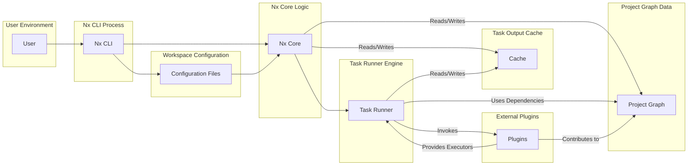

## Project Design Document: Nx Monorepo Tooling (Improved)

**1. Introduction**

This document provides an enhanced architectural design of the Nx monorepo tooling project (available at [https://github.com/nrwl/nx](https://github.com/nrwl/nx)). This revised document aims to provide a more detailed and nuanced understanding of the system's components, interactions, and data flow, specifically tailored for effective threat modeling. The intended audience includes security engineers, developers, and architects involved in the security assessment and development of systems utilizing Nx.

**2. Project Overview**

Nx is a sophisticated and extensible build framework designed to facilitate scaling full-stack development, particularly within monorepos. It enables the management of multiple interconnected projects (applications and libraries) within a single repository. Key functionalities of Nx include:

*   Facilitating code sharing and promoting reuse across different projects.
*   Optimizing build and test execution by selectively processing only the projects affected by code changes.
*   Orchestrating complex tasks and managing dependencies between projects.
*   Providing tools for code generation and project scaffolding to accelerate development.
*   Offering an extensible architecture through a robust plugin system.
*   Enabling visualization of project dependencies to understand the workspace structure.

**3. Architectural Design**

The Nx architecture comprises several interconnected components, each contributing to its overall functionality.

*   **Nx CLI (Command Line Interface):**
    *   Serves as the primary interface for user interaction with Nx.
    *   Responsible for parsing user commands, validating input, and initiating the execution of requested operations.
    *   Delegates specific tasks to the appropriate core components based on the command received.
    *   Offers a range of commands for actions such as generating code, running builds and tests, and visualizing project relationships.

*   **Nx Core:**
    *   Encapsulates the fundamental logic and algorithms that power Nx.
    *   Manages the creation and maintenance of the Project Graph, schedules tasks for execution, and implements caching mechanisms.
    *   Provides a set of APIs that allow plugins to integrate with and extend the core functionalities of Nx.

*   **Project Graph:**
    *   Represents the intricate web of dependencies that exist between projects within the monorepo.
    *   Dynamically constructed by analyzing project configurations and import statements within the codebase.
    *   Crucial for determining which projects are impacted by changes, enabling efficient task execution and visualization of dependencies.

*   **Task Runner:**
    *   The engine responsible for executing defined tasks (e.g., building, testing, linting) for specified projects.
    *   Utilizes the Project Graph to determine the correct order of task execution and to identify only the necessary projects for processing.
    *   Supports various strategies for task execution, including parallelization, to optimize performance.

*   **Configuration Files:**
    *   Store the various settings and parameters that govern the behavior of the Nx workspace and individual projects.
    *   Key configuration files include:
        *   `nx.json`: Contains workspace-level settings for task runners, caching behavior, and other global configurations.
        *   `workspace.json` (or `angular.json` for Angular-based workspaces): Defines the projects within the workspace, their available targets (build, test, lint, etc.), and their associated configurations.
        *   Project-specific configuration files (e.g., `tsconfig.json` for TypeScript compilation, `jest.config.js` for Jest testing).

*   **Cache:**
    *   A mechanism for storing the outputs of previously executed tasks.
    *   Designed to significantly reduce build and test times by reusing the cached outputs of tasks when the inputs have not changed.
    *   Supports both local caching on the developer's machine and remote caching solutions for shared environments.

*   **Plugin System:**
    *   Provides an extensibility model that allows developers to add custom functionality to Nx.
    *   Enables the creation of custom commands, executors (the logic behind targets like `build` or `test`), and code generators.
    *   Facilitates integration with a wide range of technologies, frameworks, and tools.
    *   Plugins can contribute to the Project Graph and influence task execution.

**4. Data Flow (Detailed)**

A typical user interaction with Nx involves the following data flow:

1. **User Command Initiation:** A user executes an Nx command through the CLI, specifying the desired action and target project(s) (e.g., `nx test my-library`).
2. **CLI Command Processing:** The Nx CLI receives the command, parses its structure, and performs initial validation of the provided input.
3. **Configuration Loading and Merging:** The CLI loads relevant configuration files, starting with `nx.json` and then project-specific configurations, merging them to create the effective configuration for the operation.
4. **Project Graph Resolution:** Nx Core analyzes the workspace structure, including project dependencies defined in configuration files and import statements within the code, to generate or update the Project Graph.
5. **Task Dependency Analysis and Scheduling:** Based on the requested command and the information within the Project Graph, the Task Runner identifies the specific tasks that need to be executed and determines their dependencies.
6. **Cache Lookup and Retrieval:** Before executing a task, the Task Runner checks the configured cache (local or remote) for existing outputs corresponding to the task and its inputs.
7. **Task Execution (if cache miss):** If a cache hit is not found or the cache is invalidated due to changes, the Task Runner proceeds to execute the task. This involves invoking the appropriate executor (defined in the project's configuration or a plugin) with the necessary parameters.
8. **Output Caching (if applicable):** Upon successful execution of a task, the Task Runner stores the generated outputs (e.g., compiled files, test reports) in the cache for future reuse.
9. **Result Reporting and Feedback:** The CLI provides feedback to the user, displaying the status of the executed tasks, any generated output, and potential error messages.

**5. Component Interactions (Enhanced Mermaid Diagram)**

**6. Key Data Stores and Data Handling**

*   **Configuration Files:** Store workspace and project settings in human-readable JSON format. These files are typically stored within the project repository.
*   **Project Graph:** Primarily an in-memory data structure representing project dependencies. It can be serialized and stored in the cache to avoid regeneration on subsequent runs.
*   **Cache:** Stores the outputs of task executions. This can be on the local filesystem (e.g., in the `node_modules/.cache/nx` directory) or in a remote storage service (e.g., AWS S3, Google Cloud Storage).
*   **Plugin Data:** Plugins may utilize various data storage mechanisms depending on their functionality, ranging from local files to external databases.

**7. External Dependencies and Integrations (Security Implications)**

Nx relies on and integrates with several external tools and technologies, which introduces potential security considerations:

*   **Version Control Systems (e.g., Git):** Used for change detection to determine affected projects. Compromised Git repositories could lead to incorrect dependency analysis.
*   **Package Managers (e.g., npm, yarn, pnpm):** Responsible for managing project dependencies. Vulnerabilities in dependencies or supply chain attacks through package managers are significant risks.
*   **Build Tools (e.g., Webpack, Rollup, esbuild):** Executed by the Task Runner to build projects. Vulnerabilities in these tools could be exploited during the build process.
*   **Testing Frameworks (e.g., Jest, Cypress):** Used for running tests. Malicious test code could potentially compromise the system.
*   **Cloud Storage (e.g., AWS S3, Google Cloud Storage):** Used for remote caching. Improperly secured cloud storage could lead to cache poisoning or data leaks.
*   **CI/CD Systems:** Nx is often integrated into CI/CD pipelines. Security vulnerabilities in the CI/CD system could be exploited through Nx workflows.

**8. Security Considerations (Detailed for Threat Modeling)**

This section expands on the initial security considerations, providing more specific examples and categorizations for effective threat modeling.

*   **Input Validation and Sanitization:**
    *   **Threat:** Malicious actors could inject harmful commands or data through CLI arguments or configuration file values.
    *   **Examples:** Command injection via improperly sanitized CLI inputs, injecting malicious scripts into configuration values.

*   **Authentication and Authorization:**
    *   **Threat:** Unauthorized users could potentially modify workspace configurations, trigger builds, or access cached artifacts.
    *   **Examples:** Lack of access controls on configuration files, insufficient authentication for remote cache access.

*   **Dependency Management and Supply Chain Security:**
    *   **Threat:** Vulnerabilities in project dependencies or malicious packages introduced through the supply chain could compromise the system.
    *   **Examples:** Using outdated dependencies with known vulnerabilities, installing malicious packages with the same name as legitimate ones (typosquatting).

*   **Cache Security (Integrity and Confidentiality):**
    *   **Threat:** The cache could be poisoned with malicious outputs, leading to the execution of compromised code. Cached sensitive information could be exposed if not properly secured.
    *   **Examples:** An attacker gaining write access to the remote cache and replacing legitimate build outputs with malicious ones, cached environment variables containing secrets being exposed.

*   **Plugin Security:**
    *   **Threat:** Malicious or vulnerable plugins could introduce security risks by executing arbitrary code or accessing sensitive data.
    *   **Examples:** A plugin with a vulnerability that allows remote code execution, a malicious plugin designed to steal credentials or inject malware.

*   **Secrets Management:**
    *   **Threat:** Sensitive information (e.g., API keys, database credentials) used in build processes could be exposed if not handled securely.
    *   **Examples:** Storing secrets directly in configuration files, exposing secrets in cached build outputs or logs.

*   **Code Generation Security:**
    *   **Threat:** Misuse of code generation features could introduce vulnerabilities into the generated code.
    *   **Examples:** Generating code with known security flaws, generating code that bypasses security checks.

*   **Project Graph Manipulation:**
    *   **Threat:** If the project graph can be manipulated, it could lead to incorrect build order, skipping necessary tests, or including unintended dependencies.
    *   **Examples:** Tampering with configuration files to alter project dependencies, exploiting vulnerabilities in the graph generation logic.

*   **Environment Variable Security:**
    *   **Threat:** Environment variables used in Nx commands or build processes could be compromised or misused.
    *   **Examples:** Injecting malicious environment variables, logging environment variables containing sensitive information.

**9. Conclusion**

This improved design document provides a more detailed and security-focused overview of the Nx monorepo tooling architecture. The enhanced descriptions of components, data flow, and especially the detailed security considerations are intended to provide a solid foundation for conducting thorough threat modeling activities. By understanding the potential attack surfaces and vulnerabilities outlined here, security engineers and developers can work towards implementing appropriate security measures to mitigate risks and ensure the secure use of Nx in their development workflows.