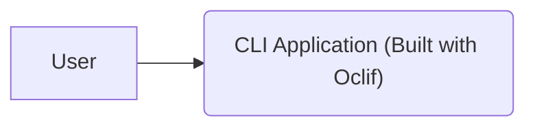
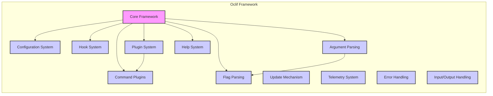
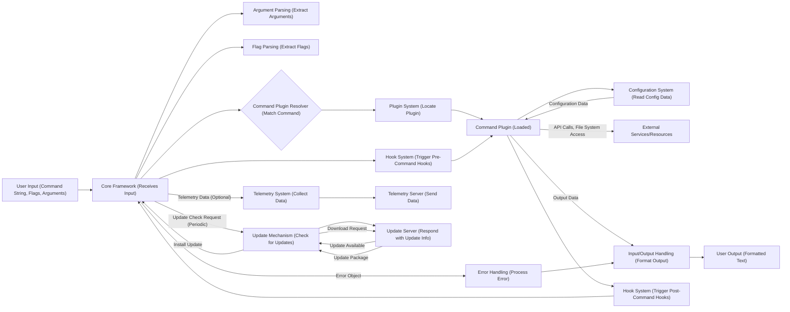

# Project Design Document: Oclif Framework

**Version:** 1.1
**Date:** October 26, 2023
**Author:** AI Software Architect

## 1. Introduction

This document provides an enhanced design overview of the Oclif framework, a robust tool for building command-line interfaces (CLIs) with Node.js. This iteration builds upon the previous version, offering a more granular understanding of Oclif's architecture, component interactions, and data flow, specifically tailored for effective threat modeling.

## 2. Goals and Objectives

The primary goal of this document remains to clearly articulate the design of the Oclif framework to facilitate comprehensive threat modeling. Specific objectives include:

*   Providing detailed descriptions of key components and their interdependencies.
*   Mapping data flow with greater specificity, including data types and transformations.
*   Highlighting potential security vulnerabilities associated with each component and data flow.
*   Offering a structured and detailed resource for security analysts, developers, and auditors.

## 3. System Architecture

Oclif provides a structured and extensible architecture for building CLIs. At a high level, it involves a user interacting with a CLI application that leverages the Oclif framework.

### 3.1. Component Diagram

The Oclif framework is composed of several interconnected components, each with specific responsibilities.

*   **Core Framework:** The central orchestrator, responsible for:
    *   Bootstrapping the CLI application.
    *   Managing the command lifecycle.
    *   Providing core utilities (logging, etc.).
    *   Interacting with other components.
*   **Command Plugins:** Self-contained units of functionality that implement specific CLI commands. They:
    *   Contain the business logic for a command.
    *   Define command-specific arguments and flags.
    *   Interact with external resources or the file system.
*   **Configuration System:** Manages application and user-specific settings. It handles:
    *   Reading configuration files (e.g., `.oclif.config.json`).
    *   Accessing environment variables.
    *   Providing a consistent way to access configuration values.
*   **Hook System:** Enables developers to inject custom logic at specific points in the CLI execution lifecycle. Hooks can be used for:
    *   Pre- and post-command execution tasks.
    *   Custom error handling.
    *   Telemetry collection.
*   **Plugin System:** Responsible for discovering, loading, and managing command plugins. It:
    *   Searches for plugins in defined locations (e.g., `node_modules`).
    *   Registers available commands.
    *   Handles plugin updates and uninstallation.
*   **Update Mechanism:** Facilitates updating the CLI application and its plugins. It typically involves:
    *   Checking for new versions on a remote server.
    *   Downloading and installing updates.
    *   Potentially restarting the CLI application.
*   **Telemetry System:**  Optionally collects usage data. This system:
    *   Gathers information about command usage, errors, and environment.
    *   Transmits data to a remote server for analysis.
    *   Requires user consent in many cases.
*   **Error Handling:** Manages and reports errors during CLI execution. It:
    *   Catches exceptions and errors.
    *   Formats error messages for display to the user.
    *   May log errors for debugging purposes.
*   **Input/Output Handling:** Manages interaction with the user. It handles:
    *   Reading input from the command line.
    *   Displaying output to the console (stdout, stderr).
    *   Potentially handling interactive prompts.
*   **Argument Parsing:**  Specifically responsible for processing command arguments. It:
    *   Identifies and extracts argument values from the command line.
    *   Validates argument types and constraints.
*   **Flag Parsing:**  Specifically responsible for processing command flags (options). It:
    *   Identifies and extracts flag values from the command line.
    *   Handles flag aliases and default values.
    *   Validates flag types and constraints.
*   **Help System:** Generates and displays help information for commands and the CLI application itself. It:
    *   Reads command and flag descriptions.
    *   Formats help messages for readability.

## 4. Data Flow

The execution of an Oclif-based CLI involves a detailed flow of data between components.

1. **User Input (Command String, Flags, Arguments):** The user provides the command and its parameters.
2. **Core Framework (Receives Input):** The core framework receives the raw command-line input.
3. **Argument Parsing (Extract Arguments):** The argument parsing component extracts and validates command arguments.
4. **Flag Parsing (Extract Flags):** The flag parsing component extracts and validates command flags.
5. **Command Plugin Resolver (Match Command):** The framework determines the appropriate command plugin based on the input.
6. **Plugin System (Locate Plugin):** The plugin system locates the corresponding plugin.
7. **Command Plugin (Loaded):** The selected command plugin is loaded into memory.
8. **Configuration System (Read Config Data):** The command plugin may read configuration data.
9. **External Services/Resources:** The command plugin interacts with external resources. Data types exchanged vary depending on the service.
10. **Input/Output Handling (Format Output):** The I/O handling component formats the output.
11. **User Output (Formatted Text):** The formatted output is displayed to the user.
12. **Hook System (Trigger Pre-Command Hooks):** Pre-command hooks are executed. Data passed to hooks depends on the hook type.
13. **Hook System (Trigger Post-Command Hooks):** Post-command hooks are executed. Data passed to hooks depends on the hook type.
14. **Telemetry System (Collect Data):**  Telemetry data (command name, execution time, errors) is collected.
15. **Telemetry Server (Send Data):** Telemetry data is sent to the server (typically JSON).
16. **Error Handling (Process Error):** Error objects containing error details are processed.
17. **Update Mechanism (Check for Updates):** The update mechanism checks for new versions.
18. **Update Server (Respond with Update Info):** The update server provides information about available updates (version numbers, download URLs).
19. **Update Package:** The update server provides the update package (e.g., a tarball or zip file).

## 5. Security Considerations (Detailed)

This section elaborates on potential security vulnerabilities, categorized for clarity.

*   **Plugin Security:**
    *   **Threat:** Malicious Plugin Installation.
        *   **Vulnerability:** Lack of verification or integrity checks during plugin installation could allow attackers to introduce malicious code.
        *   **Impact:** Code execution, data exfiltration, system compromise.
    *   **Threat:** Vulnerable Plugin Code.
        *   **Vulnerability:** Plugins may contain security vulnerabilities (e.g., injection flaws, insecure dependencies).
        *   **Impact:** Same as above, depending on the vulnerability.
    *   **Threat:** Plugin Dependency Vulnerabilities.
        *   **Vulnerability:** Plugins rely on third-party dependencies that may have known vulnerabilities.
        *   **Impact:** Same as above.
*   **Input Validation:**
    *   **Threat:** Command Injection.
        *   **Vulnerability:** Insufficient sanitization of user-provided command arguments or flags could allow attackers to execute arbitrary commands on the system.
        *   **Impact:** System compromise, data manipulation.
    *   **Threat:** Path Traversal.
        *   **Vulnerability:** If user input is used to construct file paths without proper validation, attackers could access files outside the intended directory.
        *   **Impact:** Data leakage, unauthorized access.
*   **Update Mechanism Security:**
    *   **Threat:** Man-in-the-Middle Attack.
        *   **Vulnerability:** If the update process uses insecure communication channels (e.g., unencrypted HTTP), attackers could intercept and replace legitimate updates with malicious ones.
        *   **Impact:** Installation of malware, system compromise.
    *   **Threat:** Compromised Update Server.
        *   **Vulnerability:** If the update server is compromised, attackers could distribute malicious updates to all users.
        *   **Impact:** Widespread malware distribution.
*   **Configuration Security:**
    *   **Threat:** Exposure of Sensitive Information.
        *   **Vulnerability:** Storing sensitive information (API keys, credentials) in configuration files without proper encryption or access controls.
        *   **Impact:** Unauthorized access to external services, data breaches.
    *   **Threat:** Configuration Injection.
        *   **Vulnerability:** If configuration values can be influenced by external sources without proper validation, attackers might inject malicious configurations.
        *   **Impact:** Altered application behavior, potential for code execution.
*   **Telemetry Data Privacy:**
    *   **Threat:** Data Leakage.
        *   **Vulnerability:** Sensitive user data might be inadvertently collected and transmitted through the telemetry system.
        *   **Impact:** Privacy violations, potential legal repercussions.
    *   **Threat:** Lack of Transparency.
        *   **Vulnerability:** Users may not be aware of what data is being collected and how it is being used.
        *   **Impact:** Erosion of trust, potential legal issues.
*   **Error Handling:**
    *   **Threat:** Information Disclosure.
        *   **Vulnerability:** Verbose error messages might reveal sensitive information about the system's internal workings or data structures.
        *   **Impact:** Provides attackers with valuable information for further attacks.

## 6. Deployment Considerations

Oclif-based CLIs can be deployed in various ways, each with its own security implications.

*   **Distribution via npm:**
    *   **Considerations:**  Reliance on npm's security measures. Ensure package integrity through signing and verification. Be mindful of supply chain attacks targeting npm dependencies.
    *   **Example:** `npm install -g my-oclif-cli`
*   **Standalone Executables (using `oclif-dev pack`):**
    *   **Considerations:**  The executable bundles the Node.js runtime and application code. Ensure the build process is secure and the resulting executable is not tampered with. Code signing is crucial for verifying authenticity.
    *   **Example:** Distributing a `.tar.gz` or `.exe` file.
*   **Containerization (Docker):**
    *   **Considerations:**  Securing the Docker image and the container runtime environment is essential. Follow Docker security best practices, including using minimal base images and scanning for vulnerabilities.
    *   **Example:**  Publishing a Docker image to a registry.

## 7. Future Considerations

*   **Enhanced Plugin Security Framework:** Implement a robust plugin verification and signing mechanism to ensure plugin integrity and authenticity. Explore sandboxing techniques for plugins.
*   **Standardized Input Validation Libraries:** Provide built-in, well-tested libraries for common input validation tasks to reduce the risk of injection vulnerabilities.
*   **Secure Update Mechanism Enhancements:** Enforce HTTPS for update checks and downloads. Implement robust signature verification for update packages. Consider using a Software Bill of Materials (SBOM) for transparency.
*   **Configuration Encryption:** Provide options for encrypting sensitive data stored in configuration files.
*   **Granular Telemetry Controls:** Offer users more fine-grained control over the telemetry data collected and transmitted. Provide clear documentation on data collection practices.
*   **Regular Security Audits and Penetration Testing:** Conduct periodic security assessments of the Oclif framework and popular plugins to identify and address potential vulnerabilities proactively.

This enhanced design document provides a more detailed and security-focused overview of the Oclif framework, serving as a valuable resource for comprehensive threat modeling activities.
