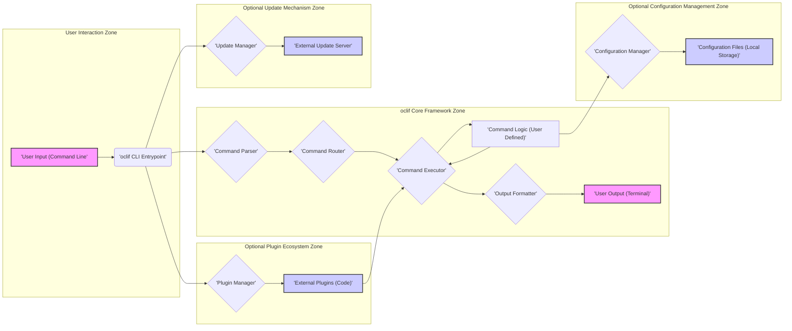

# Improved Project Design Document: oclif - CLI Framework

## 1. Introduction

This document provides a detailed design overview of the `oclif` project, a Node.js framework for building robust and extensible command-line interfaces (CLIs). It is specifically crafted to serve as the foundation for threat modeling and security analysis, both for the `oclif` framework itself and for CLIs built using it. The document outlines the key architectural components, their interactions, and data flow within a typical `oclif`-based CLI application.

The primary goal of `oclif` is to streamline CLI development by offering a structured framework that handles common CLI concerns such as argument parsing, command routing, help documentation generation, and plugin management. This allows developers to concentrate on implementing the core business logic of their CLI commands.

This document covers the following key areas:

*   System Architecture: A high-level view of `oclif`'s structure and its constituent parts.
*   Component Design Details: An in-depth examination of critical modules and their functionalities, with a security focus.
*   Data Flow Visualization: A graphical representation of data movement within an `oclif` application, highlighting trust boundaries.
*   Deployment Scenarios: Common deployment strategies for `oclif` CLIs and their security implications.
*   Security Analysis & Threat Modeling Guidance: Identification of security-sensitive areas and recommendations for threat modeling exercises.

## 2. System Architecture

`oclif` empowers developers to create CLIs with a rich feature set:

*   Organized Command Structure:  Hierarchical command organization with commands and subcommands for logical grouping of functionalities.
*   Sophisticated Argument Parsing: Robust parsing of command-line arguments, options (flags), and positional arguments with type validation.
*   Extensible Plugin System:  A plugin architecture enabling dynamic extension of CLI capabilities through external modules.
*   Automatic Help Generation:  Generation of comprehensive help documentation, including command usage, options, and descriptions.
*   Self-Update Mechanism:  Built-in support for updating the CLI application and its plugins to the latest versions.
*   Configuration Management Utilities: Tools for managing user-specific and application-level configurations.

The fundamental architecture of an `oclif` CLI application is depicted below:



**Key Component Descriptions:**

*   **`oclif CLI Entrypoint`**: The executable file that users invoke to interact with the CLI. It initializes the `oclif` framework and orchestrates command processing.
*   **Command Parser**:  Analyzes the user's command-line input, breaking it down into commands, arguments, and options.
*   **Command Router**:  Determines the specific command to be executed based on the parsed input, navigating the command hierarchy.
*   **Command Executor**:  Loads the code associated with the selected command and manages its execution lifecycle.
*   **Command Logic (User Defined)**: The core functionality of each command, implemented by the CLI developer. This is where the CLI's specific tasks are performed.
*   **Output Formatter**:  Handles the presentation of command output to the user, ensuring consistent and user-friendly formatting.
*   **Plugin Manager**:  Responsible for discovering, installing, loading, and managing plugins that extend the CLI's functionality.
*   **External Plugins (Code)**:  Independent modules that add new commands or modify existing CLI behavior, enhancing extensibility.
*   **Configuration Manager**:  Provides utilities for loading, saving, and accessing CLI configuration settings, both application-wide and user-specific.
*   **Configuration Files (Local Storage)**: Files stored locally (typically in user directories) that persist CLI configuration data.
*   **Update Manager**:  Handles checking for available updates for the CLI and its plugins and orchestrates the update process.
*   **External Update Server**:  A remote server that hosts update manifests and packages, facilitating the self-update mechanism.

## 3. Detailed Component Design and Security Analysis

This section provides a deeper dive into the design of key `oclif` components, with a particular focus on security implications and potential vulnerabilities.

### 3.1. Core CLI Framework Modules

*   **Command Parsing Module:**
    *   **Functionality:** Leverages libraries like `yargs-parser` to dissect command-line input. Defines command structures using classes and decorators. Enforces argument type validation and mandatory argument checks based on command definitions.
    *   **Security Considerations:**
        *   **Vulnerability:**  Insufficient input validation could lead to command injection vulnerabilities *within the user-defined command logic* if user-supplied input is not properly sanitized before being used in shell commands or system calls. `oclif` core itself focuses on parsing, not execution of arbitrary shell commands.
        *   **Mitigation:**  CLI developers must implement robust input sanitization and validation within their command logic. `oclif` provides tools for argument type definition, which is a first step in validation.
        *   **Vulnerability:** Potential for Denial of Service (DoS) attacks if the parser is susceptible to processing excessively long or deeply nested command-line inputs.
        *   **Mitigation:**  `oclif` and underlying parsing libraries generally have reasonable limits, but developers should be aware of potential resource exhaustion if handling extremely large inputs. Consider input length limits in command definitions if necessary.

*   **Command Routing Module:**
    *   **Functionality:** Maps parsed commands to their corresponding command handler classes. Supports nested command structures for complex CLIs. Relies on the defined command hierarchy to determine the execution path.
    *   **Security Considerations:**
        *   **Vulnerability:**  While routing itself is generally not a direct source of vulnerabilities, misconfiguration or logical errors in command definition could lead to unintended command execution paths.
        *   **Mitigation:**  Thoroughly test command routing logic to ensure commands are dispatched as expected. Follow `oclif`'s best practices for command organization.
        *   **Vulnerability:**  In extremely complex CLI structures, there might be edge cases in routing logic that could be exploited, though this is less likely in typical `oclif` usage.
        *   **Mitigation:**  Keep command structures reasonably simple and well-organized. Conduct thorough testing of complex routing scenarios.

*   **Command Execution Module:**
    *   **Functionality:** Instantiates the appropriate command class based on routing. Passes parsed arguments and flags to the command's `run` method. Manages command lifecycle events (`init`, `catch`, `finally` hooks).
    *   **Security Considerations:**
        *   **Security Focus:** The primary security responsibility lies within the *user-defined command logic* executed by this module. `oclif` provides a controlled execution environment, but the security of the *actions* performed by the command is the developer's responsibility.
        *   **Mitigation:**  Focus threat modeling and security testing on the `Command Logic (User Defined)` component. Ensure secure coding practices are followed within command implementations.

*   **Output Formatting Module:**
    *   **Functionality:** Provides utilities for formatting command output in various formats (plain text, JSON, etc.). Uses libraries like `cli-ux` for enhanced terminal output and user interaction.
    *   **Security Considerations:**
        *   **Vulnerability:**  Accidental exposure of sensitive information in command output, especially in error messages or verbose logging.
        *   **Mitigation:**  Carefully review command output and error handling to prevent leakage of sensitive data (API keys, internal paths, etc.). Implement mechanisms to redact or mask sensitive information in logs and output.
        *   **Vulnerability:**  In rare cases, if output formatting logic is flawed, it *could* potentially be exploited for output manipulation, though this is highly unlikely in `oclif`'s well-tested output mechanisms.
        *   **Mitigation:**  Rely on `oclif`'s standard output formatting utilities. If custom formatting is implemented, ensure it is thoroughly tested and reviewed.

### 3.2. Plugin System Security

*   **Plugin Installation Process:**
    *   **Mechanism:** Plugins are typically installed using `npm` or `yarn` via `oclif` CLI commands. Plugins are installed into a designated plugin directory, usually within the user's home directory.
    *   **Security Considerations:**
        *   **Vulnerability:** Dependency vulnerabilities within plugin dependencies. Plugins can introduce their own set of npm dependencies, which may contain known vulnerabilities.
        *   **Mitigation:**  Regularly audit plugin dependencies using `npm audit` or `yarn audit`. Encourage plugin authors to maintain up-to-date and secure dependencies.
        *   **Vulnerability:** Installation of malicious plugins if the plugin source is compromised or untrusted. This could occur through supply chain attacks, typosquatting, or compromised npm registries.
        *   **Mitigation:**  Advise users to install plugins only from trusted sources (verified publishers, official repositories). Consider implementing plugin signature verification (though not currently a core `oclif` feature).
        *   **Vulnerability:** Man-in-the-middle (MITM) attacks during plugin download if the installation process does not use HTTPS and integrity checks.
        *   **Mitigation:**  Ensure plugin installation processes rely on HTTPS for secure downloads. Consider implementing checksum or signature verification of downloaded plugin packages.

*   **Plugin Loading and Execution:**
    *   **Mechanism:** `oclif` dynamically discovers and loads plugins at runtime from the plugin directory. Plugin loading involves executing plugin code to register commands and hooks.
    *   **Security Considerations:**
        *   **Vulnerability:** Loading and executing untrusted plugin code can introduce arbitrary code execution vulnerabilities. Malicious plugins can gain full access to the CLI process and the user's system.
        *   **Mitigation:**  Strongly emphasize the risk of installing untrusted plugins. Implement a plugin vetting or review process if distributing plugins widely. Consider sandboxing or isolation techniques for plugin execution (though not natively supported by `oclif` currently).
        *   **Vulnerability:**  Plugin loading process vulnerabilities if the plugin directory or plugin files are tampered with.
        *   **Mitigation:**  Ensure proper file permissions on the plugin directory to prevent unauthorized modification. Implement integrity checks on plugin files during loading.

### 3.3. Command Execution Lifecycle Security

*   **Initialization (`init` hook):**
    *   **Timing:** Executed very early in the CLI lifecycle, before command parsing and execution.
    *   **Security Considerations:**
        *   **Vulnerability:**  Security flaws in code executed within the `init` hook can have broad impact as it runs before any command-specific logic or security checks.
        *   **Mitigation:**  Keep `init` hook logic minimal and secure. Thoroughly review and test any code in the `init` hook. Avoid performing sensitive operations in `init` if possible.

*   **Command `run` Method:**
    *   **Timing:** Contains the core logic of each command, executed after parsing and routing.
    *   **Security Considerations:**
        *   **Security Focus:** This is the primary area for command-specific security vulnerabilities. Input validation, secure operations, and data handling within the `run` method are critical.
        *   **Mitigation:**  Apply secure coding practices within the `run` method. Implement robust input validation, output sanitization, secure API interactions, and secure file handling. Conduct thorough security testing of command logic.

*   **Error Handling (`catch` hook):**
    *   **Timing:** Executed if an error occurs during command execution.
    *   **Security Considerations:**
        *   **Vulnerability:**  Error messages potentially revealing sensitive information about the application or system state.
        *   **Mitigation:**  Implement secure error handling that logs detailed errors for debugging but presents generic, non-revealing error messages to the user. Avoid exposing internal paths, API keys, or other sensitive data in error messages.

*   **Finalization (`finally` hook):**
    *   **Timing:** Executed after command execution, regardless of success or failure.
    *   **Security Considerations:**
        *   **Security Focus:** Generally lower security risk compared to other lifecycle hooks. Primarily for cleanup and resource release.
        *   **Mitigation:**  Ensure `finally` hook logic is robust and does not introduce new vulnerabilities during cleanup operations.

### 3.4. Configuration Management Security

*   **Configuration Files:**
    *   **Storage:** `oclif` typically uses configuration files (JSON, YAML) stored in user-specific directories (e.g., `~/.config/<cli-name>`).
    *   **Security Considerations:**
        *   **Vulnerability:** Configuration files may contain sensitive data, such as API keys, passwords, or access tokens.
        *   **Mitigation:**  Encrypt sensitive data stored in configuration files. Use secure storage mechanisms (e.g., operating system keychains) for highly sensitive credentials instead of plain text files.
        *   **Vulnerability:** Unauthorized access to configuration files if file permissions are not properly restricted.
        *   **Mitigation:**  Set restrictive file permissions on configuration files to ensure only the user has read and write access (e.g., `0600` permissions on Linux/macOS).

*   **Configuration Loading and Saving:**
    *   **Mechanism:** `oclif` provides utilities to load and save configuration data.
    *   **Security Considerations:**
        *   **Vulnerability:** Insecure loading or saving processes could lead to data corruption or exposure if file handling is flawed.
        *   **Mitigation:**  Use secure file I/O operations. Validate configuration data upon loading to detect corruption or tampering.
        *   **Vulnerability:**  If configuration loading process is vulnerable to path traversal, it *could* potentially be exploited to read arbitrary files, though this is less likely in `oclif`'s configuration utilities.
        *   **Mitigation:**  Ensure configuration loading logic properly handles file paths and prevents path traversal vulnerabilities.

### 3.5. Update Mechanism Security

*   **Update Checks:**
    *   **Mechanism:** `oclif` can periodically check for updates by contacting an external update server.
    *   **Security Considerations:**
        *   **Vulnerability:** Update checks over insecure channels (HTTP) are vulnerable to man-in-the-middle attacks, allowing attackers to redirect update checks to malicious servers.
        *   **Mitigation:**  **Mandatory use of HTTPS for all communication with the update server.**
        *   **Vulnerability:**  Update server compromise. If the update server is compromised, attackers can distribute malicious updates to all CLI users.
        *   **Mitigation:**  Implement robust security measures for the update server infrastructure. Use code signing to ensure update package authenticity and integrity.

*   **Update Download and Installation:**
    *   **Mechanism:** Updates are downloaded from the update server and installed by `oclif`, replacing older versions.
    *   **Security Considerations:**
        *   **Vulnerability:** Downloading updates without integrity verification allows for malicious updates to be installed if the download is intercepted or the update server is compromised.
        *   **Mitigation:**  **Implement robust update verification mechanisms.** Use digital signatures to sign update packages. Verify signatures before installation to ensure authenticity and integrity. Use checksums to verify download integrity.
        *   **Vulnerability:**  Insecure installation process could lead to privilege escalation if the update process requires elevated privileges and is not implemented securely.
        *   **Mitigation:**  Minimize the need for elevated privileges during update installation. If elevated privileges are required, ensure the installation process is secure and prevents privilege escalation vulnerabilities. Implement rollback mechanisms to revert to previous versions in case of failed or malicious updates.

## 4. Data Flow and Trust Boundaries Diagram

This diagram visually represents the data flow within an `oclif` CLI application, explicitly highlighting trust boundaries and data sources.

```mermaid
graph LR
    subgraph "User Environment (Untrusted)"
        A["'User Input (Command Line)'"] --> B("'oclif CLI Process (Trusted Boundary)'");
        C["'Configuration Files (User Controlled)'"] --. B;
    end
    subgraph "oclif CLI Process (Trusted Boundary)"
        B --> D{"'Command Parser'"}
        D --> E{"'Command Router'"}
        E --> F{"'Command Executor'"}
        F --> G["'Command Logic (User Code - Developer Controlled)'"]
        G --> H["'External APIs/Services (Potentially Untrusted)'"]
        G --> I["'File System (User Data - User Controlled)'"]
        G --> J{"'Configuration Manager'"}
        J --> C
        F --> K{"'Output Formatter'"}
        K --> L["'User Output (Terminal)'"]
        B --> M{"'Plugin Manager'"}
        M --> N["'External Plugins (Code - Potentially Untrusted)'"]
        N --> F
        B --> O{"'Update Manager'"}
        O --> P["'External Update Server (Potentially Untrusted)'"]
    end
    subgraph "External Environment (Potentially Untrusted)"
        P --> O
        H --> G
    end

    style A fill:#f9f,stroke:#333,stroke-width:2px
    style L fill:#f9f,stroke:#333,stroke-width:2px
    style C fill:#ccf,stroke:#333,stroke-width:2px,stroke-dasharray: 5 5
    style N fill:#ccf,stroke:#333,stroke-width:2px,stroke-dasharray: 5 5
    style P fill:#ccf,stroke:#333,stroke-width:2px,stroke-dasharray: 5 5

    classDef trustBoundary stroke-dasharray: 5 5;
    class C,N,P trustBoundary;
    classDef trustedFill fill:#bbf;
    class B,D,E,F,G,J,K,M,O trustedFill;
```

**Data Flow and Trust Boundary Explanation:**

1.  **Untrusted User Input:** User input from the command line (`'User Input (Command Line)'`) is inherently untrusted and must be rigorously validated by the CLI process.
2.  **Trusted Boundary - oclif CLI Process:** The `oclif CLI Process` itself represents a trusted boundary. Code within the core framework is assumed to be developed and maintained with security in mind.
3.  **User-Controlled Configuration:** `'Configuration Files (User Controlled)'` are partially trusted as they are under the user's control but can be modified. The CLI must handle potentially malicious or corrupted configuration data.
4.  **Developer-Controlled Command Logic:** `'Command Logic (User Code - Developer Controlled)'` is within the trusted boundary but requires careful security considerations as it's where application-specific logic resides and vulnerabilities are most likely to be introduced.
5.  **Potentially Untrusted External APIs/Services:** Interactions with `'External APIs/Services (Potentially Untrusted)'` introduce a trust boundary. Data exchanged with external services must be validated and secured.
6.  **User-Controlled File System:** Access to the `'File System (User Data - User Controlled)'` requires careful handling to prevent unauthorized access or manipulation of user data.
7.  **Potentially Untrusted External Plugins:** `'External Plugins (Code - Potentially Untrusted)'` are external code and represent a significant trust boundary. Plugins should be treated with caution and ideally vetted before use.
8.  **Potentially Untrusted External Update Server:** Communication with the `'External Update Server (Potentially Untrusted)'` is a critical trust boundary. Secure communication and update verification are essential to prevent malicious updates.

## 5. Deployment Architecture and Security Implications

`oclif` CLIs offer several deployment options, each with distinct security considerations:

*   **Global npm Installation (`npm install -g <cli-name>`):**
    *   **Deployment Characteristics:** CLI is installed globally, accessible system-wide. Requires Node.js and npm to be pre-installed. Updates are managed via npm.
    *   **Security Implications:**
        *   **Privilege Requirements:** Global installation may require administrator/root privileges, increasing the attack surface if vulnerabilities exist in the installation process.
        *   **System-Wide Impact:** Vulnerabilities in a globally installed CLI can have system-wide impact.
        *   **Update Management Complexity:** Global updates can sometimes be less transparent to users and may require elevated privileges.

*   **Local npm Installation (Project Dependency `npm install <cli-name>`):**
    *   **Deployment Characteristics:** CLI is installed as a project dependency, accessible within the project's `node_modules/.bin` directory. Common for development and CI/CD pipelines.
    *   **Security Implications:**
        *   **Isolated Impact:** Vulnerabilities are generally contained within the project context, reducing system-wide risk.
        *   **Dependency Management:** Security relies on the project's dependency management practices.
        *   **Less User Exposure:** Typically less exposed to end-users compared to global installations.

*   **Standalone Executables (Bundled using `pkg`, etc.):**
    *   **Deployment Characteristics:** CLI is packaged into a self-contained executable for specific platforms, bundling Node.js runtime. No Node.js installation required on the target system.
    *   **Security Implications:**
        *   **Larger Attack Surface:** Bundled executables can be larger and potentially have a larger attack surface due to the included runtime.
        *   **Update Challenges:** Self-update mechanisms within bundled executables are crucial and must be implemented securely. External update mechanisms may be needed.
        *   **Distribution Security:** Secure distribution channels are important to prevent tampering with executables.

*   **Docker Containers:**
    *   **Deployment Characteristics:** CLI is packaged as a Docker container image. Provides isolated and reproducible environments. Requires Docker runtime on the target system.
    *   **Security Implications:**
        *   **Isolation:** Containerization provides a degree of isolation, limiting the impact of vulnerabilities on the host system.
        *   **Image Security:** Security depends on the base image and container image build process. Regularly scan container images for vulnerabilities.
        *   **Update Management:** Updates are managed through container image updates and redeployment, which can be more controlled and auditable.

The choice of deployment method significantly affects the security posture of an `oclif` CLI. Standalone executables and global installations require careful attention to update mechanisms and privilege management, while containerization offers isolation benefits but introduces container image security considerations.

## 6. Security Analysis & Threat Modeling Guidance

This design document serves as a foundation for threat modeling `oclif`-based CLIs. Here's guidance on how to use it for threat modeling:

*   **Identify Assets:** Key assets include:
    *   User data processed by the CLI.
    *   Sensitive configuration data (API keys, credentials).
    *   The integrity and availability of the CLI itself.
    *   The user's system environment.
*   **Identify Threats:** Based on the component analysis and security considerations, consider threats such as:
    *   Command injection.
    *   Arbitrary code execution via malicious plugins.
    *   Data breaches through insecure configuration storage or output.
    *   Supply chain attacks targeting dependencies or plugins.
    *   Man-in-the-middle attacks during updates.
    *   Denial of Service attacks.
    *   Privilege escalation.
*   **STRIDE Threat Modeling:** Apply the STRIDE model to each component and data flow:
    *   **Spoofing:** Can an attacker impersonate a legitimate user or component? (e.g., malicious plugin masquerading as a trusted one).
    *   **Tampering:** Can data or code be modified maliciously? (e.g., compromised update package, tampered configuration file).
    *   **Repudiation:** Can a user deny performing an action? (Less relevant for typical CLIs, but consider logging and auditing).
    *   **Information Disclosure:** Can sensitive information be leaked? (e.g., in error messages, logs, or insecure output).
    *   **Denial of Service:** Can the CLI be made unavailable? (e.g., through input parsing DoS, resource exhaustion).
    *   **Elevation of Privilege:** Can an attacker gain higher privileges than intended? (e.g., through insecure update installation, plugin vulnerabilities).
*   **Focus on Trust Boundaries:** Pay close attention to trust boundaries identified in the data flow diagram. These are critical points for security analysis.
*   **Scenario-Based Threat Modeling:** Develop specific attack scenarios based on the identified threats and assets. For example:
    *   "An attacker installs a malicious plugin that steals user credentials from configuration files."
    *   "An attacker intercepts an update check and redirects the CLI to download a backdoored version."
    *   "A user provides maliciously crafted input that leads to command injection in a command's logic."
*   **Mitigation Strategies:** For each identified threat, develop mitigation strategies. Refer to the "Mitigation" points in Section 3 for guidance.
*   **Security Testing:** Conduct security testing (penetration testing, vulnerability scanning, code review) to validate the effectiveness of implemented mitigations and identify any remaining vulnerabilities.

## 7. Conclusion

This improved design document provides a detailed and security-focused analysis of the `oclif` framework. It outlines the architecture, component design, data flow, deployment considerations, and key security aspects relevant to `oclif`-based CLIs. By leveraging this document for threat modeling and security analysis, developers can build more secure and resilient command-line tools.  Prioritizing secure coding practices within command logic, carefully managing plugins and dependencies, securing the update mechanism, and implementing robust input validation are crucial steps in building secure `oclif` applications. This document should be considered a living document, updated as `oclif` evolves and new security considerations emerge.