# BUSINESS POSTURE

This project, oclif, aims to provide a robust and extensible framework for building command-line interfaces (CLIs) in Node.js. The primary business priority is to empower developers to create high-quality, user-friendly CLIs efficiently. The goal is to establish oclif as the leading framework for Node.js CLI development, fostering a strong community and ecosystem around it.

Key business risks associated with this project include:

- Security vulnerabilities in the oclif framework could be inherited by all CLIs built using it, potentially impacting a wide range of users and systems.
- Poor design or lack of usability in oclif could hinder developer adoption and limit its impact, failing to achieve the goal of becoming the leading framework.
- Insufficient community support or documentation could lead to developer frustration and slower adoption rates.

# SECURITY POSTURE

Existing security controls for the oclif project are based on standard open-source software development practices and the GitHub platform.

- security control: Code reviews are conducted via GitHub pull requests before merging code changes. This process is described in the project's contribution guidelines and is visible in the pull request history on GitHub.
- security control: Dependency management is enforced using `package-lock.json` to ensure consistent and reproducible builds. This file is present in the repository root.
- security control: Static code analysis and linting are likely employed during development, although specific tools and configurations are not explicitly documented in the repository. It is assumed that standard JavaScript/Node.js linters are used.
- accepted risk: As an open-source project, vulnerabilities, once discovered and publicly disclosed, become known to a wider audience, potentially increasing the window of opportunity for exploitation before patches are widely adopted.

Recommended security controls to enhance the security posture of the oclif project:

- security control: Implement automated security scanning of dependencies using tools like `npm audit` or dedicated dependency scanning services in the CI/CD pipeline.
- security control: Conduct regular security audits of the oclif codebase, potentially engaging external security experts to review the framework for vulnerabilities.
- security control: Incorporate input validation best practices into the oclif framework itself, providing developers with tools and guidance to easily validate CLI inputs and prevent common injection vulnerabilities in CLIs built with oclif.

Security requirements for the oclif project and CLIs built with it:

- Authentication: While oclif itself does not directly handle authentication, CLIs built with oclif frequently require authentication to access protected resources. Oclif should provide patterns and best practices for implementing secure authentication mechanisms within CLIs, such as using secure credential storage and established authentication protocols (OAuth 2.0, API keys).
- Authorization: Similar to authentication, authorization is typically implemented within CLIs built with oclif. Oclif should offer guidance on implementing robust authorization models, ensuring that CLIs can control access to sensitive operations based on user roles or permissions.
- Input Validation: Input validation is critical for CLIs to prevent vulnerabilities like command injection, path traversal, and cross-site scripting (in CLI outputs that might be rendered in a browser or other UI). Oclif must emphasize and facilitate input validation for all CLI arguments and options. This includes validating data types, formats, and ranges, as well as sanitizing inputs to prevent injection attacks.
- Cryptography: CLIs often handle sensitive data and require cryptographic operations for secure communication, data storage, or integrity checks. Oclif should not directly implement cryptography, but it should ensure that CLIs built with oclif can easily integrate secure cryptographic libraries and follow best practices for key management and cryptographic algorithm selection.

# DESIGN

## C4 CONTEXT

```mermaid
graph LR
    subgraph "Organization"
        User[/"CLI User"/]
        Developer[/"CLI Developer"/]
    end
    Oclif[/"Oclif Framework"/]
    PackageManager[/"Package Manager (npm)"/]
    NodeJS[/"Node.js Runtime"/]
    OS[/"Operating System"/]

    Developer --> Oclif: Uses
    Developer --> PackageManager: Publishes/Installs
    User --> CLI: Executes
    CLI[/"CLI built with Oclif"/] --> NodeJS: Requires
    CLI --> OS: Runs on
    Oclif --> PackageManager: Published/Installed via
    Oclif --> NodeJS: Requires
    CLI -->> User: Provides CLI Functionality
    PackageManager -->> Oclif: Provides Packages
    NodeJS -->> CLI: Executes JavaScript
    OS -->> CLI: Provides Execution Environment
```

### Context Diagram Elements

- Name: CLI User
  - Type: Person
  - Description: End-users who execute CLIs built with the oclif framework to perform various tasks.
  - Responsibilities: Executes CLIs, provides input to CLIs, consumes output from CLIs.
  - Security controls: Operating system level security controls on user machines, user awareness of CLI security best practices.

- Name: CLI Developer
  - Type: Person
  - Description: Software developers who use the oclif framework to build command-line interfaces.
  - Responsibilities: Develops CLIs using oclif, publishes CLIs, maintains CLIs.
  - Security controls: Secure development practices, code review, dependency management, access control to development environments and publishing platforms.

- Name: Oclif Framework
  - Type: Software System
  - Description: A Node.js framework for building command-line interfaces. It provides tools and libraries for parsing commands, handling arguments, generating help documentation, and managing plugins.
  - Responsibilities: Provides a foundation for building CLIs, simplifies CLI development, ensures consistent CLI structure and behavior.
  - Security controls: Code reviews, dependency management, static analysis, security audits, input validation guidance for developers.

- Name: Package Manager (npm)
  - Type: Software System
  - Description: The Node Package Manager (npm) is used to distribute and install Node.js packages, including the oclif framework and CLIs built with it.
  - Responsibilities: Hosts and distributes Node.js packages, manages package dependencies, facilitates package installation and updates.
  - Security controls: Package signing, vulnerability scanning of packages, access control to npm registry accounts, malware detection.

- Name: Node.js Runtime
  - Type: Software System
  - Description: The JavaScript runtime environment that executes both the oclif framework and CLIs built with it.
  - Responsibilities: Executes JavaScript code, provides core JavaScript libraries and APIs, manages system resources for running applications.
  - Security controls: Operating system level security controls, Node.js security updates, sandboxing capabilities (if applicable).

- Name: Operating System
  - Type: Software System
  - Description: The underlying operating system (e.g., Windows, macOS, Linux) on which Node.js and CLIs are executed.
  - Responsibilities: Provides the execution environment for Node.js and CLIs, manages system resources, enforces security policies.
  - Security controls: Operating system level security controls (firewall, access control, patching), user account management, security hardening.

- Name: CLI built with Oclif
  - Type: Software System
  - Description: A command-line interface application developed using the oclif framework.
  - Responsibilities: Provides specific command-line functionalities to users, interacts with other systems or resources as needed.
  - Security controls: Input validation, authentication, authorization, secure data handling, adherence to secure coding practices, dependency management.

## C4 CONTAINER

```mermaid
graph LR
    subgraph "Oclif Framework"
        Core[/"Core Modules"/]
        Plugins[/"Plugin System"/]
        Parser[/"Command Parser"/]
        Help[/"Help Generator"/]
        Config[/"Configuration Manager"/]
    end
    NodeJS[/"Node.js Runtime"/]

    Core --> NodeJS: Requires
    Plugins --> Core: Uses
    Parser --> Core: Uses
    Help --> Core: Uses
    Config --> Core: Uses
    CLI[/"CLI built with Oclif"/] --> Core: Uses Framework
    CLI --> Plugins: Extends Functionality
```

### Container Diagram Elements

- Name: Core Modules
  - Type: Container - Node.js Module
  - Description: The core set of modules within the oclif framework that provides fundamental functionalities such as command registration, plugin management, configuration loading, and CLI execution lifecycle.
  - Responsibilities: Provides the base framework structure, manages CLI execution flow, handles core functionalities common to all oclif CLIs.
  - Security controls: Code reviews, static analysis, dependency management, input validation within core functionalities, security audits.

- Name: Plugin System
  - Type: Container - Node.js Module
  - Description: The plugin system allows extending the functionality of oclif CLIs through dynamically loaded plugins. It manages plugin discovery, loading, and integration into the CLI command structure.
  - Responsibilities: Enables extensibility of oclif CLIs, manages plugin lifecycle, provides plugin API for developers.
  - Security controls: Plugin verification mechanisms (e.g., package signing), isolation of plugin execution (if feasible), input validation for plugin configurations and interactions.

- Name: Command Parser
  - Type: Container - Node.js Module
  - Description: The command parser is responsible for parsing user input from the command line, identifying the command to be executed, and extracting arguments and options.
  - Responsibilities: Parses command-line input, validates command syntax, extracts arguments and options, maps input to command handlers.
  - Security controls: Robust input validation to prevent command injection and other input-related vulnerabilities, secure parsing logic to handle unexpected or malicious input.

- Name: Help Generator
  - Type: Container - Node.js Module
  - Description: The help generator creates and displays help documentation for oclif CLIs, including command usage, options, and descriptions.
  - Responsibilities: Generates CLI help documentation, formats help output for user readability, ensures accurate and up-to-date documentation.
  - Security controls: Output sanitization to prevent cross-site scripting vulnerabilities if help output is rendered in a browser or other UI, protection against help injection attacks (unlikely but consider).

- Name: Configuration Manager
  - Type: Container - Node.js Module
  - Description: The configuration manager handles loading and managing configuration settings for oclif CLIs. This includes reading configuration files, environment variables, and command-line options.
  - Responsibilities: Loads CLI configurations, manages configuration settings, provides access to configuration values within the CLI.
  - Security controls: Secure storage of sensitive configuration data (e.g., using environment variables or secure configuration files), access control to configuration files, validation of configuration values, protection against configuration injection attacks.

- Name: Node.js Runtime
  - Type: Container - Runtime Environment
  - Description: The Node.js runtime environment that executes the oclif framework and CLIs built with it.
  - Responsibilities: Executes JavaScript code, provides core JavaScript libraries and APIs, manages system resources for running applications.
  - Security controls: Operating system level security controls, Node.js security updates, sandboxing capabilities (if applicable).

- Name: CLI built with Oclif
  - Type: Container - Application
  - Description: A command-line interface application developed using the oclif framework, utilizing its core modules and potentially extending its functionality with plugins.
  - Responsibilities: Provides specific command-line functionalities to users, interacts with other systems or resources as needed.
  - Security controls: Input validation, authentication, authorization, secure data handling, adherence to secure coding practices, dependency management, leverages oclif framework's security features.

## DEPLOYMENT

Oclif framework itself is primarily deployed as an npm package. CLIs built with oclif can be deployed in various ways depending on their purpose and target users. Possible deployment scenarios for CLIs include:

1.  **npm Global Installation:** CLIs can be published to npm and installed globally using `npm install -g <cli-name>`. This makes the CLI available system-wide.
2.  **npm Local Installation:** CLIs can be installed locally within a project using `npm install <cli-name>`. This makes the CLI available within the project's `node_modules/.bin` directory.
3.  **Standalone Executables:** CLIs can be packaged into standalone executables using tools like `pkg` or `nexe`. This allows distribution and execution without requiring Node.js to be pre-installed.
4.  **Containerized Deployment:** CLIs can be containerized using Docker and deployed in container orchestration platforms like Kubernetes.

For the purpose of this design document, we will focus on the **npm Global Installation** scenario for the oclif framework itself and a CLI built with oclif.

```mermaid
graph LR
    subgraph "Developer Machine"
        DevMachine[/"Developer Machine"/]
        Developer[/"CLI Developer"/]
    end
    subgraph "npm Registry"
        npmRegistry[/"npm Registry"/]
    end
    subgraph "User Machine"
        UserMachine[/"User Machine"/]
        User[/"CLI User"/]
        OS[/"Operating System"/]
        NodeJS[/"Node.js Runtime"/]
        GloballyInstalledCLI[/"Globally Installed CLI"/]
    end

    Developer -- Develops --> DevMachine
    DevMachine -- Publishes --> npmRegistry: Oclif Framework & CLI
    npmRegistry -- Downloads --> UserMachine: Oclif Framework & CLI
    User -- Installs --> UserMachine: Oclif Framework & CLI (via npm)
    User -- Executes --> UserMachine: GloballyInstalledCLI
    GloballyInstalledCLI -- Runs on --> NodeJS
    NodeJS -- Runs on --> OS
```

### Deployment Diagram Elements

- Name: Developer Machine
  - Type: Infrastructure - Physical Machine/Virtual Machine
  - Description: The development machine used by CLI developers to write, test, and package oclif framework and CLIs.
  - Responsibilities: Development environment, code editing, testing, building, packaging, publishing to npm.
  - Security controls: Developer machine security controls (OS hardening, antivirus, firewall), access control, secure development practices, code repository security.

- Name: npm Registry
  - Type: Infrastructure - Cloud Service
  - Description: The public npm registry (npmjs.com) used to host and distribute Node.js packages, including oclif framework and CLIs.
  - Responsibilities: Package hosting, package distribution, package versioning, dependency management, package metadata storage.
  - Security controls: Package signing, vulnerability scanning, malware detection, access control, infrastructure security of npm registry.

- Name: User Machine
  - Type: Infrastructure - Physical Machine/Virtual Machine
  - Description: The machine used by CLI users to install and execute CLIs built with oclif.
  - Responsibilities: CLI execution environment, user interaction with CLIs, operating system environment.
  - Security controls: User machine security controls (OS hardening, antivirus, firewall), user account management, operating system security updates.

- Name: Operating System (User Machine)
  - Type: Software - Operating System
  - Description: The operating system running on the user machine (e.g., Windows, macOS, Linux).
  - Responsibilities: Provides execution environment for Node.js and CLIs, manages system resources, enforces security policies.
  - Security controls: Operating system level security controls (firewall, access control, patching), user account management, security hardening.

- Name: Node.js Runtime (User Machine)
  - Type: Software - Runtime Environment
  - Description: The Node.js runtime environment installed on the user machine, required to execute oclif framework and CLIs.
  - Responsibilities: Executes JavaScript code, provides core JavaScript libraries and APIs, manages system resources for running applications.
  - Security controls: Operating system level security controls, Node.js security updates, sandboxing capabilities (if applicable).

- Name: Globally Installed CLI
  - Type: Software - Application
  - Description: A CLI built with oclif that is installed globally on the user machine using npm.
  - Responsibilities: Provides command-line functionalities to the user, interacts with the operating system and other resources.
  - Security controls: Input validation, authentication, authorization, secure data handling, adherence to secure coding practices, dependency management, leverages oclif framework's security features, user permissions on the operating system.

## BUILD

The build process for oclif and CLIs built with oclif typically involves the following steps:

1.  **Development:** Developers write code for oclif framework or CLIs, using code editors and development tools on their local machines.
2.  **Version Control:** Code is committed to a version control system (e.g., Git, hosted on GitHub in this case).
3.  **Build Automation (CI):** Upon code changes (e.g., pull requests, merges to main branch), a CI/CD system (like GitHub Actions, Jenkins, or similar) is triggered.
4.  **Dependency Installation:** The CI system installs project dependencies using `npm install`.
5.  **Linting and Static Analysis:** Automated linters and static analysis tools are run to check code quality and identify potential issues.
6.  **Testing:** Automated tests (unit tests, integration tests) are executed to ensure code functionality and prevent regressions.
7.  **Build Artifacts Creation:** The build process compiles or packages the code into distributable artifacts (e.g., npm packages).
8.  **Publishing (CD):** For oclif framework and publicly distributed CLIs, the build artifacts are published to the npm registry. For private CLIs, artifacts might be deployed to internal repositories or distribution channels.

```mermaid
graph LR
    subgraph "Developer Environment"
        Developer[/"Developer"/]
        DevMachine[/"Developer Machine"/]
        VCS[/"Version Control System (GitHub)"/]
    end
    subgraph "CI/CD Pipeline (GitHub Actions)"
        CI[/"CI/CD System"/]
        DependencyInstall[/"Dependency Installation"/]
        Linting[/"Linting & Static Analysis"/]
        Testing[/"Automated Testing"/]
        BuildArtifacts[/"Build Artifacts Creation"/]
    end
    subgraph "Package Registry"
        npmRegistry[/"npm Registry"/]
    end

    Developer -- Code Changes --> DevMachine
    DevMachine -- Push --> VCS
    VCS -- Trigger CI --> CI
    CI -- npm install --> DependencyInstall
    DependencyInstall -- Runs --> Linting
    Linting -- Runs --> Testing
    Testing -- Creates --> BuildArtifacts
    BuildArtifacts -- Publish --> npmRegistry
```



### Build Diagram Elements

- Name: Developer
  - Type: Person
  - Description: Software developer writing code for oclif framework or CLIs.
  - Responsibilities: Code development, code review, committing code changes, initiating build process indirectly through code commits.
  - Security controls: Secure coding practices, code review participation, access control to development environment and code repository.

- Name: Developer Machine
  - Type: Infrastructure - Physical Machine/Virtual Machine
  - Description: The development machine used by developers to write and test code.
  - Responsibilities: Development environment, code editing, local testing, committing code changes.
  - Security controls: Developer machine security controls (OS hardening, antivirus, firewall), access control.

- Name: Version Control System (GitHub)
  - Type: Software - Cloud Service
  - Description: GitHub is used for version control, code hosting, and collaboration for the oclif project.
  - Responsibilities: Code repository, version history management, pull request workflow, trigger CI/CD pipelines.
  - Security controls: Access control, authentication, authorization, audit logging, secure code storage, branch protection.

- Name: CI/CD System (GitHub Actions)
  - Type: Software - Cloud Service
  - Description: GitHub Actions is used as the CI/CD system to automate the build, test, and publishing process for oclif.
  - Responsibilities: Automated build execution, dependency installation, linting, static analysis, testing, artifact creation, publishing.
  - Security controls: Secure pipeline configuration, access control to CI/CD workflows, secret management for credentials, isolation of build environments, audit logging.

- Name: Dependency Installation
  - Type: Process - CI/CD Step
  - Description: Step in the CI/CD pipeline where project dependencies are installed using `npm install`.
  - Responsibilities: Resolving and installing project dependencies, ensuring consistent build environment.
  - Security controls: Dependency scanning for vulnerabilities, using `package-lock.json` for dependency integrity, verifying package checksums (if available).

- Name: Linting & Static Analysis
  - Type: Process - CI/CD Step
  - Description: Step in the CI/CD pipeline where linters and static analysis tools are executed to check code quality and identify potential issues.
  - Responsibilities: Code quality checks, identifying potential bugs and vulnerabilities, enforcing coding standards.
  - Security controls: Configuration of linters and static analysis tools to detect security-related issues, regular updates of analysis tools.

- Name: Automated Testing
  - Type: Process - CI/CD Step
  - Description: Step in the CI/CD pipeline where automated tests (unit tests, integration tests) are executed.
  - Responsibilities: Verifying code functionality, preventing regressions, ensuring code quality.
  - Security controls: Secure test environment, test data management, test coverage analysis, regular review of test suites.

- Name: Build Artifacts Creation
  - Type: Process - CI/CD Step
  - Description: Step in the CI/CD pipeline where build artifacts (e.g., npm packages) are created from the codebase.
  - Responsibilities: Packaging code into distributable artifacts, versioning artifacts, preparing artifacts for publishing.
  - Security controls: Secure artifact creation process, integrity checks for artifacts, signing of artifacts (if applicable).

- Name: npm Registry
  - Type: Infrastructure - Cloud Service
  - Description: The public npm registry (npmjs.com) used to host and distribute Node.js packages.
  - Responsibilities: Package hosting, package distribution, package versioning, dependency management, package metadata storage.
  - Security controls: Package signing, vulnerability scanning, malware detection, access control, infrastructure security of npm registry.

# RISK ASSESSMENT

Critical business processes protected by oclif and CLIs built with it:

- Development and distribution of command-line tools: Oclif facilitates the creation and distribution of CLIs, which are essential tools for developers and system administrators. Disruptions or vulnerabilities in oclif can impact the entire ecosystem of CLIs built with it.
- Automation and scripting: CLIs are often used for automation and scripting tasks. Vulnerabilities in CLIs can lead to unauthorized access, data breaches, or system compromise through malicious scripts.

Data being protected and its sensitivity:

- Source code of oclif framework: Publicly available on GitHub, low sensitivity in terms of confidentiality, but integrity and availability are crucial. Tampering with the source code or making it unavailable would severely impact the project and its users.
- Source code of CLIs built with oclif: Sensitivity depends on the specific CLI. Some CLIs might be open-source, while others might be proprietary and contain sensitive business logic or algorithms. The sensitivity ranges from low to high depending on the CLI.
- Configuration data for oclif and CLIs: Configuration data might contain sensitive information like API keys, credentials, or database connection strings. The sensitivity is high for configuration data containing secrets.
- User input to CLIs: User input can be potentially malicious and needs to be treated with caution. Input validation is crucial to prevent injection attacks and protect the CLI and underlying systems. Sensitivity of user input depends on the context of the CLI and the data being processed.

# QUESTIONS & ASSUMPTIONS

Questions:

- What specific static analysis tools and linters are currently used in the oclif project's CI/CD pipeline?
- Are there any plans for formal security audits of the oclif framework?
- Are there any guidelines or best practices documented for developers building CLIs with oclif regarding security aspects like input validation, authentication, and authorization?
- What mechanisms are in place to verify the integrity and authenticity of oclif packages published to npm?

Assumptions:

- The oclif project follows standard open-source development best practices, including code reviews and dependency management.
- Security is considered an important aspect by the oclif maintainers, although it might not be explicitly documented in detail.
- The oclif project relies on the security features provided by the Node.js runtime and the npm ecosystem.
- CLIs built with oclif are expected to implement their own security measures for authentication, authorization, and data protection, as oclif primarily provides the framework structure and not built-in security features for these aspects.