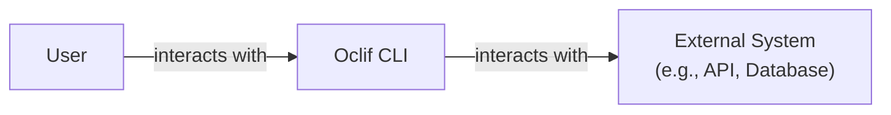
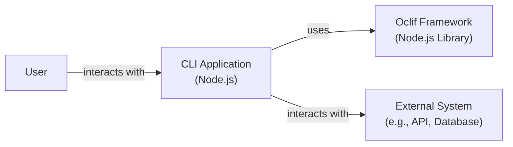
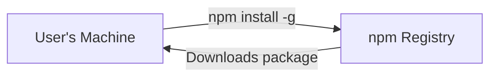
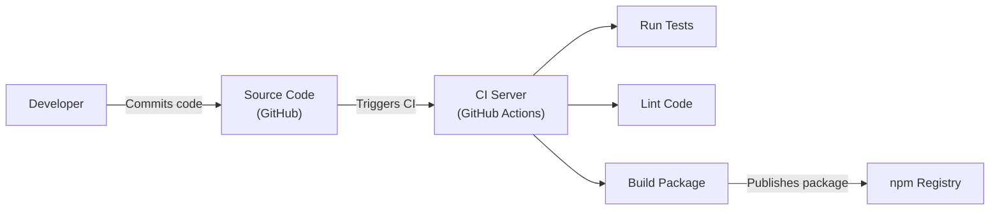

Okay, let's create a design document for the oclif project.

# BUSINESS POSTURE

Business Priorities and Goals:

*   Provide a robust and reliable framework for building command-line interfaces (CLIs).
*   Enable developers to quickly create CLIs with minimal boilerplate code.
*   Offer a consistent and user-friendly experience across different CLIs built with oclif.
*   Foster a strong community and ecosystem around the framework.
*   Maintain high code quality and test coverage.
*   Support a wide range of operating systems and Node.js versions.
*   Facilitate extensibility and customization through plugins.

Business Risks:

*   Security vulnerabilities in the framework could be exploited to compromise systems running oclif-based CLIs.
*   Bugs or performance issues could negatively impact the user experience and adoption of the framework.
*   Lack of community engagement could lead to stagnation and decline of the project.
*   Incompatibility with future Node.js versions or operating systems could limit the framework's lifespan.
*   Competition from other CLI frameworks could reduce oclif's market share.
*   Insufficient documentation or support could hinder developer adoption.

# SECURITY POSTURE

Existing Security Controls:

*   security control: Dependency management: Uses `yarn` to manage dependencies and `yarn.lock` to ensure consistent and reproducible builds. (package.json, yarn.lock)
*   security control: Code linting: Employs ESLint to enforce code style and identify potential issues. (.eslintrc.js)
*   security control: Testing: Includes a comprehensive suite of unit and integration tests. (tests directory)
*   security control: Continuous Integration: Uses GitHub Actions for automated testing and linting on every push and pull request. (.github/workflows)
*   security control: Security Audits: Regular security audits are conducted, as evidenced by the "Security" tab on the GitHub repository.
*   security control: Static Analysis: Uses tools like `npm audit` to identify known vulnerabilities in dependencies.

Accepted Risks:

*   accepted risk: The framework itself might have undiscovered vulnerabilities, despite security audits and testing.
*   accepted risk: Plugins developed by third-party developers may introduce security vulnerabilities.
*   accepted risk: Users of oclif may not follow secure coding practices when building their CLIs, leading to vulnerabilities in their applications.

Recommended Security Controls:

*   security control: Implement a Software Bill of Materials (SBOM) generation process to improve supply chain security.
*   security control: Integrate Static Application Security Testing (SAST) tools into the CI/CD pipeline for continuous security analysis.
*   security control: Consider implementing Dynamic Application Security Testing (DAST) to identify runtime vulnerabilities.
*   security control: Develop and publish a security policy that clearly outlines how to report vulnerabilities and the expected response times.
*   security control: Provide security guidelines and best practices for developers building CLIs with oclif.
*   security control: Regularly review and update dependencies to address known vulnerabilities.

Security Requirements:

*   Authentication:
    *   Not directly applicable to the framework itself, as it's a tool for building CLIs. Authentication is the responsibility of the CLI application built using oclif.
*   Authorization:
    *   Not directly applicable to the framework itself. Authorization is the responsibility of the CLI application built using oclif.
*   Input Validation:
    *   The framework should provide utilities or guidance for validating user input to prevent common vulnerabilities like command injection.
    *   CLI applications built using oclif must implement robust input validation.
*   Cryptography:
    *   If the framework handles sensitive data (e.g., API keys), it should use appropriate cryptographic libraries and algorithms.
    *   CLI applications built using oclif should use secure methods for storing and transmitting sensitive data.

# DESIGN

## C4 CONTEXT

Element Descriptions:

*   Element:
    *   Name: User
    *   Type: Person
    *   Description: A person who interacts with the CLI application.
    *   Responsibilities: Provides input to the CLI, receives output from the CLI.
    *   Security controls: None (external to the system).

*   Element:
    *   Name: Oclif CLI
    *   Type: Software System
    *   Description: A command-line interface application built using the oclif framework.
    *   Responsibilities: Parses user input, executes commands, interacts with external systems, displays output.
    *   Security controls: Input validation, secure handling of sensitive data (if applicable), adherence to oclif's security guidelines.

*   Element:
    *   Name: External System
    *   Type: Software System
    *   Description: Any external system that the CLI interacts with, such as an API, database, or file system.
    *   Responsibilities: Varies depending on the specific system.
    *   Security controls: Authentication, authorization, encryption (depending on the system and communication protocol).

## C4 CONTAINER

Element Descriptions:

*   Element:
    *   Name: User
    *   Type: Person
    *   Description: A person who interacts with the CLI application.
    *   Responsibilities: Provides input to the CLI, receives output from the CLI.
    *   Security controls: None (external to the system).

*   Element:
    *   Name: CLI Application
    *   Type: Container (Node.js)
    *   Description: The specific CLI application built using oclif.
    *   Responsibilities: Handles user commands, interacts with external systems, performs business logic.
    *   Security controls: Input validation, secure handling of sensitive data, adherence to oclif's security guidelines.

*   Element:
    *   Name: Oclif Framework
    *   Type: Container (Node.js Library)
    *   Description: The oclif framework itself, a Node.js library.
    *   Responsibilities: Provides core CLI functionality, command parsing, plugin management, help generation.
    *   Security controls: Secure coding practices, regular security audits, dependency management.

*   Element:
    *   Name: External System
    *   Type: Software System
    *   Description: Any external system that the CLI interacts with.
    *   Responsibilities: Varies depending on the specific system.
    *   Security controls: Authentication, authorization, encryption (depending on the system).

## DEPLOYMENT

Possible Deployment Solutions:

1.  **Global npm Installation:** Users install the CLI globally using `npm install -g <package-name>`. This makes the CLI available system-wide.
2.  **Local Project Dependency:** The CLI is added as a dependency in a Node.js project and executed using `npx <package-name>` or through npm scripts.
3.  **Standalone Executables:** The CLI is packaged into standalone executables for different operating systems (e.g., using tools like `pkg` or `nexe`).
4.  **Containerization (Docker):** The CLI and its dependencies are packaged into a Docker container for consistent execution across different environments.

Chosen Solution (Global npm Installation):

Element Descriptions:

*   Element:
    *   Name: User's Machine
    *   Type: Deployment Node
    *   Description: The user's computer where the CLI will be installed and executed.
    *   Responsibilities: Runs the Node.js runtime, executes the CLI commands.
    *   Security controls: Operating system security controls, user account privileges.

*   Element:
    *   Name: npm Registry
    *   Type: Software System
    *   Description: The public npm registry, a repository for Node.js packages.
    *   Responsibilities: Stores and serves the CLI package and its dependencies.
    *   Security controls: Access controls, package signing (optional), vulnerability scanning.

## BUILD

Build Process Description:

1.  **Developer Commits Code:** A developer commits changes to the oclif source code on GitHub.
2.  **CI Triggered:** The commit triggers a GitHub Actions workflow.
3.  **Run Tests:** The workflow runs the test suite to ensure code quality and functionality.
4.  **Lint Code:** The workflow uses ESLint to check for code style and potential errors.
5.  **Build Package:** If tests and linting pass, the workflow builds the oclif package. This typically involves compiling TypeScript code (if used), bundling dependencies, and preparing the package for publishing.
6.  **Publish Package:** The workflow publishes the built package to the npm registry.

Security Controls in Build Process:

*   security control: **Automated Testing:** GitHub Actions runs tests on every commit, ensuring that new code doesn't introduce regressions or vulnerabilities.
*   security control: **Code Linting:** ESLint enforces code style and helps identify potential security issues.
*   security control: **Dependency Management:** `yarn.lock` ensures consistent and reproducible builds, reducing the risk of introducing vulnerable dependencies.
*   security control: **CI/CD Pipeline:** GitHub Actions provides a controlled and auditable environment for building and publishing the package.
*   security control: **Static Analysis:** `npm audit` (or similar tools) can be integrated into the CI pipeline to scan for known vulnerabilities in dependencies.

# RISK ASSESSMENT

Critical Business Processes:

*   Providing a stable and reliable framework for building CLIs.
*   Maintaining a secure and trustworthy codebase.
*   Supporting the developer community and fostering adoption.

Data to Protect:

*   Source code of the oclif framework (sensitivity: medium - public repository, but integrity is crucial).
*   User data handled by CLIs built with oclif (sensitivity: varies greatly depending on the specific CLI application - oclif itself doesn't handle user data directly, but CLIs built with it might).
*   npm credentials used to publish the package (sensitivity: high - compromise would allow attackers to publish malicious versions of oclif).

# QUESTIONS & ASSUMPTIONS

Questions:

*   Are there any specific compliance requirements (e.g., GDPR, HIPAA) that oclif or CLIs built with it need to adhere to?
*   What is the expected threat model for CLIs built with oclif (e.g., who are the potential attackers, what are their motivations)?
*   Are there any plans to support other package managers besides npm?
*   What is the process for handling security vulnerabilities reported by external researchers?

Assumptions:

*   BUSINESS POSTURE: The primary goal is to provide a robust and secure framework for building CLIs, prioritizing developer experience and security.
*   SECURITY POSTURE: The project follows secure coding practices and has a process for addressing security vulnerabilities.
*   DESIGN: The design is modular and extensible, allowing for future enhancements and integrations. The primary deployment method is via npm.
*   The project uses GitHub and GitHub Actions.