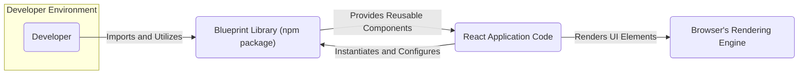
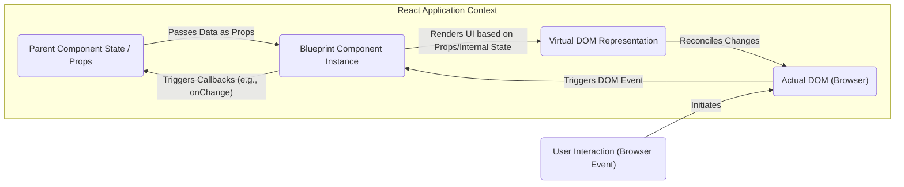

# Project Design Document: Blueprint UI Toolkit

**Version:** 1.1
**Date:** October 26, 2023
**Prepared By:** Gemini (AI Language Model)

## 1. Introduction

This document provides an enhanced design overview of the Blueprint UI toolkit, an open-source library of React UI components developed by Palantir. This document serves as a critical resource for understanding the architectural nuances and key components of Blueprint, specifically tailored for subsequent threat modeling exercises and security assessments. It aims to provide a deeper understanding of the system's inner workings to facilitate the identification of potential vulnerabilities.

## 2. Goals and Objectives

The core goals underpinning the Blueprint UI toolkit are:

* To furnish a rich and versatile collection of reusable UI components specifically designed for building complex web applications in React.
* To establish consistent and customizable styling and theming mechanisms, ensuring a cohesive and branded user experience across applications.
* To prioritize accessibility and internationalization, making applications usable by a wider audience.
* To boost developer efficiency through well-documented, intuitive, and readily adaptable components.
* To maintain optimal performance and responsiveness, ensuring a smooth user interaction.
* To foster a predictable and maintainable UI development process.

## 3. Target Audience

This document is primarily intended for:

* Security engineers tasked with performing threat modeling, penetration testing, and security audits of applications utilizing Blueprint.
* Software architects and developers responsible for integrating Blueprint into new or existing React-based projects.
* Quality assurance engineers involved in testing the functionality and security aspects of applications built with Blueprint.
* Technical leads and project managers needing a comprehensive understanding of Blueprint's architecture and capabilities.
* Any individual seeking an in-depth understanding of the Blueprint UI toolkit's design principles and component structure.

## 4. High-Level Architecture

Blueprint adopts a modular architecture centered around React components. It leverages React's declarative nature and component lifecycle to manage UI rendering and interactions.

**Key Architectural Characteristics:**

* **React-Centric:** Blueprint is tightly integrated with React, relying on its component model and lifecycle methods.
* **Declarative UI:** Components define *what* the UI should look like based on props and state, rather than imperatively manipulating the DOM.
* **Themable Design System:** A sophisticated theming system allows for extensive customization of component appearance through CSS variables and theming providers.
* **Atomic Design Principles:** Components are often built following atomic design principles, creating small, reusable building blocks that can be composed into more complex UI elements.
* **Composition over Inheritance:** Blueprint favors composition, allowing developers to combine components to create custom UI patterns.
* **Accessibility First:**  Accessibility considerations are baked into the design of components, aiming for WCAG compliance.

## 5. Key Components

Blueprint offers a wide array of components categorized by their function:

* **Core Building Blocks:**
    * "Button":  Various button styles (primary, secondary, minimal), sizes, and interaction states.
    * "Icon":  A comprehensive set of vector icons, often leveraging an icon font or SVG sprites. Example: `Icon name="add"`
    * "Typography":  Predefined styles for headings (`<h1>` to `<h6>`), paragraphs (`
`), and other text elements. Example: `<H1>Main Title</H1>`
    * "Colors":  A well-defined color palette with semantic names (e.g., `$pt-color-blue5`).
    * "Spacing":  Utility classes or variables for consistent spacing between elements (e.g., `$pt-space-large`).
* **Form Elements:**
    * "InputGroup":  Versatile text input fields with support for labels, icons, and validation states. Example: `<InputGroup placeholder="Enter text" />`
    * "Select":  Dropdown menus for selecting from a list of options. Example: `<Select options={[{ label: "Option 1", value: 1 }]} />`
    * "Checkbox":  Standard checkbox input for boolean selections. Example: `<Checkbox label="Agree" />`
    * "RadioGroup" / "Radio":  Group of radio buttons for mutually exclusive selections. Example: `<RadioGroup options={[{ label: "Yes", value: true }]} />`
    * "Switch":  A toggle control for on/off states. Example: `<Switch />`
* **Layout and Structure:**
    * "Card":  Container component for grouping related content with optional headers and footers. Example: `<Card>Content</Card>`
    * "Divider":  A visual separator line. Example: `<Divider />`
    * "Grid" / "Grid.Row" / "Grid.Col":  Components for creating responsive layouts using a grid system. Example: `<Grid><Grid.Row><Grid.Col>Content</Grid.Col></Grid.Row></Grid>`
    * "Tabs":  For organizing content into distinct views accessible through tabs. Example: `<Tabs items={[{ id: "one", title: "Tab One", panel: 
Content One
 }]} />`
* **Overlays and Interactions:**
    * "Dialog":  Modal windows for focused user interactions. Example: `<Dialog isOpen={isOpen} onClose={handleClose}>Content</Dialog>`
    * "Tooltip":  Informative popups displayed on hover. Example: `<Tooltip content="Helpful text">Hover me</Tooltip>`
    * "Popover":  More complex overlays for displaying additional content or actions. Example: `<Popover content={
Actions
}>Click me</Popover>`
    * "Menu":  Contextual menus triggered by user interaction. Example: `<Menu items={[{ text: "Action", onClick: () => {} }]} />`
* **Data Display:**
    * "Table":  Components for rendering tabular data, often with features like sorting and filtering. Example: `<Table items={data} columns={columns} />`
    * "Tree":  For displaying hierarchical data structures. Example: `<Tree contents={treeData} />`
* **Utilities and Providers:**
    * "ThemeProvider":  Component for providing the current theme to its descendants.
    * Hooks (e.g., `useTheme`):  React Hooks for accessing theme values within functional components.

## 6. Data Flow

Data flow within applications using Blueprint components adheres to the unidirectional data flow principles of React.

**Detailed Explanation:**

* **Props Down:** Data is primarily passed down from parent components to Blueprint components via `props`. These props define the initial state and configuration of the Blueprint component.
* **Internal State:** Blueprint components may manage their own internal state for handling UI interactions or temporary data.
* **Rendering:** Blueprint components render their UI based on the received props and their internal state, creating a virtual DOM representation.
* **Virtual DOM Reconciliation:** React compares the current virtual DOM with the previous one and efficiently updates the actual DOM in the browser.
* **Event Handling:** User interactions within the browser trigger DOM events. Blueprint components have built-in event handlers for common interactions.
* **Callbacks Up:** When a significant event occurs within a Blueprint component (e.g., a button click, input change), it often triggers a callback function that was passed down as a prop from the parent component. This allows the parent component to update its state in response to user actions.
* **State Updates Trigger Re-renders:** Changes in the parent component's state will cause it to re-render, potentially passing new props down to the Blueprint components, restarting the cycle.

## 7. Security Considerations

Integrating Blueprint into applications necessitates careful consideration of potential security implications:

* **Dependency Vulnerabilities:** Blueprint relies on other npm packages. Regularly monitor and update dependencies to address known security vulnerabilities in its transitive dependencies. Tools like `npm audit` or `yarn audit` should be used routinely.
* **Cross-Site Scripting (XSS):**  Be extremely cautious when rendering user-provided data or HTML within Blueprint components. Ensure proper sanitization and encoding to prevent XSS attacks. Avoid using dangerouslySetInnerHTML unless absolutely necessary and with thorough sanitization.
* **Supply Chain Attacks:** Verify the integrity and authenticity of the Blueprint package downloaded from npm. Utilize package lock files (`package-lock.json`, `yarn.lock`) to ensure consistent dependency versions and consider using tools for supply chain security.
* **Accessibility and Security:** While primarily a usability concern, ensuring accessibility can indirectly enhance security by making controls more understandable and less prone to user error. Neglecting accessibility can also lead to security vulnerabilities for users with disabilities.
* **Data Handling in Components:** Avoid storing sensitive information directly within the client-side state of Blueprint components for extended periods. Be mindful of data passed as props and ensure it's handled securely within the application logic.
* **Theming and Styling Security:** If allowing users to customize themes or styles, implement robust sanitization to prevent CSS injection attacks, which could lead to data exfiltration or UI manipulation.
* **Client-Side Logic Exposure:** Remember that all client-side code, including Blueprint components and application logic, is visible to the user. Avoid embedding sensitive business logic or secrets directly in the client-side code.
* **Third-Party Integrations:** If integrating Blueprint with third-party libraries or services, carefully evaluate the security posture of those integrations.
* **Input Validation:** While Blueprint provides UI components for input, the actual validation of user input should be implemented within the application logic to prevent malicious or unexpected data from being processed.

## 8. Deployment Model

Blueprint, being a client-side React library, is deployed as part of the larger web application. Common deployment strategies include:

* **Bundled with Application:** Blueprint components are bundled along with the application's code using tools like Webpack, Parcel, or Rollup. The resulting bundle is then deployed to a web server or CDN.
* **Content Delivery Network (CDN):** While less common for full applications, individual Blueprint assets (like CSS or fonts) could potentially be served from a CDN for performance optimization. However, the core library is typically bundled.
* **Server-Side Rendering (SSR):** In applications utilizing SSR, Blueprint components are rendered on the server to improve initial load times and SEO. The rendered HTML is then sent to the client, where React hydrates the components.
* **Static Site Generation (SSG):** Similar to SSR, Blueprint components can be rendered at build time for static sites.

Blueprint itself does not require any specific backend infrastructure. Its functionality resides entirely within the user's browser.

## 9. Assumptions and Constraints

* **React Environment:** Blueprint is designed exclusively for use within React applications.
* **Modern Browser Compatibility:** Blueprint targets modern web browsers that support the features React relies on. Compatibility with older or less common browsers may be limited.
* **JavaScript Enabled:**  Blueprint components require JavaScript to be enabled in the user's browser to function correctly.
* **Developer Expertise:**  Effective and secure use of Blueprint assumes a certain level of proficiency in React and web development best practices by the developers.
* **Adherence to Blueprint's API:**  Developers are expected to use Blueprint components according to their documented API and intended usage patterns.

## 10. Future Considerations

The Blueprint UI toolkit is continuously evolving. Potential future developments may include:

* **New Component Development:**  Expanding the library with new components to address emerging UI patterns and requirements.
* **Performance Enhancements:**  Ongoing optimization efforts to improve the rendering performance and efficiency of existing components.
* **Accessibility Improvements:**  Staying current with the latest accessibility standards and further enhancing the accessibility of components.
* **Improved Theming Capabilities:**  Potentially offering more advanced theming options and customization features.
* **Integration with Design Systems:**  Strengthening integration with popular design system tools and workflows.
* **Community Contributions:**  Actively encouraging and incorporating contributions from the open-source community.

This enhanced design document provides a more detailed and nuanced understanding of the Blueprint UI toolkit, specifically focusing on aspects relevant to security analysis and threat modeling. This information will empower security professionals and developers to build more secure and robust applications utilizing this valuable library.