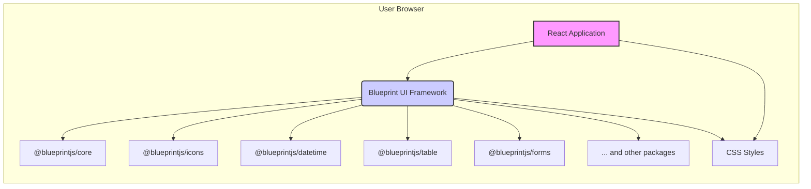
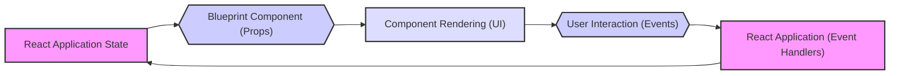

# Project Design Document: Blueprint UI Framework (Improved)

**Project Name:** Blueprint UI Framework

**Project Repository:** [https://github.com/palantir/blueprint](https://github.com/palantir/blueprint)

**Document Version:** 1.1
**Date:** 2023-10-27
**Author:** AI Software Architect

## 1. Introduction

This document provides an enhanced design overview of the Blueprint UI Framework, a widely adopted open-source React-based UI toolkit for web applications.  It is specifically crafted to facilitate threat modeling and security analysis for projects leveraging Blueprint. The document details Blueprint's architecture, core components, data flow mechanisms, and underlying technology stack, offering a comprehensive understanding of its structure and operational principles from a security perspective.

## 2. Project Overview

*   **Purpose:** Blueprint is a sophisticated React UI framework meticulously designed for building intricate, data-intensive web interfaces, particularly for desktop-caliber applications. It delivers an extensive and versatile suite of UI components, encompassing elements for layout management, intuitive navigation, rich data presentation, robust form handling, and seamless user interactions.
*   **Target Users:** Software developers and engineering teams focused on creating modern web applications, especially those demanding highly interactive and feature-rich user interfaces for complex data visualization, efficient data management, and in-depth data analysis.
*   **Key Strengths:**
    *   **Modular Component Architecture:** Built upon React's component model, promoting code reusability, maintainability, and a declarative programming style.
    *   **Extensive Component Library:** Offers a broad spectrum of pre-built UI components, ranging from fundamental UI primitives to advanced, specialized widgets, accelerating development and ensuring consistency.
    *   **Flexible Theming and Customization:**  Provides robust theming capabilities, enabling developers to tailor the visual appearance and branding of applications to specific requirements and design guidelines.
    *   **Accessibility-First Design:**  Developed with a strong emphasis on accessibility, striving for compliance with WCAG (Web Content Accessibility Guidelines) to ensure inclusivity.
    *   **TypeScript Foundation:**  Developed in TypeScript, leveraging static typing to enhance code quality, improve developer productivity, and reduce runtime errors.
    *   **Desktop-Grade User Experience:** Components are meticulously crafted to deliver user interfaces that emulate the responsiveness and familiarity of traditional desktop applications within the browser environment.

## 3. Architecture Overview

Blueprint adopts a highly modular architecture, logically organized into distinct, manageable packages. As a client-side UI library, it operates entirely within the user's web browser, seamlessly integrating into React applications.  Its modular design allows for selective inclusion of features, optimizing application bundle sizes.

*   **High-Level Architecture Diagram (Mermaid):**

*   **Architecture Layers Explained:**
    *   **React Application Layer:** This layer represents the custom application code developed by users of Blueprint. It encompasses the application's business logic, data management strategies, routing, and overall application structure, orchestrating the use of Blueprint components.
    *   **Blueprint UI Framework Layer:** This is the core of Blueprint, providing the reusable UI components, associated logic, and default styling. It is structured as a collection of npm packages, promoting modularity and selective imports.
    *   **Modular Component Packages:** Blueprint's architecture is based on npm packages, enabling developers to import only the specific components needed for their application, thereby minimizing bundle size and improving performance. Key packages include:
        *   `@blueprintjs/core`:  Contains fundamental UI components (buttons, cards, dialogs), layout utilities (grid, spacers), typography styles, theming infrastructure, and essential utilities.
        *   `@blueprintjs/icons`:  Provides a comprehensive library of vector icons and the `Icon` component for rendering them, supporting various icon sets.
        *   `@blueprintjs/datetime`:  Offers date and time selection components like `DatetimePicker` and `Calendar`, facilitating user input of temporal data.
        *   `@blueprintjs/table`:  Provides advanced table and grid components for displaying, sorting, filtering, and interacting with tabular datasets.
        *   `@blueprintjs/forms`:  Includes form-related components such as `InputGroup`, `TextArea`, `Checkbox`, `RadioGroup`, `Select`, and form validation utilities to streamline form development.
        *   `... and other packages`:  Blueprint's modularity extends to numerous other packages, each addressing specific UI needs, such as `@blueprintjs/popover2` for popovers, `@blueprintjs/select` for advanced select menus, `@blueprintjs/tree` for tree views, and more.
    *   **CSS Styles:** Blueprint provides pre-written CSS stylesheets that define the default visual styling of its components. These styles are designed to be customizable through theming mechanisms, allowing for branding and visual consistency across applications.

## 4. Component Breakdown

Blueprint's strength lies in its extensive and well-organized collection of component packages. This modularity allows developers to choose and integrate only the necessary components, optimizing application size and complexity.

*   **Foundational Components (`@blueprintjs/core`):**
    *   **Purpose:** These components form the bedrock of the framework, providing essential UI building blocks, layout primitives, and the core theming system.
    *   **Examples:**
        *   `Button`:  Interactive button elements with various styles and states.
        *   `Card`:  Container components for visually grouping related content sections.
        *   `Dialog`:  Modal dialog windows for focused user interactions and alerts.
        *   `Overlay`:  Components for creating overlay effects, popovers, and modal-like behaviors.
        *   `Navbar`:  Navigation bars typically used for application headers and primary navigation.
        *   `Menu`:  Context menus and dropdown menus for actions and options.
        *   `Tabs`:  Tabbed navigation components for organizing content into distinct views.
        *   `Colors and Themes`:  Utilities and definitions for managing application-wide styling and theming.
        *   `Grid`: Layout utilities for creating responsive grid-based layouts.
*   **Icon Components (`@blueprintjs/icons`):**
    *   **Purpose:** To provide a consistent and scalable library of vector icons for visual communication within the UI.
    *   **Examples:**
        *   `Icon`:  The primary component for rendering icons from Blueprint's icon sets, supporting customization of size and color.
        *   Various Icon Sets:  Predefined sets of icons covering common UI needs, available in different styles (e.g., solid, standard).
*   **Form Components (`@blueprintjs/forms`):**
    *   **Purpose:** To streamline form creation and user input handling with styled and functional form elements.
    *   **Examples:**
        *   `InputGroup`:  Styled text input fields, often with labels, prefixes, and suffixes for enhanced user experience.
        *   `TextArea`:  Multi-line text input fields for larger text inputs.
        *   `Checkbox`:  Standard checkbox input elements for boolean selections.
        *   `RadioGroup`:  Groups of radio buttons for mutually exclusive choices.
        *   `Select`:  Dropdown select menus for choosing from a list of options.
        *   `Slider`:  Range input sliders for selecting values within a continuous range.
        *   `Switch`:  Toggle switches for on/off or boolean state control.
*   **Data Display Components (`@blueprintjs/table`, `@blueprintjs/datetime`, etc.):**
    *   **Purpose:** To facilitate the presentation and interaction with various types of data, including tabular data, dates, and hierarchical structures.
    *   **Examples:**
        *   `Table` (`@blueprintjs/table`):  A highly customizable and feature-rich table component for displaying and manipulating large datasets, supporting sorting, filtering, and cell interactions.
        *   `DatetimePicker` (`@blueprintjs/datetime`):  Comprehensive date and time selection components, offering calendar and time input interfaces.
        *   `Calendar` (`@blueprintjs/datetime`):  A calendar view component specifically for date selection.
        *   `Tree` (`@blueprintjs/core`):  Tree view component for displaying hierarchical data in an expandable and collapsible tree structure.
*   **Interaction Components (`@blueprintjs/core`, `@blueprintjs/popover2`):**
    *   **Purpose:** To enhance user interaction and provide contextual information through interactive UI elements.
    *   **Examples:**
        *   `Tooltip` (`@blueprintjs/core`):  Tooltips for displaying short contextual help messages on hover or focus.
        *   `Popover` (`@blueprintjs/popover2`):  Popover components for displaying content in a floating panel triggered by user interaction, useful for menus, settings, and contextual information.
        *   `Menu` (`@blueprintjs/core`):  Context menus and dropdown menus for actions and options, triggered by clicks or other user events.

## 5. Data Flow

Blueprint components operate within the client-side React application, adhering to React's unidirectional data flow paradigm. Data management is primarily handled by React's state management mechanisms.

*   **Data Flow Diagram (Mermaid):**

*   **Data Flow Description:**
    *   **State as Input (Props):** Data within the React application is managed using React's state management (e.g., `useState`, `useReducer`, or external state management libraries). This state data is passed down to Blueprint components as *props* (properties). Props are the primary mechanism for configuring and controlling Blueprint components.
    *   **Rendering UI:** Blueprint components receive props and, based on these props and their internal rendering logic, generate and update the UI elements displayed in the browser. React's efficient rendering process ensures that only necessary UI updates are performed.
    *   **User Interaction and Events:** When users interact with Blueprint components (e.g., clicking a button, typing in an input field, selecting a menu item), these interactions trigger DOM events. Blueprint components are designed to capture and handle relevant DOM events.
    *   **Event Handling and State Updates:** Blueprint components often expose callback props (event handlers) that are invoked when specific user interactions occur. The React application provides the implementation for these event handlers. Within these handlers, the application logic updates the React application state based on the user interaction.
    *   **State-Driven Re-rendering:** When the React application state is modified by event handlers, React's reconciliation process detects these changes and efficiently re-renders only the components that are affected by the state update. This includes Blueprint components that are connected to the updated state via props, resulting in a reactive UI that reflects the latest application state.

## 6. Technology Stack

*   **Core Programming Languages:**
    *   TypeScript: The primary development language for Blueprint, providing static typing, enhanced code organization, and improved maintainability.
    *   JavaScript:  TypeScript code is compiled to JavaScript for execution in web browsers. Blueprint ultimately runs as JavaScript in the client's browser.
    *   CSS (and potentially CSS Preprocessors like Sass/Less): Used for styling Blueprint components. CSS defines the visual appearance and layout.
*   **Primary Framework/Library:**
    *   React (v16.8+ recommended, check Blueprint documentation for specific peer dependency): The foundational UI library upon which Blueprint is built. Blueprint components are React components and rely on React's ecosystem.
*   **Build and Development Tools:**
    *   Webpack:  A module bundler used to package JavaScript, CSS, and other assets into optimized bundles for deployment.
    *   Babel:  A JavaScript compiler that transforms modern JavaScript (and TypeScript) code into browser-compatible JavaScript versions.
    *   npm or Yarn:  Package managers for managing project dependencies, including Blueprint packages and other libraries.
*   **Testing Infrastructure:**
    *   Jest:  A popular JavaScript testing framework used for unit and integration testing of Blueprint components and related code.
    *   React Testing Library:  A testing utility specifically designed for testing React components in a user-centric way, focusing on component behavior rather than implementation details.
*   **Documentation Generation:**
    *   Custom Documentation Tools (likely): Blueprint likely employs custom tools, potentially leveraging technologies within the TypeScript and React ecosystem, to generate its comprehensive documentation from source code and documentation comments.

## 7. Deployment Model

*   **Distribution via npm:** Blueprint is distributed as a set of npm packages. Developers install these packages into their React projects using npm or Yarn package managers.
*   **Integration into React Applications:** Developers import and utilize Blueprint components directly within their React application code, composing UIs by combining Blueprint components with their own custom components and application logic.
*   **Bundling for Deployment:** Webpack or similar bundlers are used to bundle the application's JavaScript code (including Blueprint components), CSS styles, and other assets into static files (JavaScript bundles, CSS files, images, etc.). This bundling process optimizes assets for browser delivery.
*   **Deployment to Web Servers/CDNs:** The bundled static assets are typically deployed to standard web servers (e.g., Nginx, Apache) or Content Delivery Networks (CDNs) for efficient distribution to users' web browsers.
*   **Client-Side Execution Environment:** Blueprint code executes entirely within the user's web browser. It is a client-side UI framework. While Blueprint can be used in server-rendered React applications, server-side rendering is not a requirement for Blueprint itself to function.

## 8. Security Considerations (For Threat Modeling)

This section expands on security considerations relevant to Blueprint and applications built with it, providing a more detailed foundation for threat modeling.

*   **Cross-Site Scripting (XSS) Vulnerabilities:**
    *   **Risk:** Blueprint components render UI based on the props they receive. If an application passes unsanitized or improperly encoded user-provided data as props, particularly when rendering dynamic content or HTML attributes, it can create XSS vulnerabilities. Attackers could inject malicious scripts that execute in users' browsers.
    *   **Mitigation:**
        *   **Strict Input Sanitization and Validation:** Applications *must* rigorously sanitize and validate all user inputs on both the client-side and server-side before using them in props passed to Blueprint components.
        *   **Proper Output Encoding:** React's JSX syntax and default escaping mechanisms provide a degree of protection against XSS. However, developers must be mindful of situations where they might bypass these mechanisms (e.g., using `dangerouslySetInnerHTML`) and ensure proper encoding in such cases.
        *   **Content Security Policy (CSP):** Implement a strong Content Security Policy to restrict the sources from which the browser is allowed to load resources, mitigating the impact of potential XSS attacks.
*   **Dependency Vulnerabilities:**
    *   **Risk:** Blueprint, like most modern JavaScript frameworks, relies on a substantial number of npm packages (including React itself and its internal dependencies). Vulnerabilities discovered in these dependencies could indirectly affect applications using Blueprint.
    *   **Mitigation:**
        *   **Regular Dependency Updates:**  Keep Blueprint and all its dependencies updated to the latest versions. Security patches are often released for known vulnerabilities in npm packages.
        *   **Dependency Scanning Tools:** Utilize automated dependency scanning tools (e.g., npm audit, Snyk, OWASP Dependency-Check) to regularly identify and assess vulnerabilities in the project's dependency tree.
        *   **Vulnerability Monitoring:** Subscribe to security advisories and vulnerability databases to stay informed about newly discovered vulnerabilities affecting dependencies.
*   **Accessibility and Security Intersections:**
    *   **Risk:** Accessibility issues can sometimes create security vulnerabilities. For example, poorly structured ARIA attributes or insufficient semantic HTML could inadvertently expose sensitive information to users of assistive technologies or create opportunities for manipulation. Denial-of-service attacks targeting accessibility features are also possible in some scenarios.
    *   **Mitigation:**
        *   **Accessibility Best Practices:** Adhere to accessibility best practices and WCAG guidelines throughout the application development process, including when using and customizing Blueprint components.
        *   **Regular Accessibility Audits:** Conduct regular accessibility audits using automated tools and manual testing with assistive technologies to identify and remediate accessibility issues, which can indirectly improve security.
        *   **Security Testing with Accessibility in Mind:** Consider accessibility aspects during security testing to identify potential vulnerabilities related to information disclosure or manipulation through accessibility features.
*   **Insufficient Input Validation (Application-Side Responsibility):**
    *   **Risk:** While Blueprint provides form components, it does not enforce input validation itself. Applications using Blueprint are responsible for implementing robust input validation. Lack of proper validation can lead to various vulnerabilities, including data injection attacks, data corruption, and application logic errors.
    *   **Mitigation:**
        *   **Comprehensive Input Validation:** Implement thorough client-side and server-side input validation for all data collected through Blueprint form components and any other user input mechanisms.
        *   **Validation Libraries:** Utilize validation libraries to streamline and standardize input validation processes.
        *   **Server-Side Validation as Primary Defense:** Always perform server-side validation, even if client-side validation is in place, as client-side validation can be bypassed.
*   **Sensitive Data Handling in Components:**
    *   **Risk:** Applications may use Blueprint components to display or collect sensitive data (e.g., in tables, forms, charts). Improper handling of sensitive data within the application logic interacting with Blueprint components can lead to data exposure, logging of sensitive information, or insecure storage in client-side state.
    *   **Mitigation:**
        *   **Minimize Client-Side Storage of Sensitive Data:** Avoid storing sensitive data in client-side state or browser storage (localStorage, sessionStorage, cookies) unless absolutely necessary and with appropriate encryption.
        *   **Data Masking and Redaction:** Implement data masking or redaction techniques to protect sensitive data displayed in UI components, especially in logs or debugging outputs.
        *   **Secure Data Transmission (HTTPS):** Ensure all communication between the client and server, especially when transmitting sensitive data, is encrypted using HTTPS.
        *   **Careful Logging and Debugging:** Be extremely cautious about logging or including sensitive data in debugging outputs, especially in production environments.
*   **Component Misconfiguration and Misuse:**
    *   **Risk:** Incorrect configuration or unintended misuse of Blueprint components by developers could potentially introduce vulnerabilities or unexpected behavior. For example, misconfiguring permissions on interactive components or unintentionally exposing internal data through component props.
    *   **Mitigation:**
        *   **Thorough Documentation and Examples:** Blueprint should provide clear, comprehensive documentation and illustrative examples for all components, emphasizing best practices and secure usage patterns.
        *   **Code Reviews and Static Analysis:** Conduct code reviews and utilize static analysis tools to identify potential misconfigurations or misuses of Blueprint components in application code.
        *   **Developer Training and Awareness:** Educate developers on secure coding practices when using UI frameworks and specifically Blueprint, highlighting common pitfalls and security considerations.
*   **Client-Side Logic and Security Limitations:**
    *   **Risk:** As a client-side framework, all Blueprint code and application logic using it runs in the user's browser. Sensitive business logic, secrets, or critical security controls should *never* be implemented solely on the client-side, as client-side code is inherently exposed and can be manipulated by users.
    *   **Mitigation:**
        *   **Server-Side Enforcement of Security Controls:** Implement all critical security controls, authentication, authorization, and sensitive business logic on the server-side.
        *   **Secure APIs for Sensitive Operations:** Rely on secure server-side APIs for all sensitive operations and data access. Client-side code should only interact with these APIs to request data or trigger actions.
        *   **Principle of Least Privilege:** Design client-side code with the principle of least privilege in mind. Grant only the necessary permissions and access to client-side components and logic.

This improved design document provides a more robust foundation for threat modeling the Blueprint UI Framework and applications that utilize it. A dedicated threat modeling exercise should leverage this document to identify specific threats, assess their likelihood and impact, and develop appropriate mitigation strategies tailored to the specific application context.