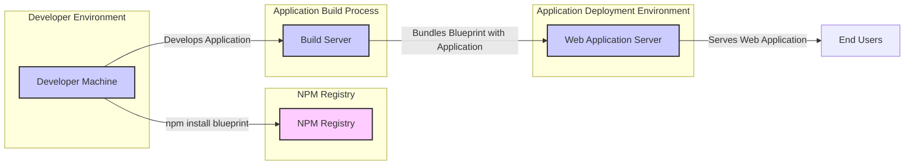

# BUSINESS POSTURE

This project, Blueprint UI framework, aims to provide a comprehensive and reusable set of React UI components for building web applications, particularly complex, data-dense interfaces.

- Business priorities:
  - Accelerate development of user interfaces.
  - Ensure consistency and quality of user interfaces across applications.
  - Provide a robust and well-tested UI component library.
  - Foster a strong developer community around the framework.
- Business goals:
  - Increase developer productivity by providing ready-to-use UI components.
  - Reduce development costs and time by simplifying UI development.
  - Improve user experience through consistent and well-designed interfaces.
  - Establish Blueprint as a leading React UI framework for enterprise applications.
- Business risks:
  - Adoption risk: Developers may not adopt Blueprint if it doesn't meet their needs or is difficult to use.
  - Quality risk: Bugs or performance issues in Blueprint components can negatively impact applications using it.
  - Security risk: Security vulnerabilities in Blueprint components can expose applications to attacks.
  - Maintenance risk: Lack of ongoing maintenance and updates can lead to Blueprint becoming outdated and less useful.
  - Dependency risk: Reliance on external dependencies could introduce vulnerabilities or instability.

# SECURITY POSTURE

Blueprint, as an open-source UI component library, likely incorporates standard security practices for open-source projects.

- Existing security controls:
  - security control: Code reviews are likely performed for contributions to the project. (Location: GitHub pull request review process)
  - security control: Unit and integration tests are in place to ensure component functionality and stability. (Location: Test suites within the repository)
  - security control: Dependency management using package managers like NPM or Yarn. (Location: `package.json` and lock files in the repository)
  - accepted risk: Vulnerabilities in third-party dependencies. Mitigation is likely through dependency updates and vulnerability scanning, but complete elimination is difficult.
  - accepted risk: Potential for undiscovered vulnerabilities in the codebase. Open-source nature and community review help mitigate this, but cannot eliminate it entirely.

- Recommended security controls:
  - security control: Implement automated Static Application Security Testing (SAST) tools in the CI/CD pipeline to detect potential vulnerabilities in the code.
  - security control: Implement automated Dependency Scanning to identify known vulnerabilities in third-party dependencies.
  - security control: Establish a clear process for reporting and handling security vulnerabilities, including a security policy and contact information.
  - security control: Consider signing releases and artifacts to ensure integrity and prevent tampering.
  - security control: Regularly update dependencies to patch known vulnerabilities.

- Security requirements:
  - Authentication: Not directly applicable to a UI component library itself. Authentication is handled by the applications that use Blueprint.
  - Authorization: Not directly applicable to a UI component library itself. Authorization is handled by the applications that use Blueprint.
  - Input validation: Blueprint components that handle user input (e.g., forms, inputs) must implement robust input validation to prevent injection attacks (e.g., XSS).
  - Cryptography: Blueprint itself is unlikely to directly implement cryptography. If applications using Blueprint require cryptography, they should use secure and well-vetted cryptographic libraries. Blueprint components should be designed to handle encrypted data securely if necessary (e.g., displaying encrypted data after decryption in the application).

# DESIGN

Blueprint is a React UI component library. Its design is centered around providing reusable and composable UI elements for web application development.

## C4 CONTEXT

```mermaid
flowchart LR
    subgraph "Application Developers"
        A[Developers]
    end
    subgraph "NPM Registry"
        NPM[NPM Registry]
    end
    subgraph "CDN (Optional)"
        CDN[Content Delivery Network]
    end
    subgraph "Web Applications"
        WebApp[Web Applications]
    end
    center_box("Blueprint UI Framework")

    A --> |Uses| center_box
    center_box --> |Published to| NPM
    center_box --> |Published to (Optional)| CDN
    center_box --> |Used by| WebApp
    WebApp --> |Delivered via| CDN
    WebApp --> |Dependencies from| NPM

    classDef centerStyle fill:#f9f,stroke:#333,stroke-width:2px
    class center_box centerStyle
```

- Context Diagram Elements:
  - Element:
    - Name: Developers
    - Type: Person
    - Description: Software developers who use Blueprint to build web applications.
    - Responsibilities: Utilize Blueprint components to create user interfaces for their applications. Integrate Blueprint into their development workflow.
    - Security controls: Secure development practices, code reviews within their own application development process.
  - Element:
    - Name: Blueprint UI Framework
    - Type: Software System
    - Description: A React-based UI component library providing reusable UI elements.
    - Responsibilities: Provide a wide range of UI components. Ensure components are well-designed, performant, and accessible. Maintain and update the library.
    - Security controls: Secure Software Development Lifecycle (SSDLC), code reviews, automated testing, dependency scanning, vulnerability management.
  - Element:
    - Name: NPM Registry
    - Type: Software System
    - Description: A public registry for Node.js packages, used to distribute and manage Javascript libraries.
    - Responsibilities: Host and distribute Blueprint packages. Provide package management functionalities.
    - Security controls: Package signing, vulnerability scanning of hosted packages, access controls for publishing packages.
  - Element:
    - Name: CDN (Content Delivery Network)
    - Type: Software System
    - Description: Optional Content Delivery Network for hosting and distributing Blueprint assets (e.g., CSS, Javascript).
    - Responsibilities: Provide fast and reliable delivery of Blueprint assets to end-users.
    - Security controls: DDoS protection, secure content delivery (HTTPS), access controls, content integrity checks.
  - Element:
    - Name: Web Applications
    - Type: Software System
    - Description: Web applications built using Blueprint UI Framework.
    - Responsibilities: Provide application-specific functionality to end-users. Render user interfaces using Blueprint components.
    - Security controls: Application-level security controls (authentication, authorization, input validation, etc.), secure deployment practices.

## C4 CONTAINER

```mermaid
flowchart LR
    subgraph "Blueprint UI Framework"
        direction TB
        Core[Core Components]
        Icons[Icons Package]
        Labs[Labs (Experimental Components)]
        Styles[Styles (CSS)]

        Core -- Uses --> Styles
        Labs -- Uses --> Core
    end
    subgraph "NPM Registry"
        NPM[NPM Registry]
    end

    BlueprintUIFramework("Blueprint UI Framework")

    BlueprintUIFramework --> NPM

    classDef containerStyle fill:#ccf,stroke:#333,stroke-width:2px
    class Core,Icons,Labs,Styles containerStyle
    classDef systemStyle fill:#fcf,stroke:#333,stroke-width:2px
    class NPM systemStyle
    classDef boundaryStyle stroke:#999,stroke-dasharray: 5 5
    class BlueprintUIFramework boundaryStyle
```

- Container Diagram Elements:
  - Element:
    - Name: Blueprint UI Framework
    - Type: Boundary
    - Description: Represents the overall Blueprint UI Framework as a logical boundary.
    - Responsibilities: Encompasses all the packages and components that make up Blueprint.
    - Security controls: Organizational security controls for the Blueprint project as a whole, including development practices, security policies, and vulnerability response.
  - Element:
    - Name: Core Components
    - Type: Container - React Components
    - Description: Contains the main, stable UI components of Blueprint.
    - Responsibilities: Provide reusable and well-tested UI components for common UI patterns.
    - Security controls: Input validation within components, secure coding practices, component-level testing.
  - Element:
    - Name: Icons Package
    - Type: Container - Assets
    - Description: Contains icon assets used by Blueprint components.
    - Responsibilities: Provide a consistent set of icons for the UI framework.
    - Security controls: Integrity checks on icon assets, secure storage and delivery of assets.
  - Element:
    - Name: Labs (Experimental Components)
    - Type: Container - React Components
    - Description: Contains experimental or less stable UI components.
    - Responsibilities: Provide early access to new components, gather feedback, and iterate on component design.
    - Security controls: Components in Labs may have fewer security guarantees than Core components. Security considerations are still important but might be less rigorous during the experimental phase. Clear communication about the experimental nature of these components is a security control in itself (managing user expectations).
  - Element:
    - Name: Styles (CSS)
    - Type: Container - Stylesheets
    - Description: Contains CSS stylesheets that define the visual appearance of Blueprint components.
    - Responsibilities: Provide consistent styling for all Blueprint components. Ensure styles are performant and maintainable.
    - Security controls: CSS injection prevention, careful review of CSS code to avoid unintended side effects or vulnerabilities.
  - Element:
    - Name: NPM Registry
    - Type: Container - Package Registry
    - Description: The NPM registry used to host and distribute Blueprint packages.
    - Responsibilities: Host and distribute Blueprint packages.
    - Security controls: Package signing, vulnerability scanning by NPM, access control for publishing.

## DEPLOYMENT

Blueprint itself is not deployed as an application but rather as a library that is consumed by other applications. The deployment context is how developers integrate Blueprint into their web applications.

Deployment Architecture Option 1: NPM and Application Bundling



- Deployment Diagram Elements (NPM and Application Bundling):
  - Element:
    - Name: Developer Machine
    - Type: Environment
    - Description: Developer's local machine where they develop web applications.
    - Responsibilities: Development of applications, installing Blueprint using package managers.
    - Security controls: Local machine security controls, developer training on secure development practices.
  - Element:
    - Name: NPM Registry
    - Type: Infrastructure
    - Description: Public NPM registry from which Blueprint packages are downloaded.
    - Responsibilities: Hosting and distributing Blueprint packages.
    - Security controls: NPM's security controls (package signing, vulnerability scanning).
  - Element:
    - Name: Build Server
    - Type: Environment
    - Description: Server used for building and bundling the web application, including Blueprint.
    - Responsibilities: Automating the build process, bundling application code and dependencies (including Blueprint).
    - Security controls: Secure build environment, access controls, build process security (e.g., dependency integrity checks).
  - Element:
    - Name: Web Application Server
    - Type: Environment
    - Description: Server hosting the deployed web application that uses Blueprint.
    - Responsibilities: Serving the web application to end-users.
    - Security controls: Server hardening, application security controls, network security controls.
  - Element:
    - Name: End Users
    - Type: Person
    - Description: Users accessing the web application built with Blueprint.
    - Responsibilities: Using the web application.
    - Security controls: User-side security practices (e.g., browser security).

## BUILD

The build process for Blueprint involves compiling, testing, and packaging the library for distribution.

```mermaid
flowchart LR
    subgraph "Developer"
        Developer[Developer]
    end
    subgraph "Source Code Repository (GitHub)"
        Repo[GitHub Repository]
    end
    subgraph "CI/CD System (GitHub Actions)"
        CI[CI/CD System]
    end
    subgraph "NPM Registry"
        NPM[NPM Registry]
    end
    subgraph "Build Artifacts"
        Artifacts[Build Artifacts (NPM Packages)]
    end

    Developer --> |Code Changes| Repo
    Repo --> |Triggers Build| CI
    CI --> |Builds & Tests| Artifacts
    CI --> |Publishes| NPM
    Artifacts --> |Stored| NPM

    classDef nodeStyle fill:#ccf,stroke:#333,stroke-width:2px
    class Developer,Artifacts nodeStyle
    classDef systemStyle fill:#fcf,stroke:#333,stroke-width:2px
    class Repo,CI,NPM systemStyle
```

- Build Diagram Elements:
  - Element:
    - Name: Developer
    - Type: Person
    - Description: Developers contributing to the Blueprint project.
    - Responsibilities: Writing code, submitting pull requests, performing code reviews.
    - Security controls: Secure coding practices, code review process, access control to the repository.
  - Element:
    - Name: Source Code Repository (GitHub)
    - Type: System
    - Description: GitHub repository hosting the Blueprint source code.
    - Responsibilities: Version control, code storage, collaboration platform.
    - Security controls: Access controls, branch protection, audit logs, vulnerability scanning by GitHub.
  - Element:
    - Name: CI/CD System (GitHub Actions)
    - Type: System
    - Description: GitHub Actions used for automated build, test, and deployment pipelines.
    - Responsibilities: Automating the build process, running tests, performing security checks (SAST, dependency scanning), publishing packages.
    - Security controls: Secure CI/CD configuration, access controls, secrets management, build process security, SAST and dependency scanning integration.
  - Element:
    - Name: Build Artifacts (NPM Packages)
    - Type: Data
    - Description: NPM packages generated by the build process.
    - Responsibilities: Packaged and tested versions of Blueprint ready for distribution.
    - Security controls: Package signing, integrity checks, secure storage.
  - Element:
    - Name: NPM Registry
    - Type: System
    - Description: Public NPM registry where Blueprint packages are published.
    - Responsibilities: Hosting and distributing Blueprint packages.
    - Security controls: NPM's security controls (package signing, vulnerability scanning, access control for publishing).

# RISK ASSESSMENT

- Critical business process:
  - Software development using Blueprint UI framework. The availability, integrity, and security of Blueprint directly impact the efficiency and security of applications built with it.
- Data being protected:
  - Source code of Blueprint UI framework: Sensitivity is moderate as it is open source, but integrity and availability are crucial. Unauthorized modification or loss of source code can disrupt development and introduce vulnerabilities.
  - Build artifacts (NPM packages): Sensitivity is moderate, integrity and availability are critical. Tampered or unavailable packages can lead to supply chain attacks and prevent developers from using Blueprint.
- Data sensitivity:
  - Source code: Publicly available, but integrity is paramount.
  - Build artifacts: Publicly available, but integrity is paramount.
  - Configuration data for build and deployment: Confidentiality is important to prevent unauthorized modifications to the build and deployment process.

# QUESTIONS & ASSUMPTIONS

- Questions:
  - What specific SAST and dependency scanning tools are used in the Blueprint CI/CD pipeline?
  - Is there a formal security vulnerability reporting and handling process for Blueprint?
  - Are Blueprint releases signed to ensure integrity?
  - Are there regular penetration tests or security audits conducted on Blueprint?
  - What is the process for updating dependencies and patching vulnerabilities in Blueprint?
- Assumptions:
  - Code reviews are performed for all contributions.
  - Unit and integration tests are comprehensive.
  - Standard GitHub Actions are used for CI/CD.
  - Blueprint packages are published to the public NPM registry.
  - Developers primarily use NPM to install and bundle Blueprint with their applications.