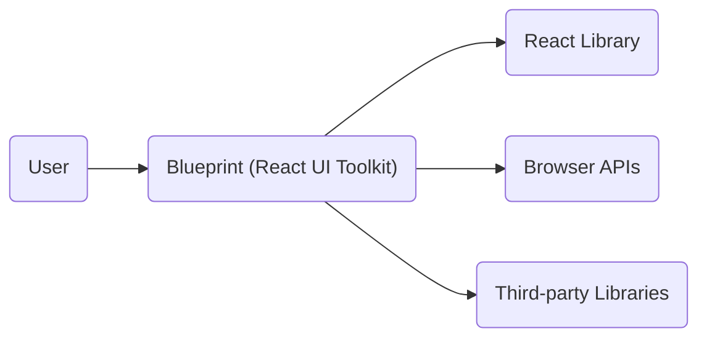
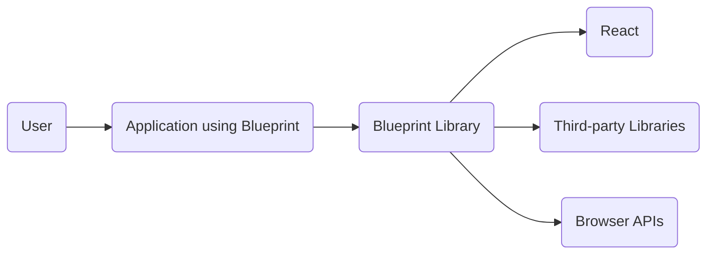
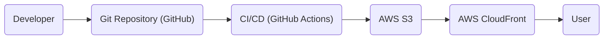
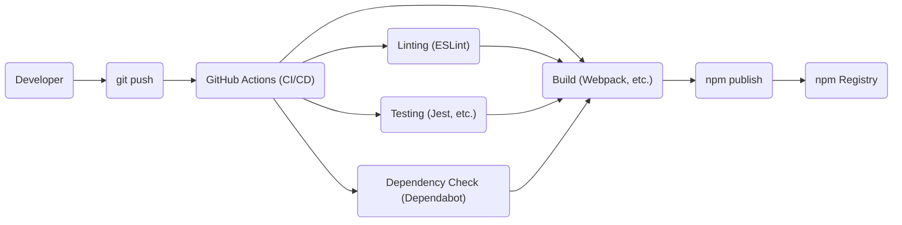

Okay, let's create a design document for the Palantir Blueprint project, focusing on aspects relevant to threat modeling.

# BUSINESS POSTURE

Blueprint is a React-based UI toolkit for building complex, data-dense web interfaces.  It's open-source, suggesting a focus on community adoption, ease of use, and broad applicability across various industries.  The project is maintained by Palantir, a company known for its data analytics platforms, implying a high standard for quality and reliability, but also potentially a lower risk tolerance than a very early-stage startup.

Priorities:

*   Wide adoption by developers.
*   Ease of integration into existing React projects.
*   Component reliability and stability.
*   Accessibility and responsiveness.
*   Maintainability and extensibility of the library.
*   Consistency of UI/UX.

Goals:

*   Provide a comprehensive set of reusable UI components.
*   Reduce development time for building complex web applications.
*   Offer a consistent and polished user experience.
*   Enable developers to create accessible and responsive interfaces.

Business Risks:

*   Security vulnerabilities in components could expose applications built with Blueprint to attacks.
*   Lack of adoption due to poor documentation, difficult integration, or performance issues.
*   Inability to keep up with evolving web standards and React updates.
*   Reputational damage due to security breaches or major bugs.
*   Competition from other UI component libraries.

# SECURITY POSTURE

Existing Security Controls (based on the GitHub repository and common practices):

*   security control: Code Reviews: Palantir likely has internal code review processes before merging pull requests. (Inferred from Palantir's reputation and standard open-source practices).
*   security control: Static Analysis: Likely use of linters (ESLint) and potentially static analysis tools to identify potential code quality and security issues. (Observed in package.json and common practice).
*   security control: Dependency Management: Use of package managers (npm/yarn) to manage dependencies and potentially tools like Dependabot to identify vulnerable dependencies. (Observed in package.json and common practice).
*   security control: Testing: Presence of unit and integration tests to ensure component functionality and prevent regressions. (Observed in the repository structure).
*   security control: Documentation: Extensive documentation, including security considerations (though specific security documentation needs further review). (Observed in the repository).

Accepted Risks:

*   accepted risk: Reliance on third-party libraries: Blueprint, like any React project, depends on numerous third-party libraries. Vulnerabilities in these dependencies could impact Blueprint's security. This is a common and generally accepted risk, mitigated by dependency management and monitoring.
*   accepted risk: Cross-Site Scripting (XSS): While React itself provides some protection against XSS, improper use of Blueprint components or custom code within applications using Blueprint could introduce XSS vulnerabilities. This is a standard risk for web applications.
*   accepted risk: Denial of Service (DoS): Extremely complex or deeply nested component structures could potentially lead to performance issues or even denial-of-service scenarios in the browser. This is a less common but potential risk.

Recommended Security Controls:

*   security control: Content Security Policy (CSP): Provide guidance and examples for implementing CSP in applications using Blueprint to mitigate XSS and other injection attacks.
*   security control: Regular Security Audits: Conduct periodic security audits, including penetration testing, of the Blueprint library and its components.
*   security control: Vulnerability Disclosure Program: Establish a clear process for reporting and addressing security vulnerabilities discovered by external researchers.
*   security control: Supply Chain Security: Implement measures to verify the integrity of the build process and prevent malicious code injection during development or deployment. This could include code signing, software bill of materials (SBOM), and provenance verification.

Security Requirements:

*   Authentication: Blueprint itself does not handle authentication. Applications using Blueprint are responsible for implementing secure authentication mechanisms.
*   Authorization: Blueprint does not directly handle authorization. Applications using Blueprint are responsible for implementing appropriate authorization controls to restrict access to sensitive data and functionality.
*   Input Validation:
    *   Blueprint components should validate user input to prevent common web vulnerabilities like XSS and injection attacks.
    *   Components should handle various data types appropriately and sanitize input where necessary.
    *   Developers using Blueprint should be aware of input validation requirements and follow best practices.
*   Cryptography: Blueprint does not directly handle cryptographic operations. Applications using Blueprint are responsible for using appropriate cryptographic libraries and techniques when handling sensitive data.
*   Output Encoding: Blueprint components should properly encode output to prevent XSS vulnerabilities. This is particularly important when rendering user-provided data.

# DESIGN

## C4 CONTEXT

Element Descriptions:

*   Element:
    *   Name: User
    *   Type: Person
    *   Description: A person interacting with a web application that utilizes Blueprint components.
    *   Responsibilities: Interacts with the UI, provides input, views data.
    *   Security controls: N/A (External to the system)

*   Element:
    *   Name: Blueprint (React UI Toolkit)
    *   Type: Software System
    *   Description: The core Blueprint library, providing a set of React components.
    *   Responsibilities: Provides UI components, handles user interactions within components, manages component state.
    *   Security controls: Input validation, output encoding, regular security audits, dependency management.

*   Element:
    *   Name: React Library
    *   Type: Software System
    *   Description: The underlying React library used by Blueprint.
    *   Responsibilities: Manages the virtual DOM, handles component rendering, provides core React functionalities.
    *   Security controls: React's built-in XSS protection (though not foolproof).

*   Element:
    *   Name: Browser APIs
    *   Type: Software System
    *   Description: Standard web APIs provided by the browser (DOM, Fetch, etc.).
    *   Responsibilities: Provides access to browser functionalities, handles network requests, interacts with the operating system.
    *   Security controls: Browser's built-in security mechanisms (same-origin policy, etc.).

*   Element:
    *   Name: Third-party Libraries
    *   Type: Software System
    *   Description: External libraries used by Blueprint for specific functionalities (e.g., date/time handling, charting).
    *   Responsibilities: Varies depending on the specific library.
    *   Security controls: Dependency management, vulnerability monitoring.

## C4 CONTAINER

Since Blueprint is a library, the "container" level is less distinct than in a typical application with multiple services.  The primary container is the Blueprint library itself, which is then integrated into other applications.

Element Descriptions:

*   Element:
    *   Name: User
    *   Type: Person
    *   Description: A person interacting with the application.
    *   Responsibilities: Interacts with the UI, provides input, views data.
    *   Security controls: N/A (External to the system)

*   Element:
    *   Name: Application using Blueprint
    *   Type: Software System
    *   Description: A web application that integrates the Blueprint library.
    *   Responsibilities: Implements application-specific logic, integrates Blueprint components, handles data fetching and persistence.
    *   Security controls: Authentication, authorization, input validation, output encoding, CSP, session management, etc. (Application-specific).

*   Element:
    *   Name: Blueprint Library
    *   Type: Library
    *   Description: The core Blueprint library, providing a set of React components.
    *   Responsibilities: Provides UI components, handles user interactions within components, manages component state.
    *   Security controls: Input validation, output encoding, regular security audits, dependency management.

*   Element:
    *   Name: React
    *   Type: Library
    *   Description: The underlying React library.
    *   Responsibilities: Manages the virtual DOM, handles component rendering.
    *   Security controls: React's built-in XSS protection.

*   Element:
    *   Name: Third-party Libraries
    *   Type: Library
    *   Description: External libraries used by Blueprint.
    *   Responsibilities: Varies depending on the library.
    *   Security controls: Dependency management, vulnerability monitoring.

*   Element:
    *   Name: Browser APIs
    *   Type: Software System
    *   Description: Standard web APIs provided by the browser.
    *   Responsibilities: Provides access to browser functionalities.
    *   Security controls: Browser's built-in security mechanisms.

## DEPLOYMENT

Blueprint, as a library, is not "deployed" in the traditional sense. It's *published* to a package registry (npm) and then *integrated* into other applications.  The deployment environment is the environment of the application *using* Blueprint.

Possible Deployment Solutions:

1.  Statically hosted web application (e.g., AWS S3 + CloudFront, Netlify, Vercel).
2.  Server-rendered web application (e.g., Node.js/Express server, Python/Django server).
3.  Containerized application (e.g., Docker, Kubernetes).

Chosen Solution (Example: Statically hosted web application on AWS S3 + CloudFront):

Element Descriptions:

*   Element:
    *   Name: Developer
    *   Type: Person
    *   Description: Develops the application using Blueprint.
    *   Responsibilities: Writes code, commits changes, manages the project.
    *   Security controls: Code reviews, secure coding practices.

*   Element:
    *   Name: Git Repository (GitHub)
    *   Type: Version Control System
    *   Description: Stores the application's source code.
    *   Responsibilities: Tracks code changes, manages versions, facilitates collaboration.
    *   Security controls: Access controls, branch protection rules.

*   Element:
    *   Name: CI/CD (GitHub Actions)
    *   Type: Continuous Integration/Continuous Deployment System
    *   Description: Automates the build, test, and deployment process.
    *   Responsibilities: Runs tests, builds the application, deploys to S3.
    *   Security controls: Secure configuration, limited access to secrets.

*   Element:
    *   Name: AWS S3
    *   Type: Cloud Storage
    *   Description: Stores the static assets of the web application (HTML, CSS, JavaScript).
    *   Responsibilities: Serves static files.
    *   Security controls: Bucket policies, access controls, encryption at rest.

*   Element:
    *   Name: AWS CloudFront
    *   Type: Content Delivery Network (CDN)
    *   Description: Distributes the application's content globally for faster access.
    *   Responsibilities: Caches content, reduces latency, provides HTTPS.
    *   Security controls: HTTPS, WAF integration, access logs.

*   Element:
    *   Name: User
    *   Type: Person
    *   Description: Accesses the application via a web browser.
    *   Responsibilities: Interacts with the application.
    *   Security controls: N/A (External to the system)

## BUILD

Build Process Description:

1.  Developer: A developer writes code and pushes changes to a Git repository (e.g., GitHub).
2.  GitHub Actions: A CI/CD pipeline (e.g., GitHub Actions) is triggered by the push.
3.  Linting: Linters (e.g., ESLint) analyze the code for style and potential errors.
4.  Testing: Unit and integration tests (e.g., Jest) are executed to verify functionality.
5.  Dependency Check: Tools like Dependabot scan for vulnerable dependencies.
6.  Build: A build tool (e.g., Webpack, Rollup) bundles the code and creates optimized assets.
7.  npm publish: The built library is published to the npm registry.
8.  npm Registry: The npm registry stores the published package, making it available for others to install.

Security Controls in Build Process:

*   security control: Linting: Identifies potential code quality and security issues early in the development process.
*   security control: Automated Testing: Ensures code functionality and helps prevent regressions that could introduce vulnerabilities.
*   security control: Dependency Scanning: Detects known vulnerabilities in third-party libraries.
*   security control: Secure CI/CD Configuration: Ensures that the build process itself is secure and protected from unauthorized access or modification.
*   security control: Code Signing (Optional): Could be used to verify the integrity of the published package.

# RISK ASSESSMENT

Critical Business Processes:

*   Software Development: The process of creating and maintaining applications that use Blueprint.
*   Community Engagement: Interacting with and supporting the developer community using Blueprint.
*   Reputation Management: Maintaining a positive reputation for security and reliability.

Data to Protect:

*   Source Code (Sensitivity: Medium): The Blueprint source code itself is publicly available, but unreleased code or internal development branches could contain sensitive information.
*   User Data (Sensitivity: Varies): Blueprint itself does not handle user data. However, *applications* built with Blueprint may handle sensitive user data, and vulnerabilities in Blueprint could indirectly expose this data. The sensitivity depends entirely on the application.
*   Build Artifacts (Sensitivity: Medium): The compiled Blueprint library. While intended for public distribution, tampered-with artifacts could pose a risk.
*   API Keys/Secrets (Sensitivity: High): Any API keys or secrets used in the build process (e.g., for publishing to npm) must be protected.

# QUESTIONS & ASSUMPTIONS

Questions:

*   What specific security testing tools and processes are used internally at Palantir for Blueprint?
*   Are there any existing security audit reports for Blueprint that can be reviewed?
*   What is the process for handling security vulnerabilities reported by external researchers?
*   Are there any specific compliance requirements (e.g., SOC 2, HIPAA) that applications built with Blueprint need to meet?
*   What level of support is provided for older versions of Blueprint?
*   Is there a formal process for reviewing and approving contributions from external developers?

Assumptions:

*   BUSINESS POSTURE: Palantir prioritizes security and has internal processes for secure software development.
*   SECURITY POSTURE: Standard security practices like code reviews, linters, and dependency management are in place.
*   DESIGN: The provided diagrams are a reasonable representation of the Blueprint architecture and deployment model, based on publicly available information. The build process is assumed to use GitHub Actions and npm, which are common practices.
*   DESIGN: Applications using Blueprint are responsible for their own security (authentication, authorization, data protection). Blueprint provides building blocks, but the overall security posture depends on the application's implementation.