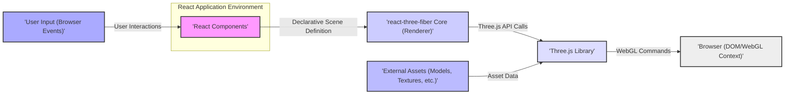
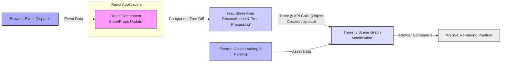

# Project Design Document: react-three-fiber

**Version:** 1.1
**Date:** October 26, 2023
**Author:** AI Software Architect

## 1. Introduction

This document provides a detailed architectural design of the `react-three-fiber` project. This design will serve as the foundation for subsequent security analysis and threat modeling activities, enabling the identification of potential security vulnerabilities and the design of appropriate mitigations. `react-three-fiber` is a React renderer for Three.js, empowering developers to declaratively create and manage Three.js scenes and objects using React's component model. It abstracts away much of the imperative Three.js setup, making 3D development more accessible within a React ecosystem.

## 2. Goals

*   Clearly define the architecture and key components of `react-three-fiber` relevant for security analysis.
*   Illustrate the flow of data and control within the system, highlighting potential points of interaction and manipulation.
*   Identify key trust boundaries and interaction points with external entities.
*   Provide a comprehensive and detailed overview of the system's structure to facilitate thorough threat modeling.

## 3. Target Audience

This document is intended for:

*   Security engineers and architects responsible for performing threat modeling and security assessments.
*   Software developers contributing to or utilizing `react-three-fiber`.
*   Technical stakeholders requiring a deep understanding of the project's architecture and potential security implications.

## 4. System Overview

`react-three-fiber` acts as a declarative bridge between the React component model and the imperative Three.js 3D graphics library. It allows developers to describe Three.js scene graphs using JSX syntax, leveraging React's reconciliation algorithm to efficiently manage the underlying Three.js objects. This abstraction simplifies the creation and manipulation of 3D scenes within React applications. The core responsibility of `react-three-fiber` is to translate the React component tree into a corresponding Three.js scene graph and manage its lifecycle.

## 5. Architectural Design

The following diagram illustrates the high-level architecture of `react-three-fiber`:

### 5.1. Component Description

*   **'React Components':** These are the user-defined React components that utilize `react-three-fiber`'s provided primitives (e.g., `<mesh>`, `<ambientLight>`, `<PerspectiveCamera>`). They define the desired state and structure of the 3D scene in a declarative manner. These components hold the application logic and data that drive the 3D scene.
*   **'react-three-fiber Core (Renderer)':** This is the core library responsible for:
    *   **Reconciliation:**  Comparing the current and previous React component trees to determine the necessary updates to the Three.js scene graph. This involves creating, updating, and removing Three.js objects.
    *   **Object Management:** Creating and managing the lifecycle of Three.js objects based on the props passed to the React components.
    *   **Event Handling:**  Translating browser events into interactions within the 3D scene, allowing for user interaction with 3D objects.
    *   **Rendering Loop Management:** Orchestrating the rendering loop, triggering updates to the Three.js scene and rendering it to the canvas.
    *   **Prop Handling:**  Safely and efficiently applying prop updates from React components to the corresponding Three.js objects.
*   **'Three.js Library':** A foundational JavaScript library providing the core functionality for creating and displaying 3D graphics in the browser using WebGL. `react-three-fiber` relies on Three.js for the actual low-level rendering and manipulation of 3D objects.
*   **'Browser (DOM/WebGL Context)':** The web browser environment where the React application and the rendered Three.js scene reside. The browser provides the DOM for the user interface and the WebGL context for hardware-accelerated 3D rendering.
*   **'User Input (Browser Events)':** User interactions such as mouse movements, clicks, keyboard presses, and touch events are captured by the browser and can be processed by React components and `react-three-fiber` to enable interaction with the 3D scene.
*   **'External Assets (Models, Textures, etc.)':**  External resources such as 3D models (e.g., GLTF, OBJ), textures (images), and other data files loaded from various sources (e.g., local files, remote servers, CDNs). These assets are crucial for populating the 3D scene with visual content.

## 6. Data Flow

The following diagram illustrates the primary data flow within the system:

### 6.1. Data Flow Description

1. **'React Component State/Props Update':** Changes in the React application's state or props, driven by user interactions, data fetching, or other application logic, trigger a re-render of the relevant React components.
2. **'react-three-fiber Reconciliation & Prop Processing':** The `react-three-fiber` core intercepts these updates and performs reconciliation. It compares the previous and current component trees to identify the necessary changes. Crucially, it processes the props passed to the `react-three-fiber` primitives, translating them into the appropriate properties and methods of the underlying Three.js objects. This stage involves data transformation and validation.
3. **'Three.js Scene Graph Modification':** Based on the reconciliation and prop processing, `react-three-fiber` makes calls to the Three.js API to create, update, or remove objects within the Three.js scene graph. This includes manipulating object properties like position, rotation, scale, materials, and geometries.
4. **'WebGL Rendering Pipeline':** Three.js utilizes the WebGL API to render the updated scene to the browser canvas. This involves complex calculations and drawing operations performed by the GPU.
5. **'Browser Event Dispatch':** Browser events originating from user interactions (e.g., mouse clicks on the canvas) are dispatched through the browser's event system.
6. **'External Asset Loading & Parsing':** React components or application logic can initiate the loading of external assets. This typically involves fetching data from a network or local storage. Once loaded, the asset data needs to be parsed into a format that Three.js can understand (e.g., parsing GLTF files into Three.js geometries and materials). This parsed data is then used to modify the Three.js scene graph.

## 7. Security Considerations (For Threat Modeling)

This section outlines potential areas of security concern that will be explored in detail during the threat modeling process. Each point is linked to specific components and data flows described above.

*   **Cross-Site Scripting (XSS) via React Components ('React Components' -> 'react-three-fiber Reconciliation & Prop Processing' -> 'Three.js Scene Graph Modification'):** If user-provided data or data from untrusted sources is used to dynamically generate props for `react-three-fiber` components (e.g., setting texture URLs, model paths), and this data is not properly sanitized, it could lead to the injection of malicious scripts or content into the rendered scene. For example, a malicious URL for a texture could redirect to a site hosting malware.
*   **Third-Party Dependency Vulnerabilities ('react-three-fiber Core (Renderer)', 'Three.js Library'):** `react-three-fiber` and Three.js rely on numerous third-party dependencies. Vulnerabilities in these dependencies could be exploited if not properly managed and updated. This includes vulnerabilities in the libraries themselves or their transitive dependencies.
*   **Denial of Service (DoS) through Malicious Assets ('External Asset Loading & Parsing' -> 'Three.js Scene Graph Modification' -> 'WebGL Rendering Pipeline'):**  Loading excessively large or complex 3D models or textures from untrusted sources can consume significant client-side resources (CPU, GPU, memory), leading to performance degradation or a complete denial of service for the user. Maliciously crafted assets could also exploit parsing vulnerabilities in Three.js.
*   **Client-Side Data Manipulation/Information Disclosure ('WebGL Rendering Pipeline' -> 'Browser (DOM/WebGL Context)'):** While the core logic resides in the application, sensitive data visualized in the 3D scene is rendered client-side. A malicious actor with access to the user's browser could potentially inspect the rendered scene data or manipulate it if proper security measures are not in place at the application level.
*   **Content Security Policy (CSP) Bypasses ('External Asset Loading & Parsing', 'WebGL Rendering Pipeline'):**  If CSP is not correctly configured or if vulnerabilities exist in how `react-three-fiber` or Three.js handle external resources, attackers might be able to bypass CSP restrictions to load malicious assets or execute scripts.
*   **Asset Integrity Issues ('External Asset Loading & Parsing'):** If the integrity of loaded external assets is not verified (e.g., using checksums or secure delivery mechanisms), attackers could potentially replace legitimate assets with malicious ones, leading to XSS or other attacks.
*   **Event Handling Exploits ('User Input (Browser Events)' -> 'React Components' -> 'react-three-fiber Reconciliation & Prop Processing'):**  Improper handling of user input events within React components that drive the 3D scene could lead to unexpected behavior or security vulnerabilities. For example, failing to validate input that controls object transformations could be exploited.
*   **Prototype Pollution (Potential in 'react-three-fiber Core (Renderer)' or 'Three.js Library'):**  Vulnerabilities in the underlying libraries could potentially allow attackers to pollute the JavaScript prototype chain, leading to unexpected behavior or the ability to execute arbitrary code.

## 8. Dependencies

*   **React:** The core JavaScript library for building user interfaces.
*   **Three.js:** The primary 3D graphics library that `react-three-fiber` renders.
*   **Potentially other utility libraries:** Depending on the specific application using `react-three-fiber`, other libraries for state management, asset loading (e.g., `gltf-loader`), and other functionalities might be dependencies. The security of these dependencies is also a concern.

## 9. Deployment

`react-three-fiber` is typically deployed as part of a client-side web application. The React components utilizing `react-three-fiber` are bundled (e.g., using Webpack, Parcel, or Vite) and served to the user's browser, where the 3D scene is rendered using the browser's WebGL capabilities. Deployment can range from simple static hosting to more complex setups involving CDNs and server-side rendering.

## 10. Future Considerations

*   **Integration with Immersive Web Standards (WebXR):** As `react-three-fiber` potentially integrates more deeply with WebXR for VR/AR experiences, new security considerations related to device permissions, sensor data, and user privacy will need to be addressed.
*   **Server-Side Rendering (SSR) Enhancements:** Further development of SSR capabilities for `react-three-fiber` might introduce new attack vectors related to server-side component rendering and data handling.
*   **Advanced Three.js Features:** As `react-three-fiber` supports more advanced Three.js features (e.g., custom shaders, post-processing effects), the potential attack surface might expand, requiring careful consideration of the security implications of these features.

This document provides a more detailed and security-focused understanding of the `react-three-fiber` project's architecture and data flow. This information is crucial for conducting a thorough threat modeling exercise to identify and mitigate potential security risks effectively.