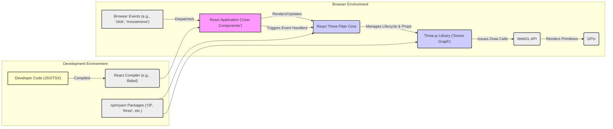

## Project Design Document: React Three Fiber

**Project Name:** React Three Fiber

**Project Repository:** [https://github.com/pmndrs/react-three-fiber](https://github.com/pmndrs/react-three-fiber)

**Document Version:** 1.1

**Date:** October 26, 2023

**Prepared By:** [Your Name/Team Name - Placeholder]

### 1. Project Overview

React Three Fiber (R3F) is a powerful React renderer for the Three.js 3D library. It enables developers to build complex and interactive 3D scenes within React applications using a declarative component-based approach. R3F abstracts away much of the imperative Three.js setup and management, allowing React developers to leverage their existing knowledge and workflows for 3D development.

The core objective of R3F is to provide a natural and efficient way to integrate Three.js into the React ecosystem. It achieves this by synchronizing the React virtual DOM with the Three.js scene graph, ensuring that changes in React components are reflected in the rendered 3D scene. This approach simplifies the creation of dynamic and data-driven 3D experiences in the browser.

This document details the architectural design and key components of React Three Fiber. It serves as a reference for understanding the system's structure and is specifically intended to support threat modeling activities.

### 2. Architecture Overview

React Three Fiber operates as a reconciliation layer, effectively translating the declarative structure of React components into the imperative commands required by Three.js to manipulate the 3D scene. It sits between the React application and the Three.js library, managing the lifecycle and properties of Three.js objects based on the React component tree.

**Detailed Architectural Layers:**

*   **React Application ('User Components'):** The React components written by the developer that define the structure and behavior of the 3D scene. These components utilize R3F's primitive components and hooks.
*   **React Three Fiber Core:** This is the central part of the library. It includes:
    *   **Reconciliation Engine:** Responsible for comparing the React virtual DOM with the current Three.js scene graph and applying necessary updates.
    *   **Instance Management:** Tracks and manages the lifecycle of Three.js objects created from React components.
    *   **Event Handling:**  Intercepts browser events and translates them into interactions with Three.js objects through raycasting.
    *   **Hooks Implementation:** Provides React hooks like `useFrame` and `useRef` for interacting with the rendering loop and accessing Three.js instances.
*   **Three.js Library ('Scene Graph'):** The underlying 3D graphics library that R3F builds upon. It provides the core functionalities for creating and manipulating 3D objects, materials, lights, cameras, and more. R3F components map directly to corresponding Three.js classes.
*   **WebGL API:** The browser's low-level API for rendering 2D and 3D graphics on the GPU. Three.js uses WebGL to perform the actual rendering.
*   **GPU:** The Graphics Processing Unit responsible for the hardware acceleration of rendering operations.
*   **Browser Events (e.g., 'click', 'mousemove'):** Standard browser events that trigger interactions within the React application and the 3D scene.
*   **Development Environment:**
    *   **Developer Code (JSX/TSX):** The source code written by developers using React and R3F components.
    *   **React Compiler (e.g., Babel):** Tools that transform JSX/TSX into standard JavaScript that can be understood by the browser.
    *   **npm/yarn Packages ('r3f', 'three', etc.):** Package managers used to install and manage the dependencies of the project, including R3F and Three.js.

### 3. Key Components

*   **`<Canvas>` Component:**
    *   The root component for any R3F scene. It initializes the Three.js renderer, scene, and camera.
    *   Provides a React Context that makes core Three.js objects (scene, camera, renderer) and the animation loop accessible to child components.
    *   Configures rendering options like antialiasing, pixel ratio, and shadow maps.
    *   Example: `<Canvas shadows camera={{ position: [5, 5, 5] }}>...</Canvas>`
*   **Primitive Components (e.g., `<mesh>`, `<group>`, `<ambientLight>`, `<PerspectiveCamera>`):**
    *   Declarative wrappers around core Three.js objects.
    *   Props passed to these components directly map to the properties of the underlying Three.js objects.
    *   R3F handles the creation, update, and disposal of these Three.js objects based on the component's lifecycle.
    *   Example: `<mesh geometry={sphereGeometry} material={basicMaterial} position={[0, 1, 0]} />`
*   **Hooks:**
    *   **`useFrame(callback, [dependencyArray])`:** A hook that allows executing code on every frame of the rendering loop. Essential for animations and dynamic updates.
        *   The `callback` function receives the current state object, including delta time.
        *   The optional `dependencyArray` allows for optimization by re-running the effect only when dependencies change.
    *   **`useRef()`:**  Standard React hook used to get direct access to the underlying Three.js object instance associated with an R3F component.
        *   Example: `const meshRef = useRef();` and then `<mesh ref={meshRef} ... />`
    *   **`useThree()`:** A hook that provides access to the core Three.js state managed by the `<Canvas>` component (scene, camera, renderer, etc.).
*   **Event Handlers (e.g., `onClick`, `onPointerMove`, `onIntersection`):**
    *   Enable interaction with 3D objects.
    *   R3F automatically performs raycasting to determine which objects are being interacted with.
    *   Event handlers receive information about the intersection point, the intersected object, and the original browser event.
    *   Example: `<mesh onClick={(event) => console.log('Mesh clicked!', event)} ... />`
*   **Loaders (e.g., `<primitive object={gltf.scene} />`, using `useLoader`):**
    *   Facilitate loading external 3D assets (models, textures, etc.).
    *   R3F provides utilities like `useLoader` for asynchronous loading of assets.
    *   Example: `const gltf = useLoader(GLTFLoader, '/path/to/model.glb');`
*   **Abstractions and Helpers (e.g., `OrbitControls`, `Sky`):**
    *   Higher-level components and utilities that simplify common tasks and patterns in 3D development.
    *   Often built on top of the core primitive components.
    *   Example: `<OrbitControls enableZoom={false} />`
*   **Reconciliation Logic (within R3F Core):**
    *   The core algorithm that diffs the React component tree and updates the Three.js scene graph accordingly.
    *   Optimizes updates to minimize unnecessary re-renders and object recreations.

### 4. Data Flow

The flow of data in an R3F application involves the interplay between React's state management and the manipulation of the Three.js scene:

*   **Initialization:**
    *   The `<Canvas>` component is mounted, initializing the Three.js renderer, scene, and camera.
*   **Component Rendering:**
    *   React components describing the 3D scene are rendered (or re-rendered due to state changes).
    *   R3F's reconciliation logic compares the current and previous component trees.
*   **Three.js Object Management:**
    *   Based on the reconciliation, R3F creates, updates, or removes corresponding Three.js objects in the scene graph.
    *   Props passed to R3F components are translated into properties of the associated Three.js objects (e.g., position, rotation, material).
*   **Animation Loop:**
    *   The `<Canvas>` component's render loop (driven by `requestAnimationFrame`) continuously renders the scene.
    *   `useFrame` hooks are executed within this loop, allowing for per-frame updates and animations based on React state or other factors.
*   **User Interactions:**
    *   Browser events (e.g., mouse clicks) are captured.
    *   R3F performs raycasting from the camera through the mouse position to determine which 3D objects are intersected.
    *   Event handlers on the intersected R3F components are triggered, providing information about the interaction.
    *   These event handlers can update the React application's state.
*   **State Updates:**
    *   Changes in the React application's state trigger re-renders of the relevant components.
    *   This, in turn, causes R3F to update the Three.js scene graph, reflecting the new state.

```mermaid
graph LR
    A["React Components (JSX)"] -- "Render" --> B("R3F Reconciliation");
    B -- "Update/Create/Delete" --> C("Three.js Scene Graph");
    C -- "Render Calls" --> D("WebGL");
    D -- "Display" --> E["Browser Window"];
    F["Browser Events"] -- "Capture" --> G("R3F Event Handling (Raycasting)");
    G -- "Identify Interacted Object" --> H["React Component Event Handler"];
    H -- "Update State" --> A;
    I["useFrame Hook"] -- "Per-Frame Updates" --> C;
    style A fill:#f9f,stroke:#333,stroke-width:2px
    style B fill:#ccf,stroke:#333,stroke-width:2px
    style C fill:#ccf,stroke:#333,stroke-width:2px
    style D fill:#eee,stroke:#333,stroke-width:2px
    style E fill:#eee,stroke:#333,stroke-width:2px
    style F fill:#eee,stroke:#333,stroke-width:2px
    style G fill:#ccf,stroke:#333,stroke-width:2px
    style H fill:#f9f,stroke:#333,stroke-width:2px
    style I fill:#ccf,stroke:#333,stroke-width:2px
```

### 5. External Dependencies

React Three Fiber relies on the following key external dependencies:

*   **`react`:** The core React library for building user interfaces.
*   **`three`:** The foundational Three.js library for 3D graphics.
*   **Potentially other npm packages:** Depending on the application's specific needs, developers may incorporate additional libraries for:
    *   **`@react-three/drei`:** A collection of useful helpers and abstractions for R3F (e.g., camera controls, loaders, effects).
    *   **`@react-three/fiber` (itself):**  While being the project, it's a dependency for components within the ecosystem.
    *   **GLTF Loaders (`three/examples/jsm/loaders/GLTFLoader.js` or dedicated packages):** For loading GLTF models.
    *   **Draco Compression Libraries:** For decompressing Draco-compressed 3D models.
    *   **Physics Engines (e.g., `cannon-es`, `ammo.js`):** For simulating physics interactions.
    *   **State Management Libraries (e.g., `zustand`, `redux`):** For managing complex application state that drives the 3D scene.

### 6. Security Considerations

Applications built with React Three Fiber need to consider various security aspects:

*   **Cross-Site Scripting (XSS):**
    *   **Risk:** If user-provided data is directly injected into the 3D scene (e.g., creating text meshes with unsanitized input), it can lead to XSS vulnerabilities.
    *   **Mitigation:**  Always sanitize and escape user input before rendering it in the 3D scene. Avoid directly using user input for creating raw HTML elements within the 3D context (if such a possibility exists through custom extensions).
*   **Third-Party Dependency Vulnerabilities:**
    *   **Risk:** Vulnerabilities in React, Three.js, or any other npm packages used in the project can be exploited.
    *   **Mitigation:** Regularly update dependencies to their latest stable versions. Utilize dependency scanning tools (e.g., `npm audit`, `yarn audit`, Snyk) to identify and address known vulnerabilities.
*   **Content Security Policy (CSP):**
    *   **Benefit:** Implementing a strong CSP can help mitigate XSS attacks by controlling the sources from which the browser is allowed to load resources (scripts, stylesheets, images, etc.).
    *   **Implementation:** Configure the web server to send appropriate CSP headers.
*   **Asset Loading Security:**
    *   **Risk:** Loading 3D models or other assets from untrusted external sources can expose the application to malicious content or supply chain attacks.
    *   **Mitigation:**  Load assets from trusted sources only. Implement integrity checks (e.g., Subresource Integrity - SRI) for externally hosted assets. Validate the integrity of downloaded assets.
*   **Denial of Service (DoS):**
    *   **Risk:**  Malicious actors might try to overload the application by rendering extremely complex scenes or triggering resource-intensive operations.
    *   **Mitigation:** Implement performance optimizations, limit the complexity of scenes, and potentially implement rate limiting or resource quotas if the application allows user-generated content or scene manipulation.
*   **Supply Chain Attacks:**
    *   **Risk:**  Compromised dependencies or build tools can introduce malicious code into the application.
    *   **Mitigation:**  Use dependency scanning tools, verify the integrity of downloaded packages, and consider using a software bill of materials (SBOM).
*   **Serialization and Deserialization:**
    *   **Risk:** If the application involves serializing and deserializing Three.js scene data (e.g., saving and loading scenes), vulnerabilities in the serialization/deserialization process could be exploited.
    *   **Mitigation:** Use secure serialization methods and carefully validate any deserialized data. Avoid using `eval()` or similar functions on untrusted data.
*   **Web Workers:**
    *   **Consideration:** If Web Workers are used for offloading computationally intensive tasks related to the 3D scene, ensure the code running in the workers is secure and does not introduce new vulnerabilities.

### 7. Deployment Model

React Three Fiber applications are typically deployed as client-side rendered single-page applications (SPAs). Common deployment strategies include:

*   **Static Hosting:**
    *   Bundling the application using tools like Webpack or Parcel.
    *   Deploying the static assets (HTML, CSS, JavaScript, assets) to a static hosting service like Netlify, Vercel, GitHub Pages, or AWS S3.
    *   This is the most common deployment model for R3F applications.
*   **Server-Side Rendering (SSR):**
    *   While less common for purely visual R3F applications, SSR can be used for SEO or performance reasons.
    *   Frameworks like Next.js can be used to implement SSR for R3F applications.
    *   Requires a Node.js server to render the initial HTML on the server.
*   **Integration with Backend Frameworks:**
    *   R3F applications can be integrated into larger web applications built with backend frameworks like Express.js, Django, or Ruby on Rails.
    *   The R3F application would typically be served as a static frontend by the backend framework.

**Security Considerations in Deployment:**

*   **HTTPS:** Always serve the application over HTTPS to encrypt communication between the browser and the server, protecting against eavesdropping and man-in-the-middle attacks.
*   **Secure Hosting Configuration:** Ensure the hosting environment is securely configured, with appropriate access controls and security updates.
*   **CDN Usage:** If using a Content Delivery Network (CDN), ensure the CDN is reputable and securely configured. Consider using Subresource Integrity (SRI) for assets served via CDN.
*   **Firewall and Network Security:** Implement appropriate firewall rules and network security measures to protect the hosting infrastructure.
*   **Regular Security Audits:** Conduct regular security audits of the deployment infrastructure and application code.

### 8. Assumptions and Constraints

*   **Modern Web Browsers:** It is assumed that users will be accessing the application using modern web browsers that support WebGL and the necessary JavaScript features.
*   **JavaScript Enabled:** The application relies on JavaScript being enabled in the user's browser.
*   **Dependency Management with npm/yarn:** Developers are expected to use npm or yarn for managing project dependencies.
*   **Build Process Required:** A build process (using tools like Webpack or Parcel) is necessary to bundle and optimize the application for deployment.
*   **Primarily Client-Side Rendering:** The primary focus of this design is on client-side rendering. While SSR is possible, it introduces additional complexities not fully covered here.
*   **Developer Familiarity with React and Three.js:** It is assumed that developers using R3F have a basic understanding of both React and Three.js concepts.
*   **No Specific Backend Requirements (for basic static deployments):** For simple static deployments, no specific backend infrastructure is assumed beyond a static file server. However, more complex applications might integrate with backend APIs.