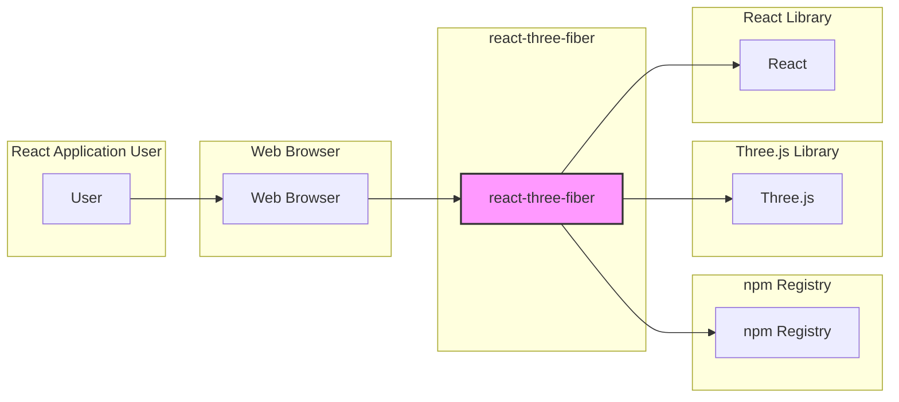
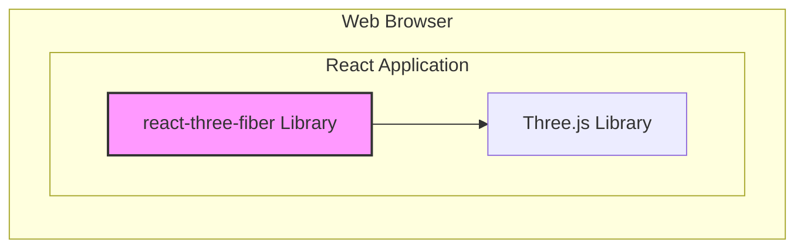

# BUSINESS POSTURE

- Business Priorities and Goals:
  - Provide a declarative and efficient way to create 3D graphics and animations in React applications.
  - Offer a high-performance rendering solution leveraging Three.js capabilities within the React ecosystem.
  - Simplify the development process for 3D web experiences using React components.
  - Foster a vibrant community and ecosystem around React-based 3D graphics.
- Business Risks:
  - Dependency risk: Vulnerabilities or instability in underlying libraries (Three.js, React) could impact react-three-fiber.
  - Performance bottlenecks: Inefficient rendering or integration could lead to poor user experience in applications using react-three-fiber.
  - Community dependency: Reliance on community contributions for maintenance and feature development introduces a risk of slowed progress or lack of support if community engagement declines.
  - Compatibility issues: Changes in React or Three.js APIs could break compatibility and require significant updates to react-three-fiber.

# SECURITY POSTURE

- Existing Security Controls:
  - security control: Open source code repository on GitHub, allowing for public code review and scrutiny. Implemented in: GitHub repository.
  - security control: Dependency management using npm, leveraging npm's security scanning features for known vulnerabilities in dependencies. Implemented in: package.json, npm ecosystem.
  - security control: Community-driven development, benefiting from collective code review and issue reporting. Implemented in: GitHub community, issue tracking.
- Accepted Risks:
  - accepted risk: Potential vulnerabilities in dependencies (Three.js, React, and other npm packages) that are not immediately identified or patched.
  - accepted risk: Bugs or security flaws in the library code itself, which may be discovered and addressed over time through community reports and code reviews.
  - accepted risk: Supply chain risks associated with npm package distribution, although mitigated by npm's security measures.
- Recommended Security Controls:
  - security control: Implement automated dependency scanning as part of the CI/CD pipeline to proactively identify and address vulnerable dependencies.
  - security control: Integrate static code analysis tools (SAST) into the development workflow to detect potential code-level security vulnerabilities.
  - security control: Conduct periodic security reviews or audits of the codebase, potentially involving external security experts, to identify and mitigate potential security weaknesses.
- Security Requirements:
  - Authentication: Not directly applicable to a front-end library. Authentication is typically handled by the backend services that the React application interacts with, not by the rendering library itself.
  - Authorization: Not directly applicable to a front-end library. Authorization logic resides in the application using the library and its backend services.
  - Input Validation: While react-three-fiber itself doesn't directly handle user input in a traditional sense, applications using it might. Input validation should be implemented in the application layer where user data is processed and used to generate 3D scenes. This is the responsibility of the developers using react-three-fiber.
  - Cryptography: Cryptography is not a core requirement for react-three-fiber itself. However, applications built with it might require cryptography for secure communication or data handling. This would be implemented at the application level, not within the library.

# DESIGN

## C4 CONTEXT



- Context Diagram Elements:
  - Element:
    - Name: User
    - Type: Person
    - Description: End-user interacting with a React application that utilizes react-three-fiber for 3D rendering.
    - Responsibilities: Interacting with the React application in a web browser.
    - Security controls: Browser-based security controls, user device security.
  - Element:
    - Name: Web Browser
    - Type: Software System
    - Description: The web browser environment where the React application and react-three-fiber library execute.
    - Responsibilities: Rendering the React application and executing JavaScript code, including react-three-fiber and Three.js.
    - Security controls: Browser security features (e.g., sandboxing, Content Security Policy), browser extensions, user security practices.
  - Element:
    - Name: react-three-fiber
    - Type: Software System
    - Description: The React library that provides a declarative interface for creating and managing Three.js scenes and objects within React applications.
    - Responsibilities: Bridging React components and Three.js API, managing the rendering loop, providing a React-friendly API for 3D graphics.
    - Security controls: Code quality, dependency management, community review, potential future SAST and dependency scanning.
  - Element:
    - Name: Three.js
    - Type: Software System
    - Description: A JavaScript 3D library that react-three-fiber depends on for core 3D rendering functionalities.
    - Responsibilities: Providing low-level 3D rendering capabilities, scene management, object manipulation, and WebGL interaction.
    - Security controls: Three.js project's security practices, community review, dependency management.
  - Element:
    - Name: React
    - Type: Software System
    - Description: The JavaScript library that react-three-fiber is built upon and integrates with.
    - Responsibilities: Providing the component-based architecture, virtual DOM, and lifecycle management for React applications.
    - Security controls: React project's security practices, framework-level security features, community review.
  - Element:
    - Name: npm Registry
    - Type: Software System
    - Description: The public package registry where react-three-fiber is published and distributed.
    - Responsibilities: Hosting and distributing the react-three-fiber npm package, managing package versions and dependencies.
    - Security controls: npm's security scanning and vulnerability detection, package integrity checks, access controls for package publishing.

## C4 CONTAINER



- Container Diagram Elements:
  - Element:
    - Name: react-three-fiber Library
    - Type: Library
    - Description: An npm package that provides React components and utilities for working with Three.js. It is included in React applications as a dependency.
    - Responsibilities: Exposing React components that wrap Three.js functionalities, managing the Three.js rendering context within React, simplifying the integration of 3D graphics into React applications.
    - Security controls: Code quality within the library, dependency management (reliance on secure dependencies), and security practices during development and publishing.
  - Element:
    - Name: Three.js Library
    - Type: Library
    - Description: A core JavaScript 3D library that react-three-fiber utilizes. It is also included as a dependency, either directly or indirectly, in React applications using react-three-fiber.
    - Responsibilities: Providing the fundamental 3D rendering engine, scene graph management, and WebGL interaction.
    - Security controls: Security practices of the Three.js project, dependency management within Three.js, and community security reviews.

## DEPLOYMENT

- Deployment Architecture:
  - react-three-fiber is a library, and its deployment is primarily about distributing the npm package. Applications using react-three-fiber are deployed separately, typically as static websites or web applications. The deployment diagram below focuses on the distribution of the library itself.

```mermaid
flowchart LR
  subgraph "Developer Machine"
    DEV[Developer]
  end
  subgraph "GitHub Actions"
    GA[GitHub Actions CI/CD]
  end
  subgraph "npm Registry"
    NPM[npm Registry]
  end

  DEV --> GA: Push Code
  GA --> NPM: Publish Package

  style RTF fill:#f9f,stroke:#333,stroke-width:2px
```

- Deployment Diagram Elements:
  - Element:
    - Name: Developer
    - Type: Person
    - Description: A software developer working on the react-three-fiber project, responsible for writing code, committing changes, and triggering the build and deployment process.
    - Responsibilities: Developing and maintaining the react-three-fiber library, writing code, running tests, and initiating releases.
    - Security controls: Developer workstation security, code review practices, secure coding habits, and access control to the GitHub repository.
  - Element:
    - Name: GitHub Actions CI/CD
    - Type: Automation System
    - Description: GitHub's built-in CI/CD service used to automate the build, test, and publishing process for react-three-fiber.
    - Responsibilities: Automating the build process, running tests, linting, and publishing the npm package to the npm registry upon code changes or releases.
    - Security controls: GitHub Actions security features, secrets management for npm token, workflow configuration security, and access control to GitHub Actions workflows.
  - Element:
    - Name: npm Registry
    - Type: Package Registry
    - Description: The public npm registry where the react-three-fiber package is published and made available for developers to download and use in their projects.
    - Responsibilities: Hosting and distributing the react-three-fiber npm package, ensuring package integrity, and providing download access to developers.
    - Security controls: npm's infrastructure security, access controls, security scanning of packages, and measures to prevent malicious package uploads.

## BUILD

```mermaid
flowchart LR
  subgraph "Developer Workstation"
    DEV[Developer]
  end
  subgraph "GitHub Repository"
    GH[GitHub Repository]
  end
  subgraph "GitHub Actions CI/CD"
    GA[GitHub Actions]
    subgraph "Build Environment"
      BC[Build Container]
      TEST[Testing Tools]
      LINT[Linters]
    end
  end
  subgraph "npm Registry"
    NPM[npm Registry]
  end
  subgraph "Build Artifacts"
    ARTIFACTS[npm Package]
  end

  DEV --> GH: Push Code
  GH --> GA: Trigger Build
  GA --> BC: Build Project
  BC --> TEST: Run Tests
  BC --> LINT: Run Linters
  GA --> ARTIFACTS: Package Artifacts
  ARTIFACTS --> NPM: Publish Package

  style RTF fill:#f9f,stroke:#333,stroke-width:2px
```

- Build Process Description:
  - Developer writes code and pushes changes to the GitHub repository.
  - Pushing code to specific branches or creating release tags triggers the GitHub Actions CI/CD pipeline.
  - GitHub Actions initiates a build environment (container) to build the project.
  - Within the build environment:
    - The project is built using build tools (e.g., npm scripts, bundlers).
    - Automated tests are executed to ensure code quality and functionality.
    - Linters and static analysis tools are run to check for code style and potential issues.
  - If tests and linters pass, the build artifacts (npm package) are packaged.
  - The npm package is published to the npm Registry, making it available for public consumption.
- Build Security Controls:
  - security control: Source code hosted on GitHub, providing version control and transparency. Implemented in: GitHub Repository.
  - security control: Automated build process using GitHub Actions, ensuring consistent and repeatable builds. Implemented in: GitHub Actions workflows.
  - security control: Automated testing as part of the build process to catch regressions and ensure code quality. Implemented in: GitHub Actions workflows, testing scripts.
  - security control: Code linting and static analysis to identify potential code quality and security issues early in the development cycle. Implemented in: GitHub Actions workflows, linting configurations.
  - security control: Secure storage of npm publishing credentials as GitHub Actions secrets, limiting access to authorized workflows. Implemented in: GitHub Secrets Management.
  - security control: Dependency scanning during the build process (can be added as a GitHub Action) to identify vulnerable dependencies. Recommended but not explicitly mentioned in the provided information.
  - security control: Code review process before merging code changes to main branches, adding a human layer of security review. Implemented in: GitHub Pull Request process.

# RISK ASSESSMENT

- Critical Business Processes:
  - Maintaining the integrity and availability of the react-three-fiber npm package on the npm registry.
  - Ensuring the library functions correctly and efficiently to meet the needs of developers using it in their React applications.
  - Protecting the project's source code and build infrastructure from unauthorized access or modification.
- Data to Protect and Sensitivity:
  - Source code: Publicly available on GitHub, but integrity is crucial to prevent malicious modifications. Sensitivity: Public, Integrity is High.
  - npm package: Publicly distributed, but integrity is essential to prevent supply chain attacks. Sensitivity: Public, Integrity is High.
  - Build infrastructure (GitHub Actions workflows, secrets): Needs to be protected to prevent unauthorized package releases or modifications. Sensitivity: Confidential, Integrity is High.

# QUESTIONS & ASSUMPTIONS

- Questions:
  - What is the process for handling security vulnerability reports for react-three-fiber and its dependencies?
  - Are there any plans to implement automated dependency scanning or SAST tools in the CI/CD pipeline?
  - Is there a defined security incident response plan for the project?
- Assumptions:
  - The primary users of react-three-fiber are web developers building front-end applications using React.
  - Security concerns are primarily focused on code quality, dependency management, and preventing supply chain vulnerabilities.
  - The project relies on the security measures provided by GitHub, npm, and the underlying JavaScript ecosystem.
  - The project is community-driven and benefits from public code review and issue reporting for identifying and addressing potential security issues.