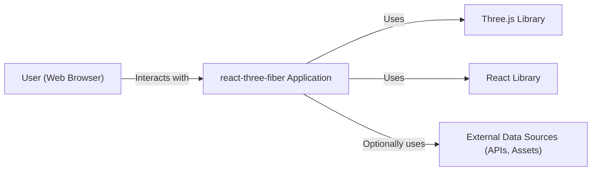
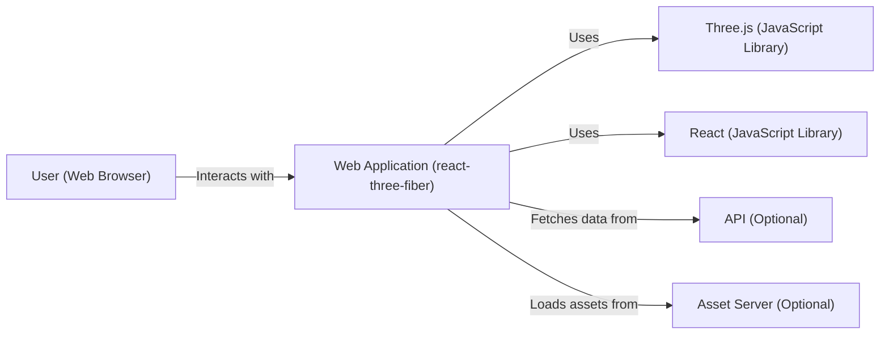
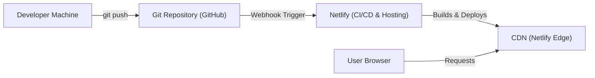
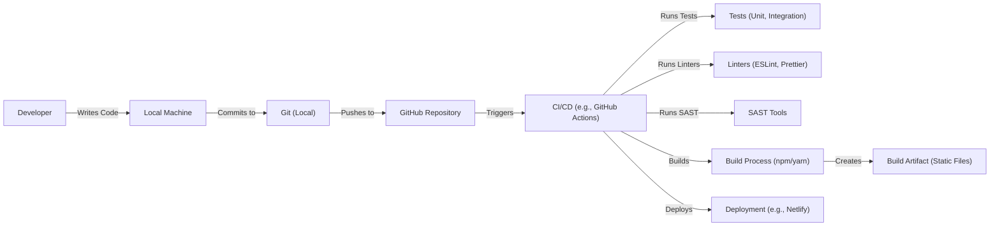

Okay, let's create a design document for the `react-three-fiber` project.

# BUSINESS POSTURE

Business Priorities and Goals:

*   Enable developers to build Three.js applications using React's declarative programming model.
*   Provide a performant and efficient way to manage the Three.js scene graph.
*   Maintain a high level of compatibility with the Three.js library.
*   Foster a strong community and ecosystem around the project.
*   Reduce the complexity of 3D graphics development in the browser.
*   Increase adoption of Three.js by making it more accessible to React developers.

Most Important Business Risks:

*   Performance bottlenecks that could hinder the user experience in complex 3D scenes.
*   Compatibility issues with new releases of Three.js or React, leading to breaking changes.
*   Security vulnerabilities that could be exploited in applications built with the library.
*   Lack of community adoption or contribution, leading to stagnation of the project.
*   Steep learning curve, preventing developers from easily adopting the library.
*   Inability to keep up with the rapid pace of development in the Three.js and React ecosystems.

# SECURITY POSTURE

Existing Security Controls:

*   security control: Dependency Management: The project uses package managers (npm/yarn) to manage dependencies, allowing for version pinning and auditing. (package.json)
*   security control: Code Style and Linting: The project likely uses linters (e.g., ESLint) and code formatters (e.g., Prettier) to enforce consistent code style and identify potential issues. (.eslintrc, .prettierrc files, if present, or in build scripts)
*   security control: Community Scrutiny: Being an open-source project on GitHub, the codebase is subject to public scrutiny, which can help identify and address security vulnerabilities. (GitHub repository)

Accepted Risks:

*   accepted risk: Reliance on Third-Party Libraries: The project depends on Three.js and React, inheriting any potential security vulnerabilities in those libraries.
*   accepted risk: Client-Side Execution: As a JavaScript library running in the browser, the project is inherently exposed to client-side attacks (e.g., XSS, injection).
*   accepted risk: Limited Control over User Input: The library itself doesn't directly handle user input, but applications built with it might, requiring developers to implement their own input validation.

Recommended Security Controls:

*   security control: Regular Security Audits: Conduct periodic security audits of the codebase and dependencies.
*   security control: Automated Dependency Updates: Implement a system (e.g., Dependabot) for automatically updating dependencies to address security vulnerabilities.
*   security control: Content Security Policy (CSP): Provide guidance to developers on implementing CSP in their applications to mitigate XSS risks.
*   security control: Input Validation Guidance: Offer clear documentation and examples on how to handle user input securely within applications built with the library.
*   security control: Security-Focused Testing: Incorporate security testing (e.g., fuzzing, penetration testing) into the development lifecycle.

Security Requirements:

*   Authentication: Not directly applicable to the library itself, as it's a rendering library. Authentication should be handled at the application level.
*   Authorization: Not directly applicable to the library itself. Authorization should be handled at the application level.
*   Input Validation: The library should provide guidance and best practices for developers to implement input validation in their applications to prevent injection attacks. Applications built with the library *must* validate all user-provided data before rendering or processing it.
*   Cryptography: Not directly applicable, unless the library is used to handle sensitive data, in which case standard cryptographic practices should be followed at the application level. The library should not introduce any custom cryptography.

# DESIGN

## C4 CONTEXT

C4 Context Element List:

*   User (Web Browser)
    *   Name: User (Web Browser)
    *   Type: Person
    *   Description: A person interacting with a web application built using react-three-fiber.
    *   Responsibilities: Initiates interactions, views the 3D scene, provides input.
    *   Security controls: Browser security mechanisms (e.g., same-origin policy, CSP).

*   react-three-fiber Application
    *   Name: react-three-fiber Application
    *   Type: Software System
    *   Description: A web application built using react-three-fiber, rendering a 3D scene.
    *   Responsibilities: Manages the Three.js scene graph using React components, handles user interactions, renders the 3D scene.
    *   Security controls: Input validation, output encoding, application-level security logic.

*   Three.js Library
    *   Name: Three.js Library
    *   Type: Software System
    *   Description: A JavaScript library for creating and displaying 3D graphics in a web browser.
    *   Responsibilities: Provides low-level 3D rendering capabilities, manages WebGL context.
    *   Security controls: Relies on browser security and WebGL security.

*   React Library
    *   Name: React Library
    *   Type: Software System
    *   Description: A JavaScript library for building user interfaces.
    *   Responsibilities: Manages the component tree, handles updates and rendering.
    *   Security controls: React's built-in security features (e.g., protection against XSS in JSX).

*   External Data Sources (APIs, Assets)
    *   Name: External Data Sources (APIs, Assets)
    *   Type: Software System
    *   Description: External sources of data or assets used by the application.
    *   Responsibilities: Provides data (e.g., 3D models, textures, API responses) to the application.
    *   Security controls: API authentication, authorization, secure asset loading (HTTPS).

## C4 CONTAINER

C4 Container Element List:

*   User (Web Browser)
    *   Name: User (Web Browser)
    *   Type: Person
    *   Description: A person interacting with the web application.
    *   Responsibilities: Initiates interactions, views the 3D scene, provides input.
    *   Security controls: Browser security mechanisms (e.g., same-origin policy, CSP).

*   Web Application (react-three-fiber)
    *   Name: Web Application (react-three-fiber)
    *   Type: Container: Web Application
    *   Description: The main application code, written using react-three-fiber.
    *   Responsibilities: Manages the Three.js scene graph, handles user input, renders the 3D scene.
    *   Security controls: Input validation, output encoding, application-level security logic.

*   Three.js (JavaScript Library)
    *   Name: Three.js (JavaScript Library)
    *   Type: Container: JavaScript Library
    *   Description: The Three.js library.
    *   Responsibilities: Provides low-level 3D rendering capabilities.
    *   Security controls: Relies on browser security and WebGL security.

*   React (JavaScript Library)
    *   Name: React (JavaScript Library)
    *   Type: Container: JavaScript Library
    *   Description: The React library.
    *   Responsibilities: Manages the component tree, handles updates and rendering.
    *   Security controls: React's built-in security features.

*   API (Optional)
    *   Name: API (Optional)
    *   Type: Container: API
    *   Description: An optional API for fetching data.
    *   Responsibilities: Provides data to the web application.
    *   Security controls: API authentication, authorization, input validation, rate limiting.

*   Asset Server (Optional)
    *   Name: Asset Server (Optional)
    *   Type: Container: Web Server
    *   Description: An optional server for serving static assets (e.g., 3D models, textures).
    *   Responsibilities: Serves static assets to the web application.
    *   Security controls: Secure asset loading (HTTPS), access controls.

## DEPLOYMENT

Possible Deployment Solutions:

1.  Static Website Hosting (e.g., Netlify, Vercel, AWS S3 + CloudFront, GitHub Pages): This is the most common and recommended approach for deploying React applications, including those using react-three-fiber.
2.  Containerized Deployment (e.g., Docker, Kubernetes): This approach is suitable for more complex applications with backend services or specific infrastructure requirements.
3.  Server-Side Rendering (SSR) (e.g., Next.js, Gatsby): SSR can improve initial load times and SEO, but adds complexity.

Chosen Solution (Detailed Description): Static Website Hosting (Netlify)

Deployment Element List:

*   Developer Machine
    *   Name: Developer Machine
    *   Type: Device
    *   Description: The developer's local machine used for development.
    *   Responsibilities: Writing code, running tests, committing changes.
    *   Security controls: Local machine security (e.g., firewall, antivirus).

*   Git Repository (GitHub)
    *   Name: Git Repository (GitHub)
    *   Type: Software System
    *   Description: The source code repository hosted on GitHub.
    *   Responsibilities: Stores the application code, tracks changes, triggers deployments.
    *   Security controls: GitHub access controls, branch protection rules.

*   Netlify (CI/CD & Hosting)
    *   Name: Netlify (CI/CD & Hosting)
    *   Type: Software System
    *   Description: The Netlify platform, providing CI/CD and hosting services.
    *   Responsibilities: Builds the application, deploys it to the CDN, manages DNS.
    *   Security controls: Netlify's built-in security features, HTTPS, access controls.

*   CDN (Netlify Edge)
    *   Name: CDN (Netlify Edge)
    *   Type: Infrastructure
    *   Description: Netlify's Content Delivery Network, serving the application to users.
    *   Responsibilities: Caches and serves static assets, reduces latency.
    *   Security controls: DDoS protection, HTTPS.

*   User Browser
    *   Name: User Browser
    *   Type: Device
    *   Description: The user's web browser.
    *   Responsibilities: Requests and renders the application.
    *   Security controls: Browser security mechanisms.

## BUILD

Build Process Description:

1.  Developer writes code on their local machine.
2.  Code is committed to a local Git repository.
3.  Code is pushed to a remote repository (GitHub).
4.  A CI/CD pipeline (e.g., GitHub Actions) is triggered.
5.  The CI/CD pipeline runs tests (unit, integration).
6.  The CI/CD pipeline runs linters (e.g., ESLint, Prettier) to enforce code style and identify potential issues.
7.  The CI/CD pipeline runs SAST tools to identify potential security vulnerabilities.
8.  The CI/CD pipeline executes the build process (using npm or yarn), which typically involves:
    *   Installing dependencies.
    *   Transpiling code (e.g., using Babel).
    *   Bundling code (e.g., using Webpack or Parcel).
    *   Minifying code.
    *   Generating static assets.
9.  The build process produces a build artifact (a set of static files).
10. The CI/CD pipeline deploys the build artifact to a hosting environment (e.g., Netlify).

Security Controls in Build Process:

*   security control: Dependency Management: Using package managers (npm/yarn) with lock files to ensure consistent and auditable dependencies.
*   security control: Linting: Using linters (ESLint, Prettier) to enforce code style and identify potential errors.
*   security control: SAST (Static Application Security Testing): Integrating SAST tools into the CI/CD pipeline to scan for vulnerabilities.
*   security control: Automated Testing: Running unit and integration tests to catch bugs and regressions.
*   security control: Code Reviews: Requiring code reviews before merging changes to the main branch.
*   security control: Build Automation: Using a CI/CD pipeline (GitHub Actions) to automate the build and deployment process, ensuring consistency and reducing manual errors.

# RISK ASSESSMENT

Critical Business Processes:

*   Rendering 3D graphics in the web browser.
*   Providing a smooth and interactive user experience.
*   Maintaining compatibility with Three.js and React.

Data to Protect and Sensitivity:

*   Source Code: Medium sensitivity. The source code itself is open-source, but vulnerabilities in the code could be exploited.
*   User Data (if any): Potentially high sensitivity, depending on the application. If the application handles user data (e.g., 3D models, user profiles), this data must be protected appropriately. The library itself doesn't handle user data directly, but applications built with it might.
*   API Keys (if any): High sensitivity. API keys used to access external services must be protected and should not be exposed in the client-side code.
*   Assets (3D models, textures): Low to medium sensitivity, depending on the nature of the assets.

# QUESTIONS & ASSUMPTIONS

Questions:

*   Are there any specific security requirements or compliance standards that need to be considered (e.g., GDPR, CCPA)?
*   Are there any plans to handle user data or authentication within applications built with react-three-fiber?
*   What is the expected level of traffic and performance requirements for applications built with the library?
*   What is the process for reporting and addressing security vulnerabilities?
*   Are there any existing security reviews or audits of the codebase?

Assumptions:

*   BUSINESS POSTURE: The primary goal is to provide a developer-friendly way to create Three.js applications using React.
*   BUSINESS POSTURE: The project aims to maintain a balance between ease of use, performance, and security.
*   SECURITY POSTURE: Developers using react-three-fiber are responsible for implementing appropriate security measures in their applications, particularly regarding user input and data handling.
*   SECURITY POSTURE: The project relies on the security of its dependencies (Three.js, React) and the underlying browser environment.
*   DESIGN: The library is primarily used for client-side rendering in web browsers.
*   DESIGN: Most deployments will be to static website hosting platforms.
*   DESIGN: The build process will be automated using a CI/CD pipeline.