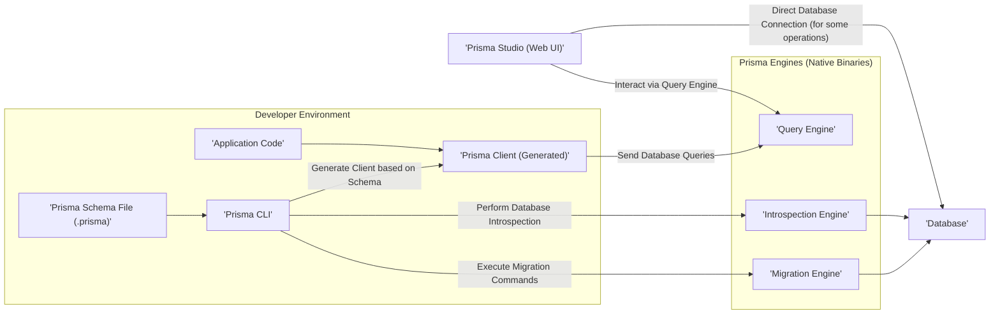
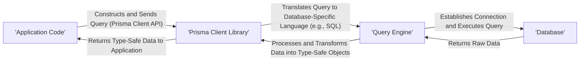
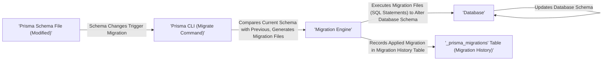

# Project Design Document: Prisma (Improved)

**Version:** 1.1
**Date:** October 26, 2023
**Author:** AI Software Architect

## 1. Introduction

This document provides an enhanced design overview of the Prisma project, an open-source ORM (Object-Relational Mapper) for Node.js and TypeScript. Building upon the previous version, this iteration aims for greater clarity, detail, and a stronger focus on aspects relevant to threat modeling. The goal remains to provide a comprehensive understanding of Prisma's architecture, components, and data flow, serving as a robust foundation for subsequent security analysis.

### 1.1. Purpose

The primary purpose of this document is to:

* Clearly and concisely articulate the architecture and design of the Prisma project.
* Identify key components, their specific functionalities, and their interactions.
* Detail the data flow within the system for various operations.
* Provide a more granular context for security considerations and potential vulnerabilities, aiding in targeted threat identification.
* Serve as a definitive reference point for threat modeling exercises and security assessments.

### 1.2. Scope

This document encompasses the core components of the Prisma project, including:

* Prisma Client (including its generation process)
* Prisma Migrate (and the migration process)
* Prisma Studio (and its access mechanisms)
* Prisma Engines (with specific focus on the Query, Migration, and Introspection Engines)
* Prisma Schema Language (and its role in defining the system)

The focus remains on the logical architecture, but with added detail relevant to security boundaries and potential attack vectors. Implementation specifics are still generally excluded unless directly relevant to security considerations.

### 1.3. Target Audience

This document is intended for:

* Security engineers and architects responsible for threat modeling and security assessments of applications using Prisma.
* Developers working with or contributing to the Prisma project, requiring a deeper understanding of its architecture for secure development practices.
* DevOps engineers involved in deploying, configuring, and maintaining Prisma in various environments, with a focus on security implications.

## 2. Overview

Prisma is a modern ORM designed to simplify database interactions in Node.js and TypeScript applications. It offers type-safe data access, streamlined database schema management through automated migrations, and a user-friendly visual database management tool. Prisma's core objective is to enhance developer efficiency and minimize the complexities associated with traditional ORMs, while also introducing a layer of type safety.

### 2.1. Key Features

* **Strongly Typed Database Access:** Generates a type-safe Prisma Client tailored to the specific database schema, reducing runtime errors.
* **Declarative Data Modeling:** Employs a human-readable Prisma Schema Language to define database models, relationships, and enums.
* **Automated and Safe Migrations:** Provides a reliable migration system to evolve the database schema, ensuring data integrity and version control.
* **Intuitive Visual Data Management:** Offers Prisma Studio, a web-based GUI for inspecting, querying, and modifying data directly in the database.
* **Multi-Database Support:** Compatible with a range of relational and NoSQL databases, including PostgreSQL, MySQL, SQLite, SQL Server, and MongoDB.

## 3. Architecture

Prisma's architecture is modular, with distinct components handling specific responsibilities. Understanding these components and their interactions is crucial for identifying potential security vulnerabilities.

### 3.1. Components

* **Prisma Schema File (`.prisma`)**:
    * A text-based, declarative file defining the data model, database connection details (potentially including credentials), and generators (specifying how the Prisma Client is created).
    * Acts as the central configuration point for Prisma, making its secure management paramount.

* **Prisma CLI**:
    * The command-line interface for interacting with Prisma. It's used for generating the Prisma Client, running migrations, introspecting databases, and launching Prisma Studio.
    * Access to the CLI and its commands should be controlled, especially in production environments, as it can modify the database schema and potentially expose sensitive information.

* **Prisma Client**:
    * A type-safe, auto-generated database client library tailored to the application's specific data model.
    * Provides a programmatic interface for querying and manipulating data. Its security relies on the integrity of the generation process and secure integration into the application.

* **Prisma Engines (Native Binaries)**:
    * Compiled, platform-specific binaries that perform the core database interactions.
    * **Query Engine:** Responsible for executing database queries received from the Prisma Client. It translates Prisma's query language into the database's native query language.
    * **Migration Engine:** Manages and applies database schema migrations based on changes in the Prisma schema. It requires direct access to modify the database schema.
    * **Introspection Engine:** Connects to an existing database and generates a Prisma schema based on its current structure. It requires read access to the database schema.

* **Prisma Studio**:
    * A web-based graphical user interface for interacting with the database. It allows developers to view and modify data, execute queries, and inspect the database schema.
    * Access control and authentication for Prisma Studio are critical security considerations, especially in shared or production environments.

* **Database**:
    * The underlying database system where the application's data is stored. Prisma supports various relational and NoSQL databases.
    * The security of the database itself is paramount, and Prisma's interaction with it should adhere to the principle of least privilege.

## 4. Data Flow

Understanding how data flows through Prisma is essential for identifying potential points of interception or manipulation.

### 4.1. Querying Data (Detailed)

* The application code utilizes the Prisma Client's API to build a database query. This query is expressed in Prisma's specific query language.
* The Prisma Client translates this query into the native query language of the target database (e.g., SQL for relational databases).
* The Query Engine receives the translated query and establishes a connection to the database (using credentials defined in the Prisma schema or environment variables).
* The Query Engine executes the query against the database.
* The database returns the raw data to the Query Engine.
* The Query Engine processes the raw data and transforms it into type-safe objects as defined by the Prisma schema.
* The Prisma Client returns these type-safe objects to the application code.

### 4.2. Running Migrations (Detailed)

* The developer modifies the Prisma schema file, introducing changes to the data model.
* The Prisma CLI's `migrate` command is executed, initiating the migration process.
* The Migration Engine compares the current schema with the previously applied schema (tracked in the `_prisma_migrations` table).
* Based on the differences, the Migration Engine generates migration files, typically containing SQL statements to alter the database schema.
* The Migration Engine executes these migration files against the database, applying the schema changes.
* The Migration Engine records the successful application of the migration in the `_prisma_migrations` table, ensuring a history of schema changes.

## 5. Deployment Considerations

The deployment environment significantly impacts Prisma's security posture.

* **Local Development:** Prisma Engines typically run as separate processes on the developer's machine, with direct access to the database (often a local instance). Security risks are generally lower but still relevant (e.g., accidental exposure of credentials).
* **Serverless Environments (e.g., AWS Lambda, Vercel Functions):** Prisma Engines are often bundled with the function. Cold starts and connection pooling require careful configuration. Security considerations include managing database connections in a stateless environment and securing environment variables containing credentials.
* **Containerized Environments (e.g., Docker, Kubernetes):** Prisma Engines can be containerized and deployed alongside the application. Security focuses on container security, network policies, and secure management of secrets.
* **Traditional Servers:** Prisma Engines run on the application server. Security involves securing the server, managing network access, and protecting database credentials stored on the server.

## 6. Security Considerations (Enhanced)

This section provides a more detailed breakdown of security considerations relevant to Prisma, categorized for clarity.

* **Authentication and Authorization:**
    * **Database Credentials Security:** Secure storage and management of database connection strings. Avoid hardcoding credentials; utilize environment variables or secrets management systems. Implement proper access controls to these secrets.
    * **Prisma Studio Access Control:** Implement strong authentication (e.g., password protection, SSO) and authorization mechanisms for Prisma Studio, especially in non-development environments. Restrict access based on the principle of least privilege.
    * **API Security (if Prisma Client is exposed):** If the Prisma Client is used in a context where it's directly accessible from the client-side (less common), standard API security practices (authentication, authorization, rate limiting) are crucial.

* **Data Protection:**
    * **Connection Security:** Ensure encrypted connections (TLS/SSL) between the application, Prisma Engines, and the database to protect data in transit.
    * **Data at Rest Encryption:** While Prisma doesn't directly handle this, ensure the underlying database implements encryption at rest for sensitive data.
    * **Data Masking/Anonymization:** Consider implementing data masking or anonymization techniques, especially when using Prisma Studio in non-production environments.

* **Input Validation and Sanitization:**
    * **Mitigation of SQL/NoSQL Injection:** While Prisma's ORM layer provides a degree of protection, be cautious when using raw queries or database functions. Always validate and sanitize user inputs to prevent injection attacks.

* **Dependency Management:**
    * **Vulnerability Scanning:** Regularly scan Prisma and its dependencies for known security vulnerabilities and update to the latest versions promptly.
    * **Supply Chain Security:** Be mindful of the sources of Prisma binaries and dependencies to mitigate supply chain attacks.

* **Operational Security:**
    * **Secure Deployment Practices:** Follow secure deployment practices for the chosen environment (serverless, containers, etc.), including network segmentation and access control.
    * **Logging and Monitoring:** Implement comprehensive logging and monitoring for Prisma Engines and database interactions to detect suspicious activity.
    * **Secrets Management:** Utilize secure secrets management solutions to store and manage database credentials and other sensitive information.
    * **Migration Security:** Review migration files carefully before applying them to production databases to prevent unintended schema changes or the introduction of vulnerabilities. Protect the migration history table from unauthorized modification.

* **Prisma Studio Specific Risks:**
    * **Information Disclosure:** Unauthorized access to Prisma Studio can lead to the disclosure of sensitive data.
    * **Data Modification:** If not properly secured, Prisma Studio can be used to modify or delete data without proper authorization.

## 7. Dependencies

Prisma's functionality relies on the following key dependencies:

* **Node.js/TypeScript:** The primary runtime environment for the Prisma Client and CLI tools.
* **Platform-Specific Native Binaries (Prisma Engines):** These are downloaded or bundled based on the operating system and architecture where Prisma is running.
* **Database Drivers:**  Specific drivers are required for connecting to different database systems (e.g., `pg` for PostgreSQL, `mysql2` for MySQL, `mongodb` for MongoDB). These drivers themselves can have security implications.

## 8. Future Considerations

* **Enhanced Security Features:** Potential future enhancements could include built-in support for data masking, encryption helpers, or more granular access control within Prisma itself.
* **Improved Observability and Auditing:** More detailed logging and auditing capabilities within the Prisma Engines to aid in security monitoring and incident response.
* **Formal Security Audits:** Regular third-party security audits of the Prisma codebase to identify and address potential vulnerabilities.

This improved design document provides a more detailed and security-focused overview of the Prisma project. It serves as a valuable resource for understanding the system's architecture and identifying potential areas of security concern for thorough threat modeling.