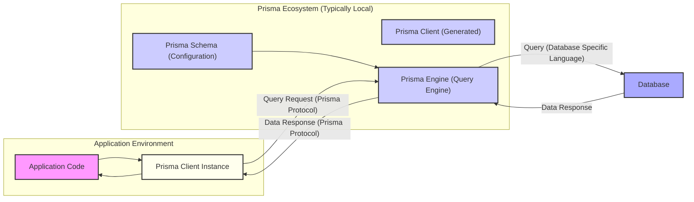

# Project Design Document: Prisma ORM for Threat Modeling (Improved)

**Version:** 1.1
**Date:** October 26, 2023
**Author:** AI Cloud & Security Architect

## 1. Introduction

This document provides an enhanced architectural overview of the Prisma ORM project (as represented by the GitHub repository: https://github.com/prisma/prisma), specifically tailored for comprehensive threat modeling. Building upon the previous version, this document offers more granular details about the components, data flows, and interactions within the Prisma ecosystem. The aim is to provide a robust foundation for identifying potential security vulnerabilities and attack vectors. This refined document will serve as a more detailed basis for subsequent threat modeling exercises.

## 2. Overview

Prisma is a modern, open-source ORM for Node.js and TypeScript, designed to streamline database access and management. It offers a type-safe query builder, an intuitive data modeling language (Prisma Schema Language - PSL), and tools for database migrations. Prisma's core function is to abstract away the complexities of direct database interaction, translating developer-friendly operations into efficient database queries. This abstraction layer, while beneficial for development, introduces its own set of security considerations that this document aims to illuminate.

## 3. Key Components (Detailed)

This section provides a more in-depth description of the main components within the Prisma ecosystem, focusing on their internal workings and potential security implications.

*   **Prisma Client:**
    *   A generated, type-safe API tailored to the project's data model defined in the Prisma Schema.
    *   Instantiated and used directly within the application code.
    *   Performs request marshalling and unmarshalling between the application and the Prisma Engine using a client-server architecture (typically local inter-process communication).
    *   Offers features like eager loading, transactions, and filtering, which can have performance and security implications if misused.
    *   Security Consideration: Vulnerabilities in the generated client code or the underlying communication mechanism could expose the application.
*   **Prisma Engine (Query Engine):**
    *   A core, compiled binary written in Rust, responsible for the heavy lifting of query execution.
    *   Receives queries from the Prisma Client over a communication channel (e.g., gRPC or standard input/output).
    *   Parses and validates incoming queries against the defined schema.
    *   Connects to the underlying database using the connection details provided in the Prisma Schema.
    *   Optimizes and translates Prisma queries into database-specific SQL or other query languages.
    *   Manages connection pooling to efficiently handle database connections.
    *   Handles transaction management, ensuring atomicity, consistency, isolation, and durability (ACID) properties.
    *   Security Consideration:  The Engine is a critical component; vulnerabilities here could lead to data breaches or denial of service. Secure handling of database credentials within the Engine is paramount.
*   **Prisma Migrate:**
    *   A command-line tool for managing database schema evolution.
    *   Compares the current Prisma Schema with the database schema to identify necessary changes.
    *   Generates reversible SQL migration scripts (or equivalent for NoSQL databases).
    *   Applies migration scripts to the database, potentially involving schema alterations and data transformations.
    *   Tracks the history of applied migrations to ensure consistency.
    *   Security Consideration: Malicious or flawed migration scripts could lead to data loss, corruption, or unintended schema changes. Access control to migration execution is crucial.
*   **Prisma Studio:**
    *   A graphical user interface (GUI) for interacting with the database.
    *   Connects directly to the database using the connection string specified in the Prisma Schema.
    *   Allows developers to browse, create, read, update, and delete data.
    *   Provides a visual representation of the database schema.
    *   Security Consideration: If exposed inappropriately (e.g., in production environments), Prisma Studio could provide unauthorized access to sensitive data. Authentication and authorization for Studio access are critical.
*   **Prisma Schema (schema.prisma):**
    *   A declarative file written in Prisma Schema Language (PSL) that defines the application's data model, database connection details (including potentially sensitive credentials), and generators (like Prisma Client).
    *   Serves as the central configuration point for Prisma.
    *   Security Consideration:  The schema file contains sensitive information and should be protected from unauthorized access. Improperly configured database connection strings can lead to vulnerabilities.
*   **Prisma CLI:**
    *   The command-line interface used to interact with various Prisma tools (e.g., `prisma generate`, `prisma migrate`, `prisma studio`).
    *   Orchestrates the execution of Prisma functionalities.
    *   Security Consideration:  Access to the CLI and its commands should be controlled, as it can be used to perform potentially destructive actions (e.g., dropping the database).

## 4. Data Flow (Detailed)

This section provides a more granular view of the data flow within the Prisma ecosystem, highlighting potential interception points and security considerations at each stage.

**Detailed Data Flow for a Typical Query:**

1. The application code (`"Application Code"`) initiates a database interaction using an instance of the Prisma Client (`"Prisma Client Instance"`).
2. The Prisma Client Instance (`"Prisma Client Instance"`) uses the generated Prisma Client (`"Prisma Client (Generated)"`) methods to construct a query. This involves serializing the request according to the Prisma communication protocol.
3. The serialized query request (following the `"Prisma Protocol"`) is sent to the Prisma Engine (`"Prisma Engine (Query Engine)"`). This communication typically happens over a local inter-process communication (IPC) mechanism.
4. The Prisma Engine (`"Prisma Engine (Query Engine)"`) consults the Prisma Schema (`"Prisma Schema (Configuration)"`) to understand the data model, database connection details, and validation rules.
5. The Prisma Engine (`"Prisma Engine (Query Engine)"`) validates and translates the incoming Prisma query into the specific query language of the target database (e.g., SQL for relational databases).
6. The Prisma Engine (`"Prisma Engine (Query Engine)"`) establishes a connection to the database (`"Database"`) using the configured credentials.
7. The translated query ( `"Query (Database Specific Language)"`) is executed against the database (`"Database"`).
8. The database (`"Database"`) processes the query and returns the results (`"Data Response"`) to the Prisma Engine.
9. The Prisma Engine (`"Prisma Engine (Query Engine)"`) receives the raw data from the database and transforms it into a format expected by the Prisma Client, again following the `"Prisma Protocol"`.
10. The formatted data response (`"Data Response (Prisma Protocol)"`) is sent back to the Prisma Client Instance (`"Prisma Client Instance"`).
11. The Prisma Client Instance (`"Prisma Client Instance"`) deserializes the data and returns it to the application code (`"Application Code"`).

**Data Flow for Migrations (Simplified):**

1. A developer modifies the Prisma Schema (`"Prisma Schema (Configuration)"`).
2. The developer executes a Prisma Migrate command (via Prisma CLI).
3. Prisma Migrate reads the Prisma Schema.
4. Prisma Migrate generates migration scripts.
5. Prisma Migrate connects to the database (`"Database"`) and applies the migration scripts.

## 5. Deployment Considerations (Security Focused)

The deployment environment significantly impacts the security posture of Prisma applications.

*   **Local Development:**
    *   Often uses less stringent security measures.
    *   Prisma Studio might be more readily accessible.
    *   Database credentials might be less securely managed.
*   **Staging/Testing Environments:**
    *   Should mirror production as closely as possible, including security configurations.
    *   Access to Prisma Studio should be controlled.
    *   Sensitive data should be masked or anonymized.
*   **Production Environments:**
    *   Requires robust security measures.
    *   Database credentials should be securely managed (e.g., using environment variables, secrets management systems).
    *   Prisma Studio should generally not be accessible.
    *   Network segmentation should limit access to the database.
    *   Consider the communication channel between the application and the Prisma Engine (local IPC is generally secure, but network communication requires encryption).
*   **Serverless Environments:**
    *   Connection management to the database can be challenging and requires careful consideration of connection pooling and potential connection leaks.
    *   Secrets management for database credentials is crucial.
    *   The Prisma Engine binary needs to be included in the deployment package.

## 6. Security Considerations (Comprehensive)

This section provides a more detailed and categorized list of potential security concerns.

*   **Authentication and Authorization:**
    *   **Database Access:** Ensuring only authorized services and users can connect to the database.
    *   **Prisma Studio Access:** Restricting access to Prisma Studio, especially in production.
    *   **Application-Level Authorization:** Implementing proper authorization logic within the application to control data access based on user roles and permissions.
*   **Data Security:**
    *   **Database Credentials Management:** Secure storage and retrieval of database connection strings and credentials. Avoid hardcoding credentials in the Prisma Schema.
    *   **Data Encryption in Transit:** Encrypting communication between the application, Prisma Engine, and the database (e.g., using TLS/SSL).
    *   **Data Encryption at Rest:**  Implementing database-level encryption for sensitive data.
    *   **Data Validation and Sanitization:** Validating and sanitizing user inputs to prevent injection attacks.
*   **Injection Vulnerabilities:**
    *   **SQL Injection:** While Prisma aims to prevent this, careful review is needed for raw queries or complex filter conditions.
    *   **NoSQL Injection:** If using a NoSQL database, ensure proper handling of queries to prevent injection attacks specific to that database.
*   **Dependency Management:**
    *   **Vulnerable Dependencies:** Regularly auditing and updating Prisma and its dependencies to patch known vulnerabilities.
    *   **Supply Chain Attacks:**  Being aware of the risk of compromised dependencies.
*   **Operational Security:**
    *   **Logging and Monitoring:** Implementing comprehensive logging and monitoring to detect suspicious activity.
    *   **Error Handling:**  Preventing sensitive information leakage through detailed error messages.
    *   **Backup and Recovery:**  Having robust backup and recovery procedures in place.
*   **Migration Security:**
    *   **Malicious Migrations:** Ensuring that only authorized personnel can create and apply database migrations.
    *   **Accidental Data Loss:** Implementing safeguards to prevent accidental data loss during migrations.
*   **Denial of Service (DoS):**
    *   **Query Complexity:**  Avoiding overly complex queries that could overload the database or Prisma Engine.
    *   **Resource Exhaustion:**  Protecting against attacks that could exhaust database connections or other resources.
*   **Information Disclosure:**
    *   **Exposure of Sensitive Data:** Preventing the unintentional exposure of sensitive data through APIs or logs.
    *   **Prisma Studio in Production:**  Avoiding the exposure of Prisma Studio in production environments.

## 7. Dependencies (Security Implications)

Prisma's security posture is also influenced by its dependencies.

*   **Node.js or TypeScript:** Security vulnerabilities in the Node.js runtime or TypeScript compiler could impact Prisma applications.
*   **Rust:** While Rust is known for its memory safety, vulnerabilities can still exist in the Prisma Engine code. Regular updates are crucial.
*   **Database Drivers (e.g., `pg`, `mysql2`, database-specific drivers):**  Vulnerabilities in these drivers could be exploited. Keeping them updated is essential.
*   **Operating System Libraries:** The Prisma Engine binary relies on system libraries. Security updates for the operating system are important.
*   **Communication Libraries (e.g., gRPC):** If communication between Prisma Client and Engine uses network protocols, vulnerabilities in the underlying communication libraries are a concern.

## 8. Future Considerations (Security Impact)

Potential future enhancements could introduce new security considerations.

*   **Support for New Databases:** Integrating with new databases will require careful consideration of their specific security models and potential vulnerabilities.
*   **Cloud Integrations:** Tighter integrations with cloud platforms might introduce new authentication and authorization challenges.
*   **GraphQL Support:** If Prisma expands its GraphQL capabilities, security considerations specific to GraphQL (e.g., injection attacks, authorization) will need to be addressed.
*   **Plugin System:** If Prisma introduces a plugin system, the security of third-party plugins will be a concern.

This improved document provides a more detailed and security-focused architectural overview of Prisma, serving as a more robust foundation for thorough threat modeling activities. The enhanced descriptions of components, data flows, and security considerations aim to facilitate a deeper understanding of potential vulnerabilities and attack vectors within the Prisma ecosystem.
