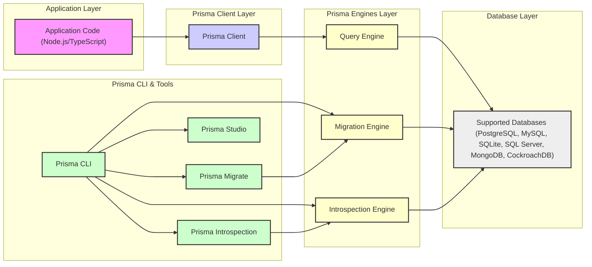

# Project Design Document: Prisma ORM

**Project Name:** Prisma ORM

**Project Repository:** [https://github.com/prisma/prisma](https://github.com/prisma/prisma)

**Document Version:** 1.1
**Date:** 2023-10-27
**Author:** AI Software Architect

## 1. Introduction

This document provides a detailed design overview of the Prisma ORM project. It aims to describe the architecture, components, data flow, and technologies involved in Prisma. This document will serve as a foundation for future threat modeling activities, enabling a comprehensive security analysis of the Prisma ecosystem.

Prisma is an open-source Object-Relational Mapper (ORM) specifically designed for Node.js and TypeScript environments. It significantly simplifies database interactions for developers by offering type-safe database clients, streamlined database migrations, and an intuitive visual database management tool. Prisma supports a wide range of databases, aiming to boost developer productivity and enhance application reliability.

## 2. System Architecture

Prisma's architecture is modular and comprises several key components that collaborate to deliver its functionalities. The diagram below illustrates the high-level architecture of Prisma, showcasing the relationships between its core parts:

## 3. Component Descriptions

This section provides a detailed description of each component depicted in the architecture diagram, outlining their specific roles and functionalities within the Prisma ecosystem.

### 3.1. Application Code (Node.js/TypeScript)

*   **Description:** This layer represents the custom application code developed by users, typically written in Node.js or TypeScript. It serves as the entry point for database operations using Prisma.
*   **Functionality:**
    *   Initiates database queries and mutations by invoking methods from the Prisma Client API.
    *   Implements core application logic, including business rules and data transformations.
    *   Consumes data retrieved from the database via Prisma Client for use within the application.

### 3.2. Prisma Client

*   **Description:**  A dynamically generated, type-safe database client tailored to the specific database schema defined in the `schema.prisma` file. It acts as an intermediary between the application code and the Prisma Engines.
*   **Functionality:**
    *   Offers a strongly-typed, promise-based API for database interactions, enhancing developer experience with autocompletion and compile-time error detection.
    *   Ensures type safety throughout the data access layer, reflecting the database schema in the application code.
    *   Translates high-level, abstract queries from the application into database-specific query language (e.g., SQL).
    *   Manages database connection lifecycle, including connection pooling and efficient resource utilization.
    *   Handles serialization and deserialization of data between JavaScript/TypeScript objects and database records.

### 3.3. Prisma CLI

*   **Description:** The command-line interface (CLI) is the central management tool for Prisma projects. It provides commands for project setup, schema management, migrations, and tool invocation.
*   **Functionality:**
    *   Initializes new Prisma projects, setting up the basic project structure and configuration (`prisma init`).
    *   Generates the Prisma Client code based on the current Prisma schema (`prisma generate`).
    *   Executes and manages database schema migrations using Prisma Migrate (`prisma migrate`).
    *   Launches Prisma Studio, the visual database management tool (`prisma studio`).
    *   Performs database schema introspection to generate a Prisma schema from an existing database (`prisma db pull`).
    *   Manages the lifecycle and versions of Prisma Engines used in the project.

### 3.4. Prisma Migrate

*   **Description:** Prisma Migrate is a dedicated tool for managing database schema migrations in a declarative and version-controlled manner. It ensures consistent schema evolution across different environments.
*   **Functionality:**
    *   Generates migration files based on detected changes in the Prisma schema, capturing schema modifications as code (`prisma migrate dev`).
    *   Applies pending migrations to the target database, updating the schema to the latest version (`prisma migrate deploy`).
    *   Provides commands to reset the database to a clean state and re-apply migrations for development purposes (`prisma migrate reset`).
    *   Generates plain SQL migration scripts for advanced customization or manual database management.
    *   Maintains a history of applied migrations, enabling tracking and rollback of schema changes.

### 3.5. Prisma Studio

*   **Description:** Prisma Studio is a graphical user interface (GUI) for interacting with the database managed by Prisma. It offers a visual way to inspect data, explore the schema, and perform basic database operations.
*   **Functionality:**
    *   Provides a user-friendly interface to browse database tables and view records.
    *   Enables Create, Read, Update, and Delete (CRUD) operations on database records directly through the GUI.
    *   Offers filtering, sorting, and searching capabilities for efficient data exploration.
    *   Visually represents the database schema, including tables, columns, and relationships.
    *   Connects to the database using the connection details specified in the Prisma schema, ensuring secure access.

### 3.6. Prisma Introspection

*   **Description:** Prisma Introspection is a feature that allows users to generate a Prisma schema (`schema.prisma`) automatically by analyzing the structure of an existing database. This is particularly useful when adopting Prisma in projects with pre-existing database infrastructure.
*   **Functionality:**
    *   Establishes a connection to a specified existing database.
    *   Analyzes the database schema metadata, including tables, columns, indexes, and relationships.
    *   Generates a `schema.prisma` file that accurately reflects the structure of the introspected database, providing a starting point for using Prisma with that database.

### 3.7. Prisma Engines

Prisma Engines are the core runtime components of Prisma, responsible for performing the heavy lifting of database interactions. They are written in Rust for performance, reliability, and security.

#### 3.7.1. Query Engine

*   **Description:** The Query Engine is the central engine responsible for processing and executing database queries. It receives requests from Prisma Client, optimizes them, and interacts with the underlying database to retrieve or modify data.
*   **Functionality:**
    *   Receives database operation requests from Prisma Client, typically over HTTP or gRPC.
    *   Optimizes incoming queries for performance based on the target database and query structure.
    *   Translates Prisma's internal query representation into database-native query language (e.g., SQL dialects for relational databases, MongoDB query language).
    *   Manages database connections and connection pooling to efficiently handle concurrent requests.
    *   Executes the translated queries against the database.
    *   Receives results from the database, transforms them into the expected format, and returns them to Prisma Client.

#### 3.7.2. Migration Engine

*   **Description:** The Migration Engine is responsible for applying and managing database schema migrations. It interprets migration files created by Prisma Migrate and executes the necessary database schema alterations.
*   **Functionality:**
    *   Reads migration files generated by Prisma Migrate, which describe schema changes.
    *   Generates database-specific migration scripts (e.g., SQL DDL statements) based on the migration definitions.
    *   Applies migrations to the database schema in a controlled and transactional manner, ensuring data integrity.
    *   Tracks the status of applied migrations in a dedicated migrations table, enabling consistent schema versioning.

#### 3.7.3. Introspection Engine

*   **Description:** The Introspection Engine is dedicated to the process of database schema introspection. It connects to a database and analyzes its structure to generate a Prisma schema representation.
*   **Functionality:**
    *   Establishes a connection to the target database based on provided connection details.
    *   Queries database system tables and metadata to extract information about tables, columns, relationships, and constraints.
    *   Constructs a Prisma schema in memory based on the analyzed database metadata.
    *   Outputs the generated Prisma schema in the `schema.prisma` file format.

### 3.8. Supported Databases

*   **Description:** Prisma is designed to be database agnostic and supports a variety of popular relational and NoSQL databases.
*   **Examples:**
    *   Relational Databases:
        *   PostgreSQL
        *   MySQL
        *   SQLite
        *   SQL Server
        *   CockroachDB
    *   NoSQL Databases:
        *   MongoDB
*   **Functionality:**
    *   Provides persistent storage for application data.
    *   Responds to data queries and modification requests from Prisma Engines.
    *   Enforces database-level security policies, data integrity constraints, and transaction management.

## 4. Data Flow

The typical data flow for a database query initiated from the application using Prisma Client follows these steps:

1.  **Application Request Initiation:** The application code starts a database operation by calling a method on the Prisma Client API (e.g., `prisma.user.findMany()`).
2.  **Prisma Client Request Processing:** Prisma Client receives the request, validates its structure and parameters, and transforms it into an internal query representation.
3.  **Query Engine Communication:** Prisma Client establishes communication with the Query Engine, typically using HTTP or gRPC for inter-process communication, and sends the query request.
4.  **Query Engine Query Execution Plan:** The Query Engine receives the query, analyzes it, and develops an optimized execution plan tailored to the target database.
5.  **Database Query Translation:** The Query Engine translates the internal query representation into the specific query language understood by the database (e.g., SQL for relational databases, MongoDB query language).
6.  **Database Interaction and Execution:** The Query Engine establishes a connection to the target database using configured credentials and executes the translated query.
7.  **Database Response Retrieval:** The database processes the query and returns the result set to the Query Engine.
8.  **Query Engine Response Processing:** The Query Engine receives the database response, processes it, and transforms it into a format suitable for Prisma Client.
9.  **Prisma Client Response Delivery:** The Query Engine sends the processed response back to Prisma Client.
10. **Prisma Client Data Hydration and Return:** Prisma Client receives the response, deserializes the data, hydrates the data into type-safe objects, and returns it to the application code.
11. **Application Data Consumption:** The application code receives the structured, type-safe data and utilizes it for its intended purpose.

For Prisma Migrate and Prisma Studio operations, the data flow similarly involves communication between the Prisma CLI/Studio, the respective Engines (Migration Engine, Introspection Engine), and the database to perform schema modifications or data exploration.

## 5. Technology Stack

Prisma is built upon and interacts with a range of technologies to deliver its functionalities:

*   **Programming Languages:**
    *   **TypeScript:** Primarily used for developing Prisma Client, Prisma CLI, and Prisma Studio, leveraging its type system and developer tooling.
    *   **Rust:** Chosen for developing the core Prisma Engines (Query, Migration, Introspection) due to its performance, memory safety, and concurrency capabilities.
    *   **JavaScript:** Used in certain parts of the Prisma CLI and build tooling ecosystem.
*   **Supported Databases:**
    *   Relational Databases: PostgreSQL, MySQL, SQLite, SQL Server, CockroachDB
    *   NoSQL Databases: MongoDB
*   **Communication Protocols:**
    *   HTTP: Used for communication between Prisma Client and Prisma Engines in various deployment scenarios, especially when engines are deployed as separate services.
    *   gRPC: Increasingly used for high-performance communication between Prisma Client and Engines, offering efficiency and scalability.
    *   TCP/IP: Standard protocol for establishing connections to databases over networks.
*   **Development and Build Tools:**
    *   Node.js, npm/yarn: Ecosystem for developing and managing Prisma Client, CLI, and Studio.
    *   Rust toolchain (Cargo): Used for building, testing, and managing Prisma Engines written in Rust.
    *   Docker: Utilized for packaging and distributing Prisma Engines as container images, simplifying deployment and ensuring consistency across environments.

## 6. Deployment Model

Prisma offers flexibility in deployment, accommodating various infrastructure setups and application requirements. Common deployment models include:

*   **Serverless Functions (e.g., AWS Lambda, Vercel Functions, Netlify Functions):** Prisma Client and embedded Prisma Engines can be deployed as part of serverless functions. In this model, connection pooling and engine lifecycle management are often handled by the serverless platform.
*   **Containerized Environments (e.g., Docker, Kubernetes):** Prisma Engines can be deployed as independent containers, orchestrated alongside application containers using platforms like Kubernetes. This provides scalability, isolation, and resource management benefits.
*   **Traditional Server Environments (e.g., Virtual Machines, Bare Metal Servers):** Prisma Engines can be deployed as services running on the same servers as the application or on dedicated servers. This model is suitable for more traditional infrastructure setups.
*   **Edge Computing Deployments:** Prisma can be deployed at the network edge, closer to data sources and users, for applications requiring low-latency data access and processing.

The chosen deployment model significantly impacts the communication mechanisms between Prisma Client and Engines. For instance, in serverless environments, engines might be embedded within the same process as the client, while containerized deployments often involve separate engine processes communicating over a network.

## 7. Security Considerations (High-Level)

Security is a critical aspect of Prisma's design and implementation. High-level security considerations include:

*   **Secure Database Connection Management:**
    *   Protecting database credentials (usernames, passwords, connection strings) from unauthorized access.
    *   Ensuring secure transmission of credentials and database traffic, potentially using encryption (e.g., TLS/SSL).
*   **Input Validation and Query Sanitization:**
    *   Implementing robust input validation in Prisma Client and Engines to prevent injection vulnerabilities such as SQL injection and NoSQL injection.
    *   Sanitizing user-provided inputs before incorporating them into database queries.
*   **Authorization and Access Control:**
    *   Enforcing application-level authorization to control access to data and operations based on user roles and permissions.
    *   Leveraging database-level access control mechanisms to restrict direct database access and enforce least privilege principles.
*   **Data Privacy and Compliance:**
    *   Implementing measures to protect sensitive data and comply with relevant data privacy regulations (e.g., GDPR, CCPA).
    *   Considering data encryption at rest and in transit for sensitive information.
*   **Dependency and Supply Chain Security:**
    *   Regularly updating Prisma dependencies to patch known vulnerabilities in underlying libraries.
    *   Ensuring the integrity and security of the Prisma supply chain, including engine binaries and npm packages.
*   **Prisma Engine Security:**
    *   Securing the distribution and update mechanisms for Prisma Engines to prevent tampering or malicious replacements.
    *   Conducting security audits and vulnerability assessments of Prisma Engines.
*   **Prisma Studio Access Control and Security:**
    *   Implementing authentication and authorization for Prisma Studio to prevent unauthorized access to the database management interface.
    *   Protecting Prisma Studio from cross-site scripting (XSS) and other web-based vulnerabilities.

These security considerations will be further analyzed and detailed during the threat modeling process, utilizing this design document as a foundational reference.

## 8. Conclusion

This document provides a comprehensive design overview of the Prisma ORM project, detailing its architecture, components, data flow, technology stack, and deployment models. It serves as a robust foundation for conducting a thorough threat model of Prisma, enabling the identification and mitigation of potential security risks within the Prisma ecosystem. The next crucial step is to leverage this document to perform a detailed threat modeling exercise, focusing on each component and interaction to pinpoint potential vulnerabilities and attack vectors, ultimately enhancing the security posture of Prisma and applications built upon it.