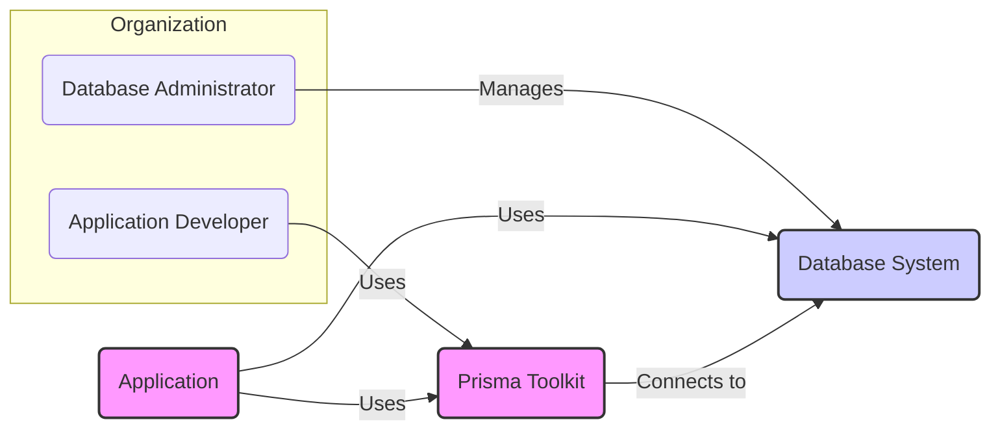
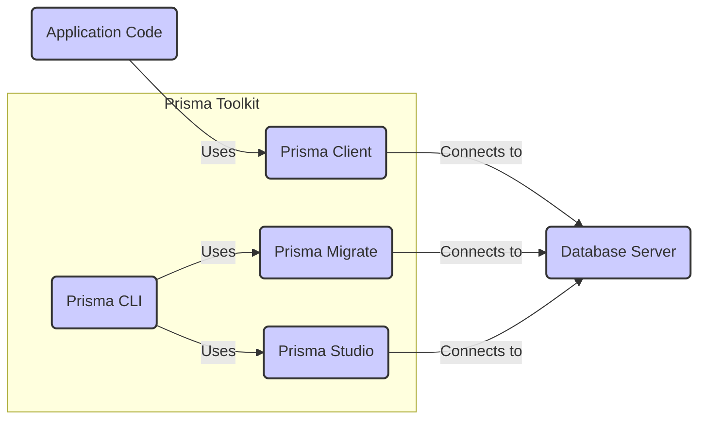
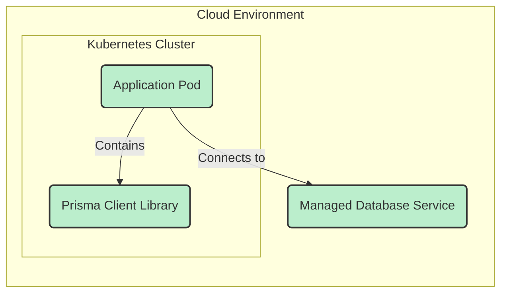
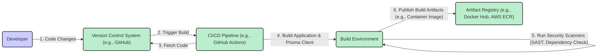

# BUSINESS POSTURE

This project, Prisma, aims to simplify database access for developers by providing a modern database toolkit. It focuses on making database interactions intuitive, safe, and efficient, ultimately increasing developer productivity and application reliability.

Business Priorities and Goals:
- Primary Goal: Enhance developer experience and productivity when working with databases.
- Secondary Goal: Provide a type-safe and performant ORM for modern application development.
- Tertiary Goal: Offer tools for database schema management and data exploration.

Business Risks:
- Data breaches due to vulnerabilities in Prisma components.
- Data integrity issues arising from ORM misconfigurations or bugs.
- Performance bottlenecks caused by inefficient database queries generated by Prisma.
- Vendor lock-in to Prisma ecosystem.
- Community support dependency and potential lack of long-term maintenance.

# SECURITY POSTURE

Existing Security Controls:
- security control: Secure software development lifecycle (SDL) practices are likely followed by the Prisma team, including code reviews and testing. (Assumed based on project maturity and popularity).
- security control: Dependency scanning is likely used to identify and address vulnerabilities in third-party libraries. (Assumed best practice for modern software projects).
- security control: Input validation is expected to be implemented within Prisma Client to prevent injection attacks. (Based on ORM functionality and common security practices).
- security control: Secure coding practices are expected to be followed by Prisma developers to minimize vulnerabilities. (Assumed based on project quality and community scrutiny).
- accepted risk: Reliance on the security of underlying database systems.
- accepted risk: Potential vulnerabilities in generated database access code if not used correctly by developers.

Recommended Security Controls:
- security control: Implement automated security testing, including static application security testing (SAST) and dynamic application security testing (DAST), in the CI/CD pipeline.
- security control: Conduct regular penetration testing and security audits by external security experts.
- security control: Establish a vulnerability disclosure program to allow the community to report security issues responsibly.
- security control: Provide security hardening guidelines for deploying and configuring Prisma in different environments.

Security Requirements:
- Authentication:
    - Requirement: Prisma itself does not handle application user authentication. It relies on the application layer to handle authentication and authorization.
    - Requirement: Secure authentication mechanisms should be used to access the database server from Prisma Client (e.g., strong passwords, certificate-based authentication).
- Authorization:
    - Requirement: Prisma should enforce database-level authorization based on the database user credentials provided.
    - Requirement: Application-level authorization logic should be implemented within the application code using Prisma Client to control access to specific data and operations.
- Input Validation:
    - Requirement: Prisma Client must sanitize and validate all inputs before constructing database queries to prevent SQL injection and other injection attacks.
    - Requirement: Prisma Migrate should validate schema migrations to prevent malicious or unintended database schema changes.
- Cryptography:
    - Requirement: Sensitive data at rest in the database should be encrypted using database-level encryption features.
    - Requirement: Communication between Prisma Client and the database server should be encrypted using TLS/SSL.
    - Requirement: If Prisma needs to handle sensitive data in memory or logs, appropriate encryption or redaction techniques should be applied.

# DESIGN

## C4 CONTEXT

Context Diagram Elements:

- Element:
    - Name: Application Developer
    - Type: Person
    - Description: Developers who use Prisma Toolkit to build applications that interact with databases.
    - Responsibilities: Develop applications, define data models, write queries using Prisma Client.
    - Security controls: Follow secure coding practices, implement application-level authentication and authorization.

- Element:
    - Name: Database Administrator
    - Type: Person
    - Description: Professionals responsible for managing and maintaining the Database System.
    - Responsibilities: Database setup, configuration, performance tuning, security hardening, backups, and recovery.
    - Security controls: Implement database access controls, monitor database activity, apply security patches, configure database encryption.

- Element:
    - Name: Prisma Toolkit
    - Type: Software System
    - Description: A set of tools including Prisma Client, Prisma Migrate, and Prisma Studio that simplifies database interactions for developers.
    - Responsibilities: Generate type-safe database clients, manage database schema migrations, provide a visual database management interface, abstract database complexities.
    - Security controls: Input validation, secure query generation, secure handling of database credentials, adherence to secure development lifecycle.

- Element:
    - Name: Application
    - Type: Software System
    - Description: The application being developed by Application Developers that utilizes Prisma Toolkit to interact with the Database System.
    - Responsibilities: Implement business logic, handle user authentication and authorization, interact with Prisma Client to perform database operations.
    - Security controls: Input validation, output encoding, secure session management, application-level authorization, protection of sensitive data.

- Element:
    - Name: Database System
    - Type: Database System
    - Description: The underlying database system (e.g., PostgreSQL, MySQL, SQL Server) where application data is stored and managed.
    - Responsibilities: Data storage, data retrieval, data integrity, transaction management, data security.
    - Security controls: Access control lists, database authentication, database encryption, auditing, regular security patching.

## C4 CONTAINER

Container Diagram Elements:

- Element:
    - Name: Prisma Client
    - Type: Container (Library)
    - Description: A type-safe query builder generated based on the Prisma schema, used within the Application Code to interact with the Database Server.
    - Responsibilities: Construct and execute database queries, provide type safety, handle database connections, perform input validation.
    - Security controls: Input validation, secure query generation, secure handling of database credentials (passed from application), connection encryption (TLS/SSL).

- Element:
    - Name: Prisma Migrate
    - Type: Container (CLI Tool)
    - Description: A command-line tool for managing database schema migrations based on changes in the Prisma schema.
    - Responsibilities: Generate migration scripts, apply migrations to the Database Server, track migration history, ensure schema consistency.
    - Security controls: Secure handling of database credentials, validation of migration scripts, access control to migration execution (typically restricted to development/admin environments).

- Element:
    - Name: Prisma Studio
    - Type: Container (GUI Application)
    - Description: A graphical user interface for visualizing and managing data in the Database Server, interacting with Prisma schema and data.
    - Responsibilities: Data browsing, data editing, query execution, schema visualization, data exploration.
    - Security controls: Authentication to access Prisma Studio (typically development/admin access), authorization to control data access within Studio, secure communication with Database Server.

- Element:
    - Name: Prisma CLI
    - Type: Container (CLI Tool)
    - Description: Command-line interface that bundles Prisma Migrate and Prisma Studio functionalities and provides other utilities for Prisma development.
    - Responsibilities: Orchestrate Prisma Migrate and Prisma Studio operations, manage Prisma projects, provide development utilities.
    - Security controls: Access control to CLI commands (typically development/admin access), secure execution of commands, secure handling of credentials.

- Element:
    - Name: Application Code
    - Type: Container (Application Component)
    - Description: The codebase of the application that uses Prisma Client to interact with the database.
    - Responsibilities: Implement business logic, handle user requests, manage application state, interact with Prisma Client for data access.
    - Security controls: Application-level authentication and authorization, input validation, output encoding, secure session management, protection of sensitive data, secure configuration management.

- Element:
    - Name: Database Server
    - Type: Container (Database System)
    - Description: The database server (e.g., PostgreSQL, MySQL, SQL Server) that stores and manages the application data.
    - Responsibilities: Data persistence, data integrity, query processing, transaction management, access control, security.
    - Security controls: Database authentication, database authorization, database encryption (at rest and in transit), auditing, regular security patching, network security controls.

## DEPLOYMENT

Deployment Architecture Option: Cloud-based deployment using containerization (e.g., Docker, Kubernetes) and a managed database service.

Deployment Diagram Elements:

- Element:
    - Name: Kubernetes Cluster
    - Type: Deployment Environment
    - Description: A managed Kubernetes cluster in a cloud environment (e.g., AWS EKS, Google GKE, Azure AKS) used to deploy and manage the Application Pod.
    - Responsibilities: Container orchestration, application scaling, high availability, resource management, network management.
    - Security controls: Network policies, RBAC (Role-Based Access Control), pod security policies, container image scanning, secrets management, cluster security hardening.

- Element:
    - Name: Application Pod
    - Type: Deployment Unit
    - Description: A pod in the Kubernetes cluster that runs the Application Code and includes the Prisma Client Library.
    - Responsibilities: Run the application logic, handle requests, interact with the Prisma Client, connect to the Managed Database Service.
    - Security controls: Least privilege container configuration, application-level security controls, secure configuration management, logging and monitoring.

- Element:
    - Name: Prisma Client Library
    - Type: Software Component (Deployed)
    - Description: The Prisma Client library embedded within the Application Pod, responsible for database interactions.
    - Responsibilities: Construct and execute database queries, manage database connections, provide type safety.
    - Security controls: Input validation (as part of the library), secure connection management, dependency vulnerability scanning.

- Element:
    - Name: Managed Database Service
    - Type: Deployment Environment (Managed Service)
    - Description: A managed database service in the cloud (e.g., AWS RDS, Google Cloud SQL, Azure SQL Database) providing the Database Server.
    - Responsibilities: Database hosting, automated backups, high availability, scaling, security patching, database management.
    - Security controls: Database encryption (at rest and in transit), access control lists, network security rules, database auditing, security compliance certifications.

## BUILD

Build Process Description:

1. Developer commits code changes to the Version Control System (e.g., GitHub).
2. Code commit triggers the CI/CD Pipeline (e.g., GitHub Actions).
3. CI/CD Pipeline fetches the latest code from the Version Control System.
4. CI/CD Pipeline builds the Application and generates the Prisma Client using the Prisma CLI in a controlled Build Environment.
5. Security scanners (SAST, Dependency Check) are executed in the Build Environment to identify potential vulnerabilities in the code and dependencies.
6. If security checks pass, the CI/CD Pipeline publishes the build artifacts (e.g., Container Image) to an Artifact Registry (e.g., Docker Hub, AWS ECR).

Build Process Security Controls:

- security control: Version Control System: Secure access control to the repository, code review process, branch protection rules.
- security control: CI/CD Pipeline: Secure pipeline configuration, secret management for credentials, isolated build environment, audit logging of pipeline activities.
- security control: Build Environment: Hardened build environment, minimal tools installed, access control, regular patching.
- security control: Security Scanners (SAST, Dependency Check): Automated static code analysis, dependency vulnerability scanning, fail build on critical vulnerabilities.
- security control: Artifact Registry: Access control to the registry, vulnerability scanning of stored artifacts, immutable artifacts, audit logging of artifact access.

# RISK ASSESSMENT

Critical Business Processes:
- Application data access and management.
- Database schema migrations and updates.
- Application availability and performance relying on database interactions.

Data Sensitivity:
- The sensitivity of data handled by Prisma depends entirely on the application using it. Prisma itself is a tool and does not inherently handle sensitive data.
- Data sensitivity should be assessed based on the specific application and the type of data it stores in the database (e.g., Personally Identifiable Information (PII), financial data, health records).
- Prisma should be configured and used in a way that protects the confidentiality, integrity, and availability of the data, according to its sensitivity level.

# QUESTIONS & ASSUMPTIONS

Questions:
- What type of applications are primarily targeted for Prisma usage? (e.g., web applications, mobile backends, serverless functions).
- What is the typical deployment environment for Prisma-based applications? (e.g., cloud, on-premises, hybrid).
- What are the performance requirements for applications using Prisma?
- Are there any specific compliance requirements that Prisma needs to adhere to? (e.g., GDPR, HIPAA, PCI DSS).

Assumptions:
- Prisma follows secure software development lifecycle practices.
- Prisma is intended to be used in modern application architectures, potentially including cloud and containerized environments.
- Security is a significant consideration for the Prisma project and its users.
- Users of Prisma are expected to implement application-level security controls in addition to relying on Prisma's security features.