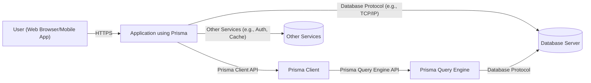
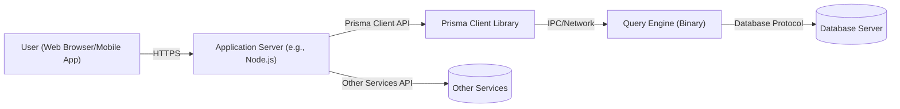
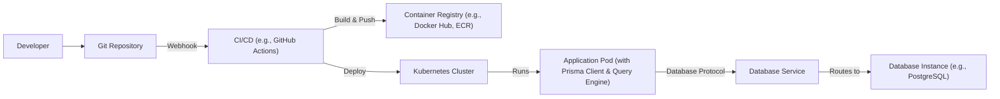
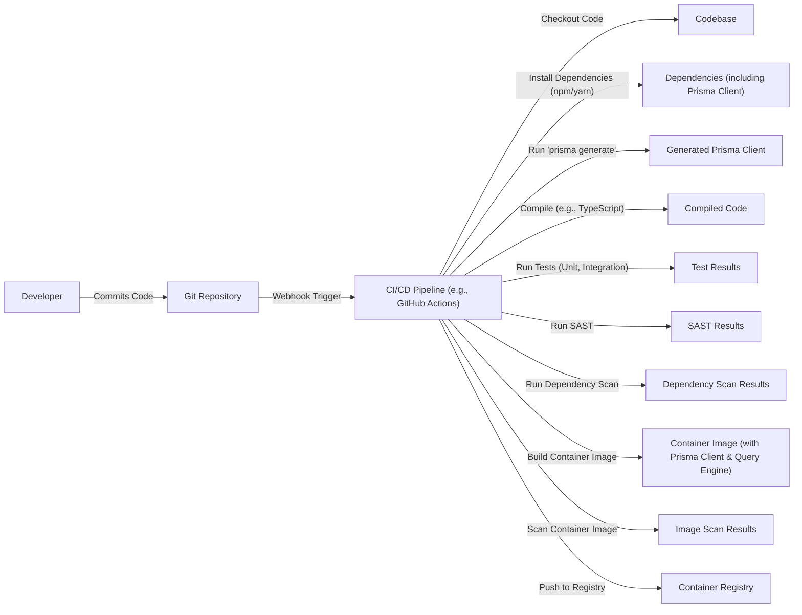

Okay, let's create a design document for the Prisma ORM project, focusing on aspects relevant for threat modeling.

# BUSINESS POSTURE

Prisma is a popular open-source ORM, widely adopted by developers and companies of various sizes.  Its primary goal is to simplify database access and management for application developers, improving productivity and reducing the risk of common database-related errors.  Given its position as a critical component in many applications' data layers, the following business priorities and risks are paramount:

Priorities:

*   Developer Productivity:  Enable rapid application development with a focus on ease of use and type safety.
*   Data Integrity:  Ensure data consistency and prevent common database errors (e.g., SQL injection, data corruption).
*   Database Compatibility: Support a wide range of popular database systems.
*   Performance: Provide efficient database access with minimal overhead.
*   Community & Ecosystem: Foster a strong community and a rich ecosystem of tools and integrations.
*   Adoption and Growth: Maintain and expand its user base, becoming a standard choice for database interaction.

Business Risks:

*   Data Breaches:  Vulnerabilities in Prisma could expose sensitive application data. This is the most critical risk.
*   Data Corruption:  Bugs in Prisma's query generation or execution could lead to data loss or corruption.
*   Denial of Service:  Inefficient queries or vulnerabilities could be exploited to overload the database server.
*   Reputation Damage:  Security incidents or major bugs could damage Prisma's reputation and erode trust.
*   Loss of Competitive Advantage:  Failure to keep up with evolving database technologies or security best practices could lead to a decline in adoption.
*   Supply Chain Attacks: Compromise of Prisma's dependencies or build process could introduce vulnerabilities.

# SECURITY POSTURE

Prisma has several built-in security controls and addresses various security concerns. However, as with any complex software, there are also accepted risks and areas for improvement.

Existing Security Controls:

*   security control: Type Safety: Prisma's core design leverages TypeScript's type system to prevent many common errors at compile time. This reduces the risk of runtime errors and some security vulnerabilities. (Implemented in Prisma Client)
*   security control: Parameterized Queries: Prisma Client generates parameterized queries, mitigating the risk of SQL injection vulnerabilities. (Implemented in Prisma Client and Query Engine)
*   security control: Data Validation: Prisma's schema definition language allows for defining data types and constraints, providing a level of input validation. (Implemented in Prisma Schema Language (PSL) and Prisma Client)
*   security control: Regular Security Audits: Prisma undergoes regular security audits and vulnerability assessments. (Described in Prisma's security documentation and public disclosures)
*   security control: Dependency Management: Prisma uses tools like Dependabot to manage dependencies and identify known vulnerabilities. (Visible in the GitHub repository)
*   security control: Secure Development Practices: Prisma follows secure coding practices and guidelines. (Described in Prisma's contributing guidelines and code reviews)
*   security control: Community Reporting: Prisma has a clear process for reporting security vulnerabilities. (Described in Prisma's security policy)

Accepted Risks:

*   accepted risk: Database-Specific Vulnerabilities: While Prisma mitigates many common risks, it cannot completely eliminate vulnerabilities specific to the underlying database system.
*   accepted risk: Complex Query Logic: Extremely complex queries or custom query logic (e.g., using `$raw` queries) may bypass some of Prisma's built-in protections.
*   accepted risk: Ecosystem Risks: Third-party extensions or integrations with Prisma may introduce their own security risks.
*   accepted risk: Zero-Day Vulnerabilities: Like all software, Prisma is susceptible to unknown (zero-day) vulnerabilities.

Recommended Security Controls:

*   High Priority: Enhanced Input Validation: Implement more robust input validation mechanisms, potentially leveraging libraries specifically designed for this purpose, to further reduce the risk of injection attacks or unexpected behavior.
*   High Priority: Regular Static Analysis: Integrate static analysis tools (SAST) into the CI/CD pipeline to automatically detect potential security vulnerabilities in the codebase.
*   High Priority: Dynamic Analysis: Incorporate dynamic analysis (DAST) to test the running application for vulnerabilities.
*   High Priority: Fuzz Testing: Implement fuzz testing to identify edge cases and unexpected behavior that could lead to security vulnerabilities.

Security Requirements:

*   Authentication: Prisma Client itself does not handle user authentication. Authentication is typically managed at the application layer, *before* interacting with Prisma.
*   Authorization: Prisma does not directly implement authorization logic. Authorization (determining which users can access which data) is the responsibility of the application using Prisma. Prisma's role is to ensure that the queries generated by the application are executed securely.
*   Input Validation: Prisma provides basic input validation through its schema definition. However, the application layer should implement comprehensive input validation to prevent malicious or malformed data from reaching the database.
*   Cryptography: Prisma does not directly handle data encryption at rest or in transit. Database encryption should be configured at the database server level. Prisma Client communicates with the database using the database's native protocol, which may or may not be encrypted (e.g., TLS/SSL for PostgreSQL).

# DESIGN

## C4 CONTEXT

Element Descriptions:

*   Element:
    *   Name: User
    *   Type: Person
    *   Description: A user interacting with the application that uses Prisma.
    *   Responsibilities: Initiates requests to the application.
    *   Security controls: None (security is handled by the application).

*   Element:
    *   Name: Application using Prisma
    *   Type: Software System
    *   Description: The application that uses Prisma Client to interact with the database.
    *   Responsibilities: Handles user requests, business logic, and data access.
    *   Security controls: Authentication, authorization, input validation, session management, error handling.

*   Element:
    *   Name: Database Server
    *   Type: Database System
    *   Description: The database system (e.g., PostgreSQL, MySQL, SQL Server) that stores the application data.
    *   Responsibilities: Stores and manages data, executes queries.
    *   Security controls: Database-level access control, encryption at rest, auditing, network security.

*   Element:
    *   Name: Prisma Client
    *   Type: Software System
    *   Description: The client-side library that provides a type-safe API for interacting with the database.
    *   Responsibilities: Generates queries, handles database connections, provides a type-safe interface.
    *   Security controls: Parameterized queries, type safety.

*   Element:
    *   Name: Prisma Query Engine
    *   Type: Software System
    *   Description: The query engine that executes queries against the database.
    *   Responsibilities: Executes queries, manages database connections.
    *   Security controls: Secure query execution.

*   Element:
    *   Name: Other Services
    *   Type: Software System
    *   Description: Other services that the application interacts with (e.g., authentication services, caching services).
    *   Responsibilities: Varies depending on the service.
    *   Security controls: Varies depending on the service.

## C4 CONTAINER

Element Descriptions:

*   Element:
    *   Name: Application Server
    *   Type: Container (e.g., Node.js runtime)
    *   Description: The server-side runtime environment for the application.
    *   Responsibilities: Executes application code, handles HTTP requests, interacts with Prisma Client.
    *   Security controls: Application-level security controls (authentication, authorization, input validation).

*   Element:
    *   Name: Prisma Client Library
    *   Type: Library
    *   Description: The Prisma Client library, integrated into the application code.
    *   Responsibilities: Provides the API for interacting with the database, generates queries.
    *   Security controls: Type safety, parameterized queries.

*   Element:
    *   Name: Query Engine
    *   Type: Binary Executable
    *   Description: The Prisma Query Engine, a separate process that executes queries.
    *   Responsibilities: Executes queries against the database, manages database connections.
    *   Security controls: Secure query execution.

*   Element:
    *   Name: Database Server
    *   Type: Database System
    *   Description: The database system (e.g., PostgreSQL, MySQL).
    *   Responsibilities: Stores and manages data, executes queries.
    *   Security controls: Database-level security controls.

*   Element:
    *   Name: Other Services
    *   Type: Software System
    *   Description: Other services that the application interacts with.
    *   Responsibilities: Varies depending on the service.
    *   Security controls: Varies depending on the service.

## DEPLOYMENT

Prisma itself is a development tool and a library, not a standalone deployable application.  The deployment of an application *using* Prisma depends on the application's architecture and infrastructure.  Here are some common deployment scenarios, with a focus on the database and Prisma-related aspects:

Possible Deployment Solutions:

1.  Serverless (e.g., AWS Lambda, Vercel, Netlify): The application code (including Prisma Client) is deployed as serverless functions. The Query Engine is typically bundled with the function or accessed via a layer. The database is often a managed service (e.g., AWS RDS, PlanetScale).
2.  Containerized (e.g., Docker, Kubernetes): The application (including Prisma Client) is packaged into a container. The Query Engine is included in the container image. The database can be another container or a managed service.
3.  Traditional Server (e.g., EC2, Virtual Machine): The application is deployed directly onto a server. The Query Engine is installed on the server or accessed via a shared location. The database can be on the same server, a separate server, or a managed service.

Detailed Deployment (Containerized with Kubernetes):

Element Descriptions:

*   Element:
    *   Name: Developer
    *   Type: Person
    *   Description: A developer working on the application.
    *   Responsibilities: Writes code, commits changes to Git.
    *   Security controls: Code review, secure coding practices.

*   Element:
    *   Name: Git Repository
    *   Type: Version Control System
    *   Description: The repository storing the application code.
    *   Responsibilities: Stores code, tracks changes.
    *   Security controls: Access control, branch protection rules.

*   Element:
    *   Name: CI/CD
    *   Type: Continuous Integration/Continuous Deployment System
    *   Description: The system that automates the build, test, and deployment process.
    *   Responsibilities: Builds the application, runs tests, deploys to Kubernetes.
    *   Security controls: SAST, DAST, dependency scanning, secrets management.

*   Element:
    *   Name: Container Registry
    *   Type: Container Image Repository
    *   Description: The registry storing the container images.
    *   Responsibilities: Stores container images, provides access control.
    *   Security controls: Image scanning, access control.

*   Element:
    *   Name: Kubernetes Cluster
    *   Type: Container Orchestration Platform
    *   Description: The Kubernetes cluster managing the application deployment.
    *   Responsibilities: Schedules and manages containers, provides networking and storage.
    *   Security controls: Network policies, pod security policies, role-based access control (RBAC).

*   Element:
    *   Name: Application Pod
    *   Type: Kubernetes Pod
    *   Description: A pod running the application container (including Prisma Client and Query Engine).
    *   Responsibilities: Executes the application code, interacts with the database.
    *   Security controls: Application-level security controls, container security context.

*   Element:
    *   Name: Database Service
    *   Type: Kubernetes Service
    *   Description: A Kubernetes service providing access to the database instance.
    *   Responsibilities: Provides a stable endpoint for accessing the database.
    *   Security controls: Network policies.

*   Element:
    *   Name: Database Instance
    *   Type: Database Instance
    *   Description: The running instance of the database (e.g., a PostgreSQL pod).
    *   Responsibilities: Stores and manages data.
    *   Security controls: Database-level security controls.

## BUILD

The build process for an application using Prisma typically involves the following steps, with a focus on security:

1.  Code Checkout: The CI/CD system checks out the application code from the Git repository.
2.  Dependency Installation: Dependencies (including Prisma Client) are installed using a package manager (e.g., npm, yarn).
3.  Prisma Generate: The `prisma generate` command is executed to generate the Prisma Client based on the Prisma schema. This step is crucial for type safety and ensuring the client is up-to-date with the schema.
4.  Compilation (if applicable): The application code (e.g., TypeScript) is compiled.
5.  Testing: Unit tests, integration tests, and potentially end-to-end tests are executed.
6.  Static Analysis (SAST): Static analysis tools are run to identify potential security vulnerabilities in the code.
7.  Dependency Scanning: Dependencies are scanned for known vulnerabilities.
8.  Containerization (if applicable): The application and its dependencies (including the Query Engine) are packaged into a container image.
9.  Image Scanning (if applicable): The container image is scanned for vulnerabilities.
10. Artifact Storage: The build artifacts (e.g., container image, compiled code) are stored in a secure location (e.g., container registry, artifact repository).

Security Controls in Build Process:

*   security control: `prisma generate`: Ensures the Prisma Client is type-safe and consistent with the database schema.
*   security control: SAST: Identifies potential code vulnerabilities.
*   security control: Dependency Scanning: Detects known vulnerabilities in dependencies.
*   security control: Image Scanning: Identifies vulnerabilities in the container image.
*   security control: Secure Build Environment: The CI/CD environment should be secured to prevent unauthorized access or modification.
*   security control: Least Privilege: Build processes should run with the minimum necessary privileges.

# RISK ASSESSMENT

Critical Business Processes:

*   Data Access and Management: Prisma is directly involved in accessing and managing application data. Any compromise of Prisma could lead to unauthorized data access, modification, or deletion.
*   Application Functionality: Many applications rely on Prisma for core functionality. A vulnerability in Prisma could disrupt or disable these applications.

Data Sensitivity:

*   The data sensitivity depends entirely on the application using Prisma. Prisma itself does not define the sensitivity of the data. However, because Prisma interacts directly with the database, it has access to *all* data stored in the database. This could range from non-sensitive public data to highly sensitive personal information, financial data, or trade secrets. Therefore, from Prisma's perspective, all data it handles should be treated as potentially high-sensitivity.

# QUESTIONS & ASSUMPTIONS

Questions:

*   What specific database systems are most commonly used with Prisma in production environments? (This helps prioritize security testing and hardening efforts.)
*   What is the typical deployment model for applications using Prisma (serverless, containerized, traditional server)? (This informs the threat modeling of the deployment environment.)
*   What are the most common types of applications built with Prisma (e.g., e-commerce, SaaS, internal tools)? (This helps understand the typical data sensitivity and business risks.)
*   What level of access does the Prisma Query Engine have to the database? (Does it use a dedicated database user with limited privileges, or a more privileged user?)
*   Are there any plans to implement additional security features directly within Prisma (e.g., built-in authorization, data masking)?

Assumptions:

*   BUSINESS POSTURE: We assume that the primary business goal is to provide a reliable, secure, and performant ORM that simplifies database interactions for developers. We assume a moderate risk appetite, balancing the need for rapid development with the importance of security.
*   SECURITY POSTURE: We assume that Prisma follows secure coding practices and has a process for addressing security vulnerabilities. We assume that applications using Prisma are responsible for implementing their own authentication and authorization logic.
*   DESIGN: We assume that Prisma Client communicates with the Query Engine via a secure channel (IPC or network). We assume that the Query Engine connects to the database using the database's native protocol. We assume that the deployment environment is secured according to best practices.