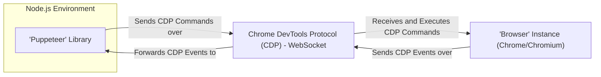
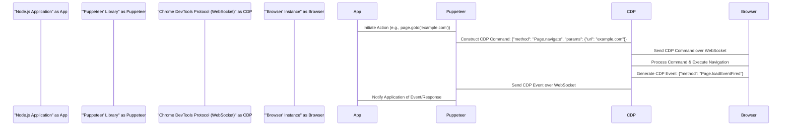

# Project Design Document: Puppeteer

**Version:** 1.1
**Date:** October 26, 2023
**Author:** AI Software Architect

## 1. Introduction

This document provides a detailed architectural design of the Puppeteer project. Puppeteer is a Node.js library that offers a high-level API to control headless (or headful) Chrome or Chromium browsers. It is widely used for various tasks, including automated testing, web scraping, generating PDFs of web pages, and capturing website screenshots. This document outlines the key components, data flows, and interactions within the Puppeteer ecosystem, serving as a foundational resource for subsequent threat modeling and security analysis.

## 2. Goals

The primary goals of this design document are to:

*   Clearly define the architecture and core components of the Puppeteer library.
*   Illustrate the communication pathways and interactions between Puppeteer and the controlled browser instance.
*   Identify key data flows, potential security boundaries, and sensitive data points.
*   Provide a comprehensive and well-structured overview to facilitate effective threat modeling and security assessments.

## 3. Scope

This document focuses on the core architectural elements and functionalities of the Puppeteer library and its direct interaction with the browser. The scope includes:

*   The Node.js API exposed by the Puppeteer library.
*   The underlying communication mechanism utilizing the Chrome DevTools Protocol (CDP).
*   Key internal modules and abstractions within the Puppeteer library.
*   The lifecycle management of browser instances controlled by Puppeteer.

This document explicitly excludes:

*   The intricate internal workings and architecture of the Chromium browser itself.
*   Specific implementation details and code-level logic within the Puppeteer library.
*   Detailed analysis of specific use cases or applications built on top of Puppeteer.

## 4. Architectural Overview

Puppeteer acts as an intermediary, enabling a Node.js application to programmatically control a browser instance. The communication and control are achieved through the Chrome DevTools Protocol (CDP).

**Key Components:**

*   **'Puppeteer' Library (Node.js):** This is the central component, providing the high-level JavaScript API for developers. It encapsulates the complexities of the CDP and offers an intuitive interface for browser automation.
*   **Chrome DevTools Protocol (CDP) - WebSocket:** This is the communication channel and protocol used by Puppeteer to interact with the browser. It's a JSON-based protocol operating over a WebSocket connection.
*   **'Browser' Instance (Chrome/Chromium):** This is the actual browser process being controlled. It interprets and executes web pages and responds to commands received via the CDP.

## 5. Detailed Design

### 5.1. 'Puppeteer' Library Internals

The Puppeteer library is structured with several key modules and abstractions:

*   **Browser:** Represents a single browser instance. It provides methods for managing pages, targets, and browser-level actions.
*   **Page:** Represents a single tab or page within the browser. It offers methods for interacting with the page content, navigation, and execution of JavaScript.
*   **Target:** Represents a discoverable entity within the browser, such as a page, a background service worker, or an extension.
*   **Frame:** Represents an iframe within a page. It allows interaction with the content within the iframe.
*   **ElementHandle:** Represents an in-page DOM element. It provides methods for interacting with the element (e.g., clicking, typing).
*   **Network:** Provides access to network-related information and allows interception and modification of network requests.
*   **Tracing:** Enables capturing performance traces from the browser.
*   **CDPSession:** Represents a raw CDP session, allowing for direct interaction with the protocol for more advanced use cases.

### 5.2. Chrome DevTools Protocol (CDP)

The CDP is a powerful, low-level protocol that exposes the internal workings of the Chromium browser. Key characteristics include:

*   **JSON-based Messaging:** Communication is structured using JSON objects for both commands and events.
*   **Asynchronous Communication:** Interactions are asynchronous, with commands sent and responses/events received independently.
*   **Event-Driven Architecture:** The browser emits events to notify the client (Puppeteer) about various occurrences, such as page loads, network activity, and console messages.
*   **Domain-Specific APIs:** The protocol is organized into domains, each representing a specific area of browser functionality (e.g., `Page`, `Network`, `Runtime`, `DOM`).

### 5.3. 'Browser' Instance Details

The browser instance controlled by Puppeteer can operate in two modes:

*   **Headless Mode:** The browser runs without a graphical user interface. This is the default mode and is efficient for automated tasks.
*   **Headful Mode:** The browser runs with a visible user interface, allowing for visual inspection and debugging.

The browser instance is responsible for:

*   Rendering web pages and executing JavaScript.
*   Handling network requests and managing browser cache and cookies.
*   Managing browser history and navigation.
*   Exposing its internal state and functionality through the CDP.

## 6. Data Flow

The core data flow involves the exchange of commands and events between the Puppeteer library and the browser instance via the CDP over a WebSocket connection.

1. **Action Initiation:** The Node.js application, utilizing the Puppeteer API (e.g., `page.goto('https://example.com')`), initiates an action.
2. **CDP Command Construction:** The Puppeteer library translates the API call into a specific CDP command formatted as a JSON object (e.g., `{"method": "Page.navigate", "params": {"url": "https://example.com"}}`).
3. **Command Transmission:** The CDP command is serialized and sent over the established WebSocket connection to the browser instance.
4. **Command Reception and Processing:** The browser instance receives the CDP command, parses it, and executes the corresponding action within the browser environment.
5. **Event Generation:** As the browser processes the command and its consequences unfold (e.g., page loading, network requests), it generates CDP events to report status and changes (e.g., `{"method": "Page.loadEventFired"}`).
6. **Event Transmission:** These CDP events, also formatted as JSON objects, are sent back to the Puppeteer library over the WebSocket connection.
7. **Event Reception and Handling:** The Puppeteer library receives the CDP events, deserializes them, and triggers corresponding callbacks or updates its internal state, allowing the Node.js application to react to browser events.
8. **Response to Application:** Based on the received events, the Puppeteer library provides feedback or results to the Node.js application, completing the cycle.

## 7. Security Considerations (Pre-Threat Modeling)

Before conducting a formal threat model, several inherent security considerations within the Puppeteer architecture can be identified:

*   **CDP Communication Security:** The integrity and confidentiality of the WebSocket connection used for CDP communication are paramount. Man-in-the-middle attacks could allow interception or manipulation of commands and events.
*   **Input Validation and Sanitization:** Puppeteer needs to carefully validate and sanitize inputs provided by the user (e.g., URLs, CSS selectors, JavaScript code to evaluate) to prevent injection vulnerabilities like Cross-Site Scripting (XSS) if these inputs are derived from untrusted sources.
*   **Resource Management and Isolation:** Improper management of browser instances and their resources (memory, CPU) could lead to denial-of-service conditions. Ensuring proper isolation between different Puppeteer instances or controlled browsers is also crucial.
*   **`evaluate` Function Risks:** The `page.evaluate()` and related functions allow executing arbitrary JavaScript code within the browser context. This powerful feature introduces risks if the code being evaluated is not carefully controlled, potentially leading to malicious actions within the browser.
*   **Network Interception Vulnerabilities:** While network interception is a core feature, it can be exploited to intercept sensitive data transmitted by the browser. Applications using this feature must implement appropriate safeguards.
*   **Browser Security Vulnerabilities:** The security of the underlying Chrome/Chromium browser is critical. Outdated browser versions may contain known vulnerabilities that could be exploited if Puppeteer is used to interact with them.
*   **Dependency Chain Security:** As a Node.js library, Puppeteer relies on a chain of dependencies. Vulnerabilities in these dependencies could indirectly impact the security of applications using Puppeteer.
*   **Permissions and Access Control:** When connecting to existing browser instances, proper authentication and authorization mechanisms are necessary to prevent unauthorized control.

## 8. Future Considerations

*   **Enhanced CDP Security:** Exploring options for more secure CDP communication, such as encryption or authentication mechanisms beyond the basic WebSocket connection, could be beneficial.
*   **Improved Isolation Mechanisms:** Investigating stronger isolation techniques between browser instances controlled by Puppeteer to prevent cross-contamination or information leakage.
*   **Integration with Security Scanning Tools:** Designing Puppeteer to be more easily integrated with security vulnerability scanning tools could streamline security assessments of web applications.
*   **Standardized Security Best Practices Documentation:** Providing clear and comprehensive documentation on security best practices for using Puppeteer would help developers build more secure applications.
*   **Support for Emerging Browser Security Features:** Adapting Puppeteer to leverage new security features introduced in modern browsers would enhance its overall security posture.

## 9. Conclusion

This design document provides a detailed architectural overview of the Puppeteer project, outlining its key components, data flows, and inherent security considerations. It serves as a valuable resource for understanding the system's architecture and identifying potential areas of security concern. This document is intended to be a foundational piece for subsequent threat modeling activities, enabling a more focused and effective security analysis of applications utilizing the Puppeteer library.
