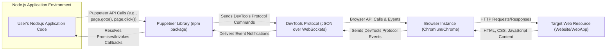
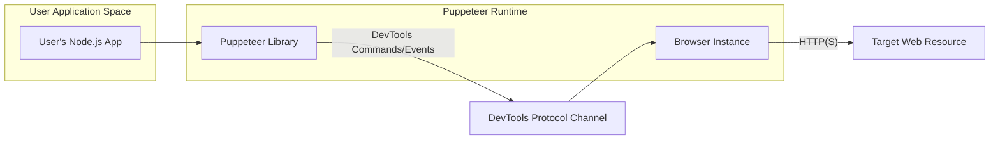
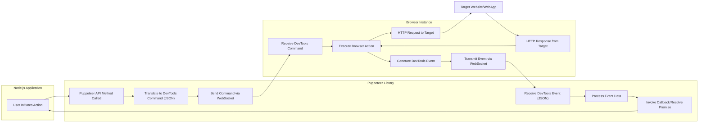

# Project Design Document: Puppeteer

**Version:** 1.1
**Date:** October 26, 2023
**Author:** AI Software Architect

## 1. Introduction

This document provides a detailed design overview of the Puppeteer project. Puppeteer is a Node.js library that offers a high-level API to control headless (or headful) Chrome or Chromium browsers via the DevTools Protocol. It is commonly used for tasks such as end-to-end testing, web scraping, generating PDFs of web pages, and automating browser interactions. This document aims to provide a comprehensive understanding of Puppeteer's architecture, components, and data flow, which is essential for effective threat modeling.

## 2. Goals and Objectives

*   Provide a clear and detailed description of Puppeteer's architecture and its constituent components.
*   Articulate the key interactions and data flows within the Puppeteer ecosystem, including the role of the DevTools Protocol.
*   Clearly identify the main boundaries and interfaces of the system to delineate potential attack surfaces.
*   Serve as a foundational document for conducting thorough threat modeling and security assessments.

## 3. Target Audience

This document is intended for:

*   Security engineers and architects responsible for threat modeling, security assessments, and penetration testing of systems utilizing Puppeteer.
*   Software developers working with or extending the Puppeteer library, requiring a deep understanding of its architecture.
*   Operations and DevOps teams involved in deploying, configuring, and managing applications that leverage Puppeteer.

## 4. System Architecture

Puppeteer's architecture centers around controlling a browser instance through the asynchronous communication facilitated by the DevTools Protocol. The primary components and their interactions are visualized below:

### 4.1. Key Components

*   **User's Node.js Application Code:** This represents the custom application code written by developers that imports and utilizes the Puppeteer library to automate browser actions.
*   **Puppeteer Library (npm package):** This is the core Node.js library installed via npm. It provides the high-level API abstractions for controlling the browser and manages the underlying DevTools Protocol communication.
*   **Browser Instance (Chromium/Chrome):** This is an instance of the Chromium or Chrome browser that Puppeteer launches and controls. It can be configured to run in headless mode (without a GUI) or headful mode.
*   **DevTools Protocol (JSON over WebSockets):** This is a low-level protocol that enables tools to inspect, debug, and control Chromium-based browsers. Puppeteer uses this protocol, typically over a WebSocket connection, to send commands to the browser and receive event notifications.
*   **Target Web Resource (Website/WebApp):** This is the external web resource (website or web application) that the browser instance interacts with under the control of Puppeteer.

### 4.2. Data Flow

The typical data flow within a Puppeteer application unfolds as follows:

1. The **User's Node.js Application Code** initiates an action by calling a method from the **Puppeteer Library's API** (e.g., `page.goto('https://example.com')`, `page.click('#submit-button')`).
2. The **Puppeteer Library** translates these high-level API calls into specific commands formatted according to the **DevTools Protocol**. These commands are typically represented as JSON objects.
3. These **DevTools Protocol Commands** are serialized and sent over a WebSocket connection to the **Browser Instance**.
4. The **Browser Instance** receives and interprets these commands, performing the requested actions, such as navigating to a URL, clicking an element, evaluating JavaScript code within the page context, etc.
5. During its operation, the **Browser Instance** interacts with the **Target Web Resource** by sending HTTP requests and receiving responses containing HTML, CSS, JavaScript, and other web content.
6. The **Browser Instance** emits events reflecting its state changes and the results of actions back to the **Puppeteer Library** via the **DevTools Protocol**. These events can include page load events, network request/response details, console messages, and more.
7. The **Puppeteer Library** receives and processes these **DevTools Protocol Events**, updating its internal state and providing the results back to the **User's Node.js Application Code** through promise resolutions or callback invocations.

## 5. Detailed Component Descriptions

### 5.1. Puppeteer Library

*   **Purpose:** To provide a user-friendly, high-level API for controlling Chromium or Chrome browsers, abstracting away the complexities of the underlying DevTools Protocol. It manages browser lifecycle, page interactions, and event handling.
*   **Key Features:**
    *   Launching and managing browser instances (local or remote).
    *   Creating and managing browser pages (tabs and windows).
    *   Navigating to URLs and managing page lifecycle.
    *   Simulating user interactions (clicks, typing, scrolling).
    *   Evaluating JavaScript code within the browser context.
    *   Taking screenshots and generating PDFs of web pages.
    *   Intercepting and modifying network requests and responses.
    *   Emulating different devices, screen sizes, and network conditions.
    *   Accessing browser console logs and errors.
*   **Interfaces:**
    *   Public JavaScript API exposed to the user's Node.js code (e.g., `Browser`, `Page`, `Frame`, `ElementHandle` classes).
    *   Internal modules for managing DevTools Protocol communication and browser process management.

### 5.2. Browser Instance (Chromium/Chrome)

*   **Purpose:** The actual browser environment where web pages are rendered and JavaScript is executed. It is the target being controlled by the Puppeteer library.
*   **Key Features:**
    *   Rendering HTML, CSS, and executing JavaScript code.
    *   Handling network requests and managing cookies and local storage.
    *   Providing the DevTools Protocol interface for external control and inspection.
    *   Implementing browser security features such as sandboxing, the same-origin policy, and Content Security Policy (CSP).
*   **Interfaces:**
    *   DevTools Protocol endpoint (typically a WebSocket server) for receiving commands and sending events.
    *   Standard web APIs exposed to web pages (e.g., DOM APIs, Fetch API).

### 5.3. DevTools Protocol (JSON over WebSockets)

*   **Purpose:** A standardized communication protocol that allows external tools (like Puppeteer) to introspect and control the behavior of Chromium-based browsers.
*   **Key Features:**
    *   Provides a comprehensive set of commands for controlling various aspects of the browser (e.g., navigation, DOM manipulation, network interception, performance profiling).
    *   Emits events reflecting changes in the browser's state and the outcome of actions.
    *   Uses a JSON-based message format transmitted over WebSockets for real-time, bidirectional communication.
*   **Interfaces:**
    *   A WebSocket connection established between the Puppeteer library and the browser instance.
    *   A defined set of command and event names with associated JSON schemas.

## 6. Deployment Model

Puppeteer applications can be deployed in various environments, each with its own security considerations:

*   **Local Execution:** The Node.js application and the controlled browser instance run on the same local machine.
*   **Cloud Environments:**
    *   **Serverless Functions (e.g., AWS Lambda, Azure Functions):** Puppeteer can be used within serverless functions for tasks like generating reports or processing web content. Requires careful configuration of the browser environment within the function.
    *   **Containerized Environments (e.g., Docker):** Packaging the Node.js application and a compatible browser within a Docker container is a common and recommended deployment strategy for consistency and isolation.
    *   **Virtual Machines (VMs):** Running Puppeteer on dedicated or shared VMs in the cloud.
*   **Continuous Integration/Continuous Deployment (CI/CD) Pipelines:** Puppeteer is frequently used for automated end-to-end testing as part of CI/CD pipelines.

## 7. Security Considerations (For Threat Modeling)

This section outlines initial security considerations relevant for threat modeling activities. These points highlight potential vulnerabilities and attack vectors associated with using Puppeteer.

*   **Code Injection Vulnerabilities:**
    *   If user-provided input is directly used to construct Puppeteer commands or JavaScript code executed within the browser context (e.g., via `page.evaluate()`), it can lead to cross-site scripting (XSS) or other code injection attacks.
*   **Sensitive Data Exposure:**
    *   Puppeteer scripts might inadvertently access or log sensitive data from web pages (e.g., user credentials, personal information). Secure handling and storage of such data are crucial.
    *   Screenshots or PDFs generated by Puppeteer might contain sensitive information and need appropriate access controls.
*   **Resource Exhaustion and Denial of Service (DoS):**
    *   Malicious or poorly written Puppeteer scripts could consume excessive system resources (CPU, memory, network bandwidth), leading to performance degradation or denial of service.
    *   Uncontrolled browser launches or long-running browser sessions can also contribute to resource exhaustion.
*   **Man-in-the-Middle (MITM) Attacks:**
    *   If the communication between the Puppeteer library and the browser instance over the DevTools Protocol is not properly secured (especially in remote debugging scenarios), it could be vulnerable to MITM attacks, allowing an attacker to intercept or manipulate commands and events.
*   **Browser Vulnerabilities:**
    *   Puppeteer relies on the underlying Chromium or Chrome browser. Unpatched vulnerabilities in the browser could be exploited if not kept up-to-date.
*   **Supply Chain Security Risks:**
    *   Vulnerabilities in the Puppeteer library itself or its dependencies could introduce security risks. Regularly auditing and updating dependencies is important.
*   **Insecure Defaults and Configurations:**
    *   Default configurations or insecure coding practices when using Puppeteer might expose unintended functionalities or data.
*   **Unauthorized Access and Control:**
    *   If Puppeteer is exposed as an API or service without proper authentication and authorization mechanisms, unauthorized users could gain control over browser instances and perform malicious actions.
*   **Navigation to Malicious Sites:**
    *   Puppeteer scripts could be tricked or instructed to navigate to malicious websites, potentially exposing the controlled browser environment to threats.
*   **Bypassing Security Measures:**
    *   Puppeteer's ability to control browser behavior could be misused to bypass security measures on target websites, such as CAPTCHAs or rate limiting.

## 8. Diagrams

### 8.1. High-Level Architecture Diagram (Revised)

### 8.2. Detailed Data Flow Diagram

## 9. Future Considerations

*   Detailed sequence diagrams illustrating specific use cases and interactions.
*   In-depth analysis of error handling and logging mechanisms within Puppeteer applications.
*   Further exploration of security best practices for configuring and using Puppeteer in different deployment environments.
*   Consideration of alternative browser control libraries and their architectural differences.

This revised document provides a more comprehensive and detailed overview of the Puppeteer project's architecture, data flow, and security considerations. It serves as a valuable resource for understanding the system and conducting thorough threat modeling activities.
