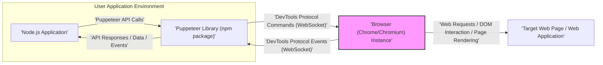

## Project Design Document: Puppeteer (Improved)

### 1. Project Overview

*   **Project Name:** Puppeteer
*   **Project Repository:** [https://github.com/puppeteer/puppeteer](https://github.com/puppeteer/puppeteer)
*   **Project Description:** Puppeteer is a Node.js library providing a high-level API to control headless or headful Chrome or Chromium browsers via the DevTools Protocol. It enables programmatic automation of browser actions, making it suitable for:
    *   Automated end-to-end testing of web applications, ensuring functionality and UI consistency.
    *   Web scraping and data extraction from websites, collecting structured information for analysis or integration.
    *   Generating website screenshots and PDFs for archiving, reporting, or visual documentation.
    *   Automating repetitive web tasks like form filling, UI interactions, and workflow automation.
    *   Server-Side Rendering (SSR) of Single-Page Applications (SPAs) to improve SEO and initial load performance.
    *   Performance analysis and monitoring of web applications by collecting metrics and tracing events.
*   **Document Purpose:** This document outlines the design of the Puppeteer project to facilitate threat modeling and security analysis. It describes the system architecture, data flow, and key security considerations.
*   **Target Audience:** Software developers, QA engineers, security engineers, and anyone involved in developing, deploying, or securing applications that utilize Puppeteer.
*   **Key Features:**
    *   **Browser Control Modes:** Supports both headless (background operation, no UI) and headful (visible UI) modes for Chrome/Chromium.
    *   **Chrome DevTools Protocol API:** Leverages the low-level Chrome DevTools Protocol for precise and comprehensive browser control.
    *   **Comprehensive Page Interaction:** Offers APIs for navigation, element interaction (clicks, typing, form submission), JavaScript execution, and DOM manipulation.
    *   **Media Capture:** Enables capturing screenshots in various formats and generating PDFs of web pages with customizable options.
    *   **Network Management:** Allows interception, modification, and monitoring of network requests and responses for testing and analysis.
    *   **Performance and Diagnostics:** Provides access to performance metrics, tracing information, and debugging capabilities via the DevTools Protocol.
    *   **Browser Lifecycle Management:** Handles the complete lifecycle of browser instances, including launching, managing multiple pages and contexts, and graceful termination.
    *   **Cross-Platform Compatibility:** Works across major operating systems (Windows, macOS, Linux) where Node.js and Chromium are supported.

### 2. System Architecture

#### 2.1. High-Level Architecture Diagram

#### 2.2. Component Description

*   **Node.js Application:**
    *   The user-developed application, written in Node.js, that integrates and utilizes the Puppeteer library.
    *   Contains the core application logic, automation scripts, and business rules that drive browser interactions.
    *   Initiates browser actions by invoking methods from the Puppeteer API, defining the desired browser behavior.
    *   Receives data, events, and responses from Puppeteer, such as page content, screenshots, network information, and execution results, for further processing and decision-making.

*   **Puppeteer Library (npm package):**
    *   A Node.js module installed via npm, acting as a bridge between the user application and the browser instance.
    *   Provides a high-level, asynchronous, and promise-based API, simplifying browser control and automation tasks for developers.
    *   Translates user-friendly Puppeteer API calls into low-level commands conforming to the Chrome DevTools Protocol.
    *   Manages the lifecycle of browser instances, including launching new browsers, connecting to existing ones, and closing them gracefully.
    *   Abstracts the complexities of the DevTools Protocol, providing a more intuitive and developer-friendly interface.
    *   Handles communication with the browser instance over a WebSocket connection, sending commands and receiving events via the DevTools Protocol.
    *   Exposes events and callbacks to the user application, enabling asynchronous handling of browser events like page loads, network requests, and console messages.

*   **Browser (Chrome/Chromium) Instance:**
    *   A running instance of the Chrome or Chromium browser engine. Puppeteer typically downloads and manages a specific version of Chromium to ensure compatibility and consistency.
    *   Responsible for rendering web pages, executing JavaScript code within the page context, and interacting with the Document Object Model (DOM).
    *   Receives commands from the Puppeteer Library via the DevTools Protocol over a WebSocket connection.
    *   Sends events and responses back to the Puppeteer Library through the DevTools Protocol, reporting browser status, page events, and execution results.
    *   Can operate in either headless mode (without a graphical user interface, running in the background) or headful mode (with a visible UI), depending on the application's requirements.
    *   Isolated from the Node.js application's process, communicating solely through the DevTools Protocol, enhancing security and stability.

*   **Chrome DevTools Protocol:**
    *   A powerful, low-level protocol that allows external tools and applications to inspect, debug, and control Chromium-based browsers.
    *   Serves as the communication channel between the Puppeteer Library and the Browser Instance.
    *   Communication is established and maintained over WebSocket connections, enabling bidirectional, real-time interaction.
    *   Defines a comprehensive set of commands and events for interacting with virtually every aspect of the browser, including:
        *   **Page Management:** Navigation, reloading, lifecycle events, resource management.
        *   **Network Control:** Request interception, modification, performance monitoring, cookie management.
        *   **JavaScript Execution & Debugging:** Evaluating JavaScript code, setting breakpoints, inspecting variables.
        *   **DOM Inspection & Manipulation:** Querying and modifying the DOM structure, simulating user input.
        *   **Rendering & Media:** Capturing screenshots, generating PDFs, controlling viewport and emulation settings.
        *   **Performance Monitoring & Tracing:** Collecting performance metrics, recording execution traces for analysis.

*   **Target Web Page / Web Application:**
    *   The website or web application that Puppeteer is instructed to interact with and automate.
    *   Can be any accessible web resource, including public websites, internal web applications, locally hosted servers, or static HTML files.
    *   Loaded and rendered within the Browser Instance under Puppeteer's control.
    *   The subject of automation tasks performed by Puppeteer, such as data extraction, UI testing, or screenshot generation.
    *   The security posture of the target web page is a significant consideration for threat modeling, as malicious pages could pose risks to the Puppeteer environment.

### 3. Data Flow

#### 3.1. Command and Response Flow

1.  **Action Initiation:** The **"Node.js Application"** initiates an automation task by calling a Puppeteer API method (e.g., `page.goto('https://example.com')`, `page.type('#search-input', 'Puppeteer')`, `page.screenshot({ path: 'screenshot.png' })`).
2.  **API Command Translation:** The **"Puppeteer Library"** receives the API call and translates it into the corresponding low-level DevTools Protocol command(s). For example, `page.goto()` might translate to a `Page.navigate` command in the DevTools Protocol.
3.  **Command Transmission:** The **"Puppeteer Library"** sends the DevTools Protocol command to the **"Browser (Chrome/Chromium) Instance"** over the established WebSocket connection.
4.  **Browser Execution:** The **"Browser (Chrome/Chromium) Instance"** receives the DevTools Protocol command and executes it. This involves actions such as:
    *   Navigating to the specified URL and loading the **"Target Web Page / Web Application"**.
    *   Simulating user interactions on the **"Target Web Page / Web Application"** by manipulating the DOM or dispatching events.
    *   Executing JavaScript code within the context of the loaded page.
    *   Rendering the page and capturing a screenshot.
5.  **Event and Response Generation:** During and after command execution, the **"Browser (Chrome/Chromium) Instance"** generates DevTools Protocol events and responses. These can include:
    *   `Page.loadEventFired` event indicating page load completion.
    *   `Network.requestWillBeSent` and `Network.responseReceived` events for network activity monitoring.
    *   Responses to commands like `Runtime.evaluate` containing the result of JavaScript execution.
    *   Console messages logged by JavaScript code in the page (`Runtime.consoleAPICalled`).
6.  **Event and Response Transmission:** The **"Browser (Chrome/Chromium) Instance"** sends these DevTools Protocol events and responses back to the **"Puppeteer Library"** over the WebSocket connection.
7.  **API Response Handling:** The **"Puppeteer Library"** receives and processes the DevTools Protocol events and responses. It then translates these low-level messages back into a format understandable by the **"Node.js Application"**, typically resolving Promises or triggering callbacks associated with the initial API calls.
8.  **Application Data Processing:** The **"Node.js Application"** receives the processed data and responses from the **"Puppeteer Library"**. This data can be used for various purposes, such as:
    *   Extracting data from the page content for scraping.
    *   Verifying expected outcomes in automated tests.
    *   Saving screenshots or PDFs.
    *   Analyzing performance metrics.
    *   Making decisions based on the browser's state or events.

### 4. Security Considerations for Threat Modeling

This section details security considerations relevant for threat modeling projects utilizing Puppeteer, categorized for clarity.

#### 4.1. Input Validation and Untrusted Targets

*   **Threat:** **Navigation to Malicious URLs and Interaction with Untrusted Web Pages.** Puppeteer applications may navigate to and interact with external websites, some of which could be malicious or compromised. These pages could host:
    *   **Cross-Site Scripting (XSS) attacks:** Malicious JavaScript designed to steal credentials, redirect users, or perform unauthorized actions within the browser context.
    *   **Clickjacking attacks:**  UI redressing techniques to trick users into performing unintended actions.
    *   **Malware distribution:** Websites hosting or redirecting to malware downloads.
    *   **Phishing attempts:** Pages designed to mimic legitimate login pages to steal user credentials.
*   **Attack Scenario:** A Puppeteer script designed for web scraping navigates to a compromised website. Malicious JavaScript on the page exploits a browser vulnerability or attempts to exfiltrate data from the Puppeteer environment.
*   **Mitigation:**
    *   **URL Validation and Sanitization:** Implement strict validation and sanitization of URLs before navigating using `page.goto()`. Use allowlists of trusted domains or blocklists of known malicious domains.
    *   **Content Security Policy (CSP) Enforcement (if applicable to target):** While Puppeteer itself doesn't enforce CSP on the *target* page, understanding the CSP of the target can inform risk assessment.
    *   **Principle of Least Privilege:** Run Puppeteer processes with minimal necessary privileges to limit the impact of potential compromises.
    *   **Regular Security Audits of Target Websites:** If automating interactions with specific websites, conduct periodic security assessments of those targets.

#### 4.2. Browser Security and Vulnerabilities

*   **Threat:** **Exploitation of Browser Vulnerabilities.** Puppeteer relies on Chrome/Chromium, which, like any complex software, may contain security vulnerabilities.
    *   **Remote Code Execution (RCE) vulnerabilities:**  Allow attackers to execute arbitrary code on the system running the browser instance.
    *   **Sandbox Escape vulnerabilities:** Allow malicious code to break out of the browser's security sandbox and gain access to the underlying operating system.
    *   **Denial of Service (DoS) vulnerabilities:** Can crash the browser or consume excessive resources, disrupting Puppeteer applications.
*   **Attack Scenario:** A malicious website exploits a known vulnerability in the version of Chromium used by Puppeteer, leading to remote code execution on the server running the Puppeteer script.
*   **Mitigation:**
    *   **Keep Puppeteer and Chromium Updated:** Regularly update the Puppeteer library and ensure it uses the latest stable version of Chromium to patch known vulnerabilities. Utilize automated dependency update tools.
    *   **Monitor Security Advisories:** Subscribe to security advisories for Chrome/Chromium and Puppeteer to stay informed about newly discovered vulnerabilities and recommended mitigations.
    *   **Consider Browser Isolation Technologies (if applicable):** In high-security environments, explore browser isolation technologies that can further sandbox or isolate browser instances.

#### 4.3. Code Injection and `evaluate()` API

*   **Threat:** **JavaScript Code Injection via `page.evaluate()` and Related APIs.** Puppeteer's `page.evaluate()`, `page.evaluateHandle()`, and similar APIs allow executing arbitrary JavaScript code within the browser context.
    *   **Unintentional or Malicious Code Execution:** If the code passed to `evaluate()` is not carefully controlled, especially if derived from untrusted sources, it can introduce vulnerabilities.
    *   **Cross-Site Scripting (XSS) within Puppeteer Context:**  While not directly XSS in the traditional web sense, injecting malicious scripts can lead to unintended actions within the automated browser session, potentially compromising data or application logic.
*   **Attack Scenario:** A Puppeteer script uses user-supplied input to dynamically construct JavaScript code for `page.evaluate()`. An attacker injects malicious JavaScript code through this input, which is then executed in the browser context, potentially exfiltrating data or manipulating the page in unintended ways.
*   **Mitigation:**
    *   **Minimize Use of `evaluate()` with Dynamic Code:** Avoid using `page.evaluate()` and similar APIs with dynamically generated JavaScript code, especially if based on untrusted input.
    *   **Input Sanitization and Validation:** If dynamic code execution is unavoidable, rigorously sanitize and validate all input used to construct the JavaScript code to prevent injection attacks.
    *   **Prefer Puppeteer APIs for DOM Manipulation:** Utilize Puppeteer's built-in APIs for DOM manipulation (e.g., `page.$eval`, `page.$$eval`, element handles) whenever possible, as they are generally safer than arbitrary code execution.
    *   **Code Review and Security Testing:** Conduct thorough code reviews and security testing of Puppeteer scripts that use `evaluate()` to identify and mitigate potential injection vulnerabilities.

#### 4.4. Data Handling and Exfiltration

*   **Threat:** **Sensitive Data Exposure and Exfiltration.** Puppeteer applications often extract data from web pages, which may include sensitive information (e.g., personal data, API keys, credentials, financial data).
    *   **Data Leakage through Logging or Storage:** Extracted sensitive data might be unintentionally logged, stored insecurely, or transmitted over unencrypted channels.
    *   **Unauthorized Access to Extracted Data:**  If not properly secured, extracted data could be accessed by unauthorized users or processes.
    *   **Data Exfiltration by Malicious Pages:** Malicious web pages could attempt to exfiltrate data from the Puppeteer environment, especially if vulnerabilities exist.
*   **Attack Scenario:** A Puppeteer script scrapes data from a website, including user email addresses. This data is then logged to a file without proper access controls, making it accessible to unauthorized users.
*   **Mitigation:**
    *   **Data Sensitivity Classification:** Identify and classify the sensitivity of data extracted by Puppeteer applications.
    *   **Secure Data Storage and Handling:** Implement appropriate security measures for storing and handling sensitive data, including encryption at rest and in transit, access control mechanisms, and secure storage locations.
    *   **Minimize Data Retention:** Retain extracted sensitive data only for as long as necessary and implement secure data disposal procedures.
    *   **Avoid Logging Sensitive Data:**  Refrain from logging sensitive data unnecessarily. If logging is required, redact or mask sensitive information.
    *   **Secure Communication Channels:** Use HTTPS for all network communication involving sensitive data.

#### 4.5. Resource Exhaustion and Denial of Service (Self-Inflicted)

*   **Threat:** **Resource Exhaustion and Self-Inflicted Denial of Service.** Running multiple Puppeteer instances concurrently or performing resource-intensive operations can consume significant system resources (CPU, memory, network bandwidth).
    *   **System Overload:**  Uncontrolled Puppeteer processes can overload the system running them, leading to performance degradation or system crashes.
    *   **Denial of Service to Target Websites:**  Aggressive scraping or automation activities can overwhelm target websites, potentially leading to IP blocking or service disruption.
*   **Attack Scenario:** A Puppeteer script designed for large-scale web scraping is launched without proper resource management. It spawns too many browser instances, consuming all available memory and CPU, causing the server to crash.
*   **Mitigation:**
    *   **Resource Limits and Throttling:** Implement resource limits on Puppeteer processes (e.g., maximum number of concurrent browser instances, memory limits). Introduce throttling mechanisms to control the rate of requests to target websites.
    *   **Queueing and Task Management:** Use queuing systems to manage and schedule Puppeteer tasks, preventing overload and ensuring fair resource allocation.
    *   **Resource Monitoring and Alerting:** Monitor resource usage (CPU, memory, network) of Puppeteer applications and set up alerts to detect and respond to resource exhaustion issues.
    *   **Respect `robots.txt` and Website Terms of Service:** Adhere to website `robots.txt` rules and terms of service to avoid overloading target websites and potential legal issues.

#### 4.6. Dependency Management

*   **Threat:** **Vulnerabilities in Dependencies.** Puppeteer, being a Node.js library, relies on a number of npm package dependencies.
    *   **Transitive Dependency Vulnerabilities:** Vulnerabilities in Puppeteer's dependencies, even transitive ones, can indirectly affect the security of applications using Puppeteer.
    *   **Supply Chain Attacks:** Compromised dependencies could be used to inject malicious code into Puppeteer applications.
*   **Attack Scenario:** A vulnerability is discovered in a dependency used by Puppeteer. An attacker exploits this vulnerability to compromise applications using Puppeteer.
*   **Mitigation:**
    *   **Regular Dependency Audits:** Regularly audit Puppeteer's dependencies using tools like `npm audit` or `yarn audit` to identify known vulnerabilities.
    *   **Dependency Updates:** Keep Puppeteer's dependencies updated to the latest versions to patch known vulnerabilities. Use automated dependency update tools and processes.
    *   **Dependency Scanning Tools:** Integrate dependency scanning tools into the development and deployment pipeline to automatically detect and alert on dependency vulnerabilities.
    *   **Software Composition Analysis (SCA):** Consider using SCA tools for more comprehensive analysis of dependencies and potential supply chain risks.
    *   **Lock Dependency Versions:** Use package lock files (`package-lock.json` or `yarn.lock`) to ensure consistent dependency versions and prevent unexpected updates that might introduce vulnerabilities.

This improved design document provides a more detailed and structured foundation for threat modeling Puppeteer-based projects. By considering these security aspects, developers and security teams can proactively identify and mitigate potential risks, building more secure and resilient automation solutions.