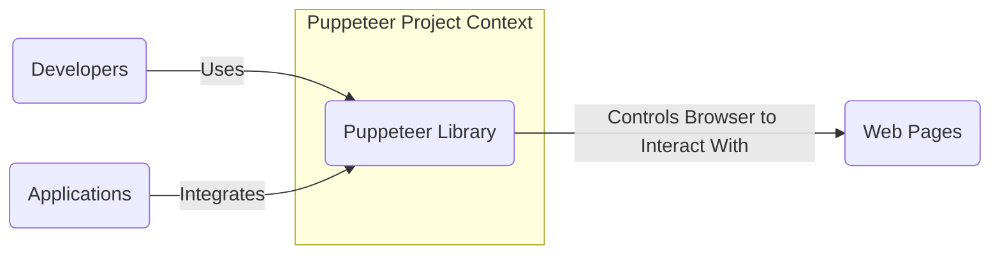
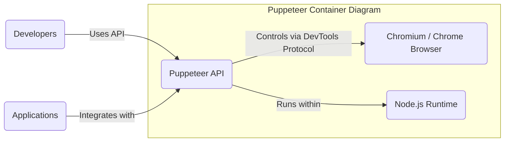
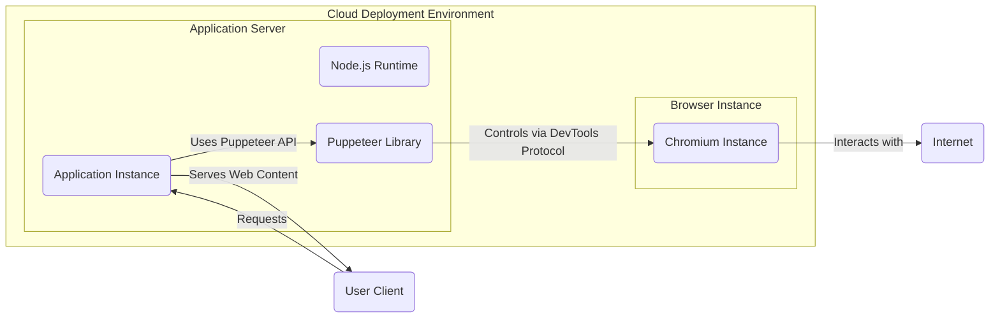
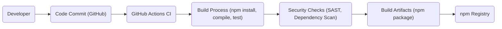

# BUSINESS POSTURE

This project, the Puppeteer library, aims to provide a high-level API to control headless Chrome or Chromium over the DevTools Protocol. It enables developers to automate browser actions, generate screenshots and PDFs, perform UI testing, and scrape web content.

Business Priorities and Goals:
- Provide a stable and reliable API for browser automation.
- Ensure compatibility with the latest Chrome/Chromium versions.
- Maintain ease of use and developer-friendliness.
- Foster a strong community and provide good documentation.
- Ensure performance and efficiency of browser automation tasks.

Most Important Business Risks:
- Security vulnerabilities in the Puppeteer library itself could be exploited by malicious actors to compromise applications that depend on it. This could lead to data breaches, unauthorized access, or denial of service.
- Unintended or malicious use of Puppeteer by developers could result in security issues in their applications, such as exposing sensitive data or creating vulnerabilities through insecure automation scripts.
- Supply chain risks associated with dependencies of the Puppeteer library. Compromised dependencies could introduce vulnerabilities into Puppeteer and subsequently into applications using it.
- Performance issues or instability in Puppeteer could disrupt critical business processes that rely on browser automation.

# SECURITY POSTURE

Existing Security Controls:
- security control: Code reviews are likely performed by maintainers and contributors as part of the open-source development process, although not explicitly documented in the repository. Location: GitHub Pull Request review process.
- security control: Automated testing (unit and integration tests) is implemented to ensure code quality and prevent regressions. Location: GitHub Actions workflows defined in `.github/workflows`.
- security control: Dependency management is handled using `npm` and `package-lock.json` to ensure consistent dependency versions. Location: `package.json` and `package-lock.json` files in the repository.
- security control: Regular updates of dependencies are likely performed to address known vulnerabilities in underlying libraries, although specific policy is not documented. Location: Project maintainers' responsibility.

Accepted Risks:
- accepted risk: As an open-source project, vulnerability disclosure might be public before a patch is available, creating a window of opportunity for exploitation.
- accepted risk: Security of applications using Puppeteer is the responsibility of the application developers, not the Puppeteer project itself. Misuse of Puppeteer in applications can introduce security vulnerabilities.

Recommended Security Controls:
- security control: Implement Static Application Security Testing (SAST) tools in the CI/CD pipeline to automatically scan the codebase for potential vulnerabilities during development.
- security control: Integrate Dependency Vulnerability Scanning tools to automatically check for known vulnerabilities in project dependencies and alert maintainers to update them.
- security control: Consider incorporating fuzzing techniques to proactively discover potential security vulnerabilities by testing Puppeteer with a wide range of inputs.
- security control: Conduct periodic security audits by external security experts to identify and address potential security weaknesses in the codebase and architecture.

Security Requirements:
- Authentication: Not directly applicable to the Puppeteer library itself. Authentication is the responsibility of applications that utilize Puppeteer to secure their own functionalities.
- Authorization: Similarly, authorization is managed by applications using Puppeteer. Applications must ensure that Puppeteer is used in an authorized manner and does not perform actions beyond its intended scope within the application's security context.
- Input Validation: Puppeteer API inputs should be validated to prevent unexpected behavior and potential vulnerabilities. This includes validating arguments passed to Puppeteer functions and handling responses from the browser in a secure manner. Web pages loaded and interacted with by Puppeteer should be treated as untrusted inputs, and appropriate security measures should be taken to mitigate risks from malicious web content.
- Cryptography: Puppeteer itself does not directly handle cryptography. However, applications using Puppeteer might interact with web pages that use cryptography. Puppeteer should support secure communication protocols like HTTPS when interacting with web pages to protect sensitive data in transit. Applications using Puppeteer should ensure they handle any cryptographic operations securely and adhere to best practices for key management and data protection.

# DESIGN

## C4 CONTEXT

Context Diagram Elements:

- Element:
    - Name: Developers
    - Type: User
    - Description: Software developers who use the Puppeteer library to build applications, write tests, or automate web tasks.
    - Responsibilities: Utilize Puppeteer API to automate browser interactions, develop applications leveraging browser automation, contribute to Puppeteer project.
    - Security controls: Secure development practices, input validation in their applications using Puppeteer, responsible use of Puppeteer to avoid unintended security consequences.

- Element:
    - Name: Applications
    - Type: System
    - Description: Software applications that integrate the Puppeteer library to perform browser automation tasks as part of their functionality. These can be web applications, desktop applications, or command-line tools.
    - Responsibilities: Utilize Puppeteer for tasks like web scraping, UI testing, PDF generation, and more. Manage Puppeteer instances and handle interactions with web pages.
    - Security controls: Authentication and authorization within the application, secure handling of data obtained through Puppeteer, input validation for Puppeteer API calls, protection against vulnerabilities arising from interactions with untrusted web content.

- Element:
    - Name: Web Pages
    - Type: System
    - Description: External web pages and web applications that Puppeteer interacts with and automates. These are the targets of browser automation tasks performed by Puppeteer.
    - Responsibilities: Serve web content and functionality that Puppeteer interacts with.
    - Security controls: Web pages should implement their own security controls to protect against malicious interactions, but Puppeteer needs to be used in a way that minimizes risks from interacting with potentially untrusted or malicious web pages.

- Element:
    - Name: Puppeteer Library
    - Type: System
    - Description: The Puppeteer Node.js library itself, providing the API and functionality to control Chrome/Chromium browsers.
    - Responsibilities: Provide a stable, secure, and efficient API for browser automation. Manage communication with the browser instance. Handle browser lifecycle and events.
    - Security controls: Code reviews, automated testing, dependency management, vulnerability scanning, secure coding practices, input validation within the library, adherence to security best practices for Node.js libraries.

## C4 CONTAINER

Container Diagram Elements:

- Element:
    - Name: Puppeteer API
    - Type: Container
    - Description: The public API exposed by the Puppeteer library. This is the interface that developers and applications interact with to control the browser.
    - Responsibilities: Provide a high-level abstraction for browser automation. Translate API calls into DevTools Protocol commands. Manage browser instances and communication.
    - Security controls: Input validation for API calls, secure handling of communication with the browser, protection against API misuse, adherence to secure coding practices in API implementation.

- Element:
    - Name: Chromium / Chrome Browser
    - Type: Container
    - Description: The headless or headed Chrome/Chromium browser instance that Puppeteer controls. This is the actual browser engine that renders web pages and executes JavaScript.
    - Responsibilities: Render web pages, execute JavaScript, handle browser events, interact with web content as instructed by Puppeteer.
    - Security controls: Browser security features (sandboxing, site isolation, etc.), regular browser updates to patch vulnerabilities, controlled environment when running in headless mode, minimizing permissions granted to the browser instance.

- Element:
    - Name: Node.js Runtime
    - Type: Container
    - Description: The Node.js runtime environment in which the Puppeteer library and applications using it execute.
    - Responsibilities: Provide the execution environment for Puppeteer and related JavaScript code. Manage dependencies and modules.
    - Security controls: Secure Node.js runtime environment, dependency management, vulnerability scanning of Node.js dependencies, secure configuration of Node.js environment, adherence to Node.js security best practices.

## DEPLOYMENT

Deployment Diagram for Applications Using Puppeteer (Example - Cloud Deployment):

Deployment Diagram Elements:

- Element:
    - Name: Application Instance
    - Type: Software Instance
    - Description: An instance of the application that uses the Puppeteer library, running on a server in a cloud environment.
    - Responsibilities: Handle user requests, execute application logic, utilize Puppeteer for browser automation tasks, serve web content to users.
    - Security controls: Application-level security controls (authentication, authorization, input validation), secure configuration of the application server, network security controls (firewalls, intrusion detection), monitoring and logging.

- Element:
    - Name: Node.js Runtime
    - Type: Software Instance
    - Description: The Node.js runtime environment running within the application server, providing the execution environment for the application and Puppeteer library.
    - Responsibilities: Execute application code and Puppeteer library, manage dependencies, provide runtime environment.
    - Security controls: Secure Node.js runtime configuration, vulnerability scanning of Node.js dependencies, resource limits, process isolation.

- Element:
    - Name: Puppeteer Library
    - Type: Software Library
    - Description: The Puppeteer library deployed within the application server, providing browser automation capabilities to the application.
    - Responsibilities: Provide browser automation API, control Chromium instances, handle communication.
    - Security controls: As per Security Posture section, secure library implementation, regular updates, vulnerability management.

- Element:
    - Name: Chromium Instance
    - Type: Software Instance
    - Description: A headless Chromium browser instance running in the cloud environment, controlled by the Puppeteer library within the application server.
    - Responsibilities: Render web pages, execute JavaScript, perform browser automation tasks as instructed by Puppeteer.
    - Security controls: Browser security features (sandboxing, site isolation), running in a controlled environment, resource limits, regular browser updates, minimizing permissions.

- Element:
    - Name: Internet
    - Type: Environment
    - Description: The public internet, representing external web pages and user clients accessing the application.
    - Responsibilities: Provide access to web resources and user clients.
    - Security controls: Network security controls at the cloud provider level, web application firewalls (WAFs) for protecting the application, DDoS protection.

- Element:
    - Name: User Client
    - Type: User
    - Description: User's web browser or application that interacts with the deployed application.
    - Responsibilities: Send requests to the application, receive and render web content.
    - Security controls: User-side security controls (browser security settings, antivirus), secure communication (HTTPS).

## BUILD

Build Process Description:

1. Developer: Developers write code, make changes, and commit them to the GitHub repository.
2. Code Commit (GitHub): Code changes are pushed to the GitHub repository, triggering the CI/CD pipeline.
3. GitHub Actions CI: GitHub Actions workflows are configured to automatically run the build process upon code commits and pull requests.
4. Build Process (npm install, compile, test): The build process involves:
    - Installing dependencies using `npm install`.
    - Compiling TypeScript code to JavaScript.
    - Running unit and integration tests to ensure code quality and functionality.
5. Security Checks (SAST, Dependency Scan): Security checks are integrated into the build process:
    - Static Application Security Testing (SAST) tools scan the codebase for potential security vulnerabilities.
    - Dependency vulnerability scanning tools check for known vulnerabilities in project dependencies.
6. Build Artifacts (npm package): If the build and security checks are successful, build artifacts are created, typically an npm package ready for publishing.
7. npm Registry: The build artifacts (npm package) are published to the npm registry, making the Puppeteer library available for developers to download and use in their projects.

Security Controls in Build Process:
- security control: Automated build process using GitHub Actions ensures consistency and repeatability of builds.
- security control: Static Application Security Testing (SAST) integrated into the build pipeline helps identify potential vulnerabilities early in the development lifecycle.
- security control: Dependency vulnerability scanning ensures that project dependencies are checked for known vulnerabilities, reducing supply chain risks.
- security control: Automated testing (unit and integration tests) helps prevent regressions and ensures code quality, indirectly contributing to security.
- security control: Code review process on GitHub pull requests provides an additional layer of security review before code is merged.
- security control: Secure access control to GitHub repository and npm registry to protect against unauthorized modifications and publishing of malicious packages.

# RISK ASSESSMENT

Critical Business Processes:
- For the Puppeteer project itself, the critical business process is maintaining and providing a secure, stable, and reliable browser automation library for the open-source community and commercial users.
- For applications using Puppeteer, critical business processes depend on the application's purpose. Examples include:
    - Automated UI testing pipelines.
    - Web scraping and data extraction processes.
    - PDF and screenshot generation for reporting or archiving.
    - Server-side rendering for SEO and performance optimization.

Data Sensitivity:
- The Puppeteer library itself does not directly handle or store sensitive data.
- However, applications using Puppeteer might handle sensitive data depending on their use case. This could include:
    - User credentials and personal information if automating login processes or interacting with user accounts.
    - Financial data if scraping e-commerce sites or processing financial transactions.
    - Proprietary or confidential information if scraping internal web applications or generating reports containing sensitive data.
- The sensitivity of data handled by applications using Puppeteer is determined by the application's context and data processing activities. Applications must implement appropriate data protection measures based on the sensitivity of the data they handle.

# QUESTIONS & ASSUMPTIONS

Questions:
- What specific SAST and dependency scanning tools are currently used or planned to be used in the Puppeteer project's CI/CD pipeline?
- Are there documented security incident response procedures for the Puppeteer project in case of a reported vulnerability?
- What are the guidelines or best practices recommended by the Puppeteer project for developers to securely use Puppeteer in their applications?
- Is there a public roadmap for addressing security concerns and improving the security posture of the Puppeteer library?

Assumptions:
- It is assumed that the Puppeteer project maintainers are committed to addressing security vulnerabilities and maintaining a secure library.
- It is assumed that standard open-source development security practices are generally followed in the Puppeteer project, such as code reviews and automated testing.
- It is assumed that applications using Puppeteer are responsible for implementing their own security controls and using Puppeteer in a secure manner within their application context.
- It is assumed that the deployment environment for applications using Puppeteer is appropriately secured according to best practices for cloud or server environments.