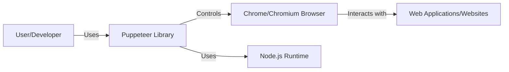
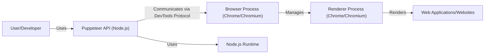
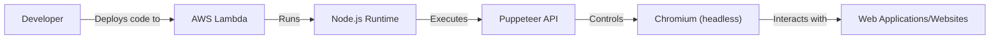
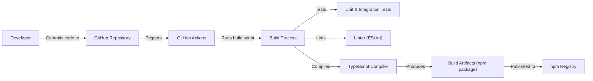

# BUSINESS POSTURE

Puppeteer is a Node.js library that provides a high-level API for controlling headless Chrome or Chromium (or full Chrome/Chromium) over the DevTools Protocol. It's primarily used for web scraping, automating form submissions, UI testing, generating PDFs and screenshots, and generally automating anything a user can do in a browser.

Business Priorities and Goals:

*   Enable developers to easily automate browser interactions.
*   Provide a reliable and consistent API across different Chromium versions.
*   Support a wide range of browser automation use cases.
*   Maintain a high level of performance and efficiency.
*   Foster a strong community and ecosystem around the project.

Business Risks:

*   Malicious use: Puppeteer can be used for malicious purposes, such as creating bots for spamming, credential stuffing, or DDoS attacks. The project itself doesn't directly control this, but it's a reputational risk.
*   Breaking changes in Chromium: Puppeteer relies heavily on the DevTools Protocol, which can change with new Chromium releases.  This can lead to broken functionality and require significant maintenance effort.
*   Competition: Other browser automation tools exist, and Puppeteer needs to stay competitive in terms of features, performance, and ease of use.
*   Security vulnerabilities in Puppeteer or its dependencies:  Vulnerabilities could allow attackers to execute arbitrary code or gain access to sensitive information.
*   Detection and blocking: Websites may actively try to detect and block headless browsers, including those controlled by Puppeteer. This can limit the effectiveness of Puppeteer for certain use cases.

# SECURITY POSTURE

Existing Security Controls:

*   security control: Regular dependency updates: Puppeteer's `package.json` and `package-lock.json` files, along with automated tools like Dependabot or Renovate, are used to keep dependencies up-to-date, mitigating known vulnerabilities in third-party libraries.
*   security control: Code reviews: All code changes go through a code review process on GitHub, where other maintainers and contributors can examine the code for potential security issues.
*   security control: Static analysis: Linters (like ESLint) and potentially other static analysis tools are used to identify potential code quality and security issues. This is evident from the project's configuration files.
*   security control: Sandboxing (inherent to Chromium): Chromium itself has a multi-process architecture and sandboxing features that limit the impact of potential vulnerabilities in the renderer process. Puppeteer benefits from this.
*   security control: Issue tracking: Security vulnerabilities can be reported through GitHub's issue tracker, allowing for coordinated disclosure and resolution.

Accepted Risks:

*   accepted risk: Reliance on Chromium's security: Puppeteer's security is heavily dependent on the security of Chromium. While Chromium is generally considered secure, vulnerabilities do occasionally arise.
*   accepted risk: Potential for misuse: As mentioned earlier, Puppeteer can be used for malicious purposes. The project acknowledges this risk but places the responsibility on the users to use the tool ethically.
*   accepted risk: Limited control over website behavior: Puppeteer interacts with websites, and those websites may have their own security vulnerabilities or malicious code. Puppeteer has limited control over this.

Recommended Security Controls:

*   security control: Implement Content Security Policy (CSP) where applicable: If Puppeteer is used to render untrusted content, consider using CSP to mitigate the risk of cross-site scripting (XSS) attacks.
*   security control: Fuzz testing: Integrate fuzz testing to proactively discover vulnerabilities by providing invalid, unexpected, or random data as input to the API.
*   security control: Security audits: Conduct periodic security audits by external experts to identify potential vulnerabilities that may have been missed.
*   security control: Consider using a dedicated user/profile for automated tasks: This can help isolate the browser automation environment from other user activities and data.

Security Requirements:

*   Authentication:
    *   Puppeteer itself does not handle authentication directly. It relies on the underlying Chromium browser's authentication mechanisms (e.g., cookies, HTTP authentication, client certificates).
    *   If Puppeteer is used to interact with services that require authentication, the authentication credentials should be managed securely (e.g., using environment variables, secrets management tools, or dedicated configuration files).
    *   Avoid hardcoding credentials in scripts.

*   Authorization:
    *   Puppeteer does not implement its own authorization mechanisms. Authorization is typically handled by the websites and services that Puppeteer interacts with.
    *   Ensure that Puppeteer scripts only perform actions that they are authorized to perform.

*   Input Validation:
    *   When providing input to websites (e.g., filling out forms), validate the input to prevent injection attacks (e.g., XSS, SQL injection). This is primarily the responsibility of the user's script, not Puppeteer itself.
    *   Sanitize user-provided data before using it in Puppeteer scripts.

*   Cryptography:
    *   Puppeteer relies on Chromium's built-in cryptographic capabilities for secure communication (e.g., HTTPS).
    *   If Puppeteer is used to handle sensitive data, ensure that the data is encrypted in transit and at rest, where appropriate. This is the responsibility of the user and the services they interact with.

# DESIGN

## C4 CONTEXT

Element List:

*   Element:
    *   Name: User/Developer
    *   Type: Person
    *   Description: A person who uses Puppeteer to automate browser interactions.
    *   Responsibilities: Writes and executes Puppeteer scripts, handles authentication, manages input data, and interprets results.
    *   Security controls: Secure coding practices, input validation, secure handling of credentials.

*   Element:
    *   Name: Puppeteer Library
    *   Type: Software System
    *   Description: The Node.js library that provides the high-level API for controlling Chrome/Chromium.
    *   Responsibilities: Provides an API for browser automation, manages communication with the browser via the DevTools Protocol, handles events and callbacks.
    *   Security controls: Regular dependency updates, code reviews, static analysis, fuzz testing (recommended).

*   Element:
    *   Name: Chrome/Chromium Browser
    *   Type: Software System
    *   Description: The web browser that Puppeteer controls.
    *   Responsibilities: Renders web pages, executes JavaScript, handles network requests, manages cookies and other browser data.
    *   Security controls: Sandboxing, regular security updates, built-in security features (e.g., XSS auditor, Safe Browsing).

*   Element:
    *   Name: Web Applications/Websites
    *   Type: Software System
    *   Description: The websites and web applications that Puppeteer interacts with.
    *   Responsibilities: Serve web content, handle user input, process data, interact with other services.
    *   Security controls: Website-specific security measures (e.g., input validation, authentication, authorization, CSP).

*   Element:
    *   Name: Node.js Runtime
    *   Type: Software System
    *   Description: The JavaScript runtime environment that Puppeteer runs on.
    *   Responsibilities: Executes JavaScript code, provides access to system resources, manages dependencies.
    *   Security controls: Regular updates to the Node.js runtime, secure configuration of the Node.js environment.

## C4 CONTAINER

Element List:

*   Element:
    *   Name: User/Developer
    *   Type: Person
    *   Description: A person who uses Puppeteer to automate browser interactions.
    *   Responsibilities: Writes and executes Puppeteer scripts, handles authentication, manages input data, and interprets results.
    *   Security controls: Secure coding practices, input validation, secure handling of credentials.

*   Element:
    *   Name: Puppeteer API (Node.js)
    *   Type: Container
    *   Description: The Node.js module that provides the Puppeteer API.
    *   Responsibilities: Exposes functions for launching and controlling the browser, interacting with pages and elements, handling events, and managing resources.
    *   Security controls: Regular dependency updates, code reviews, static analysis, fuzz testing (recommended).

*   Element:
    *   Name: Browser Process (Chrome/Chromium)
    *   Type: Container
    *   Description: The main Chrome/Chromium process that manages the browser window, renderer processes, and other browser components.
    *   Responsibilities: Handles inter-process communication (IPC), manages the browser lifecycle, enforces security policies.
    *   Security controls: Sandboxing, regular security updates, process isolation.

*   Element:
    *   Name: Renderer Process (Chrome/Chromium)
    *   Type: Container
    *   Description: A separate process that renders web content and executes JavaScript.
    *   Responsibilities: Parses HTML, CSS, and JavaScript, renders the web page, handles user input events.
    *   Security controls: Sandboxing, process isolation, site isolation, built-in security features (e.g., XSS auditor).

*   Element:
    *   Name: Web Applications/Websites
    *   Type: Software System
    *   Description: The websites and web applications that Puppeteer interacts with.
    *   Responsibilities: Serve web content, handle user input, process data, interact with other services.
    *   Security controls: Website-specific security measures (e.g., input validation, authentication, authorization, CSP).

*   Element:
    *   Name: Node.js Runtime
    *   Type: Software System
    *   Description: The JavaScript runtime environment that Puppeteer runs on.
    *   Responsibilities: Executes JavaScript code, provides access to system resources, manages dependencies.
    *   Security controls: Regular updates to the Node.js runtime, secure configuration of the Node.js environment.

## DEPLOYMENT

Puppeteer is a library, not a standalone application, so "deployment" in the traditional sense doesn't apply. However, Puppeteer scripts can be executed in various environments. Here are a few possibilities, with one described in detail:

Possible Deployment Solutions:

1.  Local machine: Running Puppeteer scripts directly on a developer's machine.
2.  Server: Deploying Puppeteer scripts to a server (e.g., a cloud-based virtual machine or a dedicated server).
3.  Serverless functions: Running Puppeteer scripts in a serverless environment (e.g., AWS Lambda, Google Cloud Functions, Azure Functions).
4.  Containers: Packaging Puppeteer scripts and their dependencies in a container (e.g., Docker) and deploying the container to a container orchestration platform (e.g., Kubernetes, Amazon ECS).

Chosen Solution: Serverless Functions (AWS Lambda)

Element List:

*   Element:
    *   Name: Developer
    *   Type: Person
    *   Description: The person who develops and deploys the Puppeteer script.
    *   Responsibilities: Writes the Puppeteer script, configures the AWS Lambda function, manages deployment.
    *   Security controls: Secure coding practices, IAM roles and permissions, secure handling of credentials.

*   Element:
    *   Name: AWS Lambda
    *   Type: Platform
    *   Description: The serverless compute service that executes the Puppeteer script.
    *   Responsibilities: Provides the execution environment, manages scaling and resource allocation, handles invocation triggers.
    *   Security controls: IAM roles and permissions, function-level resource policies, VPC configuration (if needed), logging and monitoring.

*   Element:
    *   Name: Node.js Runtime
    *   Type: Platform
    *   Description: The Node.js runtime environment provided by AWS Lambda.
    *   Responsibilities: Executes the JavaScript code of the Puppeteer script.
    *   Security controls: Regular updates to the Node.js runtime, secure configuration of the Lambda function.

*   Element:
    *   Name: Puppeteer API
    *   Type: Container
    *   Description: The Puppeteer library running within the Node.js runtime.
    *   Responsibilities: Provides the API for controlling the headless Chromium browser.
    *   Security controls: Regular dependency updates, secure coding practices within the script.

*   Element:
    *   Name: Chromium (headless)
    *   Type: Container
    *   Description: The headless Chromium browser instance launched by Puppeteer.
    *   Responsibilities: Renders web pages, executes JavaScript, interacts with websites.
    *   Security controls: Sandboxing, regular updates to the Chromium version used by Puppeteer, Lambda execution environment isolation.

*   Element:
    *   Name: Web Applications/Websites
    *   Type: Software System
    *   Description: The external websites and web applications that Puppeteer interacts with.
    *   Responsibilities: Serve web content, handle requests from the headless browser.
    *   Security controls: Website-specific security measures (external to the Puppeteer deployment).

## BUILD

The Puppeteer project itself has a build process for creating releases. User scripts using Puppeteer may or may not have a separate build process, depending on their complexity and deployment method. Here's a description of the Puppeteer project's build process:

Build Process Description:

1.  Developers commit code changes to the Puppeteer repository on GitHub.
2.  GitHub Actions is used as the CI/CD system. Workflows are defined in `.github/workflows`.
3.  The build process typically includes the following steps:
    *   Checkout code: The repository is checked out.
    *   Setup Node.js: The appropriate Node.js version is set up.
    *   Install dependencies: Project dependencies are installed using `npm install`.
    *   Linting: ESLint is used to check for code style and potential errors.
    *   Testing: Unit and integration tests are run to ensure code quality and functionality.
    *   Compilation: The TypeScript code is compiled to JavaScript using the TypeScript compiler.
    *   Packaging: The compiled code and other necessary files are packaged into an npm package.
    *   Publishing: The npm package is published to the npm registry.

Security Controls in Build Process:

*   security control: Dependency management: Dependencies are managed using `package.json` and `package-lock.json`, and automated tools are used to keep them up-to-date.
*   security control: Linting: ESLint is used to enforce code style and identify potential security issues.
*   security control: Testing: Automated tests help ensure that the code functions as expected and that security vulnerabilities are not introduced.
*   security control: CI/CD: GitHub Actions provides a secure and automated build environment.
*   security control: Code Review: All code changes are reviewed before being merged into the main branch.

# RISK ASSESSMENT

Critical Business Processes:

*   Web scraping: Extracting data from websites for various purposes (e.g., market research, price comparison, data analysis).
*   Automated testing: Testing web applications to ensure functionality, performance, and security.
*   PDF and screenshot generation: Creating documents and images from web content.
*   Form automation: Automating the filling and submission of web forms.
*   Performance monitoring: Monitoring website performance and identifying bottlenecks.

Data Sensitivity:

The data Puppeteer handles can vary greatly in sensitivity, depending on the use case.

*   Publicly available web data: Low sensitivity.
*   Usernames and passwords (if used for authentication): High sensitivity.
*   Personally identifiable information (PII): High sensitivity.
*   Financial data: High sensitivity.
*   Proprietary data scraped from websites: Medium to high sensitivity, depending on the data.
*   Session cookies: High sensitivity.

Puppeteer itself doesn't inherently store or manage this data long-term; it's the responsibility of the user's script and infrastructure to handle data appropriately.

# QUESTIONS & ASSUMPTIONS

Questions:

*   Are there any specific compliance requirements (e.g., GDPR, CCPA, HIPAA) that apply to the use of Puppeteer in this context?
*   What is the expected scale of usage (e.g., number of requests per day, number of concurrent browser instances)?
*   Are there any specific websites or web applications that are known to be particularly sensitive or difficult to automate?
*   What is the level of expertise of the developers who will be using Puppeteer?
*   What logging and monitoring capabilities are required for the Puppeteer scripts?

Assumptions:

*   BUSINESS POSTURE: The primary use case is legitimate and ethical web automation.
*   BUSINESS POSTURE: The organization has a basic understanding of security best practices.
*   SECURITY POSTURE: The Node.js environment and Chromium browser will be kept up-to-date with the latest security patches.
*   SECURITY POSTURE: Developers will follow secure coding practices when writing Puppeteer scripts.
*   DESIGN: The Puppeteer scripts will be designed to handle errors and exceptions gracefully.
*   DESIGN: The Puppeteer scripts will be designed to respect website terms of service and robots.txt.
*   DESIGN: The deployment environment (local machine, server, serverless functions, or containers) will be secured appropriately.